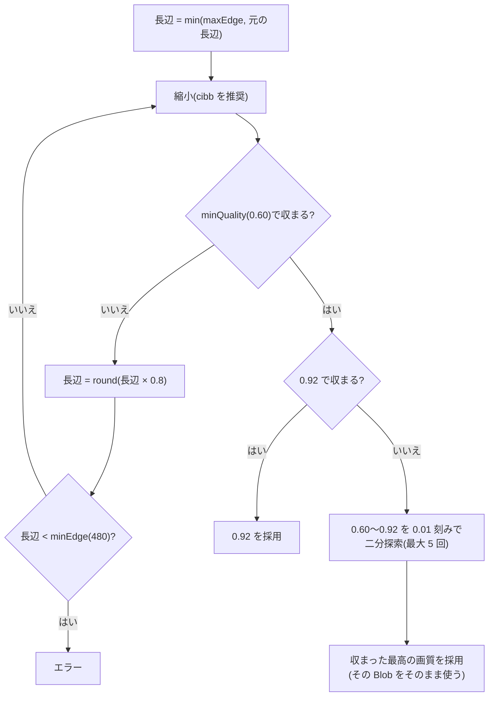

# canvas の WebP エンコード(Chromium・Firefox と cwebp の比較)

> [!summary] 要点
> - **エンコーダー自体の差は小さい。** 同じ画素を渡すと、Firefox 155 の `toBlob` は cwebp 1.6.0 と同じバイト数になった。Chromium 153 は +0.2〜1.2%(中央値)。保存 100,000 バイトに収まる最高画質は、付録 A.2 と ±1 以内。
> - **ずれの主な原因は縮小の方法。** Chromium の `drawImage`(`imageSmoothingQuality = "high"`)は ImageMagick の Lanczos よりわずかに柔らかく、同じ画質で 6〜9% 小さい。Firefox 155 には `imageSmoothingQuality` が無い。2 倍以上の縮小でエイリアシングが出て、1024px で +10%、800px で +25% 大きい。
> - **`createImageBitmap(bitmap, { resizeWidth, resizeHeight, resizeQuality: "high" })` で縮小すると、Firefox は Lanczos とほぼ同じ画素になる(PSNR 55〜59 dB)。** 仕様書 6.3 の表(cwebp の見積もり)を、p5 の 92 が 91 になった以外はそのまま再現した。Chromium では `drawImage` の `high` とほぼ同じ結果になる(5 枚中 4 枚はすべての条件で同じサイズ)。→ [[T13-encode-search|T13]] はこの方法で縮小するのがよい。
> - **既定値(画質 0.60〜0.92、0.8 倍、`maxEdge` 1600、`minEdge` 480)は変えない。** 理由は [[#7. 既定値の判断]]。
> - 仕様書 6.3 の探索(`minQuality` を最初に試す二分探索)では、1 枚あたりエンコード 2〜10 回、合計 0.13〜0.51 秒だった(Apple M5 Pro)。`toBlob` の間、主スレッドは止まらない。
> - `blob.type` は常に `image/webp`。可逆(`VP8L`)になるのは、Chromium では画質ちょうど 1.0、Firefox では 0.995 以上。画質を省略するか範囲外にすると、ブラウザの既定値(Chromium 0.80、Firefox 0.92)になる。
> - Chromium の出力は `VP8X` + `ICCP`(sRGB、456 B)+ `VP8 ` で、Firefox(`VP8 ` だけ)より 482 バイト大きい。[[T04-webp-utils|T04]] / [[T11-server-validation|T11]] の WebP の解析は、この形も扱う必要がある。
> - 関連: [[T05-spike-canvas-webp]]、[[T13-encode-search]]、[[base64-image-plugin-spec#6.3 リサイズと画質の方針(Q7)|仕様書 6.3]]、[[base64-image-plugin-spec#付録 A. 実測データ|仕様書 付録 A.2]]

## 測定の環境

| 項目 | 内容 |
|---|---|
| マシン | Apple M5 Pro(18 コア)、メモリ 24GB、macOS 26.4(25E246) |
| Node / npm | 26.10.0 / 12.0.2 |
| Playwright | `@playwright/test` 1.63.0(ルートの `node_modules`)。headless で起動 |
| Cr-SW | Chromium 153.0.8010.12。`chromium.launch({ headless: true })` で起動する headless shell(`chromium_headless_shell-1243`)。WebGL は SwiftShader(GPU を使わない)。`chrome://gpu` は開けなかった。canvas もソフトウェアで描画していると考えられる(推測のみ) |
| Cr-GPU | Chromium 153.0.8010.12。`chromium.launch({ headless: true, channel: "chromium" })` で起動する new headless(`chromium-1243`)。`chrome://gpu` は Canvas: Hardware accelerated、Skia Graphite: Enabled。WebGL は ANGLE Metal(Apple M5 Pro) |
| Fx | Firefox 155.0(Playwright のビルド `firefox-1543`)。`firefox.launch({ headless: true })` |
| cwebp / ImageMagick | cwebp 1.6.0(libsharpyuv 0.4.2)/ ImageMagick 7.1.2-31 Q16-HDRI |
| 写真 | 付録 A と同じ 5 枚。2400×1600 の JPEG(品質 89、4:2:0、sRGB IEC61966-2.1 の ICC 付き、EXIF の向きなし)。リポジトリには入れていない |
| 日付 | 2026-09-24 |

> [!info] 実際の Chrome / Edge に近いのは Cr-GPU
> 管理画面を使う実際の Chrome / Edge は、GPU で canvas を描画することが多い(推測のみ)。Cr-SW と Cr-GPU では `drawImage` で縮小した画素がわずかに違い、最高画質が最大 2 ずれた。採用される長辺は同じだった(実測のみ)。

## 手順

1. `node:http` の静的サーバー(`127.0.0.1:4405`)で、測定用のページと写真を配信する。写真は scratchpad から直接読む。
2. Playwright で各ブラウザを起動し、ページの関数を `page.evaluate` で呼ぶ。
3. 本番と同じ手順でエンコードする。
   - `fetch` した写真から `File` を作り、`createImageBitmap(file, { imageOrientation: "from-image" })` でデコードする。
   - 長辺を 1600 / 1280 / 1024 / 819 / 800 / 655 / 524 にする(`Math.round`、拡大しない)。819 / 655 / 524 は、仕様書 6.3 の 0.8 倍の探索で通る長辺。
   - 縮小は `drawImage` 1 回。`imageSmoothingEnabled = true`、`imageSmoothingQuality = "high"`。T13 が使うと想定した方法。
   - `canvas.toBlob(cb, "image/webp", q)` でエンコードする。
4. 各長辺で、画質 0.01〜1.00 を 0.01 刻みで 1 回ずつ(サイズ・チャンク・`blob.type`)、0.60〜0.92 を 0.02 刻みで 3 回ずつ(時間)エンコードする。最初にウォームアップのエンコードを行う。
5. 要因を分けるため、付録 A の probe.sh と同じコマンドで ImageMagick の Lanczos で縮小した PNG を、cwebp(`-q` 1〜100)と各ブラウザの `toBlob` に渡す。逆に、ブラウザの canvas の画素(PNG)を cwebp に渡す。
6. 縮小方法を比べる: `low` / `medium` / `high`、段階縮小(半分ずつ縮小してから最後に目的の大きさへ)、`createImageBitmap` の `resizeQuality: "high"`(File から / デコード済みの ImageBitmap から)。画質は Lanczos の画素との PSNR と、輝度のラプラシアンの平均(鮮鋭度。高周波の量の目安)で比べる。
7. 仕様書 6.3 の探索を、ページの中で実際に実行する(探索の順番 3 通り × 3 回)。

「保存 100,000 バイトに収まる最高画質」は、付録 A.2 の probe.sh と同じく、1〜100 の二分探索で求めた(WebP ≤ 74,982 B)。cwebp と `drawImage` の表は、0.01 刻みの全探索から求めた値とも一致した。付録 A.2 の cwebp の値は、同じ写真とコマンドで再測定して、20 か所すべて一致した。

## 結果

### 1. ブラウザのエンコーダーの性質

| 項目 | Chromium 153 | Firefox 155 | 根拠レベル |
|---|---|---|---|
| `blob.type` | すべて `image/webp`(3,500 回) | すべて `image/webp`(3,500 回) | 実測のみ |
| 画質の渡し方 | `q × 100` を小数のまま libwebp に渡す | `round(q × 100)` の整数にする | 実測+公式ドキュメント |
| 可逆(`VP8L`)になる画質 | ちょうど 1.0 だけ。0.995 と 0.999 は非可逆 | 0.995 以上 | 実測+公式ドキュメント |
| 画質を省略・範囲外(1.01、2、−1)にしたとき | 0.80 と同じ出力 | 0.92 と同じ出力 | 実測+公式ドキュメント |
| 画質を変えるとサイズが変わるか | 変わる | 変わる。1600px の p1 で 0.60 → 78,690 B、0.80 → 125,466 B、0.92 → 341,264 B | 実測のみ |
| RIFF のチャンク(非可逆) | `VP8X` + `ICCP` + `VP8 ` | `VP8 ` だけ | 実測のみ |
| 埋め込まれる ICC | Skia の sRGB プロファイル(456 B、"Google Inc. 2016")。`VP8X` と合わせて 482 B 増える | なし | 実測+公式ドキュメント |
| libwebp の設定 | 非可逆は method 3(cwebp の既定は 4) | libwebp の簡易 API(`WebPEncodeRGBA`)で、既定の設定 | 公式ドキュメントのみ |
| 同じ条件で繰り返したとき | 毎回同じサイズ | 毎回同じサイズ | 実測のみ |
| 画質を 0.01 上げてサイズが減った箇所 | 3,430 か所中 33〜42(最大 158 B、0.76%) | 27(最大 58 B、0.60%) | 実測のみ |
| `imageSmoothingQuality` | ある(既定 `low`) | 無い(代入しても無視される) | 実測のみ |
| `imageOrientation: "from-image"` | EXIF の向き(6)を反映した | 反映した | 実測のみ |
| data URL の長さ | `23 + 4 × ceil(B / 3)` と一致(先頭は `data:image/webp;base64,`) | 一致 | 実測のみ |

根拠にしたソースコード(2026-09-24 に各リポジトリの main を読んだ。測定したブラウザの版とは一致しない可能性がある):

- Chromium `third_party/blink/renderer/platform/image-encoders/image_encoder.cc` の `ComputeWebpOptions`: quality が 1.0 なら可逆、0〜1 の範囲外なら 80、それ以外は `quality * 100`。
- Skia `src/encode/SkWebpEncoderImpl.cpp`: 非可逆は `method = 3`(`SK_WEBP_ENCODER_USE_DEFAULT_METHOD` が定義されていないとき)。ICC は `SkWriteICCProfile(pixmap.colorSpace())` で作って `ICCP` チャンクにする。
- Firefox `dom/canvas/CanvasRenderingContextHelper.cpp` の `ParseParams`: 0〜1 のときだけ `quality=` に `NS_lround(quality * 100.0)` を渡す。`image/encoders/webp/nsWebPEncoder.cpp`: 既定は 92。100 なら `WebPEncodeLosslessRGBA`、それ以外は `WebPEncodeRGBA`。
- MDN の互換性データ(`api.CanvasRenderingContext2D.imageSmoothingQuality`)でも、Firefox は `version_added: false`(外部ドキュメントのみ)。

> [!warning] 画質は必ず 0.60〜0.92 の範囲で明示する
> 省略や範囲外の値は、ブラウザごとに違う既定値になる。0.995 以上は Firefox で可逆になり、1600px で 1.4MB を超え、1 回に約 440ms かかる。上限の 0.92 は十分に離れている。

### 2. 保存 100,000 バイトに収まる最高画質(付録 A.2 と同じ形)

値は `-q` / `quality × 100`。各セルは「cwebp(付録 A.2)/ Cr-SW / Cr-GPU / Fx / Fx cibb」。Cr と Fx は `drawImage`(`high`)で縮小したもの。Fx cibb は `createImageBitmap` の `resizeQuality: "high"` で縮小したもの([[#4. 縮小方法の比較と Lanczos との違い]])。根拠レベル: **実測のみ**

| 写真 | 1600px | 1280px | 1024px | 800px |
|---|---|---|---|---|
| p1 | 55 / 57 / 57 / 56 / 55 | 77 / 78 / 78 / 75 / 77 | 84 / 85 / 85 / 81 / 84 | 90 / 91 / 91 / 84 / 90 |
| p2 | 80 / 81 / 82 / 81 / 80 | 86 / 87 / 87 / 85 / 86 | 91 / 91 / 91 / 88 / 91 | 94 / 94 / 94 / 92 / 94 |
| p3(細部が多い) | 22 / 26 / 27 / 25 / 22 | 37 / 45 / 45 / 37 / 36 | 60 / 70 / 72 / 54 / 60 | 80 / 83 / 83 / 75 / 80 |
| p4 | 40 / 43 / 43 / 41 / 39 | 59 / 66 / 66 / 57 / 58 | 77 / 79 / 79 / 72 / 77 | 84 / 86 / 86 / 79 / 84 |
| p5(単純) | 92 / 92 / 92 / 92 / 91 | 95 / 95 / 95 / 95 / 95 | 97 / 97 / 97 / 97 / 97 | 100 / 99 / 99 / 99 / 99 |

- cwebp との差は、Chromium で −1〜+12、Firefox(`drawImage`)で −6〜+3、Firefox(cibb)で −1〜0。
- 800px の p5 がブラウザで 99 になるのは、画質 1.00 が可逆になって大きくなるため。cwebp の `-q 100` は非可逆のまま。

### 3. ずれの要因: エンコーダーより縮小の方法

同じ画素を渡した比較(最高画質。括弧は cwebp との差)。根拠レベル: **実測のみ**

| 比べたもの | 結果 |
|---|---|
| Lanczos の画素 → ブラウザの `toBlob`(エンコーダーだけの差) | Firefox は 800px の p5(可逆の件で 99)を除く 19 か所が cwebp と同じ。画質 0.01〜0.99 の 1,980 点で、バイト数も完全に一致した。Chromium は 20 か所中 16 か所が同じで、4 か所が −1(うち 1 か所は 800px の p5 の可逆の件) |
| ブラウザの canvas の画素 → cwebp(縮小だけの差) | ブラウザの `toBlob` の結果とほぼ同じ(Chromium の p3 の 1024px が 70 → 71 など、差は最大 1) |

同じ画質でのサイズ比(0.60〜0.92 の 0.02 刻み × 写真 5 枚の中央値 [最小〜最大])。根拠レベル: **実測のみ**

| ブラウザ | 長辺 | 全体: ブラウザ ÷ cwebp(Lanczos) | エンコーダー: ブラウザ(Lanczos の画素)÷ cwebp | 縮小: ブラウザ(canvas)÷ ブラウザ(Lanczos の画素) |
|---|---|---|---|---|
| Cr-SW | 1600 | −7.4% [−12.8%〜+2.2%] | +0.2% [−0.8%〜+2.5%] | −7.7% [−12.9%〜+0.7%] |
| Cr-SW | 1280 | −7.9% [−16.0%〜+3.4%] | +0.4% [−0.9%〜+3.9%] | −8.2% [−16.2%〜+0.2%] |
| Cr-SW | 1024 | −5.9% [−16.1%〜+5.8%] | +0.7% [−0.6%〜+5.9%] | −7.0% [−16.5%〜+0.5%] |
| Cr-SW | 800 | −5.6% [−14.3%〜+7.3%] | +1.2% [+0.1%〜+7.6%] | −6.8% [−15.0%〜+1.1%] |
| Cr-GPU | 1600 | −8.7% [−14.5%〜+1.9%] | +0.2% [−0.8%〜+2.5%] | −8.8% [−14.5%〜+0.4%] |
| Cr-GPU | 1280 | −9.0% [−17.5%〜+3.3%] | +0.4% [−0.9%〜+3.9%] | −9.0% [−17.6%〜−0.6%] |
| Cr-GPU | 1024 | −7.0% [−18.1%〜+6.2%] | +0.7% [−0.6%〜+5.9%] | −8.1% [−18.5%〜+1.0%] |
| Cr-GPU | 800 | −6.0% [−17.1%〜+8.0%] | +1.2% [+0.1%〜+7.6%] | −6.9% [−17.9%〜+1.8%] |
| Fx | 1600 | −4.6% [−9.3%〜−0.1%] | ±0.0%(全点で同じバイト数) | −4.6% [−9.3%〜−0.1%] |
| Fx | 1280 | +1.8% [−1.9%〜+26.6%] | ±0.0% | +1.8% [−1.9%〜+26.6%] |
| Fx | 1024 | +10.3% [+2.1%〜+40.4%] | ±0.0% | +10.3% [+2.1%〜+40.4%] |
| Fx | 800 | +24.6% [+5.8%〜+58.0%] | ±0.0% | +24.6% [+5.8%〜+58.0%] |
| Fx cibb | 1600〜800 | +0.1%(各長辺)[−1.8%〜+3.5%] | ±0.0% | +0.1%(各長辺)[−1.8%〜+3.5%] |

- Firefox の非可逆のエンコードは、同じ画素なら cwebp の既定(method 4)と同じバイト数になった。Chromium の +0.2〜1.2% は、method 3 と、`VP8X` + `ICCP` の 482 B によるものと考えられる(推測のみ。ソースは [[#1. ブラウザのエンコーダーの性質]])。
- Chromium の `ICCP` を取り除いたと仮定しても、最高画質が上がるのは 40 か所中 2 か所で、+1 だけだった(実測のみ)。取り除く処理は入れなくてよい。

### 4. 縮小方法の比較と Lanczos との違い

写真 5 枚の平均。サイズは `high` に対する比(画質 0.60 / 0.76 / 0.92)。PSNR は ImageMagick の Lanczos の画素との比較。鮮鋭度は Lanczos を 1 とした比。縮小の時間は中央値。根拠レベル: **実測のみ**

| ブラウザ | 長辺 | 方法 | サイズ比 | PSNR | 鮮鋭度 | 縮小 ms |
|---|---|---|---|---|---|---|
| Cr-SW | 1600 | `low` | 1.016 / 1.027 / 1.040 | 43.9 dB | 0.94 | 3.4 |
| Cr-SW | 1600 | `medium` / `high` / 段階縮小 / cibb | 1.000 | 44.1 dB | 0.90 | 13.5〜15.0 |
| Cr-SW | 1024 | `low` | 1.157 / 1.210 / 1.257 | 39.0 dB | 1.23 | 1.4 |
| Cr-SW | 1024 | `medium` / `high` / cibb | 1.000 | 41.2 dB | 0.88 | 5.5〜6.4 |
| Cr-SW | 1024 | 段階縮小 | 0.956 / 0.958 / 0.936 | 39.8 dB | 0.79 | 10.7 |
| Cr-SW | 800 | `low` | 1.280 / 1.320 / 1.388 | 35.5 dB | 1.42 | 1.0 |
| Cr-SW | 800 | `medium` / `high` / 段階縮小 / cibb | 1.000 | 40.4 dB | 0.88 | 3.3〜11.5 |
| Fx | 1600 | `drawImage`(`low` / `medium` / `high` は同じ) | 1.000 | 46.4 dB | 0.94 | 2 |
| Fx | 1600 | cibb | 1.048 / 1.055 / 1.059 | 56.4 dB | 1.01 | 9 |
| Fx | 1024 | `drawImage` | 1.000 | 40.6 dB | 1.23 | 1 |
| Fx | 1024 | 段階縮小 | 0.830 / 0.799 / 0.741 | 40.9 dB | 0.79 | 3 |
| Fx | 1024 | cibb | 0.942 / 0.914 / 0.866 | 57.1 dB | 1.00 | 7 |
| Fx | 800 | `drawImage` | 1.000 | 36.5 dB | 1.41 | 0〜1 |
| Fx | 800 | 段階縮小 | 0.807 / 0.788 / 0.751 | 41.9 dB | 0.92 | 2 |
| Fx | 800 | cibb | 0.859 / 0.839 / 0.788 | 57.5 dB | 1.01 | 6 |

Cr-GPU の傾向は Cr-SW と同じ(`high` の PSNR は 43.9 / 41.1 / 40.2 dB)。cibb = `createImageBitmap(bitmap, { resizeWidth, resizeHeight, resizeQuality: "high" })` のあと、同じ大きさの canvas に `drawImage(resized, 0, 0)` する方法。

- **Chromium の `high`**(実測のみ): Lanczos より鮮鋭度が約 1 割低く(0.87〜0.90)、少し柔らかい。そのため同じ画質で 6〜9% 小さくなり、最高画質は cwebp より高くなる(細部の多い p3 の 1280・1024px と p4 の 1280px で +7〜+12)。`medium` と `high` の結果は同じだった。既定の `low` は 2 倍以上の縮小でエイリアシングが出る(鮮鋭度 1.23〜1.42、サイズ +16〜39%)。
- **Chromium の cibb**(実測のみ): `drawImage` の `high` とほぼ同じ結果になった。Cr-SW では、p1〜p4 のサイズがすべての条件で一致した(340 条件中 272)。違ったのは p5 だけで、差は 1.05% 以内。Cr-SW と Cr-GPU の間でも、cibb は p1〜p4 のサイズが一致した(272 / 340)。`drawImage` は Cr-SW と Cr-GPU で 2,000 条件中 10 しか一致しないので、cibb の方が GPU の有無の影響を受けにくい。
- **Firefox の `drawImage`**(実測のみ): `imageSmoothingQuality` が無いので、`low` / `medium` / `high` はすべて同じ結果になる。2 倍以上の縮小では、鮮鋭度が Lanczos の 1.23〜1.41 倍で PSNR が低い。細部ではなくエイリアシング(ジャギー・モアレ)で高周波が増えている(推測のみ。PSNR と鮮鋭度からの推論)。見た目が悪くなるうえにファイルも大きくなる。
- **Firefox の cibb**(実測のみ): PSNR 55〜59 dB で、ImageMagick の Lanczos とほぼ同じ画素。最高画質は cwebp と −1〜0 の差だった。File から作っても ImageBitmap から作っても同じ画素になった(340 / 340)。
- **段階縮小**(実測のみ): Firefox のエイリアシングは消えるが、Lanczos より柔らかくなる(鮮鋭度 0.79〜0.92)。Chromium では、1024px で少し柔らかくなる(鮮鋭度 0.79)ほかは `high` とほぼ同じ。
- **EXIF の向きと resize の順番**(実測のみ): 向き 6 の JPEG を `createImageBitmap(file, { imageOrientation: "from-image", resizeWidth: 200, resizeHeight: 300, resizeQuality: "high" })` にすると、両方のブラウザで向きを反映したあとに縮小された。Chromium は `drawImage` の `high` と画素が一致し、Firefox は 36.7 dB だった。向きより先に縮小されていれば、縦横が伸びた画像になり、PSNR は大きく下がるはずである。

> [!tip] Lanczos(付録 A)との違いのまとめ
> 付録 A.2 は、ImageMagick の Lanczos で縮小した画素を cwebp に渡した値である。ブラウザのエンコーダーは cwebp とほぼ同じなので、ずれはほとんどが縮小の違いで決まる。Chromium は Lanczos より柔らかく縮小するので、同じ長辺で画質を上げられる(付録 A.2 は控えめな見積もりになる)。Firefox は、`drawImage` で縮小するとエイリアシングで不利になる。cibb で縮小すれば、Firefox は付録 A.2 とほぼ同じになる。

### 5. 時間

根拠レベル: **実測のみ**(Apple M5 Pro。Firefox の `performance.now()` は 1ms 単位)

| 処理 | Cr-SW | Cr-GPU | Fx |
|---|---|---|---|
| デコード(2400×1600 の JPEG、`createImageBitmap`) | 19 ms | 19 ms | 19 ms |
| 縮小 `drawImage`(`high`)、1600 / 1024 / 800px | 13.5 / 5.5 / 3.4 ms | 1.3 / 0.9 / 0.9 ms | 2 / 1 / 0 ms |
| 縮小 cibb、1600 / 1024 / 800px | 15.0 / 6.4 / 3.8 ms | 16.2 / 6.9 / 4.6 ms | 9 / 7 / 6 ms |
| 縮小 `createImageBitmap(file, …)`(デコードし直す) | 26〜39 ms | 25〜38 ms | 25〜27 ms |
| エンコード 1 回(画質 1.00 の可逆、1600px) | 146 ms | 147 ms | 438 ms |

エンコード 1 回(画質 0.60〜0.92 の 17 点 × 写真 5 枚 × 3 回。各点の中央値の、中央値 [最小〜最大]、ms):

| 長辺 | Cr-SW | Cr-GPU | Fx |
|---|---|---|---|
| 1600 | 69.0 [47.4〜106] | 70.9 [48.6〜110] | 76.0 [51.0〜121] |
| 1280 | 43.7 [29.3〜68.1] | 45.3 [30.3〜69.8] | 52.0 [32.0〜79.0] |
| 1024 | 28.4 [19.8〜47.1] | 30.0 [19.9〜45.3] | 34.0 [21.0〜51.0] |
| 819 | 19.4 [13.1〜30.9] | 20.5 [13.5〜29.8] | 24.0 [14.0〜34.0] |
| 800 | 18.1 [12.0〜28.8] | 19.4 [12.7〜27.8] | 23.0 [13.0〜32.0] |
| 655 | 12.7 [8.6〜18.4] | 13.4 [9.1〜19.0] | 16.0 [9.0〜22.0] |
| 524 | 8.4 [5.4〜12.5] | 9.0 [6.3〜12.4] | 10.0 [5.0〜14.0] |

- エンコードの時間は画素数にほぼ比例し、画質が高いほど長い。写真によっても違い、1600px では 47〜121ms の幅があった。
- 主スレッドへの影響: 1600px・画質 0.92 の `toBlob`(約 110ms)の間、MessageChannel で測った主スレッドの空きは最大 1〜3ms だった。エンコードは主スレッドの外で行われている。縮小は主スレッドを止め、1 回あたり最大約 17ms(Chromium の cibb。描画を確定させる `getImageData(0, 0, 1, 1)` を含む)だった。
- 遅い PC では数倍かかる可能性がある(推測のみ)。

### 6. 仕様書 6.3 の探索を当てはめた結果

探索する長辺は 1600 → 1280 → 1024 → 819 → 655 → 524(次は 419 で `minEdge` 未満)。画質は 0.01 刻み。実際にページの中で探索を実行した結果(3 回とも同じ結果)。根拠レベル: **実測のみ**

採用される長辺 / 画質:

| 写真 | 仕様書 6.3(cwebp の見積もり) | Cr-SW `high` | Cr-GPU `high` | Fx `drawImage` | Fx cibb | Cr cibb(SW / GPU) |
|---|---|---|---|---|---|---|
| p1 | 1280 / 77 | 1280 / 78 | 1280 / 78 | 1280 / 75 | 1280 / 77 | 1280 / 78 |
| p2 | 1600 / 80 | 1600 / 81 | 1600 / 82 | 1600 / 81 | 1600 / 80 | 1600 / 81 |
| p3 | 1024 / 60 | 1024 / 70 | 1024 / 72 | **819 / 75** | 1024 / 60 | 1024 / 70 |
| p4 | 1024 / 77 | **1280 / 66** | **1280 / 66** | 1024 / 72 | 1024 / 77 | **1280 / 66** |
| p5 | 1600 / 92 | 1600 / 92 | 1600 / 92 | 1600 / 92 | 1600 / 91 | 1600 / 92 |

- `drawImage` の `high` で採用された WebP は 69,842〜74,890 B(保存 93,147〜99,879 バイト)。予算内に収まった Blob だけを採用する。
- 全探索の表から予測した結果と、実際の探索の結果は一致した。探索の中のエンコード(`getImageData` を呼ばない)と全探索(呼ぶ)で、同じ条件のサイズはすべて一致した(Chromium 351 / 351、Firefox 405 / 405)。

探索の順番とエンコード回数(`drawImage` の `high`。括弧は実測の合計時間の中央値):

| 写真 | bisect(Cr / Fx) | minFirst(Cr-SW / Cr-GPU / Fx) | maxFirst(Cr / Fx) |
|---|---|---|---|
| p1 | 10 / 11 回 | 8 回(414 / 407 / 447 ms) | 9 / 9 回 |
| p2 | 5 / 5 回 | 7 回(476 / 482 / 509 ms) | 7 / 7 回 |
| p3 | 15 / 21 回(Fx 1,149 ms) | 9 / 9 / 10 回(417 / 402 / 425 ms) | 11 / 13 回 |
| p4 | 10 / 15 回 | 8 / 8 / 9 回(456 / 476 / 422 ms) | 9 / 11 回 |
| p5 | 6 / 6 回 | 2 回(149 / 129 / 127 ms) | 1 / 1 回 |
| 計 | 46 / 58 回 | 34 / 34 / 36 回 | 37 / 41 回 |

- bisect: 0.60〜0.92 をそのまま二分探索する。収まらない長辺でも 5 回エンコードする。
- minFirst: まず `minQuality` で試し、収まらなければすぐ縮小する(1 回)。収まれば 0.92 を試し、それも収まらなければ間を二分探索する(最大 2 + 5 = 7 回)。
- maxFirst: まず 0.92 を試す。単純な写真(p5)は 1 回で終わるが、収まらない長辺では 2 回かかる。
- minFirst の見積もり(デコード + 縮小 + 各エンコードの測定値の和)と実測の差は、最大 27ms だった。
- cibb で縮小した場合(minFirst): Firefox は 8 / 7 / 9 / 9 / 7 回(446 / 471 / 429 / 425 / 400 ms)。p5 が 0.92 に収まらなくなるので 7 回になる。Chromium は `high` と同じ回数で、時間の差は −6〜+29ms だった。



### 7. 既定値の判断

**既定値は変えない。** 根拠レベル: **実測のみ**(判断は、下の測定値と仕様書の Q7 の方針による)

| 既定値 | 判断 | 理由 |
|---|---|---|
| `minQuality` 0.60 | 変えない | cibb で縮小すれば、どのブラウザでも 5 枚すべてが 1024px 以上・画質 0.60 以上に収まった(Firefox の `drawImage` では p3 が 819px)。0.50 に下げると、p1 が 1600px / 0.55〜0.57、p4(Firefox)が 1280px / 0.57〜0.58 になり、画質を下げて解像度を上げる方向に変わる。0.70 に上げると、Chromium の p4 が 1024px に下がる。どちらにするかは見た目の判断(Q7 で決めた方針)で、ブラウザと cwebp のずれ(±数ポイント)は判断を変えるほど大きくない |
| 上限 0.92 | 変えない | 0.95 にしても、5 枚の結果は変わらなかった(p5 は 1600px で 0.93 以上が収まらない)。Firefox が可逆になる 0.995 から十分に離れている |
| 0.8 倍 | 変えない | 5 枚は 1600〜1024px に収まった(819px は Firefox の `drawImage` の p3 だけ)。minFirst なら収まらない長辺のコストはエンコード 1 回で、合計も 10 回・0.51 秒以内 |
| `maxEdge` 1600 | 変えない | 単純な写真(p2 / p5)は 1600px で収まった。上げる根拠になるデータは無い |
| `minEdge` 480 | 変えない | 5 枚とも近づかなかった |

仕様書 6.3 の表(cwebp の見積もり)は、Firefox + cibb でほぼ再現した。Chromium では、p3 の画質と p4 の長辺が見積もりより良くなる。

## T13 への申し送り

1. **縮小は cibb にする。** `createImageBitmap(bitmap, { resizeWidth, resizeHeight, resizeQuality: "high" })` で縮小し、同じ大きさの canvas に `drawImage(resized, 0, 0)` してから `toBlob` する。
   - Firefox 155 には `imageSmoothingQuality` が無い。`drawImage` で縮小すると、2 倍以上の縮小でエイリアシングが出て、ファイルも大きくなる。
   - Chromium では `drawImage` の `high` とほぼ同じ結果になる(5 枚中 4 枚はすべての条件で同じサイズ、p5 も差は 1.05% 以内)。GPU の有無による違いも `drawImage` より小さい。
   - デコード済みの ImageBitmap(`imageOrientation: "from-image"` でデコードしたもの)から作ればよい。File から作ると同じ画素になるが、デコードをやり直すぶん約 20ms 遅い。
2. **探索は minFirst にする。** `minQuality` → 0.92 → 0.01 刻みの二分探索の順に試す。5 枚では 2〜10 回・0.13〜0.51 秒で、3 通りの中で合計の回数が最も少なかった。
3. **画質は必ず 0.60〜0.92 の範囲で明示する。** 省略・範囲外はブラウザの既定値(0.80 / 0.92)になり、0.995 以上は Firefox で可逆になる。
4. **サイズの判定は `blob.size` のままでよい。** Chromium の 482 B(`VP8X` + `ICCP`)を含めた値で判定する。`ICCP` を取り除く処理は入れない。
5. **探索中に収まった最高画質の Blob を保持し、最後にエンコードし直さない。** 同じ条件のサイズは毎回同じだが、1 回ぶん時間がかかる。
6. **サイズは画質に対して完全には単調でない**(最大 158 B の逆転)。二分探索の結果が、真の最高画質より 1 低くなることがある。許容してよい。単体テストの偽のエンコーダーに逆転を入れておくと、収まらない Blob を採用しないことを確かめられる。
7. `toBlob` は主スレッドを止めない。縮小で止まるのは 1 回あたり約 17ms まで。Worker や OffscreenCanvas は無くてもよい(推測のみ。UI の要件による)。
8. サムネイル(長辺 96px、cibb)は画質 0.60〜0.92 で 474〜3,288 B だった。8,000 B に十分収まる(Chromium は 482 B の上乗せを含む)。

## 再現のコード

スパイクのコードは `spikes/canvas-webp/`(git 管理外)にある。再現に必要な部分だけを載せる。

### 本番と同じ手順(ページ側)

```js
// 1. デコード(EXIF の向きを反映)
const bitmap = await createImageBitmap(file, { imageOrientation: "from-image" });

// 2. 長辺を edge にする(拡大しない)
const scale = Math.min(1, edge / Math.max(bitmap.width, bitmap.height));
const w = Math.max(1, Math.round(bitmap.width * scale));
const h = Math.max(1, Math.round(bitmap.height * scale));
const canvas = document.createElement("canvas");
canvas.width = w;
canvas.height = h;
const ctx = canvas.getContext("2d");

// 2a. 測定の主条件: drawImage 1 回(Firefox 155 は imageSmoothingQuality を無視する)
ctx.imageSmoothingEnabled = true;
ctx.imageSmoothingQuality = "high";
ctx.drawImage(bitmap, 0, 0, w, h);

// 2b. 推奨(cibb): createImageBitmap で縮小してから 1:1 で描く
// const resized = await createImageBitmap(bitmap, { resizeWidth: w, resizeHeight: h, resizeQuality: "high" });
// ctx.drawImage(resized, 0, 0);
// resized.close();

// 3. エンコード
const blob = await new Promise((resolve, reject) =>
	canvas.toBlob((b) => (b ? resolve(b) : reject(new Error("toBlob returned null"))), "image/webp", q),
);
const stored = 23 + 4 * Math.ceil(blob.size / 3); // data URL の長さ
```

### 探索(`spikes/canvas-webp/search.mjs`。ページと Node の両方で使った)

```js
export const storedBytes = (webpBytes) => 23 + 4 * Math.ceil(webpBytes / 3);

export function edgeSequence({ longEdge, maxEdge, minEdge, shrink }) {
	const edges = [];
	let edge = Math.min(maxEdge, longEdge);
	while (edge >= minEdge) {
		edges.push(edge);
		edge = Math.round(edge * shrink);
	}
	return edges;
}

// 画質は整数(60 = 0.60)。probe(q) は 1 回エンコードして { bytes } を返す
export async function searchQuality(probe, { minQ, maxQ, limit, strategy }) {
	const fits = async (q) => storedBytes((await probe(q)).bytes) <= limit;
	let lo; // 収まるとわかった最高の画質(または minQ - 1)
	let hi; // 収まらないとわかった最低の画質(または maxQ + 1)
	if (strategy === "bisect") {
		lo = minQ - 1;
		hi = maxQ + 1;
	} else if (strategy === "minFirst") {
		if (!(await fits(minQ))) return null;
		if (await fits(maxQ)) return maxQ;
		lo = minQ;
		hi = maxQ;
	} else {
		// maxFirst
		if (await fits(maxQ)) return maxQ;
		if (!(await fits(minQ))) return null;
		lo = minQ;
		hi = maxQ;
	}
	while (hi - lo > 1) {
		const mid = Math.floor((lo + hi) / 2);
		if (await fits(mid)) lo = mid;
		else hi = mid;
	}
	return lo >= minQ ? lo : null;
}
```

### ブラウザの起動(Node 側)

```js
import { chromium, firefox } from "@playwright/test"; // ルートの node_modules(1.63.0)

const crSW = await chromium.launch({ headless: true }); // headless shell。ソフトウェア描画
const crGPU = await chromium.launch({ headless: true, channel: "chromium" }); // new headless。GPU 描画
const fx = await firefox.launch({ headless: true });
// node:http のサーバー(127.0.0.1:4405)でページと写真を配信し、page.evaluate でページの関数を呼ぶ
```

### cwebp(付録 A.2 と同じ)

```sh
magick pN.jpg -filter Lanczos -resize "${L}x${L}>" -quality 100 -strip lanczos_${L}.png
cwebp -quiet -q "$Q" lanczos_${L}.png -o out.webp   # Q = 1..100、サイズは stat で取る
```

`-strip` は付録 A の probe.sh には無いが、ブラウザに同じ PNG を渡すために付けた。画素は変わらず、cwebp の結果は付録 A.2 と 20 か所すべて一致した。

## 全データ

長辺 × 画質 0.60〜0.92(0.02 刻み)。各セルは「WebP バイト数 / 保存バイト数 / エンコード ms」。✗ は保存 100,000 バイトを超えるもの。cwebp は Lanczos で縮小した画素のバイト数。Cr と Fx は `drawImage`(`high`)で縮小したもので、時間は 3 回の中央値。Fx cibb は 1 回の値。655 / 524px の値はスパイクの `results/` にだけある。根拠レベル: **実測のみ**

> [!note]- p1
> | 長辺 | 画質 | cwebp | Cr-SW | Cr-GPU | Fx | Fx cibb |
> |---|---|---|---|---|---|---|
> | 1600 | 0.60 | 79,446 | 77,464 / 103,311 ✗ / 60.0 | 77,062 / 102,775 ✗ / 62.1 | 78,690 / 104,943 ✗ / 64.0 | 79,428 / 105,927 ✗ / 60.0 |
> | 1600 | 0.62 | 80,748 | 78,706 / 104,967 ✗ / 60.1 | 77,986 / 104,007 ✗ / 62.1 | 79,748 / 106,355 ✗ / 64.0 | 80,552 / 107,427 ✗ / 60.0 |
> | 1600 | 0.64 | 82,966 | 80,454 / 107,295 ✗ / 60.7 | 79,800 / 106,423 ✗ / 61.9 | 81,774 / 109,055 ✗ / 66.0 | 82,762 / 110,375 ✗ / 59.0 |
> | 1600 | 0.66 | 84,396 | 81,972 / 109,319 ✗ / 61.2 | 82,010 / 109,371 ✗ / 62.8 | 83,340 / 111,143 ✗ / 64.0 | 84,254 / 112,363 ✗ / 61.0 |
> | 1600 | 0.68 | 87,398 | 84,896 / 113,219 ✗ / 61.3 | 84,192 / 112,279 ✗ / 64.2 | 86,502 / 115,359 ✗ / 65.0 | 87,690 / 116,943 ✗ / 60.0 |
> | 1600 | 0.70 | 91,492 | 88,126 / 117,527 ✗ / 61.4 | 87,304 / 116,431 ✗ / 63.4 | 89,830 / 119,799 ✗ / 67.0 | 91,456 / 121,967 ✗ / 61.0 |
> | 1600 | 0.72 | 93,234 | 89,738 / 119,675 ✗ / 62.0 | 88,856 / 118,499 ✗ / 64.7 | 91,574 / 122,123 ✗ / 66.0 | 93,176 / 124,259 ✗ / 62.0 |
> | 1600 | 0.74 | 95,484 | 91,890 / 122,543 ✗ / 62.5 | 91,116 / 121,511 ✗ / 67.1 | 93,914 / 125,243 ✗ / 67.0 | 95,396 / 127,219 ✗ / 61.0 |
> | 1600 | 0.76 | 102,254 | 97,534 / 130,071 ✗ / 63.0 | 96,458 / 128,635 ✗ / 67.4 | 100,060 / 133,439 ✗ / 69.0 | 102,174 / 136,255 ✗ / 63.0 |
> | 1600 | 0.78 | 113,194 | 107,318 / 143,115 ✗ / 64.7 | 106,030 / 141,399 ✗ / 68.8 | 110,006 / 146,699 ✗ / 71.0 | 113,136 / 150,871 ✗ / 65.0 |
> | 1600 | 0.80 | 128,388 | 120,744 / 161,015 ✗ / 67.1 | 119,008 / 158,703 ✗ / 71.2 | 125,466 / 167,311 ✗ / 74.0 | 128,230 / 170,999 ✗ / 68.0 |
> | 1600 | 0.82 | 147,596 | 136,748 / 182,355 ✗ / 70.1 | 134,396 / 179,219 ✗ / 73.7 | 141,410 / 188,571 ✗ / 76.0 | 148,068 / 197,447 ✗ / 73.0 |
> | 1600 | 0.84 | 171,184 | 154,898 / 206,555 ✗ / 73.5 | 151,808 / 202,435 ✗ / 74.8 | 162,926 / 217,259 ✗ / 82.0 | 171,576 / 228,791 ✗ / 78.0 |
> | 1600 | 0.86 | 204,306 | 183,000 / 244,023 ✗ / 80.1 | 179,158 / 238,903 ✗ / 79.0 | 193,580 / 258,131 ✗ / 88.0 | 204,814 / 273,111 ✗ / 82.0 |
> | 1600 | 0.88 | 246,804 | 219,068 / 292,115 ✗ / 84.0 | 214,100 / 285,491 ✗ / 85.4 | 233,302 / 311,095 ✗ / 95.0 | 247,698 / 330,287 ✗ / 87.0 |
> | 1600 | 0.90 | 306,436 | 273,082 / 364,135 ✗ / 93.2 | 270,938 / 361,275 ✗ / 91.6 | 290,376 / 387,191 ✗ / 103 | 306,530 / 408,731 ✗ / 91.0 |
> | 1600 | 0.92 | 356,272 | 325,516 / 434,047 ✗ / 97.9 | 319,282 / 425,735 ✗ / 96.0 | 341,264 / 455,043 ✗ / 110 | 357,580 / 476,799 ✗ / 96.0 |
> | 1280 | 0.60 | 58,226 | 56,652 / 75,559 / 39.4 | 56,398 / 75,223 / 41.5 | 60,056 / 80,099 / 44.0 | 58,216 / 77,647 / 42.0 |
> | 1280 | 0.62 | 59,278 | 57,436 / 76,607 / 39.1 | 57,156 / 76,231 / 41.0 | 61,056 / 81,431 / 43.0 | 59,274 / 79,055 / 43.0 |
> | 1280 | 0.64 | 60,730 | 58,404 / 77,895 / 39.4 | 58,840 / 78,479 / 41.0 | 62,726 / 83,659 / 42.0 | 60,946 / 81,287 / 44.0 |
> | 1280 | 0.66 | 62,576 | 60,182 / 80,267 / 39.7 | 59,716 / 79,647 / 40.8 | 65,114 / 86,843 / 44.0 | 62,576 / 83,459 / 42.0 |
> | 1280 | 0.68 | 63,886 | 61,098 / 81,487 / 39.7 | 60,802 / 81,095 / 41.3 | 67,036 / 89,407 / 44.0 | 63,794 / 85,083 / 44.0 |
> | 1280 | 0.70 | 65,014 | 62,924 / 83,923 / 40.2 | 62,684 / 83,603 / 41.7 | 68,646 / 91,551 / 44.0 | 65,034 / 86,735 / 42.0 |
> | 1280 | 0.72 | 66,588 | 63,942 / 85,279 / 40.2 | 63,732 / 84,999 / 41.8 | 69,796 / 93,087 / 44.0 | 66,472 / 88,655 / 47.0 |
> | 1280 | 0.74 | 68,228 | 65,684 / 87,603 / 40.4 | 65,430 / 87,263 / 42.0 | 72,412 / 96,575 / 45.0 | 68,312 / 91,107 / 43.0 |
> | 1280 | 0.76 | 71,582 | 68,646 / 91,551 / 41.0 | 69,002 / 92,027 / 42.4 | 77,792 / 103,747 ✗ / 46.0 | 71,676 / 95,591 / 42.0 |
> | 1280 | 0.78 | 77,770 | 74,852 / 99,827 / 41.4 | 74,412 / 99,239 / 43.2 | 84,430 / 112,599 ✗ / 47.0 | 77,836 / 103,807 ✗ / 43.0 |
> | 1280 | 0.80 | 85,372 | 81,924 / 109,255 ✗ / 42.7 | 81,350 / 108,491 ✗ / 43.7 | 94,390 / 125,879 ✗ / 49.0 | 85,396 / 113,887 ✗ / 44.0 |
> | 1280 | 0.82 | 94,132 | 89,576 / 119,459 ✗ / 43.7 | 88,846 / 118,487 ✗ / 45.3 | 106,308 / 141,767 ✗ / 52.0 | 94,126 / 125,527 ✗ / 44.0 |
> | 1280 | 0.84 | 106,802 | 99,648 / 132,887 ✗ / 45.1 | 99,560 / 132,771 ✗ / 46.9 | 122,204 / 162,963 ✗ / 54.0 | 106,836 / 142,471 ✗ / 47.0 |
> | 1280 | 0.86 | 121,654 | 112,978 / 150,663 ✗ / 47.9 | 111,544 / 148,751 ✗ / 48.7 | 154,034 / 205,403 ✗ / 61.0 | 121,726 / 162,327 ✗ / 49.0 |
> | 1280 | 0.88 | 144,172 | 132,132 / 176,199 ✗ / 50.6 | 130,134 / 173,535 ✗ / 53.6 | 167,774 / 223,723 ✗ / 64.0 | 144,580 / 192,799 ✗ / 53.0 |
> | 1280 | 0.90 | 183,034 | 163,998 / 218,687 ✗ / 55.5 | 163,050 / 217,423 ✗ / 60.4 | 211,460 / 281,971 ✗ / 72.0 | 183,812 / 245,107 ✗ / 62.0 |
> | 1280 | 0.92 | 231,364 | 199,306 / 265,767 ✗ / 59.1 | 196,266 / 261,711 ✗ / 60.6 | 261,496 / 348,687 ✗ / 77.0 | 232,538 / 310,075 ✗ / 62.0 |
> | 1024 | 0.60 | 43,852 | 42,284 / 56,403 / 25.8 | 42,258 / 56,367 / 27.0 | 45,702 / 60,959 / 29.0 | 43,860 / 58,503 / 27.0 |
> | 1024 | 0.62 | 44,462 | 43,084 / 57,471 / 25.7 | 42,958 / 57,303 / 26.9 | 46,462 / 61,975 / 28.0 | 44,516 / 59,379 / 26.0 |
> | 1024 | 0.64 | 45,710 | 43,730 / 58,331 / 25.9 | 43,538 / 58,075 / 26.7 | 47,898 / 63,887 / 29.0 | 45,696 / 60,951 / 25.0 |
> | 1024 | 0.66 | 46,580 | 45,054 / 60,095 / 25.7 | 44,950 / 59,959 / 27.0 | 49,218 / 65,647 / 29.0 | 46,598 / 62,155 / 26.0 |
> | 1024 | 0.68 | 47,424 | 45,918 / 61,247 / 26.2 | 45,776 / 61,059 / 27.0 | 50,112 / 66,839 / 29.0 | 47,514 / 63,375 / 27.0 |
> | 1024 | 0.70 | 48,378 | 46,942 / 62,615 / 26.2 | 46,802 / 62,427 / 27.1 | 51,184 / 68,271 / 30.0 | 48,410 / 64,571 / 26.0 |
> | 1024 | 0.72 | 49,478 | 47,846 / 63,819 / 26.3 | 47,704 / 63,631 / 27.3 | 52,876 / 70,527 / 30.0 | 49,550 / 66,091 / 27.0 |
> | 1024 | 0.74 | 50,474 | 48,962 / 65,307 / 26.3 | 48,712 / 64,975 / 27.5 | 54,056 / 72,099 / 30.0 | 50,494 / 67,351 / 27.0 |
> | 1024 | 0.76 | 53,068 | 50,750 / 67,691 / 26.8 | 50,586 / 67,471 / 28.7 | 57,716 / 76,979 / 30.0 | 53,004 / 70,695 / 28.0 |
> | 1024 | 0.78 | 56,588 | 54,834 / 73,135 / 27.4 | 54,242 / 72,347 / 29.7 | 62,424 / 83,255 / 31.0 | 56,544 / 75,415 / 29.0 |
> | 1024 | 0.80 | 60,524 | 58,658 / 78,235 / 27.8 | 58,454 / 77,963 / 28.7 | 68,656 / 91,567 / 32.0 | 60,598 / 80,823 / 29.0 |
> | 1024 | 0.82 | 66,264 | 63,524 / 84,723 / 28.4 | 63,392 / 84,547 / 29.4 | 77,644 / 103,551 ✗ / 34.0 | 66,286 / 88,407 / 29.0 |
> | 1024 | 0.84 | 71,766 | 68,646 / 91,551 / 28.8 | 68,422 / 91,255 / 30.0 | 87,146 / 116,219 ✗ / 36.0 | 71,770 / 95,719 / 30.0 |
> | 1024 | 0.86 | 82,488 | 78,638 / 104,875 ✗ / 30.7 | 78,082 / 104,135 ✗ / 31.9 | 107,304 / 143,095 ✗ / 40.0 | 82,872 / 110,519 ✗ / 34.0 |
> | 1024 | 0.88 | 92,652 | 93,440 / 124,611 ✗ / 33.0 | 87,358 / 116,503 ✗ / 34.2 | 130,054 / 173,431 ✗ / 43.0 | 92,924 / 123,923 ✗ / 32.0 |
> | 1024 | 0.90 | 110,470 | 104,096 / 138,819 ✗ / 34.1 | 103,248 / 137,687 ✗ / 35.4 | 146,246 / 195,019 ✗ / 45.0 | 111,032 / 148,067 ✗ / 35.0 |
> | 1024 | 0.92 | 135,428 | 127,350 / 169,823 ✗ / 39.7 | 126,188 / 168,275 ✗ / 38.6 | 176,976 / 235,991 ✗ / 50.0 | 136,028 / 181,395 ✗ / 38.0 |
> | 819 | 0.60 | 33,686 | 32,496 / 43,351 / 17.6 | 32,264 / 43,043 / 18.7 | 35,426 / 47,259 / 20.0 | — |
> | 819 | 0.62 | 34,286 | 33,018 / 44,047 / 17.3 | 32,764 / 43,711 / 18.4 | 35,952 / 47,959 / 20.0 | — |
> | 819 | 0.64 | 34,912 | 33,548 / 44,755 / 17.5 | 33,354 / 44,495 / 18.3 | 36,788 / 49,075 / 21.0 | — |
> | 819 | 0.66 | 35,482 | 34,130 / 45,531 / 17.3 | 34,156 / 45,567 / 18.5 | 38,038 / 50,743 / 20.0 | — |
> | 819 | 0.68 | 36,430 | 35,120 / 46,851 / 17.6 | 34,824 / 46,455 / 18.4 | 38,826 / 51,791 / 20.0 | — |
> | 819 | 0.70 | 37,108 | 35,654 / 47,563 / 17.8 | 35,446 / 47,287 / 18.7 | 39,830 / 53,131 / 20.0 | — |
> | 819 | 0.72 | 37,924 | 36,568 / 48,783 / 17.8 | 36,286 / 48,407 / 18.8 | 40,670 / 54,251 / 20.0 | — |
> | 819 | 0.74 | 38,714 | 37,238 / 49,675 / 17.8 | 37,014 / 49,375 / 18.8 | 41,560 / 55,439 / 20.0 | — |
> | 819 | 0.76 | 40,106 | 38,630 / 51,531 / 18.0 | 38,388 / 51,207 / 19.7 | 43,918 / 58,583 / 21.0 | — |
> | 819 | 0.78 | 42,976 | 41,502 / 55,359 / 18.3 | 41,224 / 54,991 / 19.4 | 48,906 / 65,231 / 21.0 | — |
> | 819 | 0.80 | 45,846 | 44,196 / 58,951 / 18.6 | 43,972 / 58,655 / 19.7 | 53,826 / 71,791 / 23.0 | — |
> | 819 | 0.82 | 49,170 | 47,814 / 63,775 / 19.1 | 47,524 / 63,391 / 20.7 | 60,444 / 80,615 / 23.0 | — |
> | 819 | 0.84 | 52,768 | 50,960 / 67,971 / 19.4 | 50,636 / 67,539 / 21.2 | 63,980 / 85,331 / 24.0 | — |
> | 819 | 0.86 | 58,214 | 56,316 / 75,111 / 20.7 | 55,794 / 74,415 / 22.5 | 79,546 / 106,087 ✗ / 27.0 | — |
> | 819 | 0.88 | 67,462 | 65,282 / 87,067 / 22.4 | 64,434 / 85,935 / 23.6 | 92,234 / 123,003 ✗ / 28.0 | — |
> | 819 | 0.90 | 73,462 | 71,032 / 94,735 / 22.2 | 71,318 / 95,115 / 24.1 | 103,260 / 137,703 ✗ / 29.0 | — |
> | 819 | 0.92 | 87,468 | 84,952 / 113,295 ✗ / 24.2 | 83,592 / 111,479 ✗ / 26.4 | 123,078 / 164,127 ✗ / 31.0 | — |
> | 800 | 0.60 | 32,694 | 31,066 / 41,447 / 16.3 | 30,880 / 41,199 / 18.7 | 35,440 / 47,279 / 19.0 | 32,744 / 43,683 / 17.0 |
> | 800 | 0.62 | 33,130 | 31,618 / 42,183 / 16.3 | 31,418 / 41,915 / 18.6 | 36,276 / 48,391 / 19.0 | 33,158 / 44,235 / 17.0 |
> | 800 | 0.64 | 33,904 | 32,316 / 43,111 / 16.5 | 32,302 / 43,095 / 18.6 | 37,602 / 50,159 / 19.0 | 33,962 / 45,307 / 16.0 |
> | 800 | 0.66 | 34,736 | 32,970 / 43,983 / 16.9 | 33,204 / 44,295 / 18.9 | 38,548 / 51,423 / 19.0 | 34,754 / 46,363 / 17.0 |
> | 800 | 0.68 | 35,412 | 33,626 / 44,859 / 16.7 | 33,462 / 44,639 / 19.1 | 39,200 / 52,291 / 19.0 | 35,386 / 47,207 / 16.0 |
> | 800 | 0.70 | 36,010 | 34,036 / 45,407 / 16.7 | 34,160 / 45,571 / 18.6 | 40,654 / 54,231 / 19.0 | 36,092 / 48,147 / 17.0 |
> | 800 | 0.72 | 36,734 | 34,790 / 46,411 / 16.7 | 34,854 / 46,495 / 18.8 | 41,730 / 55,663 / 19.0 | 36,766 / 49,047 / 17.0 |
> | 800 | 0.74 | 37,652 | 35,498 / 47,355 / 16.8 | 35,488 / 47,343 / 18.7 | 43,588 / 58,143 / 19.0 | 37,664 / 50,243 / 16.0 |
> | 800 | 0.76 | 39,276 | 37,282 / 49,735 / 17.0 | 36,922 / 49,255 / 18.7 | 45,662 / 60,907 / 21.0 | 39,352 / 52,495 / 18.0 |
> | 800 | 0.78 | 41,482 | 39,634 / 52,871 / 17.3 | 39,434 / 52,603 / 19.1 | 50,166 / 66,911 / 21.0 | 41,516 / 55,379 / 17.0 |
> | 800 | 0.80 | 44,798 | 42,260 / 56,371 / 17.7 | 42,540 / 56,743 / 19.7 | 56,644 / 75,551 / 23.0 | 44,722 / 59,655 / 18.0 |
> | 800 | 0.82 | 47,918 | 45,420 / 60,583 / 18.1 | 45,210 / 60,303 / 19.8 | 62,672 / 83,587 / 24.0 | 47,878 / 63,863 / 18.0 |
> | 800 | 0.84 | 50,688 | 48,482 / 64,667 / 18.5 | 48,040 / 64,079 / 20.2 | 70,928 / 94,595 / 25.0 | 50,724 / 67,655 / 18.0 |
> | 800 | 0.86 | 57,166 | 52,930 / 70,599 / 19.7 | 53,644 / 71,551 / 21.2 | 83,240 / 111,011 ✗ / 26.0 | 57,250 / 76,359 / 20.0 |
> | 800 | 0.88 | 63,886 | 60,854 / 81,163 / 21.0 | 60,150 / 80,223 / 21.1 | 95,306 / 127,099 ✗ / 27.0 | 63,930 / 85,263 / 20.0 |
> | 800 | 0.90 | 70,672 | 67,382 / 89,867 / 21.7 | 66,774 / 89,055 / 21.7 | 111,648 / 148,887 ✗ / 28.0 | 70,712 / 94,307 / 20.0 |
> | 800 | 0.92 | 82,884 | 78,684 / 104,935 ✗ / 23.2 | 77,756 / 103,699 ✗ / 23.6 | 125,674 / 167,591 ✗ / 30.0 | 82,746 / 110,351 ✗ / 22.0 |

> [!note]- p2
> | 長辺 | 画質 | cwebp | Cr-SW | Cr-GPU | Fx | Fx cibb |
> |---|---|---|---|---|---|---|
> | 1600 | 0.60 | 43,008 | 40,982 / 54,667 / 54.4 | 40,516 / 54,047 / 56.3 | 41,086 / 54,807 / 57.0 | 42,988 / 57,343 / 54.0 |
> | 1600 | 0.62 | 44,320 | 42,370 / 56,519 / 54.3 | 42,068 / 56,115 / 56.5 | 42,600 / 56,823 / 58.0 | 44,352 / 59,159 / 55.0 |
> | 1600 | 0.64 | 45,226 | 43,176 / 57,591 / 54.4 | 42,860 / 57,171 / 57.6 | 43,738 / 58,343 / 60.0 | 45,102 / 60,159 / 55.0 |
> | 1600 | 0.66 | 46,940 | 44,714 / 59,643 / 54.8 | 44,262 / 59,039 / 56.8 | 45,076 / 60,127 / 62.0 | 47,020 / 62,719 / 56.0 |
> | 1600 | 0.68 | 47,562 | 45,466 / 60,647 / 55.4 | 45,042 / 60,079 / 56.5 | 45,780 / 61,063 / 61.0 | 47,716 / 63,647 / 55.0 |
> | 1600 | 0.70 | 48,674 | 47,624 / 63,523 / 55.6 | 47,074 / 62,791 / 57.8 | 47,962 / 63,975 / 62.0 | 48,714 / 64,975 / 57.0 |
> | 1600 | 0.72 | 51,518 | 48,676 / 64,927 / 55.8 | 48,952 / 65,295 / 58.3 | 48,980 / 65,331 / 62.0 | 51,458 / 68,635 / 56.0 |
> | 1600 | 0.74 | 53,026 | 50,086 / 66,807 / 56.2 | 49,454 / 65,963 / 59.6 | 50,604 / 67,495 / 63.0 | 52,944 / 70,615 / 58.0 |
> | 1600 | 0.76 | 57,342 | 53,596 / 71,487 / 57.1 | 52,850 / 70,491 / 59.2 | 54,174 / 72,255 / 64.0 | 57,424 / 76,591 / 57.0 |
> | 1600 | 0.78 | 63,492 | 58,922 / 78,587 / 58.6 | 57,952 / 77,295 / 60.4 | 59,784 / 79,735 / 64.0 | 63,648 / 84,887 / 60.0 |
> | 1600 | 0.80 | 70,584 | 65,178 / 86,927 / 60.2 | 67,244 / 89,683 / 63.0 | 66,582 / 88,799 / 66.0 | 70,594 / 94,151 / 61.0 |
> | 1600 | 0.82 | 79,044 | 75,992 / 101,347 ✗ / 62.8 | 74,656 / 99,567 / 64.6 | 78,728 / 104,995 ✗ / 69.0 | 79,142 / 105,547 ✗ / 63.0 |
> | 1600 | 0.84 | 91,062 | 87,308 / 116,435 ✗ / 64.9 | 85,668 / 114,247 ✗ / 66.7 | 90,542 / 120,747 ✗ / 72.0 | 91,472 / 121,987 ✗ / 65.0 |
> | 1600 | 0.86 | 105,458 | 100,862 / 134,507 ✗ / 69.0 | 98,602 / 131,495 ✗ / 69.4 | 105,396 / 140,551 ✗ / 76.0 | 105,458 / 140,635 ✗ / 67.0 |
> | 1600 | 0.88 | 133,304 | 118,432 / 157,935 ✗ / 72.5 | 119,340 / 159,143 ✗ / 73.9 | 124,078 / 165,463 ✗ / 79.0 | 133,548 / 178,087 ✗ / 72.0 |
> | 1600 | 0.90 | 166,568 | 148,696 / 198,287 ✗ / 75.0 | 145,014 / 193,375 ✗ / 76.5 | 155,862 / 207,839 ✗ / 85.0 | 167,378 / 223,195 ✗ / 76.0 |
> | 1600 | 0.92 | 208,718 | 185,784 / 247,735 ✗ / 78.7 | 181,804 / 242,431 ✗ / 80.6 | 195,714 / 260,975 ✗ / 89.0 | 209,402 / 279,227 ✗ / 79.0 |
> | 1280 | 0.60 | 31,364 | 29,854 / 39,831 / 35.7 | 29,634 / 39,535 / 36.8 | 31,044 / 41,415 / 38.0 | 31,316 / 41,779 / 35.0 |
> | 1280 | 0.62 | 32,336 | 30,690 / 40,943 / 35.4 | 30,612 / 40,839 / 36.9 | 32,132 / 42,867 / 39.0 | 32,326 / 43,127 / 36.0 |
> | 1280 | 0.64 | 32,858 | 31,252 / 41,695 / 35.5 | 31,240 / 41,679 / 36.8 | 32,858 / 43,835 / 39.0 | 32,880 / 43,863 / 37.0 |
> | 1280 | 0.66 | 33,902 | 32,172 / 42,919 / 36.4 | 31,950 / 42,623 / 38.2 | 34,168 / 45,583 / 39.0 | 33,782 / 45,067 / 36.0 |
> | 1280 | 0.68 | 35,290 | 32,998 / 44,023 / 36.1 | 32,614 / 43,511 / 37.2 | 35,028 / 46,727 / 40.0 | 35,200 / 46,959 / 37.0 |
> | 1280 | 0.70 | 36,766 | 34,084 / 45,471 / 36.6 | 33,864 / 45,175 / 37.8 | 36,900 / 49,223 / 41.0 | 36,798 / 49,087 / 36.0 |
> | 1280 | 0.72 | 37,738 | 35,634 / 47,535 / 36.7 | 35,452 / 47,295 / 38.9 | 38,052 / 50,759 / 41.0 | 37,710 / 50,303 / 38.0 |
> | 1280 | 0.74 | 38,612 | 36,292 / 48,415 / 37.5 | 36,042 / 48,079 / 39.3 | 38,886 / 51,871 / 41.0 | 38,494 / 51,351 / 38.0 |
> | 1280 | 0.76 | 40,994 | 37,908 / 50,567 / 38.1 | 37,716 / 50,311 / 40.8 | 41,492 / 55,347 / 41.0 | 40,962 / 54,639 / 38.0 |
> | 1280 | 0.78 | 44,556 | 41,536 / 55,407 / 38.6 | 41,008 / 54,703 / 39.9 | 45,524 / 60,723 / 42.0 | 44,464 / 59,311 / 38.0 |
> | 1280 | 0.80 | 50,846 | 47,010 / 62,703 / 39.2 | 46,758 / 62,367 / 40.8 | 52,570 / 70,119 / 44.0 | 50,880 / 67,863 / 42.0 |
> | 1280 | 0.82 | 56,536 | 51,952 / 69,295 / 40.3 | 51,152 / 68,227 / 43.4 | 59,264 / 79,043 / 49.0 | 56,604 / 75,495 / 42.0 |
> | 1280 | 0.84 | 64,532 | 58,686 / 78,271 / 41.8 | 58,154 / 77,563 / 43.6 | 68,344 / 91,151 / 50.0 | 64,568 / 86,115 / 43.0 |
> | 1280 | 0.86 | 74,060 | 67,084 / 89,471 / 43.4 | 65,270 / 87,051 / 44.6 | 79,636 / 106,207 ✗ / 53.0 | 74,192 / 98,947 / 44.0 |
> | 1280 | 0.88 | 86,832 | 77,838 / 103,807 ✗ / 45.2 | 77,060 / 102,771 ✗ / 46.9 | 94,020 / 125,383 ✗ / 53.0 | 87,018 / 116,047 ✗ / 48.0 |
> | 1280 | 0.90 | 104,506 | 93,502 / 124,695 ✗ / 47.2 | 92,198 / 122,955 ✗ / 48.6 | 113,904 / 151,895 ✗ / 55.0 | 104,782 / 139,735 ✗ / 48.0 |
> | 1280 | 0.92 | 130,802 | 116,820 / 155,783 ✗ / 52.6 | 115,144 / 153,551 ✗ / 53.4 | 142,004 / 189,363 ✗ / 58.0 | 131,080 / 174,799 ✗ / 51.0 |
> | 1024 | 0.60 | 23,110 | 22,118 / 29,515 / 23.8 | 22,112 / 29,507 / 24.7 | 23,894 / 31,883 / 26.0 | 23,142 / 30,879 / 24.0 |
> | 1024 | 0.62 | 23,814 | 22,604 / 30,163 / 24.2 | 22,708 / 30,303 / 24.5 | 24,562 / 32,775 / 26.0 | 23,762 / 31,707 / 22.0 |
> | 1024 | 0.64 | 24,304 | 23,058 / 30,767 / 24.1 | 23,118 / 30,847 / 24.5 | 25,516 / 34,047 / 27.0 | 24,340 / 32,479 / 24.0 |
> | 1024 | 0.66 | 25,026 | 23,644 / 31,551 / 23.6 | 23,606 / 31,499 / 24.4 | 25,938 / 34,607 / 26.0 | 24,966 / 33,311 / 24.0 |
> | 1024 | 0.68 | 25,598 | 24,408 / 32,567 / 23.7 | 23,976 / 31,991 / 24.8 | 26,546 / 35,419 / 26.0 | 25,596 / 34,151 / 24.0 |
> | 1024 | 0.70 | 26,858 | 25,394 / 33,883 / 24.4 | 24,878 / 33,195 / 24.8 | 27,946 / 37,287 / 27.0 | 26,836 / 35,807 / 24.0 |
> | 1024 | 0.72 | 27,254 | 26,034 / 34,735 / 24.3 | 25,738 / 34,343 / 25.3 | 28,578 / 38,127 / 26.0 | 27,242 / 36,347 / 24.0 |
> | 1024 | 0.74 | 28,254 | 26,816 / 35,779 / 24.6 | 26,284 / 35,071 / 25.1 | 29,664 / 39,575 / 27.0 | 28,338 / 37,807 / 24.0 |
> | 1024 | 0.76 | 29,722 | 28,158 / 37,567 / 24.8 | 27,606 / 36,831 / 25.4 | 31,482 / 41,999 / 28.0 | 29,818 / 39,783 / 24.0 |
> | 1024 | 0.78 | 32,188 | 30,304 / 40,431 / 25.3 | 30,202 / 40,295 / 25.9 | 35,134 / 46,871 / 28.0 | 32,254 / 43,031 / 26.0 |
> | 1024 | 0.80 | 36,084 | 33,878 / 45,195 / 25.9 | 33,684 / 44,935 / 28.2 | 39,320 / 52,451 / 30.0 | 36,080 / 48,131 / 26.0 |
> | 1024 | 0.82 | 39,730 | 37,256 / 49,699 / 26.5 | 36,948 / 49,287 / 29.7 | 44,134 / 58,871 / 30.0 | 39,856 / 53,167 / 27.0 |
> | 1024 | 0.84 | 44,208 | 41,574 / 55,455 / 27.2 | 40,844 / 54,483 / 30.2 | 50,056 / 66,767 / 32.0 | 44,354 / 59,163 / 27.0 |
> | 1024 | 0.86 | 49,832 | 46,080 / 61,463 / 28.2 | 45,912 / 61,239 / 31.1 | 57,700 / 76,959 / 34.0 | 49,936 / 66,607 / 28.0 |
> | 1024 | 0.88 | 57,988 | 53,310 / 71,103 / 29.7 | 53,004 / 70,695 / 32.2 | 68,570 / 91,451 / 35.0 | 58,102 / 77,495 / 30.0 |
> | 1024 | 0.90 | 69,630 | 62,554 / 83,431 / 32.0 | 63,342 / 84,479 / 34.3 | 84,206 / 112,299 ✗ / 37.0 | 69,960 / 93,303 / 30.0 |
> | 1024 | 0.92 | 83,274 | 76,962 / 102,639 ✗ / 34.2 | 75,904 / 101,231 ✗ / 33.9 | 100,280 / 133,731 ✗ / 38.0 | 83,570 / 111,451 ✗ / 33.0 |
> | 819 | 0.60 | 17,404 | 16,844 / 22,483 / 16.2 | 16,652 / 22,227 / 16.5 | 18,710 / 24,971 / 19.0 | — |
> | 819 | 0.62 | 17,930 | 17,354 / 23,163 / 16.5 | 17,196 / 22,951 / 16.7 | 19,000 / 25,359 / 18.0 | — |
> | 819 | 0.64 | 18,404 | 17,634 / 23,535 / 16.8 | 17,504 / 23,363 / 17.4 | 19,692 / 26,279 / 19.0 | — |
> | 819 | 0.66 | 18,850 | 17,986 / 24,007 / 17.1 | 17,828 / 23,795 / 17.0 | 20,064 / 26,775 / 19.0 | — |
> | 819 | 0.68 | 19,414 | 18,704 / 24,963 / 16.9 | 18,476 / 24,659 / 17.2 | 20,878 / 27,863 / 19.0 | — |
> | 819 | 0.70 | 20,210 | 19,296 / 25,751 / 17.1 | 19,286 / 25,739 / 17.5 | 21,780 / 29,063 / 19.0 | — |
> | 819 | 0.72 | 20,338 | 19,592 / 26,147 / 17.5 | 19,532 / 26,067 / 18.5 | 22,060 / 29,439 / 20.0 | — |
> | 819 | 0.74 | 21,044 | 20,258 / 27,035 / 17.4 | 19,984 / 26,671 / 18.5 | 22,718 / 30,315 / 20.0 | — |
> | 819 | 0.76 | 22,392 | 21,340 / 28,479 / 17.6 | 21,054 / 28,095 / 18.9 | 24,484 / 32,671 / 19.0 | — |
> | 819 | 0.78 | 24,432 | 22,918 / 30,583 / 17.9 | 22,698 / 30,287 / 19.0 | 27,118 / 36,183 / 21.0 | — |
> | 819 | 0.80 | 26,728 | 25,404 / 33,895 / 18.3 | 25,094 / 33,483 / 19.6 | 30,042 / 40,079 / 22.0 | — |
> | 819 | 0.82 | 29,198 | 27,810 / 37,103 / 18.8 | 27,432 / 36,599 / 19.4 | 33,416 / 44,579 / 25.0 | — |
> | 819 | 0.84 | 32,556 | 30,758 / 41,035 / 19.1 | 30,364 / 40,511 / 19.5 | 37,842 / 50,479 / 29.0 | — |
> | 819 | 0.86 | 36,384 | 34,354 / 45,831 / 19.9 | 33,956 / 45,299 / 20.2 | 43,066 / 57,447 / 28.0 | — |
> | 819 | 0.88 | 41,080 | 38,766 / 51,711 / 20.7 | 38,206 / 50,967 / 20.8 | 49,990 / 66,679 / 26.0 | — |
> | 819 | 0.90 | 48,258 | 45,494 / 60,683 / 21.7 | 44,806 / 59,767 / 22.0 | 60,200 / 80,291 / 28.0 | — |
> | 819 | 0.92 | 57,350 | 54,384 / 72,535 / 22.7 | 53,482 / 71,335 / 23.2 | 72,904 / 97,231 / 28.0 | — |
> | 800 | 0.60 | 16,984 | 16,478 / 21,995 / 14.8 | 16,416 / 21,911 / 16.0 | 18,632 / 24,867 / 17.0 | 17,052 / 22,759 / 16.0 |
> | 800 | 0.62 | 17,368 | 16,734 / 22,335 / 15.0 | 16,690 / 22,279 / 15.9 | 18,964 / 25,311 / 18.0 | 17,406 / 23,231 / 15.0 |
> | 800 | 0.64 | 17,760 | 17,248 / 23,023 / 15.1 | 17,116 / 22,847 / 15.9 | 19,726 / 26,327 / 17.0 | 17,790 / 23,743 / 16.0 |
> | 800 | 0.66 | 18,210 | 17,954 / 23,963 / 16.0 | 17,758 / 23,703 / 15.9 | 20,002 / 26,695 / 18.0 | 18,348 / 24,487 / 16.0 |
> | 800 | 0.68 | 18,734 | 18,554 / 24,763 / 16.3 | 18,410 / 24,571 / 16.2 | 20,906 / 27,899 / 18.0 | 18,778 / 25,063 / 16.0 |
> | 800 | 0.70 | 19,528 | 18,778 / 25,063 / 16.5 | 18,708 / 24,967 / 16.1 | 22,076 / 29,459 / 19.0 | 19,566 / 26,111 / 16.0 |
> | 800 | 0.72 | 19,882 | 19,278 / 25,727 / 16.3 | 19,166 / 25,579 / 16.3 | 22,486 / 30,007 / 19.0 | 19,904 / 26,563 / 16.0 |
> | 800 | 0.74 | 20,388 | 19,680 / 26,263 / 15.9 | 19,572 / 26,119 / 16.4 | 23,058 / 30,767 / 18.0 | 20,472 / 27,319 / 17.0 |
> | 800 | 0.76 | 21,546 | 20,744 / 27,683 / 16.2 | 20,608 / 27,503 / 16.5 | 24,690 / 32,943 / 19.0 | 21,678 / 28,927 / 17.0 |
> | 800 | 0.78 | 23,664 | 22,406 / 29,899 / 16.1 | 22,240 / 29,679 / 16.9 | 27,496 / 36,687 / 19.0 | 23,634 / 31,535 / 17.0 |
> | 800 | 0.80 | 26,114 | 24,206 / 32,299 / 16.8 | 23,878 / 31,863 / 17.3 | 30,774 / 41,055 / 20.0 | 25,986 / 34,671 / 17.0 |
> | 800 | 0.82 | 28,496 | 26,756 / 35,699 / 17.0 | 26,558 / 35,435 / 17.7 | 34,602 / 46,159 / 20.0 | 28,250 / 37,691 / 18.0 |
> | 800 | 0.84 | 31,506 | 29,728 / 39,663 / 17.2 | 29,456 / 39,299 / 18.4 | 39,314 / 52,443 / 21.0 | 31,696 / 42,287 / 18.0 |
> | 800 | 0.86 | 34,982 | 32,868 / 43,847 / 17.8 | 32,618 / 43,515 / 18.6 | 44,534 / 59,403 / 21.0 | 35,270 / 47,051 / 19.0 |
> | 800 | 0.88 | 39,742 | 36,090 / 48,143 / 18.2 | 35,802 / 47,759 / 19.3 | 51,952 / 69,295 / 23.0 | 39,906 / 53,231 / 19.0 |
> | 800 | 0.90 | 45,666 | 44,414 / 59,243 / 19.3 | 43,904 / 58,563 / 20.1 | 62,368 / 83,183 / 23.0 | 45,814 / 61,111 / 18.0 |
> | 800 | 0.92 | 55,930 | 52,040 / 69,411 / 20.3 | 51,474 / 68,655 / 21.0 | 73,576 / 98,127 / 25.0 | 56,172 / 74,919 / 22.0 |

> [!note]- p3
> | 長辺 | 画質 | cwebp | Cr-SW | Cr-GPU | Fx | Fx cibb |
> |---|---|---|---|---|---|---|
> | 1600 | 0.60 | 166,686 | 150,460 / 200,639 ✗ / 76.1 | 146,154 / 194,895 ✗ / 77.3 | 151,282 / 201,735 ✗ / 85.0 | 167,146 / 222,887 ✗ / 84.0 |
> | 1600 | 0.62 | 174,008 | 152,104 / 202,831 ✗ / 76.5 | 149,764 / 199,711 ✗ / 77.4 | 157,904 / 210,563 ✗ / 87.0 | 174,708 / 232,967 ✗ / 82.0 |
> | 1600 | 0.64 | 176,478 | 157,130 / 209,531 ✗ / 77.0 | 154,906 / 206,567 ✗ / 77.8 | 160,442 / 213,947 ✗ / 87.0 | 177,148 / 236,223 ✗ / 81.0 |
> | 1600 | 0.66 | 181,102 | 165,860 / 221,171 ✗ / 77.5 | 160,304 / 213,763 ✗ / 78.5 | 170,518 / 227,383 ✗ / 89.0 | 186,236 / 248,339 ✗ / 82.0 |
> | 1600 | 0.68 | 191,172 | 166,792 / 222,415 ✗ / 78.0 | 164,178 / 218,927 ✗ / 78.9 | 174,198 / 232,287 ✗ / 93.0 | 191,682 / 255,599 ✗ / 83.0 |
> | 1600 | 0.70 | 194,568 | 172,192 / 229,615 ✗ / 78.8 | 171,320 / 228,451 ✗ / 80.4 | 176,806 / 235,767 ✗ / 89.0 | 194,898 / 259,887 ✗ / 83.0 |
> | 1600 | 0.72 | 204,740 | 178,958 / 238,635 ✗ / 80.1 | 175,018 / 233,383 ✗ / 80.2 | 186,474 / 248,655 ✗ / 91.0 | 205,458 / 273,967 ✗ / 84.0 |
> | 1600 | 0.74 | 208,430 | 184,900 / 246,559 ✗ / 79.7 | 179,886 / 239,871 ✗ / 80.7 | 190,562 / 254,107 ✗ / 93.0 | 208,906 / 278,567 ✗ / 87.0 |
> | 1600 | 0.76 | 220,278 | 194,584 / 259,471 ✗ / 80.4 | 192,198 / 256,287 ✗ / 82.2 | 200,756 / 267,699 ✗ / 93.0 | 220,730 / 294,331 ✗ / 87.0 |
> | 1600 | 0.78 | 245,556 | 215,072 / 286,787 ✗ / 82.8 | 212,774 / 283,723 ✗ / 84.3 | 224,986 / 300,007 ✗ / 96.0 | 245,934 / 327,935 ✗ / 90.0 |
> | 1600 | 0.80 | 267,884 | 241,634 / 322,203 ✗ / 85.8 | 234,650 / 312,891 ✗ / 87.1 | 247,842 / 330,479 ✗ / 99.0 | 268,580 / 358,131 ✗ / 92.0 |
> | 1600 | 0.82 | 297,846 | 265,592 / 354,147 ✗ / 88.6 | 263,774 / 351,723 ✗ / 89.1 | 277,296 / 369,751 ✗ / 103 | 298,604 / 398,163 ✗ / 95.0 |
> | 1600 | 0.84 | 331,414 | 292,992 / 390,679 ✗ / 90.4 | 303,124 / 404,191 ✗ / 93.2 | 304,928 / 406,595 ✗ / 107 | 332,074 / 442,791 ✗ / 98.0 |
> | 1600 | 0.86 | 374,080 | 338,936 / 451,939 ✗ / 95.0 | 330,188 / 440,275 ✗ / 95.4 | 345,638 / 460,875 ✗ / 109 | 375,068 / 500,115 ✗ / 102 |
> | 1600 | 0.88 | 425,006 | 378,088 / 504,143 ✗ / 98.1 | 374,874 / 499,855 ✗ / 99.0 | 394,598 / 526,155 ✗ / 114 | 426,364 / 568,511 ✗ / 108 |
> | 1600 | 0.90 | 483,816 | 441,414 / 588,575 ✗ / 106 | 430,546 / 574,087 ✗ / 103 | 451,450 / 601,959 ✗ / 118 | 484,730 / 646,331 ✗ / 111 |
> | 1600 | 0.92 | 546,554 | 494,008 / 658,703 ✗ / 106 | 482,832 / 643,799 ✗ / 110 | 513,736 / 685,007 ✗ / 121 | 547,824 / 730,455 ✗ / 119 |
> | 1280 | 0.60 | 114,406 | 96,154 / 128,231 ✗ / 48.8 | 94,420 / 125,919 ✗ / 49.9 | 114,610 / 152,839 ✗ / 58.0 | 114,098 / 152,155 ✗ / 50.0 |
> | 1280 | 0.62 | 117,856 | 100,394 / 133,883 ✗ / 49.0 | 98,510 / 131,371 ✗ / 50.3 | 118,034 / 157,403 ✗ / 58.0 | 117,992 / 157,347 ✗ / 50.0 |
> | 1280 | 0.64 | 121,830 | 102,832 / 137,135 ✗ / 49.1 | 102,590 / 136,811 ✗ / 50.2 | 121,900 / 162,559 ✗ / 59.0 | 122,072 / 162,787 ✗ / 51.0 |
> | 1280 | 0.66 | 125,536 | 105,490 / 140,679 ✗ / 49.3 | 108,440 / 144,611 ✗ / 51.1 | 125,944 / 167,951 ✗ / 58.0 | 125,880 / 167,863 ✗ / 50.0 |
> | 1280 | 0.68 | 128,810 | 110,730 / 147,663 ✗ / 49.8 | 108,612 / 144,839 ✗ / 51.3 | 129,540 / 172,743 ✗ / 59.0 | 129,152 / 172,227 ✗ / 51.0 |
> | 1280 | 0.70 | 133,554 | 112,406 / 149,899 ✗ / 50.5 | 112,448 / 149,955 ✗ / 51.3 | 134,016 / 178,711 ✗ / 60.0 | 133,640 / 178,211 ✗ / 51.0 |
> | 1280 | 0.72 | 139,706 | 118,348 / 157,823 ✗ / 51.8 | 116,294 / 155,083 ✗ / 52.0 | 140,604 / 187,495 ✗ / 62.0 | 138,750 / 185,023 ✗ / 53.0 |
> | 1280 | 0.74 | 143,004 | 120,572 / 160,787 ✗ / 53.9 | 118,534 / 158,071 ✗ / 53.3 | 143,816 / 191,779 ✗ / 61.0 | 143,274 / 191,055 ✗ / 52.0 |
> | 1280 | 0.76 | 152,490 | 129,128 / 172,195 ✗ / 55.1 | 126,988 / 169,343 ✗ / 55.4 | 153,632 / 204,867 ✗ / 62.0 | 152,842 / 203,815 ✗ / 54.0 |
> | 1280 | 0.78 | 165,292 | 143,024 / 190,723 ✗ / 56.5 | 140,560 / 187,439 ✗ / 57.5 | 166,724 / 222,323 ✗ / 64.0 | 165,556 / 220,767 ✗ / 54.0 |
> | 1280 | 0.80 | 184,894 | 157,122 / 209,519 ✗ / 57.8 | 157,784 / 210,403 ✗ / 59.4 | 187,026 / 249,391 ✗ / 66.0 | 185,138 / 246,875 ✗ / 58.0 |
> | 1280 | 0.82 | 201,302 | 175,176 / 233,591 ✗ / 59.6 | 172,848 / 230,487 ✗ / 60.6 | 203,766 / 271,711 ✗ / 67.0 | 201,442 / 268,615 ✗ / 59.0 |
> | 1280 | 0.84 | 226,208 | 193,260 / 257,703 ✗ / 61.4 | 190,366 / 253,847 ✗ / 62.7 | 229,994 / 306,683 ✗ / 69.0 | 226,786 / 302,407 ✗ / 59.0 |
> | 1280 | 0.86 | 253,916 | 217,434 / 289,935 ✗ / 60.9 | 219,816 / 293,111 ✗ / 64.6 | 258,588 / 344,807 ✗ / 72.0 | 254,408 / 339,235 ✗ / 64.0 |
> | 1280 | 0.88 | 281,234 | 248,818 / 331,783 ✗ / 62.7 | 245,404 / 327,231 ✗ / 64.2 | 286,186 / 381,607 ✗ / 74.0 | 281,738 / 375,675 ✗ / 63.0 |
> | 1280 | 0.90 | 324,614 | 290,298 / 387,087 ✗ / 65.6 | 286,316 / 381,779 ✗ / 67.2 | 329,996 / 440,019 ✗ / 76.0 | 325,062 / 433,439 ✗ / 68.0 |
> | 1280 | 0.92 | 361,616 | 324,950 / 433,291 ✗ / 68.1 | 320,308 / 427,103 ✗ / 69.8 | 367,746 / 490,351 ✗ / 79.0 | 362,438 / 483,275 ✗ / 69.0 |
> | 1024 | 0.60 | 73,428 | 63,394 / 84,551 / 33.4 | 63,098 / 84,155 / 34.3 | 82,128 / 109,527 ✗ / 37.0 | 73,854 / 98,495 / 32.0 |
> | 1024 | 0.62 | 75,622 | 64,152 / 85,559 / 33.7 | 64,944 / 86,615 / 34.5 | 84,532 / 112,735 ✗ / 38.0 | 76,194 / 101,615 ✗ / 34.0 |
> | 1024 | 0.64 | 79,256 | 67,260 / 89,703 / 33.9 | 66,688 / 88,943 / 34.6 | 89,626 / 119,527 ✗ / 39.0 | 78,682 / 104,935 ✗ / 33.0 |
> | 1024 | 0.66 | 82,836 | 69,504 / 92,695 / 34.2 | 67,868 / 90,515 / 34.3 | 90,090 / 120,143 ✗ / 38.0 | 83,162 / 110,907 ✗ / 34.0 |
> | 1024 | 0.68 | 83,966 | 73,518 / 98,047 / 34.5 | 71,666 / 95,579 / 34.7 | 93,036 / 124,071 ✗ / 38.0 | 84,172 / 112,255 ✗ / 35.0 |
> | 1024 | 0.70 | 86,186 | 74,890 / 99,879 / 34.2 | 73,752 / 98,359 / 35.1 | 97,432 / 129,935 ✗ / 40.0 | 86,664 / 115,575 ✗ / 36.0 |
> | 1024 | 0.72 | 90,228 | 76,736 / 102,339 ✗ / 34.4 | 74,486 / 99,339 / 35.3 | 100,538 / 134,075 ✗ / 40.0 | 90,664 / 120,911 ✗ / 34.0 |
> | 1024 | 0.74 | 92,650 | 80,394 / 107,215 ✗ / 35.7 | 79,442 / 105,947 ✗ / 35.8 | 102,442 / 136,615 ✗ / 40.0 | 93,236 / 124,339 ✗ / 35.0 |
> | 1024 | 0.76 | 98,696 | 83,576 / 111,459 ✗ / 35.3 | 84,074 / 112,123 ✗ / 35.0 | 112,520 / 150,051 ✗ / 40.0 | 99,128 / 132,195 ✗ / 35.0 |
> | 1024 | 0.78 | 109,492 | 94,066 / 125,447 ✗ / 36.8 | 93,710 / 124,971 ✗ / 35.6 | 120,076 / 160,127 ✗ / 42.0 | 107,698 / 143,623 ✗ / 36.0 |
> | 1024 | 0.80 | 120,164 | 102,874 / 137,191 ✗ / 37.5 | 102,286 / 136,407 ✗ / 36.3 | 132,760 / 177,039 ✗ / 43.0 | 120,354 / 160,495 ✗ / 38.0 |
> | 1024 | 0.82 | 130,964 | 114,124 / 152,191 ✗ / 38.6 | 113,318 / 151,115 ✗ / 37.4 | 145,608 / 194,167 ✗ / 43.0 | 131,230 / 174,999 ✗ / 40.0 |
> | 1024 | 0.84 | 146,302 | 128,228 / 170,995 ✗ / 40.1 | 127,380 / 169,863 ✗ / 38.7 | 164,930 / 219,931 ✗ / 45.0 | 146,978 / 195,995 ✗ / 40.0 |
> | 1024 | 0.86 | 164,400 | 144,646 / 192,887 ✗ / 41.7 | 143,624 / 191,523 ✗ / 40.2 | 178,848 / 238,487 ✗ / 47.0 | 165,148 / 220,223 ✗ / 42.0 |
> | 1024 | 0.88 | 181,012 | 160,456 / 213,967 ✗ / 42.8 | 159,300 / 212,423 ✗ / 41.2 | 203,108 / 270,835 ✗ / 48.0 | 181,940 / 242,611 ✗ / 44.0 |
> | 1024 | 0.90 | 208,760 | 188,980 / 251,999 ✗ / 45.0 | 188,112 / 250,839 ✗ / 43.2 | 224,844 / 299,815 ✗ / 49.0 | 209,394 / 279,215 ✗ / 46.0 |
> | 1024 | 0.92 | 232,512 | 213,428 / 284,595 ✗ / 47.1 | 212,400 / 283,223 ✗ / 44.8 | 249,940 / 333,279 ✗ / 51.0 | 233,352 / 311,159 ✗ / 48.0 |
> | 819 | 0.60 | 46,206 | 40,672 / 54,255 / 22.0 | 40,072 / 53,455 / 21.6 | 58,468 / 77,983 / 25.0 | — |
> | 819 | 0.62 | 48,418 | 42,532 / 56,735 / 21.9 | 41,842 / 55,815 / 21.7 | 61,390 / 81,879 / 25.0 | — |
> | 819 | 0.64 | 50,152 | 43,966 / 58,647 / 22.3 | 43,352 / 57,827 / 21.8 | 62,048 / 82,755 / 25.0 | — |
> | 819 | 0.66 | 51,726 | 45,406 / 60,567 / 22.4 | 44,562 / 59,439 / 22.0 | 63,996 / 85,351 / 25.0 | — |
> | 819 | 0.68 | 53,050 | 48,196 / 64,287 / 22.6 | 46,328 / 61,795 / 22.0 | 65,898 / 87,887 / 26.0 | — |
> | 819 | 0.70 | 55,092 | 48,678 / 64,927 / 22.7 | 47,948 / 63,955 / 22.4 | 68,334 / 91,135 / 26.0 | — |
> | 819 | 0.72 | 57,856 | 50,228 / 66,995 / 22.8 | 49,534 / 66,071 / 22.4 | 69,892 / 93,215 / 26.0 | — |
> | 819 | 0.74 | 59,072 | 52,584 / 70,135 / 23.1 | 51,718 / 68,983 / 22.6 | 73,120 / 97,519 / 26.0 | — |
> | 819 | 0.76 | 62,098 | 54,816 / 73,111 / 23.4 | 53,846 / 71,819 / 22.8 | 78,066 / 104,111 ✗ / 27.0 | — |
> | 819 | 0.78 | 68,780 | 61,624 / 82,191 / 24.0 | 60,758 / 81,035 / 23.4 | 84,508 / 112,703 ✗ / 28.0 | — |
> | 819 | 0.80 | 76,890 | 67,582 / 90,135 / 24.7 | 67,252 / 89,695 / 24.3 | 93,082 / 124,135 ✗ / 28.0 | — |
> | 819 | 0.82 | 83,896 | 75,486 / 100,671 ✗ / 25.4 | 74,352 / 99,159 / 24.8 | 99,220 / 132,319 ✗ / 29.0 | — |
> | 819 | 0.84 | 91,864 | 83,926 / 111,927 ✗ / 26.1 | 82,842 / 110,479 ✗ / 25.6 | 111,990 / 149,343 ✗ / 30.0 | — |
> | 819 | 0.86 | 105,186 | 92,736 / 123,671 ✗ / 26.9 | 91,572 / 122,119 ✗ / 26.3 | 122,716 / 163,647 ✗ / 30.0 | — |
> | 819 | 0.88 | 116,370 | 107,742 / 143,679 ✗ / 28.3 | 106,500 / 142,023 ✗ / 27.4 | 138,802 / 185,095 ✗ / 31.0 | — |
> | 819 | 0.90 | 133,990 | 123,050 / 164,091 ✗ / 29.6 | 115,650 / 154,223 ✗ / 28.2 | 153,562 / 204,775 ✗ / 31.0 | — |
> | 819 | 0.92 | 148,556 | 139,276 / 185,727 ✗ / 30.9 | 137,702 / 183,627 ✗ / 29.8 | 178,490 / 238,011 ✗ / 34.0 | — |
> | 800 | 0.60 | 43,946 | 37,726 / 50,327 / 20.6 | 36,968 / 49,315 / 21.1 | 58,146 / 77,551 / 24.0 | 43,776 / 58,391 / 21.0 |
> | 800 | 0.62 | 45,106 | 39,306 / 52,431 / 20.6 | 38,740 / 51,679 / 20.5 | 61,706 / 82,299 / 25.0 | 44,876 / 59,859 / 21.0 |
> | 800 | 0.64 | 46,754 | 40,970 / 54,651 / 20.7 | 39,638 / 52,875 / 20.4 | 62,650 / 83,559 / 26.0 | 46,732 / 62,335 / 22.0 |
> | 800 | 0.66 | 49,292 | 43,116 / 57,511 / 21.2 | 40,848 / 54,487 / 20.4 | 64,414 / 85,911 / 25.0 | 49,128 / 65,527 / 21.0 |
> | 800 | 0.68 | 49,668 | 43,286 / 57,739 / 21.1 | 42,788 / 57,075 / 20.7 | 66,106 / 88,167 / 26.0 | 49,184 / 65,603 / 21.0 |
> | 800 | 0.70 | 51,556 | 44,990 / 60,011 / 21.2 | 43,652 / 58,227 / 20.6 | 68,534 / 91,403 / 26.0 | 51,464 / 68,643 / 21.0 |
> | 800 | 0.72 | 53,836 | 46,880 / 62,531 / 21.5 | 45,674 / 60,923 / 21.1 | 69,242 / 92,347 / 26.0 | 53,786 / 71,739 / 21.0 |
> | 800 | 0.74 | 55,592 | 47,640 / 63,543 / 21.6 | 46,624 / 62,191 / 21.1 | 72,398 / 96,555 / 26.0 | 55,524 / 74,055 / 23.0 |
> | 800 | 0.76 | 59,112 | 50,650 / 67,559 / 21.9 | 49,946 / 66,619 / 21.5 | 76,720 / 102,319 ✗ / 27.0 | 58,978 / 78,663 / 22.0 |
> | 800 | 0.78 | 64,378 | 56,500 / 75,359 / 22.6 | 55,782 / 74,399 / 22.1 | 84,206 / 112,299 ✗ / 27.0 | 64,134 / 85,535 / 22.0 |
> | 800 | 0.80 | 72,194 | 63,820 / 85,119 / 23.3 | 61,490 / 82,011 / 22.4 | 92,202 / 122,959 ✗ / 28.0 | 72,036 / 96,071 / 23.0 |
> | 800 | 0.82 | 78,422 | 69,468 / 92,647 / 23.8 | 68,162 / 90,907 / 22.6 | 101,248 / 135,023 ✗ / 29.0 | 78,294 / 104,415 ✗ / 23.0 |
> | 800 | 0.84 | 87,994 | 76,602 / 102,159 ✗ / 24.3 | 75,596 / 100,819 ✗ / 23.9 | 111,452 / 148,627 ✗ / 29.0 | 87,798 / 117,087 ✗ / 24.0 |
> | 800 | 0.86 | 98,340 | 87,778 / 117,063 ✗ / 25.5 | 84,534 / 112,735 ✗ / 24.7 | 122,504 / 163,363 ✗ / 30.0 | 98,156 / 130,899 ✗ / 25.0 |
> | 800 | 0.88 | 108,054 | 97,592 / 130,147 ✗ / 26.3 | 96,512 / 128,707 ✗ / 25.5 | 136,874 / 182,523 ✗ / 31.0 | 107,994 / 144,015 ✗ / 26.0 |
> | 800 | 0.90 | 123,466 | 112,328 / 149,795 ✗ / 27.6 | 111,088 / 148,143 ✗ / 26.8 | 148,850 / 198,491 ✗ / 30.0 | 123,300 / 164,423 ✗ / 28.0 |
> | 800 | 0.92 | 139,796 | 127,838 / 170,475 ✗ / 28.8 | 126,546 / 168,751 ✗ / 27.8 | 170,204 / 226,963 ✗ / 32.0 | 139,492 / 186,015 ✗ / 28.0 |

> [!note]- p4
> | 長辺 | 画質 | cwebp | Cr-SW | Cr-GPU | Fx | Fx cibb |
> |---|---|---|---|---|---|---|
> | 1600 | 0.60 | 110,408 | 100,998 / 134,687 ✗ / 70.5 | 98,662 / 131,575 ✗ / 70.3 | 104,222 / 138,987 ✗ / 77.0 | 110,436 / 147,271 ✗ / 71.0 |
> | 1600 | 0.62 | 111,962 | 102,786 / 137,071 ✗ / 68.8 | 101,416 / 135,247 ✗ / 70.9 | 106,240 / 141,679 ✗ / 81.0 | 111,828 / 149,127 ✗ / 71.0 |
> | 1600 | 0.64 | 117,750 | 107,996 / 144,019 ✗ / 70.1 | 106,576 / 142,127 ✗ / 71.3 | 111,526 / 148,727 ✗ / 82.0 | 117,636 / 156,871 ✗ / 70.0 |
> | 1600 | 0.66 | 119,682 | 109,234 / 145,671 ✗ / 71.3 | 107,760 / 143,703 ✗ / 71.9 | 112,872 / 150,519 ✗ / 81.0 | 119,810 / 159,771 ✗ / 72.0 |
> | 1600 | 0.68 | 127,244 | 115,568 / 154,115 ✗ / 71.6 | 114,084 / 152,135 ✗ / 72.9 | 119,704 / 159,631 ✗ / 85.0 | 127,364 / 169,843 ✗ / 74.0 |
> | 1600 | 0.70 | 134,604 | 122,806 / 163,767 ✗ / 72.7 | 121,042 / 161,415 ✗ / 74.2 | 127,856 / 170,499 ✗ / 86.0 | 134,800 / 179,759 ✗ / 74.0 |
> | 1600 | 0.72 | 135,972 | 124,280 / 165,731 ✗ / 72.6 | 122,544 / 163,415 ✗ / 74.6 | 128,976 / 171,991 ✗ / 90.0 | 136,022 / 181,387 ✗ / 74.0 |
> | 1600 | 0.74 | 139,498 | 127,542 / 170,079 ✗ / 77.0 | 125,600 / 167,491 ✗ / 75.5 | 132,674 / 176,923 ✗ / 87.0 | 139,622 / 186,187 ✗ / 75.0 |
> | 1600 | 0.76 | 152,032 | 137,590 / 183,479 ✗ / 78.7 | 135,804 / 181,095 ✗ / 79.8 | 143,632 / 191,535 ✗ / 91.0 | 152,094 / 202,815 ✗ / 76.0 |
> | 1600 | 0.78 | 169,746 | 153,632 / 204,867 ✗ / 81.6 | 151,124 / 201,523 ✗ / 79.4 | 161,684 / 215,603 ✗ / 93.0 | 170,212 / 226,975 ✗ / 82.0 |
> | 1600 | 0.80 | 192,184 | 174,300 / 232,423 ✗ / 84.5 | 171,512 / 228,707 ✗ / 82.1 | 182,864 / 243,843 ✗ / 97.0 | 192,142 / 256,215 ✗ / 83.0 |
> | 1600 | 0.82 | 214,422 | 195,344 / 260,483 ✗ / 84.1 | 191,784 / 255,735 ✗ / 84.3 | 205,014 / 273,375 ✗ / 101 | 214,412 / 285,907 ✗ / 86.0 |
> | 1600 | 0.84 | 244,722 | 222,336 / 296,471 ✗ / 86.5 | 218,434 / 291,271 ✗ / 87.7 | 233,234 / 311,003 ✗ / 104 | 244,756 / 326,367 ✗ / 89.0 |
> | 1600 | 0.86 | 276,824 | 250,496 / 334,019 ✗ / 88.7 | 246,134 / 328,203 ✗ / 89.7 | 265,570 / 354,119 ✗ / 108 | 277,032 / 369,399 ✗ / 91.0 |
> | 1600 | 0.88 | 319,660 | 293,334 / 391,135 ✗ / 92.0 | 288,312 / 384,439 ✗ / 93.1 | 307,828 / 410,463 ✗ / 109 | 320,148 / 426,887 ✗ / 94.0 |
> | 1600 | 0.90 | 375,450 | 347,702 / 463,627 ✗ / 96.2 | 341,858 / 455,835 ✗ / 97.8 | 362,776 / 483,727 ✗ / 116 | 375,906 / 501,231 ✗ / 96.0 |
> | 1600 | 0.92 | 433,030 | 399,960 / 533,303 ✗ / 102 | 394,164 / 525,575 ✗ / 101 | 414,876 / 553,191 ✗ / 119 | 433,614 / 578,175 ✗ / 102 |
> | 1280 | 0.60 | 76,064 | 68,034 / 90,735 / 45.0 | 67,288 / 89,743 / 47.8 | 79,202 / 105,627 ✗ / 52.0 | 76,244 / 101,683 ✗ / 46.0 |
> | 1280 | 0.62 | 78,574 | 69,422 / 92,587 / 44.8 | 68,716 / 91,647 / 47.8 | 82,180 / 109,599 ✗ / 52.0 | 78,806 / 105,099 ✗ / 46.0 |
> | 1280 | 0.64 | 80,418 | 72,394 / 96,551 / 46.5 | 71,690 / 95,611 / 48.5 | 84,006 / 112,031 ✗ / 52.0 | 80,486 / 107,339 ✗ / 46.0 |
> | 1280 | 0.66 | 81,408 | 73,258 / 97,703 / 47.2 | 72,448 / 96,623 / 48.7 | 86,294 / 115,083 ✗ / 53.0 | 81,144 / 108,215 ✗ / 47.0 |
> | 1280 | 0.68 | 86,164 | 77,154 / 102,895 ✗ / 49.1 | 76,336 / 101,807 ✗ / 48.7 | 92,012 / 122,707 ✗ / 54.0 | 86,254 / 115,031 ✗ / 48.0 |
> | 1280 | 0.70 | 90,648 | 81,716 / 108,979 ✗ / 50.0 | 80,868 / 107,847 ✗ / 48.9 | 95,938 / 127,943 ✗ / 56.0 | 90,790 / 121,079 ✗ / 48.0 |
> | 1280 | 0.72 | 92,298 | 83,322 / 111,119 ✗ / 48.3 | 82,416 / 109,911 ✗ / 48.4 | 99,132 / 132,199 ✗ / 59.0 | 92,438 / 123,275 ✗ / 47.0 |
> | 1280 | 0.74 | 97,552 | 84,850 / 113,159 ✗ / 47.6 | 84,046 / 112,087 ✗ / 49.0 | 104,522 / 139,387 ✗ / 57.0 | 97,758 / 130,367 ✗ / 49.0 |
> | 1280 | 0.76 | 101,886 | 91,210 / 121,639 ✗ / 50.6 | 90,212 / 120,307 ✗ / 52.9 | 108,784 / 145,071 ✗ / 56.0 | 101,488 / 135,343 ✗ / 50.0 |
> | 1280 | 0.78 | 113,672 | 101,138 / 134,875 ✗ / 52.5 | 99,984 / 133,335 ✗ / 51.4 | 121,860 / 162,503 ✗ / 60.0 | 113,632 / 151,535 ✗ / 52.0 |
> | 1280 | 0.80 | 127,882 | 114,366 / 152,511 ✗ / 54.6 | 112,814 / 150,443 ✗ / 53.2 | 137,174 / 182,923 ✗ / 63.0 | 128,148 / 170,887 ✗ / 52.0 |
> | 1280 | 0.82 | 142,494 | 126,864 / 169,175 ✗ / 56.4 | 125,102 / 166,827 ✗ / 54.5 | 152,992 / 204,015 ✗ / 63.0 | 142,464 / 189,975 ✗ / 55.0 |
> | 1280 | 0.84 | 160,016 | 144,120 / 192,183 ✗ / 55.7 | 142,190 / 189,611 ✗ / 56.5 | 173,820 / 231,783 ✗ / 67.0 | 160,262 / 213,707 ✗ / 55.0 |
> | 1280 | 0.86 | 180,150 | 160,886 / 214,539 ✗ / 56.7 | 158,826 / 211,791 ✗ / 58.2 | 195,866 / 261,179 ✗ / 67.0 | 180,470 / 240,651 ✗ / 60.0 |
> | 1280 | 0.88 | 207,002 | 187,292 / 249,747 ✗ / 59.2 | 184,694 / 246,283 ✗ / 61.2 | 224,682 / 299,599 ✗ / 70.0 | 207,214 / 276,311 ✗ / 61.0 |
> | 1280 | 0.90 | 246,694 | 221,600 / 295,491 ✗ / 61.6 | 218,808 / 291,767 ✗ / 62.9 | 266,148 / 354,887 ✗ / 73.0 | 246,934 / 329,271 ✗ / 64.0 |
> | 1280 | 0.92 | 282,572 | 260,278 / 347,063 ✗ / 64.3 | 257,084 / 342,803 ✗ / 65.0 | 301,936 / 402,607 ✗ / 74.0 | 282,930 / 377,263 ✗ / 65.0 |
> | 1024 | 0.60 | 52,448 | 47,462 / 63,307 / 29.4 | 47,154 / 62,895 / 30.0 | 58,090 / 77,479 / 34.0 | 52,500 / 70,023 / 31.0 |
> | 1024 | 0.62 | 54,806 | 48,946 / 65,287 / 30.6 | 48,618 / 64,847 / 30.4 | 61,060 / 81,439 / 36.0 | 54,838 / 73,143 / 29.0 |
> | 1024 | 0.64 | 55,768 | 49,920 / 66,583 / 31.5 | 49,648 / 66,223 / 30.5 | 61,868 / 82,515 / 34.0 | 55,806 / 74,431 / 31.0 |
> | 1024 | 0.66 | 56,828 | 50,400 / 67,223 / 31.3 | 49,942 / 66,615 / 30.8 | 65,574 / 87,455 / 35.0 | 56,966 / 75,979 / 30.0 |
> | 1024 | 0.68 | 60,172 | 53,328 / 71,127 / 32.1 | 53,006 / 70,699 / 31.4 | 69,834 / 93,135 / 36.0 | 60,198 / 80,287 / 32.0 |
> | 1024 | 0.70 | 62,150 | 56,082 / 74,799 / 32.1 | 55,636 / 74,207 / 31.7 | 70,880 / 94,531 / 36.0 | 62,246 / 83,019 / 30.0 |
> | 1024 | 0.72 | 64,274 | 56,968 / 75,983 / 32.2 | 56,496 / 75,351 / 31.6 | 72,738 / 97,007 / 36.0 | 64,360 / 85,839 / 32.0 |
> | 1024 | 0.74 | 67,168 | 59,940 / 79,943 / 32.6 | 59,396 / 79,219 / 32.4 | 76,808 / 102,435 ✗ / 37.0 | 67,258 / 89,703 / 32.0 |
> | 1024 | 0.76 | 70,066 | 62,284 / 83,071 / 33.2 | 61,694 / 82,283 / 32.6 | 83,096 / 110,819 ✗ / 39.0 | 70,210 / 93,639 / 31.0 |
> | 1024 | 0.78 | 79,066 | 69,312 / 92,439 / 34.3 | 68,804 / 91,763 / 33.5 | 90,972 / 121,319 ✗ / 40.0 | 77,620 / 103,519 ✗ / 34.0 |
> | 1024 | 0.80 | 86,732 | 77,404 / 103,231 ✗ / 35.5 | 77,114 / 102,843 ✗ / 34.6 | 100,836 / 134,471 ✗ / 41.0 | 86,838 / 115,807 ✗ / 35.0 |
> | 1024 | 0.82 | 95,966 | 85,456 / 113,967 ✗ / 36.3 | 85,196 / 113,619 ✗ / 35.5 | 112,448 / 149,955 ✗ / 42.0 | 96,098 / 128,155 ✗ / 35.0 |
> | 1024 | 0.84 | 107,818 | 96,508 / 128,703 ✗ / 36.1 | 95,774 / 127,723 ✗ / 36.7 | 125,212 / 166,975 ✗ / 43.0 | 107,614 / 143,511 ✗ / 36.0 |
> | 1024 | 0.86 | 120,298 | 108,318 / 144,447 ✗ / 37.1 | 107,388 / 143,207 ✗ / 38.5 | 147,450 / 196,623 ✗ / 45.0 | 120,324 / 160,455 ✗ / 38.0 |
> | 1024 | 0.88 | 137,432 | 123,934 / 165,271 ✗ / 38.7 | 122,642 / 163,547 ✗ / 41.5 | 163,790 / 218,411 ✗ / 45.0 | 137,360 / 183,171 ✗ / 38.0 |
> | 1024 | 0.90 | 162,636 | 145,708 / 194,303 ✗ / 39.7 | 144,350 / 192,491 ✗ / 43.4 | 186,478 / 248,663 ✗ / 47.0 | 162,876 / 217,191 ✗ / 40.0 |
> | 1024 | 0.92 | 186,094 | 171,230 / 228,331 ✗ / 41.4 | 169,648 / 226,223 ✗ / 45.3 | 219,698 / 292,955 ✗ / 49.0 | 186,292 / 248,415 ✗ / 42.0 |
> | 819 | 0.60 | 36,448 | 33,522 / 44,719 / 19.4 | 33,088 / 44,143 / 20.5 | 44,346 / 59,151 / 23.0 | — |
> | 819 | 0.62 | 38,098 | 34,934 / 46,603 / 19.7 | 34,524 / 46,055 / 20.6 | 44,788 / 59,743 / 24.0 | — |
> | 819 | 0.64 | 38,404 | 35,390 / 47,211 / 19.6 | 34,946 / 46,619 / 20.6 | 47,604 / 63,495 / 24.0 | — |
> | 819 | 0.66 | 40,534 | 37,278 / 49,727 / 19.9 | 36,730 / 48,999 / 20.9 | 48,854 / 65,163 / 24.0 | — |
> | 819 | 0.68 | 42,626 | 38,216 / 50,979 / 20.2 | 38,500 / 51,359 / 21.1 | 50,652 / 67,559 / 25.0 | — |
> | 819 | 0.70 | 42,784 | 39,230 / 52,331 / 20.4 | 38,668 / 51,583 / 21.6 | 52,404 / 69,895 / 25.0 | — |
> | 819 | 0.72 | 44,380 | 40,614 / 54,175 / 20.6 | 39,942 / 53,279 / 21.5 | 54,810 / 73,103 / 26.0 | — |
> | 819 | 0.74 | 46,298 | 42,072 / 56,119 / 20.9 | 41,366 / 55,179 / 21.5 | 56,886 / 75,871 / 25.0 | — |
> | 819 | 0.76 | 49,592 | 44,008 / 58,703 / 21.1 | 44,620 / 59,519 / 22.2 | 60,294 / 80,415 / 26.0 | — |
> | 819 | 0.78 | 54,302 | 49,156 / 65,567 / 22.0 | 48,546 / 64,751 / 22.8 | 65,492 / 87,347 / 27.0 | — |
> | 819 | 0.80 | 59,030 | 54,084 / 72,135 / 22.7 | 53,274 / 71,055 / 23.3 | 73,580 / 98,131 / 28.0 | — |
> | 819 | 0.82 | 65,682 | 60,196 / 80,287 / 23.2 | 59,318 / 79,115 / 24.0 | 80,418 / 107,247 ✗ / 29.0 | — |
> | 819 | 0.84 | 72,770 | 66,770 / 89,051 / 23.8 | 65,840 / 87,811 / 24.7 | 89,090 / 118,811 ✗ / 30.0 | — |
> | 819 | 0.86 | 80,500 | 74,104 / 98,831 / 24.3 | 73,070 / 97,451 / 25.1 | 104,878 / 139,863 ✗ / 31.0 | — |
> | 819 | 0.88 | 93,892 | 84,400 / 112,559 ✗ / 25.0 | 85,560 / 114,103 ✗ / 26.3 | 113,352 / 151,159 ✗ / 31.0 | — |
> | 819 | 0.90 | 107,834 | 100,178 / 133,595 ✗ / 26.2 | 99,002 / 132,027 ✗ / 27.3 | 129,686 / 172,939 ✗ / 31.0 | — |
> | 819 | 0.92 | 128,766 | 114,374 / 152,523 ✗ / 27.3 | 119,086 / 158,807 ✗ / 28.9 | 149,942 / 199,947 ✗ / 34.0 | — |
> | 800 | 0.60 | 34,876 | 32,238 / 43,007 / 19.2 | 31,852 / 42,495 / 19.5 | 45,756 / 61,031 / 23.0 | 34,922 / 46,587 / 18.0 |
> | 800 | 0.62 | 36,390 | 32,382 / 43,199 / 18.5 | 32,040 / 42,743 / 19.4 | 45,968 / 61,315 / 23.0 | 36,504 / 48,695 / 19.0 |
> | 800 | 0.64 | 36,928 | 33,260 / 44,371 / 19.1 | 32,838 / 43,807 / 19.4 | 49,010 / 65,371 / 23.0 | 36,902 / 49,227 / 19.0 |
> | 800 | 0.66 | 38,880 | 34,970 / 46,651 / 19.3 | 34,610 / 46,171 / 19.7 | 52,026 / 69,391 / 24.0 | 38,926 / 51,927 / 20.0 |
> | 800 | 0.68 | 40,784 | 36,596 / 48,819 / 20.1 | 36,154 / 48,231 / 20.0 | 52,754 / 70,363 / 23.0 | 40,734 / 54,335 / 20.0 |
> | 800 | 0.70 | 41,158 | 37,090 / 49,479 / 20.5 | 36,666 / 48,911 / 20.2 | 53,962 / 71,975 / 24.0 | 41,364 / 55,175 / 21.0 |
> | 800 | 0.72 | 42,302 | 39,032 / 52,067 / 20.8 | 38,602 / 51,495 / 20.4 | 56,918 / 75,915 / 24.0 | 42,320 / 56,451 / 21.0 |
> | 800 | 0.74 | 44,132 | 39,314 / 52,443 / 20.6 | 38,918 / 51,915 / 20.4 | 58,624 / 78,191 / 24.0 | 44,058 / 58,767 / 21.0 |
> | 800 | 0.76 | 47,434 | 42,380 / 56,531 / 21.3 | 41,782 / 55,735 / 20.8 | 63,274 / 84,391 / 25.0 | 47,490 / 63,343 / 22.0 |
> | 800 | 0.78 | 51,434 | 46,176 / 61,591 / 21.7 | 45,590 / 60,811 / 21.2 | 67,322 / 89,787 / 26.0 | 51,502 / 68,695 / 22.0 |
> | 800 | 0.80 | 56,524 | 50,538 / 67,407 / 22.1 | 49,766 / 66,379 / 21.7 | 75,572 / 100,787 ✗ / 26.0 | 56,458 / 75,303 / 24.0 |
> | 800 | 0.82 | 62,270 | 55,768 / 74,383 / 22.8 | 54,960 / 73,303 / 22.4 | 82,332 / 109,799 ✗ / 27.0 | 62,244 / 83,015 / 24.0 |
> | 800 | 0.84 | 69,720 | 62,314 / 83,111 / 23.4 | 61,404 / 81,895 / 23.0 | 92,612 / 123,507 ✗ / 27.0 | 69,682 / 92,935 / 24.0 |
> | 800 | 0.86 | 81,430 | 73,210 / 97,639 / 24.5 | 72,168 / 96,247 / 24.0 | 106,334 / 141,803 ✗ / 28.0 | 81,434 / 108,603 ✗ / 24.0 |
> | 800 | 0.88 | 87,714 | 79,054 / 105,431 ✗ / 24.9 | 77,590 / 103,479 ✗ / 24.5 | 117,790 / 157,079 ✗ / 29.0 | 87,258 / 116,367 ✗ / 25.0 |
> | 800 | 0.90 | 103,114 | 93,548 / 124,755 ✗ / 26.0 | 92,296 / 123,087 ✗ / 26.1 | 129,870 / 173,183 ✗ / 29.0 | 103,178 / 137,595 ✗ / 27.0 |
> | 800 | 0.92 | 123,190 | 112,812 / 150,439 ✗ / 27.7 | 111,442 / 148,615 ✗ / 27.1 | 149,096 / 198,819 ✗ / 30.0 | 123,224 / 164,323 ✗ / 28.0 |

> [!note]- p5
> | 長辺 | 画質 | cwebp | Cr-SW | Cr-GPU | Fx | Fx cibb |
> |---|---|---|---|---|---|---|
> | 1600 | 0.60 | 17,382 | 17,758 / 23,703 / 48.6 | 17,662 / 23,575 / 48.9 | 17,010 / 22,703 / 52.0 | 17,324 / 23,123 / 51.0 |
> | 1600 | 0.62 | 17,804 | 18,162 / 24,239 / 47.4 | 18,060 / 24,103 / 48.6 | 17,396 / 23,219 / 54.0 | 17,804 / 23,763 / 52.0 |
> | 1600 | 0.64 | 18,304 | 18,680 / 24,931 / 47.4 | 18,578 / 24,795 / 49.1 | 17,728 / 23,663 / 52.0 | 18,166 / 24,247 / 53.0 |
> | 1600 | 0.66 | 18,754 | 19,086 / 25,471 / 47.7 | 18,988 / 25,343 / 49.9 | 18,228 / 24,327 / 52.0 | 18,788 / 25,075 / 51.0 |
> | 1600 | 0.68 | 19,160 | 19,582 / 26,135 / 47.9 | 19,446 / 25,951 / 49.5 | 18,552 / 24,759 / 51.0 | 19,164 / 25,575 / 53.0 |
> | 1600 | 0.70 | 19,584 | 20,022 / 26,719 / 48.0 | 19,874 / 26,523 / 49.8 | 19,204 / 25,631 / 52.0 | 19,826 / 26,459 / 51.0 |
> | 1600 | 0.72 | 20,188 | 20,510 / 27,371 / 48.0 | 20,434 / 27,271 / 49.8 | 19,570 / 26,119 / 52.0 | 20,154 / 26,895 / 53.0 |
> | 1600 | 0.74 | 21,290 | 21,404 / 28,563 / 48.5 | 21,290 / 28,411 / 50.0 | 20,514 / 27,375 / 52.0 | 21,212 / 28,307 / 52.0 |
> | 1600 | 0.76 | 22,658 | 22,696 / 30,287 / 49.5 | 22,594 / 30,151 / 50.6 | 21,884 / 29,203 / 52.0 | 22,636 / 30,207 / 52.0 |
> | 1600 | 0.78 | 24,602 | 24,396 / 32,551 / 51.0 | 24,200 / 32,291 / 51.8 | 23,684 / 31,603 / 53.0 | 24,572 / 32,787 / 52.0 |
> | 1600 | 0.80 | 26,818 | 27,388 / 36,543 / 52.8 | 27,324 / 36,455 / 52.5 | 26,514 / 35,375 / 54.0 | 27,746 / 37,019 / 54.0 |
> | 1600 | 0.82 | 30,846 | 30,162 / 40,239 / 53.3 | 30,220 / 40,319 / 52.5 | 29,498 / 39,355 / 54.0 | 30,816 / 41,111 / 53.0 |
> | 1600 | 0.84 | 34,350 | 33,530 / 44,731 / 53.9 | 33,560 / 44,771 / 54.2 | 33,068 / 44,115 / 55.0 | 34,452 / 45,959 / 55.0 |
> | 1600 | 0.86 | 39,284 | 37,904 / 50,563 / 54.4 | 37,806 / 50,431 / 54.2 | 37,550 / 50,091 / 56.0 | 39,250 / 52,359 / 56.0 |
> | 1600 | 0.88 | 48,180 | 45,908 / 61,235 / 56.0 | 45,702 / 60,959 / 55.4 | 45,582 / 60,799 / 59.0 | 48,382 / 64,535 / 57.0 |
> | 1600 | 0.90 | 60,044 | 57,488 / 76,675 / 57.9 | 57,284 / 76,403 / 58.1 | 56,674 / 75,591 / 61.0 | 60,194 / 80,283 / 61.0 |
> | 1600 | 0.92 | 74,768 | 72,054 / 96,095 / 59.1 | 71,800 / 95,759 / 60.6 | 71,320 / 95,119 / 65.0 | 75,884 / 101,203 ✗ / 64.0 |
> | 1280 | 0.60 | 12,668 | 13,066 / 17,447 / 29.3 | 13,028 / 17,395 / 30.4 | 12,700 / 16,959 / 32.0 | 12,682 / 16,935 / 32.0 |
> | 1280 | 0.62 | 12,852 | 13,248 / 17,687 / 30.2 | 13,272 / 17,719 / 30.3 | 12,752 / 17,027 / 34.0 | 12,894 / 17,215 / 32.0 |
> | 1280 | 0.64 | 13,290 | 13,680 / 18,263 / 30.6 | 13,630 / 18,199 / 32.2 | 13,242 / 17,679 / 33.0 | 13,286 / 17,739 / 32.0 |
> | 1280 | 0.66 | 13,638 | 14,038 / 18,743 / 31.1 | 13,990 / 18,679 / 31.9 | 13,464 / 17,975 / 33.0 | 13,644 / 18,215 / 32.0 |
> | 1280 | 0.68 | 13,916 | 14,388 / 19,207 / 31.1 | 14,242 / 19,015 / 32.4 | 13,768 / 18,383 / 33.0 | 13,906 / 18,567 / 32.0 |
> | 1280 | 0.70 | 14,164 | 14,614 / 19,511 / 31.5 | 14,462 / 19,307 / 33.1 | 13,978 / 18,663 / 34.0 | 14,154 / 18,895 / 32.0 |
> | 1280 | 0.72 | 14,836 | 14,924 / 19,923 / 31.6 | 15,154 / 20,231 / 33.2 | 14,708 / 19,635 / 33.0 | 14,824 / 19,791 / 32.0 |
> | 1280 | 0.74 | 15,112 | 15,362 / 20,507 / 32.6 | 15,288 / 20,407 / 33.4 | 15,156 / 20,231 / 34.0 | 15,050 / 20,091 / 32.0 |
> | 1280 | 0.76 | 15,944 | 16,148 / 21,555 / 33.2 | 16,194 / 21,615 / 33.5 | 15,844 / 21,151 / 34.0 | 15,998 / 21,355 / 33.0 |
> | 1280 | 0.78 | 17,536 | 17,466 / 23,311 / 34.4 | 17,542 / 23,415 / 33.7 | 17,326 / 23,127 / 35.0 | 17,642 / 23,547 / 32.0 |
> | 1280 | 0.80 | 19,146 | 19,258 / 25,703 / 34.2 | 19,230 / 25,663 / 34.1 | 19,034 / 25,403 / 35.0 | 19,298 / 25,755 / 33.0 |
> | 1280 | 0.82 | 21,196 | 21,086 / 28,139 / 34.8 | 21,040 / 28,079 / 34.3 | 21,178 / 28,263 / 36.0 | 21,212 / 28,307 / 34.0 |
> | 1280 | 0.84 | 23,500 | 23,036 / 30,739 / 35.1 | 23,196 / 30,951 / 35.1 | 23,186 / 30,939 / 36.0 | 23,504 / 31,363 / 33.0 |
> | 1280 | 0.86 | 26,562 | 26,154 / 34,895 / 35.7 | 26,054 / 34,763 / 35.5 | 26,578 / 35,463 / 37.0 | 26,542 / 35,415 / 35.0 |
> | 1280 | 0.88 | 32,294 | 31,304 / 41,763 / 37.2 | 31,300 / 41,759 / 36.7 | 31,784 / 42,403 / 39.0 | 32,432 / 43,267 / 36.0 |
> | 1280 | 0.90 | 40,434 | 38,886 / 51,871 / 38.8 | 38,670 / 51,583 / 38.2 | 40,200 / 53,623 / 40.0 | 40,498 / 54,023 / 38.0 |
> | 1280 | 0.92 | 51,086 | 48,976 / 65,327 / 40.3 | 48,606 / 64,831 / 39.7 | 50,134 / 66,871 / 42.0 | 51,124 / 68,191 / 38.0 |
> | 1024 | 0.60 | 9,084 | 9,610 / 12,839 / 20.2 | 9,618 / 12,847 / 20.0 | 9,312 / 12,439 / 21.0 | 9,098 / 12,155 / 20.0 |
> | 1024 | 0.62 | 9,178 | 9,684 / 12,935 / 19.9 | 9,748 / 13,023 / 19.9 | 9,514 / 12,711 / 21.0 | 9,292 / 12,415 / 20.0 |
> | 1024 | 0.64 | 9,528 | 10,046 / 13,419 / 19.8 | 10,016 / 13,379 / 20.1 | 9,802 / 13,095 / 22.0 | 9,584 / 12,803 / 20.0 |
> | 1024 | 0.66 | 9,766 | 10,206 / 13,631 / 20.8 | 10,270 / 13,719 / 20.8 | 9,978 / 13,327 / 22.0 | 9,754 / 13,031 / 21.0 |
> | 1024 | 0.68 | 10,030 | 10,468 / 13,983 / 20.9 | 10,424 / 13,923 / 20.9 | 10,244 / 13,683 / 22.0 | 9,902 / 13,227 / 21.0 |
> | 1024 | 0.70 | 10,172 | 10,646 / 14,219 / 20.9 | 10,600 / 14,159 / 21.0 | 10,424 / 13,923 / 22.0 | 10,098 / 13,487 / 21.0 |
> | 1024 | 0.72 | 10,586 | 11,032 / 14,735 / 21.3 | 11,010 / 14,703 / 21.7 | 10,878 / 14,527 / 22.0 | 10,574 / 14,123 / 21.0 |
> | 1024 | 0.74 | 10,850 | 11,318 / 15,115 / 21.5 | 11,286 / 15,071 / 21.8 | 11,104 / 14,831 / 23.0 | 10,850 / 14,491 / 20.0 |
> | 1024 | 0.76 | 11,354 | 11,696 / 15,619 / 21.6 | 11,784 / 15,735 / 22.1 | 11,634 / 15,535 / 23.0 | 11,358 / 15,167 / 22.0 |
> | 1024 | 0.78 | 12,352 | 12,798 / 17,087 / 22.1 | 12,696 / 16,951 / 22.4 | 12,756 / 17,031 / 23.0 | 12,364 / 16,511 / 22.0 |
> | 1024 | 0.80 | 13,486 | 13,826 / 18,459 / 22.0 | 13,824 / 18,455 / 22.6 | 13,880 / 18,531 / 24.0 | 13,432 / 17,935 / 20.0 |
> | 1024 | 0.82 | 14,808 | 15,044 / 20,083 / 21.8 | 15,092 / 20,147 / 22.6 | 15,306 / 20,431 / 24.0 | 14,818 / 19,783 / 23.0 |
> | 1024 | 0.84 | 16,356 | 16,562 / 22,107 / 22.1 | 16,586 / 22,139 / 23.5 | 16,692 / 22,279 / 24.0 | 16,380 / 21,863 / 22.0 |
> | 1024 | 0.86 | 18,346 | 18,394 / 24,551 / 22.3 | 18,252 / 24,359 / 23.9 | 19,126 / 25,527 / 24.0 | 18,382 / 24,535 / 23.0 |
> | 1024 | 0.88 | 22,200 | 21,876 / 29,191 / 23.1 | 21,838 / 29,143 / 24.0 | 23,240 / 31,011 / 26.0 | 22,192 / 29,615 / 22.0 |
> | 1024 | 0.90 | 27,218 | 26,560 / 35,439 / 24.0 | 26,534 / 35,403 / 24.9 | 28,374 / 37,855 / 26.0 | 27,318 / 36,447 / 24.0 |
> | 1024 | 0.92 | 34,302 | 33,264 / 44,375 / 24.8 | 33,312 / 44,439 / 25.7 | 36,204 / 48,295 / 28.0 | 34,328 / 45,795 / 25.0 |
> | 819 | 0.60 | 6,866 | 7,298 / 9,755 / 13.2 | 7,352 / 9,827 / 13.7 | 7,086 / 9,471 / 14.0 | — |
> | 819 | 0.62 | 6,980 | 7,446 / 9,951 / 13.1 | 7,414 / 9,911 / 13.5 | 7,174 / 9,591 / 14.0 | — |
> | 819 | 0.64 | 7,198 | 7,672 / 10,255 / 13.4 | 7,598 / 10,155 / 13.7 | 7,396 / 9,887 / 15.0 | — |
> | 819 | 0.66 | 7,300 | 7,806 / 10,431 / 13.7 | 7,822 / 10,455 / 14.5 | 7,554 / 10,095 / 15.0 | — |
> | 819 | 0.68 | 7,376 | 7,976 / 10,659 / 13.7 | 7,972 / 10,655 / 14.7 | 7,744 / 10,351 / 14.0 | — |
> | 819 | 0.70 | 7,536 | 8,136 / 10,871 / 14.0 | 8,112 / 10,839 / 14.2 | 7,924 / 10,591 / 14.0 | — |
> | 819 | 0.72 | 7,880 | 8,364 / 11,175 / 13.9 | 8,468 / 11,315 / 15.2 | 8,182 / 10,935 / 14.0 | — |
> | 819 | 0.74 | 8,066 | 8,692 / 11,615 / 13.8 | 8,636 / 11,539 / 15.0 | 8,496 / 11,351 / 15.0 | — |
> | 819 | 0.76 | 8,464 | 8,992 / 12,015 / 14.0 | 9,014 / 12,043 / 15.0 | 8,926 / 11,927 / 15.0 | — |
> | 819 | 0.78 | 9,132 | 9,668 / 12,915 / 14.2 | 9,680 / 12,931 / 15.3 | 9,604 / 12,831 / 15.0 | — |
> | 819 | 0.80 | 9,890 | 10,424 / 13,923 / 14.5 | 10,444 / 13,951 / 15.3 | 10,558 / 14,103 / 15.0 | — |
> | 819 | 0.82 | 10,876 | 11,270 / 15,051 / 14.6 | 11,194 / 14,951 / 15.4 | 11,696 / 15,619 / 16.0 | — |
> | 819 | 0.84 | 11,832 | 12,124 / 16,191 / 15.1 | 12,224 / 16,323 / 15.6 | 12,610 / 16,839 / 16.0 | — |
> | 819 | 0.86 | 13,404 | 13,702 / 18,295 / 15.0 | 13,720 / 18,319 / 15.9 | 14,450 / 19,291 / 16.0 | — |
> | 819 | 0.88 | 15,544 | 15,730 / 20,999 / 15.4 | 15,752 / 21,027 / 16.9 | 16,984 / 22,671 / 17.0 | — |
> | 819 | 0.90 | 19,148 | 19,070 / 25,451 / 16.4 | 19,252 / 25,695 / 17.6 | 20,842 / 27,815 / 18.0 | — |
> | 819 | 0.92 | 23,448 | 23,176 / 30,927 / 16.6 | 23,248 / 31,023 / 17.8 | 25,562 / 34,107 / 18.0 | — |
> | 800 | 0.60 | 6,558 | 7,036 / 9,407 / 12.1 | 7,080 / 9,463 / 13.0 | 6,972 / 9,319 / 13.0 | 6,550 / 8,759 / 12.0 |
> | 800 | 0.62 | 6,688 | 7,120 / 9,519 / 12.0 | 7,172 / 9,587 / 12.7 | 7,078 / 9,463 / 13.0 | 6,754 / 9,031 / 13.0 |
> | 800 | 0.64 | 6,940 | 7,324 / 9,791 / 12.7 | 7,358 / 9,835 / 12.7 | 7,398 / 9,887 / 13.0 | 6,926 / 9,259 / 13.0 |
> | 800 | 0.66 | 7,076 | 7,440 / 9,943 / 12.7 | 7,454 / 9,963 / 13.0 | 7,540 / 10,079 / 13.0 | 7,020 / 9,383 / 12.0 |
> | 800 | 0.68 | 7,118 | 7,586 / 10,139 / 12.8 | 7,560 / 10,103 / 13.9 | 7,592 / 10,147 / 14.0 | 7,128 / 9,527 / 14.0 |
> | 800 | 0.70 | 7,278 | 7,774 / 10,391 / 12.9 | 7,740 / 10,343 / 14.0 | 7,718 / 10,315 / 14.0 | 7,270 / 9,719 / 12.0 |
> | 800 | 0.72 | 7,574 | 8,062 / 10,775 / 13.0 | 8,062 / 10,775 / 14.2 | 8,092 / 10,815 / 13.0 | 7,506 / 10,031 / 13.0 |
> | 800 | 0.74 | 7,818 | 8,206 / 10,967 / 13.1 | 8,176 / 10,927 / 13.8 | 8,322 / 11,119 / 14.0 | 7,774 / 10,391 / 13.0 |
> | 800 | 0.76 | 8,116 | 8,594 / 11,483 / 13.1 | 8,572 / 11,455 / 13.9 | 8,690 / 11,611 / 14.0 | 8,132 / 10,867 / 13.0 |
> | 800 | 0.78 | 8,728 | 9,114 / 12,175 / 13.3 | 9,088 / 12,143 / 14.0 | 9,490 / 12,679 / 15.0 | 8,710 / 11,639 / 14.0 |
> | 800 | 0.80 | 9,450 | 10,050 / 13,423 / 13.5 | 10,044 / 13,415 / 14.3 | 10,430 / 13,931 / 14.0 | 9,486 / 12,671 / 13.0 |
> | 800 | 0.82 | 10,348 | 10,900 / 14,559 / 13.7 | 10,878 / 14,527 / 14.4 | 11,332 / 15,135 / 14.0 | 10,398 / 13,887 / 14.0 |
> | 800 | 0.84 | 11,252 | 11,878 / 15,863 / 13.8 | 11,962 / 15,975 / 14.8 | 12,568 / 16,783 / 15.0 | 11,258 / 15,035 / 13.0 |
> | 800 | 0.86 | 12,794 | 13,192 / 17,615 / 14.0 | 13,206 / 17,631 / 14.8 | 13,984 / 18,671 / 15.0 | 12,816 / 17,111 / 14.0 |
> | 800 | 0.88 | 14,920 | 15,238 / 20,343 / 14.4 | 15,266 / 20,379 / 15.4 | 16,992 / 22,679 / 16.0 | 14,938 / 19,943 / 14.0 |
> | 800 | 0.90 | 18,186 | 17,602 / 23,495 / 14.7 | 17,566 / 23,447 / 15.7 | 20,384 / 27,203 / 16.0 | 18,254 / 24,363 / 16.0 |
> | 800 | 0.92 | 22,260 | 21,358 / 28,503 / 15.3 | 21,396 / 28,551 / 16.3 | 25,616 / 34,179 / 17.0 | 22,358 / 29,835 / 15.0 |
