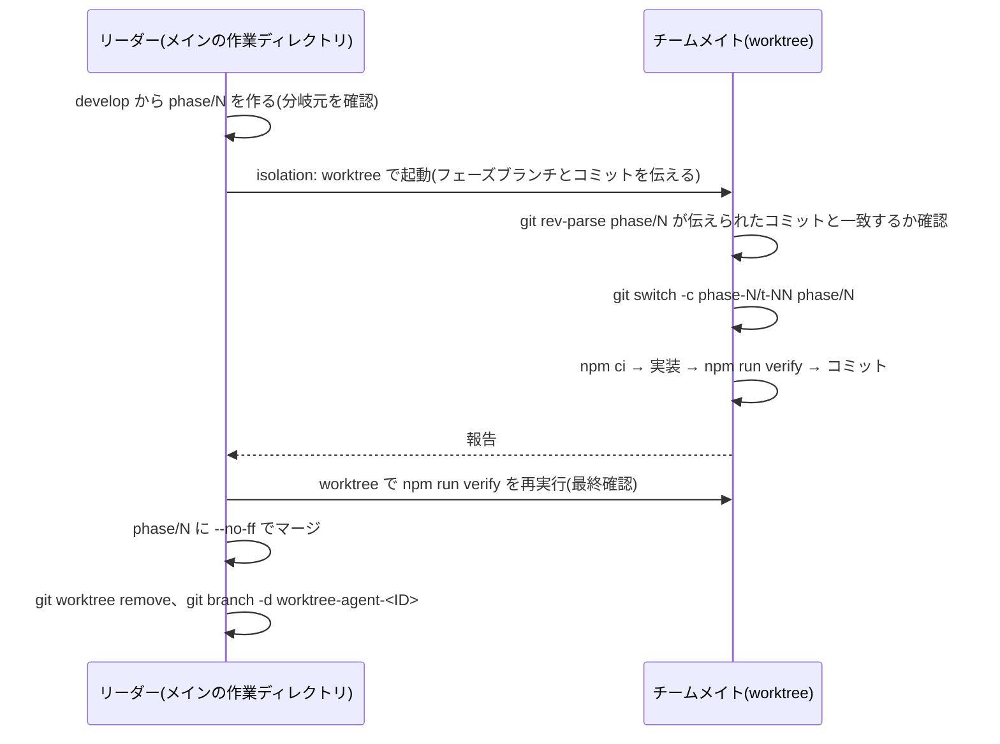

# worktree で隔離したチームの運用

> [!summary] 要点
> - Claude Code のサブエージェントを isolation: worktree で起動すると、worktree は `.claude/worktrees/agent-<ID>` に作られる。ブランチ `worktree-agent-<ID>` も自動で作られる。
> - **そのブランチの分岐元は `main` だった。** リーダーが今いるブランチ(`phase/0`)ではない。そのため、チームメイトは分岐元を確かめてから `git switch -c phase-N/t-NN phase/N` でタスクブランチを作る。
> - worktree はメインの作業ディレクトリの中に入れ子で作られる。上位の `node_modules` や設定ファイルを拾わないよう、worktree ごとに `npm ci` し、ツールの対象から `.claude/` を外す。

関係するノート: [[tasks/00-index|タスク一覧]](進め方のルール)、[[npm-workspaces-nested-worktree]]、[[test-lint-setup]]

## 観察したこと

2026-09-24、[[T01-scaffold|T01]] のチームメイトを isolation: worktree で起動したときの結果。

| 項目 | 結果 | 根拠レベル |
|---|---|---|
| worktree の場所 | `/Users/home/sandbox/emdash-base64img-plugin/.claude/worktrees/agent-<ID>`(メインの作業ディレクトリの中) | 実測のみ |
| 自動で作られるブランチ | `worktree-agent-<ID>` | 実測のみ |
| 自動で作られるブランチの分岐元 | `14b5db3`(`main`)。起動時にリーダーが `phase/0`(`19a32ce`)にいても、`main` から作られた | 実測のみ |
| 終了後の worktree | チームメイトがタスクブランチに切り替えてコミットした worktree は、自動では消えずに残った。完了通知には、worktree のパスと、自動で作られたブランチの名前が入っていた | 実測のみ |
| 共有されるもの | ブランチなどの ref、`git stash` のスタック、`.git/info/exclude` | 実測+公式ドキュメント(git worktree の仕様) |
| 共有されないもの | 未追跡のファイル(例: 当時の `mise.toml`)、git 管理外の `references/` | 実測のみ |

## 運用の手順

- 同じブランチは 2 つの worktree で同時にチェックアウトできない。フェーズブランチはメインの作業ディレクトリでチェックアウトしたままにし、チームメイトは起点として参照するだけにする。
- 自動で作られたブランチ `worktree-agent-<ID>` にはコミットが無い。worktree を消したあと `git branch -d` で消せた(実測のみ)。
- `git worktree remove` は、ignore されたファイル(`node_modules` など)しか無ければ `--force` なしで成功した(実測のみ)。

## 入れ子の worktree で気をつけること

- **モジュールの解決**: Node と TypeScript は上位ディレクトリの `node_modules` まで探す。worktree に `node_modules` が無いと、メインの作業ディレクトリのものが使われる。worktree ごとに `npm ci` する([[npm-workspaces-nested-worktree]])。
- **ツールの対象**: vitest の include を `tests/**` に限り、oxlint と prettier の対象から `.claude/` と `references/` を外している([[test-lint-setup]])。
- **stash**: `git stash` は全 worktree で共有される。チームメイトが `git stash pop` すると、ほかの人が退避したものを取り出してしまう。チームメイトは stash を使わない。
- **ポートとデータベース**: 開発サーバーを同時に動かすときは、ポートを `4400 + タスク番号` のように分ける。SQLite のファイルと wrangler のローカル状態(`.wrangler/`)は worktree の中に置かれるので、worktree ごとに別になる(推測のみ。[[T02-playground|T02]] 以降で確認する)。
