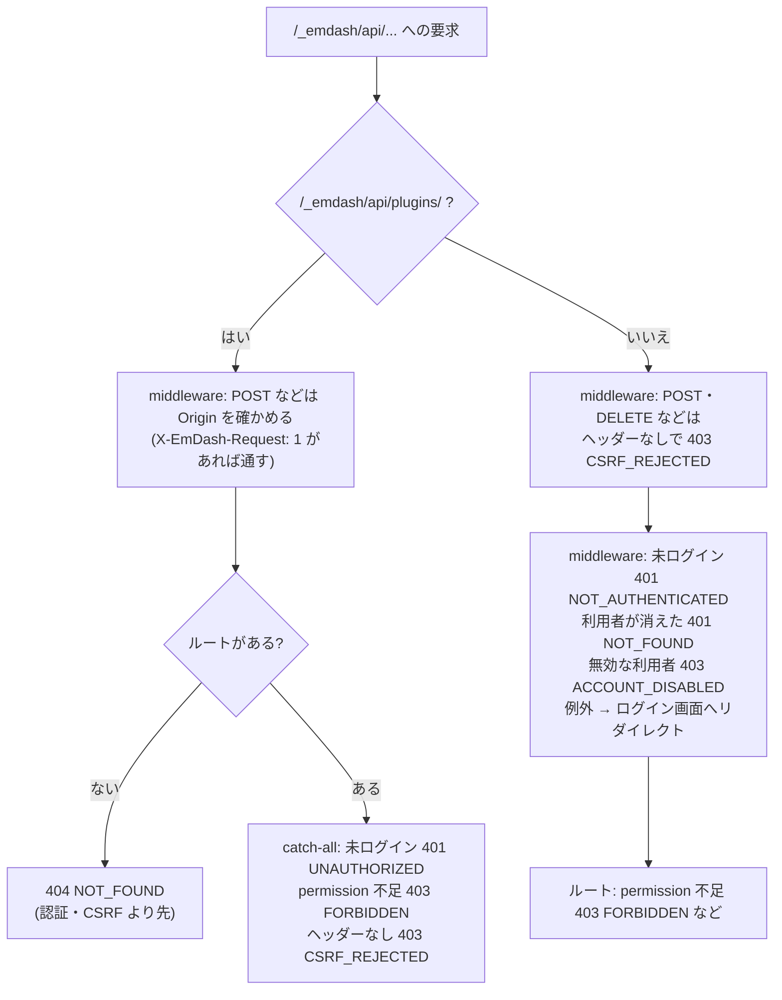

# EmDash 0.39.1 の API を管理画面の部品から呼ぶときの送り方とエラーの形

> [!summary] 要点
> - 管理画面は、同じオリジンの `/_emdash/api/...` を、ヘッダー `X-EmDash-Request: 1` を付けた `fetch` で呼ぶ。認証はセッションの cookie で、`credentials` は既定(`same-origin`)のまま。
> - プラグインのルートは `/_emdash/api/plugins/<プラグイン ID>/<ルート名>`。完全削除は標準 API `DELETE /_emdash/api/content/<collection>/<id>/permanent`(管理者のみ、body なし)。
> - エラーの body はどちらも `{ success: false, error: { code, message } }`。ただし **未ログインのコードが違う**: プラグインのルートは 401 `UNAUTHORIZED`、標準 API は middleware が 401 `NOT_AUTHENTICATED` を返す。ほかに 401 `NOT_FOUND`(セッションの利用者が消えた)、403 `ACCOUNT_DISABLED` もある。
> - 外部の認証(Cloudflare Access など)の失敗は `text/plain` の body で、HTTP ステータスしか分からない。認証の middleware が例外を投げると、API の要求でもログイン画面へリダイレクトする。
> - このプラグインの `src/client/api.ts` は、401 を常に `UNAUTHORIZED` にし、知らないコードと JSON でない body は HTTP ステータスからコードを決め、リダイレクトは追わずに `UNAUTHORIZED` にする。
> - 関連: [[base64-image-plugin-spec#7. アップロード(書き込み経路)|仕様書 7 章]]、[[base64-image-plugin-spec#10. 画像のライフサイクル|仕様書 10 章]]、[[T14-admin-i18n-api]]、[[emdash-plugin-route-errors]]、[[emdash-plugin-route-permissions]]、[[emdash-admin-locale-lang]]

## 送り方

| 項目 | 値 | 根拠 |
|---|---|---|
| API の起点 | `/_emdash/api`(同じオリジンの絶対パス) | `references/emdash/packages/admin/src/lib/api/client.ts:11` |
| プラグインのルート | `/_emdash/api/plugins/{pluginId}/{path}`。メソッドは GET / HEAD / POST / PUT / PATCH / DELETE のどれでもよい | `references/emdash/packages/core/src/astro/routes/api/plugins/[pluginId]/[...path].ts:4-6`、`:41-46` |
| 完全削除 | `DELETE /_emdash/api/content/{collection}/{id}/permanent`。body なし。permission は `content:delete_permanent`(Admin のみ) | `.../api/content/[collection]/[id]/permanent.ts:14-31`、管理画面の呼び方は `packages/admin/src/lib/api/content.ts:367-373` |
| CSRF 対策 | ヘッダー `X-EmDash-Request: 1`。管理画面の `apiFetch` は、これだけを足して `fetch` を呼ぶ | `packages/admin/src/lib/api/client.ts:17-21`。プラグイン向けに同じ関数が `emdash/plugin-utils` にもある(`packages/core/src/plugin-utils.ts:27-31`) |
| 認証 | セッションの cookie。`apiFetch` は `credentials` を指定しない(既定の `same-origin` で cookie が送られる) | 同上 |

- 根拠レベル: 公式ドキュメントのみ(上の表)。送り方どおりに呼んで成功することは、下の実測で確かめた(実測+公式ドキュメント)。
- インストールされる `@emdash-cms/admin` 0.39.1 の dist も同じ(`node_modules/@emdash-cms/admin/dist/plugins-*.js` の `apiFetch`、`dist/index.js` の `permanentDeleteContent`)。根拠: 公式ドキュメントのみ

## CSRF の確認が行われる場所



- プラグインのルート: middleware は Origin の確認だけを行い(`packages/core/src/astro/middleware/auth.ts:216-225`、`api/csrf.ts:31-59`)、ヘッダーの確認は catch-all が、ルートが見つかったあとで行う(`plugins/http-route-dispatch.ts:104-110`、`:75-77`)。そのため、無いルートはヘッダーが無くても 404 になる。根拠: 実測+公式ドキュメント
- 標準 API: middleware が、GET / HEAD / OPTIONS 以外でヘッダーを確かめる(`astro/middleware/auth.ts:280-291`)。根拠: 実測+公式ドキュメント
- 未ログインなどの応答は `astro/middleware/auth.ts:696-736`(パスキー)。外部の認証は `:497-631` で、`new Response("User not authorized", { status: 403 })` のような `text/plain` を返す。根拠: 公式ドキュメントのみ

## EmDash がリダイレクトを返す場合

- `/_emdash/api/...` の要求がリダイレクトされるのは、パスキーの認証の middleware が例外を投げたときだけ(`astro/middleware/auth.ts:732-736` で `/_emdash/admin/login` へ)。未ログインなどは JSON の 401 / 403 を返す(`:696-728` の `isApiRoute` の分岐)。根拠: 公式ドキュメントのみ
- setup へのリダイレクトは管理画面(`/_emdash/admin`)と公開ページだけで、API には無い(`astro/middleware/setup.ts:20-24`、`astro/middleware.ts:705-733`)。サイトのリダイレクト設定も `/_emdash` を対象にしない(`astro/middleware/redirect.ts:25`、`:40-41`)。根拠: 公式ドキュメントのみ
- Cloudflare Access などの外部の認証は、EmDash の手前でログイン画面(別のオリジン)へリダイレクトすることがある。`fetch` がこれを追うと CORS で失敗し、通信のエラーと区別できない。根拠: 推測のみ(Access での確認はしていない。[[T32-cloudflare-check|T32]] で確かめられる)

## 完全削除 API の応答

| 状況 | HTTP | body | 根拠 |
|---|---|---|---|
| ゴミ箱に入った画像 | 200 | `{"success":true,"data":{"deleted":true,"id":"…"}}` | 実測+公式ドキュメント(`api/handlers/content.ts:1505-1508`) |
| ゴミ箱に入っていない画像・無い画像 | 404 | `{"success":false,"error":{"code":"NOT_FOUND","message":"Content item not found: <id>"}}` | 実測+公式ドキュメント(`:1495-1502`) |
| 削除に失敗した | 500 | `CONTENT_DELETE_ERROR` `"Failed to permanently delete content"` | 公式ドキュメントのみ(`:1509-1517`) |
| Admin でない | 403 | `FORBIDDEN` `"Insufficient permissions"` | 公式ドキュメントのみ(`api/authorize.ts:43-45`)。ロールごとの実測は [[emdash-plugin-route-permissions]] |
| 未ログイン | 401 | `NOT_AUTHENTICATED` `"Not authenticated"` | 実測+公式ドキュメント(`astro/middleware/auth.ts:696-699`) |
| ヘッダー `X-EmDash-Request` なし | 403 | `CSRF_REJECTED` `"Missing required header"` | 実測+公式ドキュメント |

- エラーの body は `apiError` の形で、プラグインのルートと同じ(`api/error.ts:31-43`)。`unwrapResult` を通るエラーは `details` を含むことがある(`:110-119`)。T03 の `routeErrorBodySchema` は `z.object` なので、`details` があっても読める。根拠: 公式ドキュメントのみ(テストで確かめた)
- 成功すると、ほかのプラグインの `content:afterDelete` が `permanent: true` で呼ばれる(`emdash-runtime.ts:3749-3763`)。根拠: 公式ドキュメントのみ
- 参考: 標準 API のゴミ箱への移動(`DELETE /_emdash/api/content/b64_images/{id}`)も、200 で同じ形の `{ deleted: true, id }` を返した。根拠: 実測のみ

## このプラグインでの変換(`src/client/api.ts`)

| 応答 | コード |
|---|---|
| 401(body に関係なく) | `UNAUTHORIZED` |
| エラーの形の body で、`code` が `SERVER_ERROR_CODES` / `HOST_ERROR_CODES` のどれか | そのコード |
| エラーの形の body で、知らないコード(`ACCOUNT_DISABLED` など)、またはブラウザ側のコード | HTTP ステータスから決める(下の表) |
| エラーの形でない body(HTML・`text/plain`・空) | HTTP ステータスから決める |
| リダイレクト(`opaqueredirect`、3xx) | `UNAUTHORIZED` |
| 2xx で、包み `{ success: true, data }` か `data` の形が T03 のスキーマに合わない | `UNEXPECTED_RESPONSE` |
| `fetch` の失敗、body の読み込みの失敗 | `NETWORK_ERROR` |
| `signal` の中断 | `signal.reason` で reject(コードにしない) |

| HTTP ステータス | コード |
|---|---|
| 400 / 422 | `VALIDATION_ERROR` |
| 401 | `UNAUTHORIZED` |
| 403 | `FORBIDDEN` |
| 404 | `NOT_FOUND` |
| 405 | `METHOD_NOT_ALLOWED` |
| 413 / 415 | `INVALID_PLUGIN_REQUEST` |
| 5xx | `INTERNAL_ERROR` |
| それ以外(408 / 409 / 429 など) | `UNEXPECTED_RESPONSE` |

- `Base64ImageError` の `details` には `status`(HTTP ステータス)と、あれば `responseCode`(応答の元のコード)を入れる。`message` はサーバーの英語の `message`(ログ用)。
- 送る前に、入力を T03 のスキーマで確かめる。合わなければ送らずに `VALIDATION_ERROR`。完全削除の ID は URL のパスに入るので、`entryIdSchema`(`/` と `.` を含まない)で確かめる。
- 決定の根拠レベル: 変換の規則は設計判断。規則の前提(どの層がどのコードを返すか)は上の表のとおり。

## 実測

playground(Node + SQLite、`astro dev`)を起動し、Playwright の Chromium で管理画面を開いた。`src/client/api.ts` などを esbuild で 1 つのスクリプトにまとめ、ページに読み込んで呼んだ。根拠: **実測のみ**(上の表の「実測+公式ドキュメント」は、この結果とソースを合わせたもの)

| 呼び方 | 結果 |
|---|---|
| 管理者、`fetch` で完全削除(無い ID、ヘッダーあり) | 404 `NOT_FOUND` `"Content item not found: missing01"` |
| 管理者、`fetch` で完全削除(ヘッダーなし) | 403 `CSRF_REJECTED` `"Missing required header"` |
| 管理者、`fetch` でプラグインのルート `upload`(まだ無い。ヘッダーあり・なし) | どちらも 404 `NOT_FOUND` `"Plugin route not found"` |
| 管理者、標準 API で `b64_images` を作成 | 201 |
| `deleteImagePermanently(ゴミ箱に入っていない ID)` | `NOT_FOUND`、`details: { status: 404, responseCode: "NOT_FOUND" }` |
| 標準 API でゴミ箱へ移動 | 200 `{ success: true, data: { deleted: true, id } }` |
| `deleteImagePermanently(ゴミ箱に入った ID)` | `{ deleted: true, id }` で成功 |
| もう一度 `deleteImagePermanently` | `NOT_FOUND` |
| `uploadImage(…)`(ルートがまだ無い) | `NOT_FOUND`、`message: "Plugin route not found"` |
| 未ログイン、`fetch` で完全削除 | 401 `NOT_AUTHENTICATED` `"Not authenticated"` |
| 未ログイン、`deleteImagePermanently` | `UNAUTHORIZED`、`details: { status: 401, responseCode: "NOT_AUTHENTICATED" }` |
| 未ログイン、`uploadImage`(ルートがまだ無い) | `NOT_FOUND`(ルートの確認が認証より先) |

> [!info] 計測環境
> macOS 26.4(Darwin 25.4.0、arm64)、Node 26.10.0、Chromium 153.0.8010.12(Playwright 1.63.0)、`emdash` / `@emdash-cms/admin` 0.39.1、Astro 7.3.3(`astro dev`)、esbuild 0.28.2。2026-09-24 に計測。プラグインのルートは、まだ登録されていない段階([[T29-plugin-definition|T29]] の前)。

### 再現手順

1. worktree で `npm run dev -w playground -- --port 4414` を実行する(エージェントからはバックグラウンドで起動する。[[astro-dev-background-for-agents]])。
2. スクラッチ(worktree の外)に次の入口を置き、`npx esbuild harness.ts --bundle --format=iife --platform=browser --outfile=harness.js` でまとめる(worktree で実行すると、`zod` と `react` は worktree の `node_modules` から解決される)。

```ts
import { deleteImagePermanently, uploadImage } from "<worktree>/src/client/api";
import { getErrorMessage } from "<worktree>/src/client/error-messages";
import { getDocumentLocale, subscribeDocumentLocale } from "<worktree>/src/client/i18n";

(window as unknown as { T14: unknown }).T14 = {
	deleteImagePermanently,
	uploadImage,
	getErrorMessage,
	getDocumentLocale,
	subscribeDocumentLocale,
};
```

3. Playwright で `/_emdash/api/setup/dev-bypass?redirect=/_emdash/admin` を開いてログインし、`/_emdash/admin/settings` で `page.addScriptTag({ path: "harness.js" })` を実行してから、`page.evaluate` で呼ぶ。新しいセッションでは「Welcome to EmDash」のダイアログが描画のあとに出て、ほかの要素がアクセシビリティツリーから隠れる(`getByRole` で見つからない)。先に「Get Started」を押して閉じる。

```js
const capture = async (promise) => {
	try {
		return { resolved: await promise };
	} catch (error) {
		return { code: error.code, details: error.details, message: error.message };
	}
};
const created = await (
	await fetch("/_emdash/api/content/b64_images", {
		method: "POST",
		headers: { "X-EmDash-Request": "1", "Content-Type": "application/json" },
		body: JSON.stringify({ data: { image: { src: "data:image/webp;base64,UklGRhYAAABXRUJQ", mimeType: "image/webp", width: 1, height: 1, meta: { v: 1, bytes: 26 } } } }),
	})
).json();
const id = created.data.item.id;
await capture(T14.deleteImagePermanently(id)); // NOT_FOUND(ゴミ箱に入っていない)
await fetch(`/_emdash/api/content/b64_images/${id}`, { method: "DELETE", headers: { "X-EmDash-Request": "1" } });
await capture(T14.deleteImagePermanently(id)); // { resolved: { deleted: true, id } }
```

4. 未ログインは、cookie の無い別のコンテキストでサイトのページ(`/`)を開き、同じスクリプトを読み込んで呼ぶ。
5. 最後に `npm run dev -w playground -- stop` で止め、`lsof -nP -iTCP:4414 -sTCP:LISTEN` で何も出ないことを確かめる。
