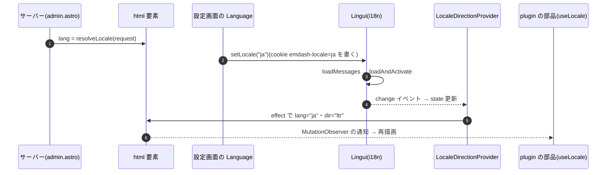

# EmDash 0.39.1 の管理画面の言語と `<html lang>`

> [!summary] 要点
> - 管理画面を開いたときの `<html lang>` は、サーバーが cookie `emdash-locale` → `Accept-Language` → `en` の順で決める。
> - 設定画面(Settings)の「Language」で言語を変えると、**再読み込みせずに** `<html lang>`(と `dir`)が書き換わる。書き換えるのは `LocaleDirectionProvider` の effect。cookie `emdash-locale` も書かれ、次に開いたときはサーバーがその言語で描く。
> - plugin の部品は `LocaleDirectionProvider` の内側で描画されるが、言語が変わっても再描画されるとは限らない。このプラグインは `MutationObserver` で `lang` 属性を監視し、`useLocale()` で追随する(`src/client/i18n.ts`)。
> - 言語の判定は主言語のサブタグで行う(`ja-JP` → 日本語、`en-GB` → 英語)。ja / en 以外は英語。
> - 関連: [[base64-image-plugin-spec#11.1 共通方針|仕様書 11.1]]、[[T14-admin-i18n-api]]、[[emdash-admin-api-requests]]

## 流れ



| 段階 | 内容 | 根拠 |
|---|---|---|
| 初期値 | `<html lang={resolvedLocale} dir={resolvedDir}>`。`resolveLocale(Astro.request)` は cookie `emdash-locale`(対応している言語のとき)→ `Accept-Language`(ベースの言語や文字体系でも照合)→ `DEFAULT_LOCALE`(`en`) | `references/emdash/packages/core/src/astro/routes/admin.astro:19-23`、`:63`、`packages/admin/src/locales/config.ts:114-135` |
| 切り替え | 設定画面の Combobox が `setLocale(code)` を呼ぶ。cookie を書き(`Path=/_emdash; SameSite=Lax; Max-Age=31536000`)、カタログを読み込んで `i18n.loadAndActivate` する | `packages/admin/src/components/Settings.tsx:138-165`、`packages/admin/src/locales/useLocale.ts:7-31` |
| 反映 | `useLocale` が Lingui の `change` を購読して state を更新し、`LocaleDirectionProvider` の effect が `lang` と `dir` を `setAttribute` する | `useLocale.ts:33-39`、`LocaleDirectionProvider.tsx:15-25` |
| 位置 | `LocaleDirectionProvider` は `AdminApp` のほぼ最上位で、plugin の部品(`PluginAdminProvider` とルーター)はその内側 | `packages/admin/src/App.tsx:145-163` |

- 根拠レベル: 上の表は公式ドキュメントのみ。インストールされる `@emdash-cms/admin` 0.39.1 の dist も同じ(`node_modules/@emdash-cms/admin/dist/LocaleDirectionProvider-*.js`)。切り替えで `lang` が変わることは、下の実測で確かめた(実測+公式ドキュメント)。
- 対応している言語(`packages/admin/src/locales/locales.ts:34-64`): `en`(既定)、`ar`、`eu`、`ca`、`zh-CN`、`zh-TW`、`cs`、`nl`、`en-GB`、`fa`、`fr`、`ka`、`de`、`hi`、`hu`、`id`、`ja`、`nb`、`pl`、`pt-BR`、`sr-Latn`、`es-419`、`es-ES`、`sv`、`th`、`tr`、`uk`。`ko` と `pseudo` は無効。`en-GB` があるので、`en` との完全一致では判定しない。根拠: 公式ドキュメントのみ

## plugin の部品が言語の変化に追随する方法

- plugin の部品は、Lingui のフックを使わない限り、言語が変わっても props も context も変わらないので再描画されない。根拠: 推測のみ(React の再描画の規則から)
- `lang` は親(Provider)の effect で書き換わる。Lingui の `change` で再描画された子が、描画中に `document.documentElement.lang` を読むと、まだ古い値のことがある(effect は描画と commit のあとに実行される)。根拠: 推測のみ
- そのため、描画中に読むのではなく、属性の変化を購読する。`src/client/i18n.ts` の `useLocale()` は `useSyncExternalStore` と `MutationObserver`(`attributeFilter: ["lang"]`)で実装した。監視は購読の数に関係なく 1 つにまとめる(コンテンツ一覧の列は 1 ページ 100 行の各セルが購読しうる)。
- Lingui(`@lingui/react`)を plugin から直接使う方法は採らなかった。このプラグインの依存に無く、管理画面と同じインスタンスになる保証も無いため。根拠: 推測のみ

## 実測

playground(Node + SQLite、`astro dev`)の管理画面を Playwright の Chromium(`locale: "en-US"`)で開き、`src/client/i18n.ts` を esbuild でまとめたスクリプトを読み込んだ。根拠: **実測のみ**

| 手順 | 結果 |
|---|---|
| ログイン直後の設定画面 | `lang="en"`、`getDocumentLocale()` は `en` |
| `subscribeDocumentLocale` で購読し、「Language」で「日本語」を選ぶ | 同じドキュメントのまま(`window` に置いた印が残った)`lang="ja"`・`dir="ltr"` になり、購読した関数が 1 回呼ばれた。`getDocumentLocale()` は `ja` |
| cookie | `emdash-locale=ja`(`Path=/_emdash`、`SameSite=Lax`、1 年) |
| 再読み込み | サーバーが `lang="ja"` で描いた |

> [!info] 計測環境
> macOS 26.4(Darwin 25.4.0、arm64)、Node 26.10.0、Chromium 153.0.8010.12(Playwright 1.63.0)、`emdash` / `@emdash-cms/admin` 0.39.1、Astro 7.3.3(`astro dev`)。2026-09-24 に計測。手順とスクリプトは [[emdash-admin-api-requests#再現手順]] と同じ(同じ実行で測った)。

言語を切り替える部分:

```js
await page.evaluate(() => {
	window.__marker = "same-document";
	window.__notified = [];
	window.T14.subscribeDocumentLocale(() =>
		window.__notified.push([document.documentElement.lang, window.T14.getDocumentLocale()]),
	);
});
await page.getByRole("combobox", { name: "Language" }).click();
await page.getByRole("option", { name: "日本語" }).click();
await page.waitForFunction(() => document.documentElement.lang === "ja");
// → { lang: "ja", sameDocument: true, notified: [["ja", "ja"]] }
```

## テストでの扱い

- jsdom(30.1.0)の `MutationObserver` で、`document.documentElement.lang` の変更が通知される。部品のテストでは、描画の前に `document.documentElement.lang = "ja"` を設定する。描画したあとに変えるときは、`act(async () => { …; await new Promise((r) => setTimeout(r, 0)); })` の中で変えると、React の `act` の警告が出ない。根拠: 実測のみ(`tests/client/api.test.ts`)
