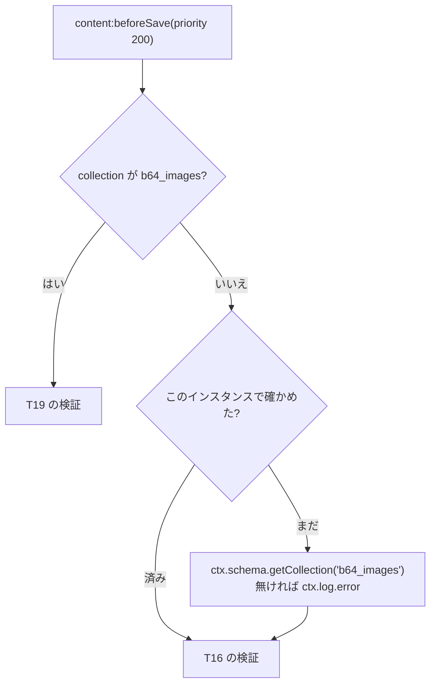

# EmDash 0.39.1 の native プラグインの lifecycle hook はいつ呼ばれるか(起動時の確認の置き場所)

> [!summary] 要点
> - `astro.config.mjs` の `emdash({ plugins: [...] })` で登録した native プラグインでは、**起動時に呼ばれる hook が無い**。サーバーの起動、最初のリクエスト、ページの表示、dev-bypass、再起動のどれでも、`plugin:install` / `plugin:activate` は呼ばれなかった。根拠: 実測+公式ドキュメント
> - `plugin:activate` が呼ばれるのは、管理者がプラグインを有効にしたとき(管理画面のプラグインの画面、`POST /_emdash/api/admin/plugins/{id}/enable`、権限 `plugins:manage`)だけ。無効にすると `plugin:deactivate` が呼ばれる。`plugin:install` は、マーケットプレイスとレジストリからのインストールでだけ呼ばれ、config で登録したプラグインでは一度も呼ばれない。根拠: 実測+公式ドキュメント
> - 公式ドキュメントの「`plugin:install`: Runs once when the plugin is first added to a site」「`plugin:activate`: Runs when the plugin is enabled (after install or when re-enabled)」は、config で登録した native プラグインには当てはまらない。根拠: 実測+公式ドキュメント
> - lifecycle hook の例外は結果に入るだけで、投げ直されない。有効化の処理はその結果を読まないので、**例外はどこにもログが出ない**。根拠: 公式ドキュメントのみ
> - base64-image は、仕様書 13.1 の「起動時に `b64_images` があるかを確かめる」を、`plugin:activate` と、プラグインのインスタンスごとの**最初の `b64_images` 以外の保存**(`content:beforeSave`)で行う。無ければエラーのログを出すだけで、例外は投げない。クエリは最初の 1 回だけ増える(あれば +2、無ければ +1)。根拠: 実測+公式ドキュメント
> - 関連: [[T29-plugin-definition]]、[[base64-image-plugin-spec#13.1 seed|仕様書 13.1]]、[[emdash-seed-and-b64-images]]、[[emdash-plugin-definition-registration]]、[[emdash-native-plugin-entrypoints]]

> [!info] 計測の方法と環境
> - playground を複製した使い捨てのサイト(`spikes/t29-plugin/site/`、git 管理外)に、base64-image と、lifecycle hook が呼ばれたらログを出すだけのプラグイン(`lifecycle-observer`)を登録した。seed には `b64_images` を入れていない([[#再現手順]])。
> - playground(`b64_images` がある)でも、再起動のあとの保存のクエリ数を測った。
> - macOS 26.4(Darwin 25.4.0、arm64)、Node 26.10.0、`emdash` 0.39.1、Astro 7.3.3、SQLite(`node:sqlite`、SQLite 3.53.4)。開発サーバー(`astro dev`)、ポート 4429。2026-09-24 に計測。クエリ数は応答の `Server-Timing` の `db.count`。
> - 行番号は `references/emdash/packages/core/src/` 以下(タグ `emdash@0.39.1`)。

## いつ呼ばれるか

| 操作 | `plugin:install` | `plugin:activate` | `plugin:deactivate` | 根拠 |
|---|---|---|---|---|
| サーバーの起動(ランタイムの作成) | 呼ばれない | 呼ばれない | 呼ばれない | 実測+公式ドキュメント。`EmDashRuntime.create()`(`emdash-runtime.ts:1441-2169`)は、`_plugin_state` から有効なプラグインを決めるだけで(`:1699-1706`。行が無ければ有効)、lifecycle hook を呼ばない |
| 最初のリクエスト、ページの表示、dev-bypass(初回のセットアップ) | 呼ばれない | 呼ばれない | 呼ばれない | 実測のみ |
| 再起動(無効化・有効化で `_plugin_state` に行ができたあと) | 呼ばれない | 呼ばれない | 呼ばれない | 実測のみ |
| 管理画面でプラグインを無効にする | — | — | 呼ばれる | 実測+公式ドキュメント(`plugins/lifecycle.ts:35-47` → `emdash-runtime.ts:1004-1016`) |
| 管理画面でプラグインを有効にする | — | 呼ばれる | — | 実測+公式ドキュメント(`astro/routes/api/admin/plugins/[id]/enable.ts:16-35`。権限 `plugins:manage`。`plugins/lifecycle.ts:18-33` → `setPluginStatus(id, "active")` → `emdash-runtime.ts:1009`) |
| マーケットプレイス・レジストリからのインストール | 呼ばれる | 続けて呼ばれる | — | 公式ドキュメントのみ(`emdash-runtime.ts:1046-1049`。`astro/routes/api/admin/plugins/marketplace/[id]/install.ts:75`、`…/plugins/registry/install.ts:122`) |
| マーケットプレイス・レジストリのプラグインの更新 | — | 呼ばれる | — | 公式ドキュメントのみ(`emdash-runtime.ts:1051-1053`。`astro/routes/api/admin/plugins/[id]/update.ts:71`、`…/plugins/registry/[id]/update.ts:92`) |

- `PluginManager`(`plugins/manager.ts:179`、`:212` に install / activate がある)は `createPluginManager` として export されているが、0.39.1 のランタイムの中では作られない(`new PluginManager` は `manager.ts:676` だけ)。根拠: 公式ドキュメントのみ
- 公式ドキュメントとの食い違い: `references/emdash/docs/src/content/docs/plugins/creating-plugins/hooks.mdx:94`(「Runs once when the plugin is first added to a site」)、`:110`(「after install or when re-enabled」)、`reference/hooks.mdx:40`、`:403`、`:419`。config で登録したプラグインは「インストール」の手順を通らないので、どちらの記述も当てはまらない。根拠: 実測+公式ドキュメント
- 公式の forms プラグイン(`packages/plugins/forms/src/index.ts:102-109`)は、`plugin:activate` で週 1 回の cron を登録する。config で登録すると、管理者が一度無効にして有効に戻すまで cron が登録されないとみられる。根拠: 推測のみ(forms は動かしていない)

### 例外とタイムアウト

- lifecycle hook は、登録に capability が要らない(`plugins/hooks.ts:309-348` の表に無い)。根拠: 公式ドキュメントのみ
- `runLifecycleHook`(`plugins/hooks.ts:498-531`)は、例外を `{ success: false, error }` として結果に入れ、投げ直さない。`setPluginStatus`(`emdash-runtime.ts:1004-1016`)は結果を読まないので、例外は捨てられ、ログも出ない。タイムアウトは hook の `timeout`(既定 5,000ms。`plugins/define-plugin.ts:271`)。根拠: 公式ドキュメントのみ(例外を投げる hook は動かしていない)
- → lifecycle hook で見つけた問題は、自分で `ctx.log` に出す。例外を投げても、利用者には何も見えない。

## base64-image の確認のしかた(仕様書 13.1)

`b64_images` が無いサイトでは、アップロードのルートが 500 `IMAGE_COLLECTION_MISSING` を返す([[T18-upload-route|T18]])。それより前に、サーバーのログで気付けるようにする。プラグインはコレクションを作れない(`ctx.schema` は読み取り専用)ので、作り方を書いたエラーのログを出す。

| いつ | すること | クエリ | ログ |
|---|---|---|---|
| `plugin:activate`(管理者が有効に戻したとき) | 毎回確かめる | あれば 2、無ければ 1 | 無ければ `error`(`trigger: "plugin:activate"`) |
| プラグインのインスタンスごとの、最初の `b64_images` 以外の保存(`content:beforeSave`) | 1 回だけ確かめる。同時に来た保存でも 1 回 | 同上。2 回目からは 0 | 無ければ `error`(`trigger: "content:beforeSave"`) |
| `b64_images` への保存 | 確かめない | 0 | — |
| 読み出しに失敗(データベースのエラー) | 保存・有効化は止めない。やり直さない | — | `warn` |
| `ctx.schema` が無い(`schema:read` の宣言漏れ) | 同上 | 0 | `error`(`schema:read` を宣言するように書く) |

- 実装: `src/server/plugin.ts` の `checkImageCollection`(1 回の確認)と `createImageCollectionCheck`(1 回だけにする)。状態は `createPlugin()` ごとに持つ。EmDash は、生成する仮想モジュールの中で `createPlugin(options)` をモジュールの評価のときに 1 回呼ぶ(`astro/integration/virtual-modules.ts:300-305`)ので、プロセス(Workers では isolate)ごとに 1 回になる。根拠: 実測+公式ドキュメント
- `ctx.schema.getCollection` は、コレクションの行を読み、あればフィールドも読む(`schema/registry.ts:314-321`)。無ければ 1 クエリ、あれば 2 クエリ。根拠: 実測+公式ドキュメント



### 決めた理由

| 決めたこと | 理由 | 根拠 |
|---|---|---|
| 起動時ではなく、`plugin:activate` と最初の保存で確かめる | config で登録した native プラグインに、起動時に呼ばれる hook が無い(上の表)。`createPlugin()` は `ctx` もデータベースも無いところで呼ばれる。保存はサイトを使い始めるとまず起きる操作で、beforeSave には `ctx.schema` がある | 実測+公式ドキュメント |
| ログだけにし、例外を投げない | beforeSave で投げると、画像を使わない投稿を含め、すべての保存が止まる(422 か 500)。`plugin:activate` で投げても捨てられる(上の「例外とタイムアウト」)。画像を上げようとした利用者には、アップロードのルートが `IMAGE_COLLECTION_MISSING` を返す | 公式ドキュメントのみ(`plugins/hooks.ts:583-594`、`:498-531`) |
| `b64_images` への保存では確かめない | beforeSave はコレクションがあるかを確かめる前に呼ばれる(作成は `emdash-runtime.ts:3339` のあとに `:3369-3370` で検証、更新は `:3474` のあとに `:3503-3504`)。`b64_images` が無ければ、そのあと EmDash が `COLLECTION_NOT_FOUND` で止め、アップロードのルートは `IMAGE_COLLECTION_MISSING` を返してログも出す。確かめても新しく分かることが無い。`b64_images` の beforeSave は「クエリはしない」([[base64-image-plugin-spec#8. サーバー側の検証\|仕様書 8 章]]②)も保つ | 実測+公式ドキュメント |
| 1 回だけ。確かめられなかった(`unknown`)ときもやり直さない | 保存のたびに 1〜2 クエリ増やさない(T16 がすでにフィールド定義で 2 クエリ使う。[[base64-image-plugin-spec#8. サーバー側の検証\|仕様書 8 章]]③)。データベースの障害が続くときに、保存のたびに警告を出さない。確かめ損ねても、アップロードのルートが別に `IMAGE_COLLECTION_MISSING` を返す | 推測のみ(設計の判断) |
| 始めた時点で「済み」にする | 最初の保存が同時に複数来ても、読むのは 1 回(`started = true` を `await` の前に置く) | 実測のみ(単体テスト) |

### 実測(使い捨てのサイト、b64_images なし)

| 手順 | 結果 | クエリ |
|---|---|---|
| 起動し、`/` と `/posts/` を開く | lifecycle hook のログなし(`Auto-seeded default collections` だけ) | — |
| dev-bypass でログイン | ログなし | — |
| 投稿を 3 件作る(`POST /_emdash/api/content/posts`) | 201。1 件目で 1 回だけ `[plugin:base64-image] The "b64_images" collection does not exist, … { collection: 'b64_images', trigger: 'content:beforeSave' }` | 35 → 34 → 34 |
| アップロード | 500 `IMAGE_COLLECTION_MISSING`(ルートが `Failed to create the image entry` のログを出す) | 7 |
| `lifecycle-observer` を無効にして有効に戻す | `OBSERVER plugin:deactivate called`、`OBSERVER plugin:activate called` | 8 / 8 |
| base64-image を無効にして有効に戻す | 有効に戻したときに、同じエラーのログ(`trigger: 'plugin:activate'`) | 8 / 9 |
| 再起動し(`_plugin_state` に両方の行がある)、`/posts/` を開き、先にアップロードする | lifecycle hook のログなし。アップロードは 500 `IMAGE_COLLECTION_MISSING`。ルートの `ctx.content.create("b64_images", …)` で beforeSave は呼ばれるが、`b64_images` への保存なので確かめず、確認のログは出ない(このあと EmDash が `COLLECTION_NOT_FOUND` で止める) | 7 |
| 続けて投稿を 2 件作る | 1 件目で 1 回だけエラーのログ(`trigger: 'content:beforeSave'`) | 35 → 34 |

playground(`b64_images` がある)を再起動し、投稿を 3 件作ると、クエリは 36 → 34 → 34 で、ログは出なかった。根拠: 実測のみ

## 選ばなかった方法

- `plugin:install` / `plugin:activate` だけで確かめる: config で登録したプラグインでは、ふつう一度も呼ばれない(上の表)。
- `createPlugin()` の中で確かめる: `ctx` もデータベースも無い。Workers では、モジュールの評価のときに I/O もできない(推測のみ)。
- 管理画面で知らせる: マニフェスト(`GET /_emdash/api/manifest`)の `collections` には、非表示の `b64_images` も入る(playground で確かめた。`b64_images` の無いサイトでは入らない)。widget や画像管理ページが、これを見て知らせることはできる。サーバーのログとは別の話なので、[[T30-admin-entry|T30]] への提案にした。根拠: 実測のみ

## 再現手順

使い捨てのサイトは、playground の `src/` と `tsconfig.json` を複製し、`package.json` と `astro.config.mjs` と seed を書き換えた(`spikes/t29-plugin/site/`)。

- プラグイン本体は、worktree の `node_modules/emdash-plugin-base64-image`(npm workspaces が作る、ルートへのリンク)で解決される。サイトの `package.json` には入れない。
- サイトの `package.json` に依存を書かないと、起動の途中で `Failed to create the dev server app: Only URLs with a scheme in: file, data, and node are supported by the default ESM loader. Received protocol 'astro:'` になり、リクエストが応答しなくなった。playground と同じ依存(`@astrojs/node`・`@astrojs/react`・`astro`・`emdash` 0.39.1・`react`・`react-dom`)を書くと起動した。根拠: 実測のみ(原因の仕組みは確かめていない)
- seed は、playground の seed から `b64_images` を除いたもの。

```js
// spikes/t29-plugin/site/astro.config.mjs(抜粋)
emdash({
	database: sqlite({ url: "file:./data.db" }),
	plugins: [
		base64ImagePlugin(),
		{ id: "lifecycle-observer", version: "0.0.0", entrypoint: "/plugins/lifecycle-observer.ts", options: {} },
	],
	fonts: false,
}),
```

```ts
// spikes/t29-plugin/site/plugins/lifecycle-observer.ts
import { definePlugin } from "emdash";

export function createPlugin() {
	return definePlugin({
		id: "lifecycle-observer",
		version: "0.0.0",
		capabilities: [],
		hooks: {
			"plugin:install": async (_event, ctx) => ctx.log.info("OBSERVER plugin:install called"),
			"plugin:activate": async (_event, ctx) => ctx.log.info("OBSERVER plugin:activate called"),
			"plugin:deactivate": async (_event, ctx) => ctx.log.info("OBSERVER plugin:deactivate called"),
		},
	});
}
```

```sh
# サイトのディレクトリの中から起動する(Astro 7.3.3 はエージェントから実行するとバックグラウンドで起動する。[[astro-dev-background-for-agents]])
cd spikes/t29-plugin/site
node ../../../node_modules/astro/bin/astro.mjs dev --port 4429
curl -s -o /dev/null http://localhost:4429/posts/
curl -s -c ../cookies.txt -o /dev/null "http://localhost:4429/_emdash/api/setup/dev-bypass?redirect=/_emdash/admin"
# 無効化・有効化(X-EmDash-Request が無いと 403 CSRF_REJECTED)
curl -s -b ../cookies.txt -H 'X-EmDash-Request: 1' -X POST http://localhost:4429/_emdash/api/admin/plugins/lifecycle-observer/disable
curl -s -b ../cookies.txt -H 'X-EmDash-Request: 1' -X POST http://localhost:4429/_emdash/api/admin/plugins/lifecycle-observer/enable
grep -n -e OBSERVER -e 'plugin:base64-image' .astro/dev.log
node ../../../node_modules/astro/bin/astro.mjs dev stop
lsof -nP -iTCP:4429 -sTCP:LISTEN   # 何も出ないこと
```
