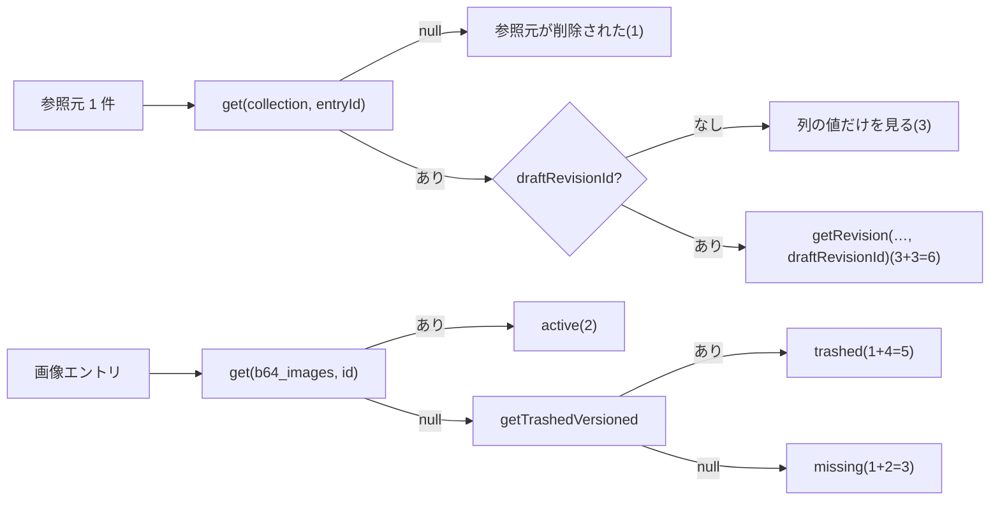

# EmDash 0.39.1 のプラグイン content API のクエリ数(公開版・下書き・ゴミ箱の読み出し)

> [!summary] 要点
> - プラグインのルートは、ハンドラーの外で **1 クエリ**(セッションの利用者の行)を使う。
> - `ctx.content.get` は、見つかれば 3(SEO ありのコレクション)/ 2(SEO なし)、見つからなければ 1。公開版(content テーブルの列)を返し、`draftRevisionId` も返す。
> - `getRevision` と `listRevisions` は **3**(件数に関係なし)。エントリがゴミ箱に入っていると、リビジョンが残っていても、どちらも何も返さない。
> - `getTrashedVersioned` は、ゴミ箱のエントリで 4〜6、無いエントリで 2、**ゴミ箱に入っていないエントリで 9**(`null` を返すのに重い)。先に `get` で絞ってから呼ぶ。
> - [[T21-orphan-routes|T21]] の判定 1 件のクエリ数: 参照元 1 件は 1 / 3 / 6(無い / 下書きなし / 下書きあり)、画像エントリの状態は 2 / 5 / 3(active / trashed / missing)。**仕様書 9 章の「10 件程度ずつ」は、参照元がそれぞれ別の投稿だと、ふつうの場合でも 50 を超える**(10 件で 52)。1 回に扱う件数は、下の式で決める。
> - プラグインストレージの `putMany` は、**1 件ごとに 1 クエリ**(SQLite では前後に `begin` / `commit`)。「`getMany` / `putMany` で 1〜2 クエリ」は `putMany` の件数が 1 のときだけ。
> - 参考: プラグインの `ctx.content.create` → `getVersioned` → `publish`(仕様書 7 章のアップロード)は、ルート全体で **72 クエリ**(SQLite)。
> - Cloudflare のドキュメントは D1 のクエリ数の上限で食い違う(D1 のページは Free で 50、Workers のページは内部サービスへのサブリクエストが Free で 1,000)。
> - 関連: [[emdash-after-save-payload]]、[[emdash-plugin-content-api-constraints]]、[[base64-image-plugin-spec#9. 参照元の記録と未使用画像の検出|仕様書 9 章]]、[[base64-image-plugin-spec#2.2 プラットフォームの上限|仕様書 2.2]]、[[T10-spike-after-save]]、[[T09-spike-query-count]]

> [!info] 計測の環境と方法
> - macOS 26.4(Darwin 25.4.0、arm64)、Node 26.10.0、emdash 0.39.1、Astro 7.3.3、SQLite(`node:sqlite`)。2026-09-24 に計測。
> - 使い捨てのサイト(`spikes/after-save/site/`)に、`ctx.content.*` を 1 つずつ呼ぶプラグインのルートを作り、ルートの応答の `Server-Timing` の `db.count` を読んだ。同じルートを 2〜3 回呼んで、毎回同じ数になることを確かめた。
> - 内訳は、開発サーバーを `EMDASH_QUERY_LOG=1` で起動して、リクエストごとの SQL を読んだ([[#計り方]])。
> - D1 では計っていない。EmDash 自身の計測では、同じページでも D1 のほうが多い(`GET /` の 2 回目: SQLite 6、D1 10。`references/emdash/scripts/query-counts.snapshot.{sqlite,d1}.json`)。この表の数は D1 での下限とみなす。

## 読み出し 1 回あたりのクエリ数

ルートの `db.count` から、ルートの固定費の 1 を引いた数。`posts` は SEO あり、`b64_images` は SEO なし。

| 呼び出し | 状況 | クエリ数 | 内訳 | 根拠 |
|---|---|---|---|---|
| (ルートの固定費) | どのルートでも | 1 | `users` の行(セッションの利用者) | 実測のみ |
| `ctx.content.get` | 見つかった(`posts`) | 3 | 行 / `has_seo` / `_emdash_seo` | 実測+公式ドキュメント |
| 〃 | 見つかった(`b64_images`) | 2 | 行 / `has_seo` | 実測+公式ドキュメント |
| 〃 | ゴミ箱・無い | 1 | 行(`deleted_at IS NULL`) | 実測+公式ドキュメント |
| `getRevision` | 見つかった | 3 | リビジョン(エントリがゴミ箱に無いことも同じ文で確かめる)/ フィールド定義 / `options`(日時の正規化) | 実測+公式ドキュメント |
| 〃 | エントリがゴミ箱 | 1 | リビジョンの文だけ。結果は `null` | 実測+公式ドキュメント(`core/src/database/repositories/revision.ts:177-198`) |
| `listRevisions` | 5〜6 件(`limit` 1 でも同じ) | 3 | 同上 | 実測+公式ドキュメント |
| 〃 | エントリがゴミ箱(リビジョン 6 件のエントリ) | 3 | 同上。結果は空の配列 | 実測+公式ドキュメント(`core/src/database/repositories/revision.ts:145-174`) |
| `getTrashedVersioned` | ゴミ箱(`posts`) | 6 | 行(ゴミ箱を含む)/ `has_seo` / `_emdash_seo` / バイライン 2 / ゴミ箱かの確認 | 実測+公式ドキュメント |
| 〃 | ゴミ箱(`b64_images`) | 4 | 行 / `has_seo` / バイライン / ゴミ箱かの確認 | 実測のみ |
| 〃 | ゴミ箱に入っていない(`posts`、下書きあり) | 9 | 上に加えて、下書きのリビジョン 3。結果は `null` | 実測のみ |
| 〃 | 無い | 2 | ID で行 / slug で行 | 実測のみ |
| `getVersioned` | `posts`(下書きあり) | 8 | 行 / `has_seo` / `_emdash_seo` / バイライン 2 / 下書きのリビジョン 3 | 実測のみ |
| `ctx.storage.<c>.query` | `limit: 100` | 1 | | 実測のみ |
| `ctx.storage.<c>.getMany` | ID の IN | 1 | | 実測+公式ドキュメント |
| `ctx.storage.<c>.putMany` | N 件 | N(D1)/ N+2(SQLite) | 1 件ずつ upsert。トランザクションが使えれば `begin` / `commit` が付く | 公式ドキュメントのみ(`core/src/database/repositories/plugin-storage.ts:293-325`、`core/src/database/transaction.ts:28-55`)+ `begin` と 1 件目の upsert は実測 |
| `ctx.schema.getCollection` | | 2 | コレクション / フィールド | 公式ドキュメントのみ(`core/src/plugins/context.ts:379-381`。保存の SQL にも同じ 2 本が出る) |

- `get` / `getTrashedVersioned` は `SELECT *` なので、`b64_images` では画像の data URL(最大 100,000 バイト)まで読む。状態を知るだけでも本体を読むことになる。根拠: 実測のみ(SQL)
- `getRevision` は、リビジョンのデータをそのまま返す。管理画面から保存したリビジョンには、内部のキー `_slug` が入っている(afterSave の `content.data` では除かれる)。フィールドは、スキーマのフィールド名で読む。根拠: 実測+公式ドキュメント(`core/src/emdash-runtime.ts:3228-3235`)
- `get` の結果の `data` は content テーブルの列の値。公開済みなら公開版、一度も公開していなければ作成したときの値。下書きは `draftRevisionId` が指すリビジョンにある。根拠: 実測+公式ドキュメント([[emdash-after-save-payload#afterSave の event の形]])

## 判定 1 件あたりのクエリ数([[T21-orphan-routes|T21]])



| 判定 | ケース | クエリ数(SEO ありの参照元) | SEO なしの参照元 | 根拠 |
|---|---|---|---|---|
| 参照元 1 件(`get` → 下書きがあれば `getRevision`) | 下書きあり | 6 | 5 | 実測のみ(ルート `judge` で 7 = 1+6) |
| 〃 | 下書きなし | 3 | 2 | 実測のみ(4 = 1+3) |
| 〃 | ゴミ箱・削除済み | 1 | 1 | 実測のみ(2 = 1+1) |
| 画像エントリの状態(`get` → `null` なら `getTrashedVersioned`) | active | 2 | — | 実測のみ(3 = 1+2) |
| 〃 | trashed | 5 | — | 実測のみ(6 = 1+5) |
| 〃 | missing | 3 | — | 実測のみ(4 = 1+3) |

- 組み合わせたクエリ数は、個々のクエリ数の和と一致した(リクエストの中でキャッシュされない)。`has_seo` も呼ぶたびに読む。根拠: 実測のみ
- ゴミ箱に入った画像と、無い画像を区別できた(`ctx.content.delete` でゴミ箱に入れたものも `trashed`、完全削除したものと存在しない ID は `missing`)。T03 の `imageEntryStatusSchema` の前提は成り立つ。根拠: 実測+公式ドキュメント

### 1 リクエストで扱う件数の決め方

1 ページのクエリ数は、次の式で見積もれる(SQLite で実測した値。D1 ではこれより多い見込み)。

```text
Q = 1(ルートの固定費) + 1(imageRefs の query)
  + Σ 画像ごとの状態(2 / 5 / 3)
  + Σ 参照元ごと(1 / 3 / 6)※ 同じエントリはリクエストの中で 1 回だけ調べる
```

| 例(10 件) | Q |
|---|---|
| 画像 10 枚、参照元はそれぞれ別の投稿で、どれも公開済み・下書きなし | 2 + 10 × (2 + 3) = **52** |
| 画像 10 枚、参照元はそれぞれ別の投稿で、どれも下書きあり | 2 + 10 × (2 + 6) = **82** |
| 画像 10 枚、参照元はすべて同じ投稿(ギャラリー) | 2 + 10 × 2 + 6 = **28** |
| 最悪(画像がゴミ箱、参照元はそれぞれ別の投稿で下書きあり) | 2 + 10 × (5 + 6) = **112** |

- T03 の一覧の応答(`imageListItemSchema`)は、参照元ごとの状態を返す。そのため、1 枚目の参照元が使用中でも、残りの参照元も調べる必要がある。
- 件数を固定にせず、「次の画像を足しても、最悪の見積もり(状態 5 + 未確認の参照元 × 6)が予算を超えないか」で止め、残りは `nextCursor` で次のリクエストに回せば、予算(1 リクエスト 50 クエリ未満)に収まる。
- 参照元が 8 件以上ある画像は、1 枚だけでも 2 + 5 + 8 × 6 = 55 で、1 リクエストに収まらない。参照元の上限や、参照元のページ送りが要る。根拠: 推測のみ(上の実測値からの計算)

## 書き込み(参考)

`Server-Timing` の `db.count`(ルートの固定費 1 を含む)。afterSave などの hook のクエリも一部入る([[emdash-after-save-payload#呼ばれる時機]])。

| 操作 | db.count(SQLite) | 根拠 |
|---|---|---|
| 投稿の作成 `POST /content/posts` | 32〜34 | 実測のみ |
| 下書きの保存・自動保存 `PUT` | 55〜62(同じエントリへの保存でも回によって違った。`after()` に回るリビジョンの整理のクエリが同じリクエストで数えられていた) | 実測のみ(違いの理由は推測のみ) |
| 公開 `POST …/publish` | 56 | 実測のみ |
| 複製 / ゴミ箱 / 復元 / 完全削除 | 41 / 29〜31 / 28 / 35 | 実測のみ |
| リビジョンの復元 / 下書きの破棄 | 56 / 41 | 実測のみ |
| プラグイン: `create` → `getVersioned` → `publish`(`b64_images`) | **72** = 固定費 1 + `create` 30 + `getVersioned` 3 + `publish` 38 | 実測のみ |
| プラグイン: `create`(`posts`)/ `update` / `delete` | 32 / 23 / 8 | 実測のみ |

- プラグインの `create` と `publish` には、それぞれ 14 本ずつ、EmDash 本体のメディアの使用状況の索引(`_emdash_media_usage_*`)を更新するクエリが入る(このサイトは playground と同じく `storage` を省略した構成)。根拠: 実測のみ
- SQLite では `begin` / `commit` もクエリとして数えられる。D1 はトランザクションが使えないので、この 2 本は出ない(`core/src/database/transaction.ts:28-55`)。根拠: 公式ドキュメントのみ

## D1 のクエリ数の上限(ドキュメントの食い違い)

| ページ | 記述 | 根拠 |
|---|---|---|
| D1 Limits(2026-04-21 更新) | 「Queries per Worker invocation (read subrequest limits): 1000 (Workers Paid) / 50 (Free)」 | 公式ドキュメントのみ |
| Workers Limits | 「Subrequests per invocation: 50(Free)」「Subrequests to internal services: 1,000(Free)」。サブリクエストには D1 へのリクエストを含む | 公式ドキュメントのみ |
| Workflows Limits | 「Workers on the free plan remain limited to 50 external subrequests and 1,000 subrequests to Cloudflare services per invocation.」 | 公式ドキュメントのみ |

- 仕様書 2.2 の「D1 のクエリ数(Free) 50 / リクエスト」は D1 のページの値。Workers のページに従うと、D1 へのクエリは Free でも 1,000 まで。
- EmDash 本体の保存(`PUT`)が SQLite で 55〜62 クエリなので、D1 でも 50 が本当の上限なら、Workers Free では EmDash の標準の保存も失敗することになる。実際の上限は 1,000 の見込み。根拠: 推測のみ。[[T32-cloudflare-check|T32]] で確かめるまでは、50 を予算とする。
- URL: https://developers.cloudflare.com/d1/platform/limits/ 、https://developers.cloudflare.com/workers/platform/limits/#subrequests 、https://developers.cloudflare.com/workflows/reference/limits/

## 計り方

- `Server-Timing` の `db.count` は、ミドルウェアの `next()` が返った時点(応答のヘッダーを作る時点)の数(`core/src/astro/middleware.ts:1053-1063`)。そのあとに実行されたクエリ(ボディを送る間のもの、まだ動いている `after()` の hook)は入らない。根拠: 実測+公式ドキュメント
- 開発サーバーを `EMDASH_QUERY_LOG=1` で起動すると、リクエストごとに `[emdash-stream-end] {…"dbCount":N…}`(ボディを送り終えた時点の数)と、その直後に `[emdash-query-log] {"sql":…}` が 1 クエリ 1 行で `.astro/dev.log` に出る(`core/src/database/instrumentation.ts`、`core/src/astro/middleware/stream-end-metrics.ts`)。エージェントから起動したときも、環境変数はバックグラウンドのプロセスに引き継がれた。根拠: 実測+公式ドキュメント

```js
// dev.log をリクエストごとに分ける(stream-end の行のあとに、そのリクエストの SQL が並ぶ)
const blocks = [];
for (const line of readFileSync(".astro/dev.log", "utf8").split("\n")) {
	if (line.startsWith("[emdash-stream-end] ")) {
		blocks.push({ ...JSON.parse(line.slice(20)), sql: [] });
	} else if (line.startsWith("[emdash-query-log] ")) {
		const q = JSON.parse(line.slice(19));
		[...blocks].reverse().find((b) => b.route === q.route && b.method === q.method)?.sql.push(q.sql);
	}
}
```
