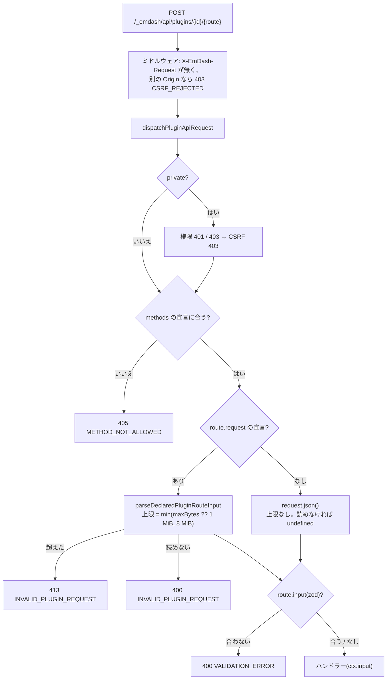

# EmDash 0.39.1 のプラグインルートの body 上限と、ルートの宣言の書き方

> [!summary] 要点
> - 「既定 1MiB」は、ルートが `request`(body の形式)を宣言したときだけの上限である。native プラグインのルートも同じ処理を通る。**宣言しないと、EmDash の側に上限は無い**。12MB の JSON もそのまま受け取った(開発サーバーと本番のビルドの両方)。
> - `request: { body: "json" }` の既定の上限は 1,048,576 バイトである。ちょうどの大きさは通り、1 バイト超えると 413 `INVALID_PLUGIN_REQUEST` になる。`maxBytes` で変えられる。8 MiB を超える値は、エラーにならずに 8,388,608 に切り詰められる(native では検証されず、型エラーにもならない)。
> - `Content-Length` があれば読む前に拒否する。無いとき(chunked)は、読みながら数えて拒否する。
> - 判定の順番は、認証 401 → 権限 403 → CSRF 403 → メソッド 405 → body の上限 413 / 読めない body 400 → 入力のスキーマ 400 `VALIDATION_ERROR` → ハンドラー。
> - アップロードのルートには `permission: "content:create"`、`methods: ["POST"]`、`request: { body: "json", maxBytes: 600_000 }`、`input: uploadRequestSchema` を宣言する。型は `PluginRoute<UploadRequest>` で付ける(`definePluginRoute` を使うと、json の入力の型は `unknown` になる)→ [[#アップロードのルートの宣言(T18 向けの雛形)]]
> - CPU 時間(Node 26、Apple M5 Pro): 固定上限(dataUrl 500,000)の body で、デコード・parse・スキーマの検証・WebP の検証の合計は 0.28ms だった(新しいプロセスでの 1 回目は 1.1ms)。既定の予算(100,000)では 0.06ms / 0.83ms。Workers Free の 10ms と比べて小さい。宣言しないルートに 10.5MB を送ると、拒否するまでに parse とスキーマで約 5.6ms を使う。
> - JSON の応答(raw でない応答)には上限が無い。12MB の応答も返った。
> - 権限の表は、0.39.1 でも [[T06-decision-trash-permission|T06]](0.38.0)と同じだった → [[emdash-plugin-route-permissions#0.39.1 での再計測]]
> - 関連: [[T08-spike-route-body]]、[[T18-upload-route]]、[[base64-image-plugin-spec#7. アップロード(書き込み経路)|仕様書 7 章]]、[[base64-image-plugin-spec#16. 実装前の検証(スパイク)|仕様書 16 章]]、[[emdash-plugin-route-errors]]、[[emdash-plugin-route-permissions]]、[[webp-data-url-validation]]

> [!info] 計測の方法
> - playground を複製した使い捨てのサイト(`spikes/route-body/site/`、git 管理外)に、宣言を変えたルートを並べた native プラグインを入れた([[#再現手順]])。
> - 開発サーバー(`astro dev`)と本番のビルド(`astro build` + `astro preview`、`@astrojs/node` の standalone)の両方で、同じリクエストを送った。body の上限・エラーの形・権限の結果は、両方で同じだった。
> - Cloudflare(workerd)では測っていない。上限の処理は EmDash のコードなので、同じ結果になる見込み(推測のみ)。[[T32-cloudflare-check|T32]] で確かめられる。

## body の上限が決まる場所(ソース)



根拠: 公式ドキュメントのみ(`references/emdash/packages/` 以下、タグ `emdash@0.39.1`)。npm から入れた `node_modules/emdash/src` の同じファイルと内容が一致することも確かめた。

| 場所 | 内容 |
|---|---|
| `plugin-types/src/routes.ts:3-4` | `PLUGIN_ROUTE_MAX_BODY_BYTES = 8 * 1024 * 1024`、`PLUGIN_ROUTE_DEFAULT_BODY_BYTES = 1024 * 1024` |
| `plugin-types/src/routes.ts:11`、`:51-65` | body の形式は `none` / `json` / `text` / `bytes` / `form-data`。`maxBytes` は正の整数で 8 MiB まで。この zod のスキーマを使うのは、sandboxed のマニフェストとバンドル用の CLI だけである(`core/src/plugins/manifest-schema.ts:158`、`core/src/cli/commands/bundle.ts:312`) |
| `core/src/plugins/types.ts:1767-1788` | native の `PluginRoute` は `input`・`public`・`permission`・`cacheControl`・`request`・`methods`・`response`・`handler` を持つ |
| `core/src/plugins/define-plugin.ts:103-222` | native の `definePlugin` は、ルートの `request` を検証しない |
| `core/src/emdash-runtime.ts:5071-5082` | 信頼済み(native)のプラグインのルートの情報は `buildRouteMeta(route)` で作る。`request` もそのまま渡る(`core/src/plugins/routes.ts:88-112`) |
| `core/src/emdash-runtime.ts:5156-5168` | `parseRouteInput(request, routeMeta?.request)`。`PluginRouteRequestError` は `INVALID_PLUGIN_REQUEST` と、その status(400 / 413 / 415)になる |
| `core/src/plugins/routes.ts:129-150` | `request` の宣言があれば `parseDeclaredPluginRouteInput`。無ければ、POST / PUT / PATCH は `request.json()`(失敗は `undefined`)、ほかは query 文字列 |
| `core/src/plugins/route-wire.ts:177-203` | 上限は `Math.min(maxBytes ?? 1 MiB, 8 MiB)`。`json` は UTF-8 の検査付きでデコードしてから `JSON.parse` する。Content-Type は見ない |
| `core/src/plugins/route-wire.ts:76-92`、`http-wire.ts:26-61` | `Content-Length` が上限を超えていれば読まずに 413。無ければ、読みながら数えて超えたところで 413 |
| `core/src/plugins/http-route-dispatch.ts:93-135` | ルートの情報 → 権限と CSRF → `methods`(405 と `Allow`)→ `handlePluginApiRoute` の順に進む。失敗は `apiError(code, message, status)` になる |

公式の説明文も同じことを書いている。根拠: 公式ドキュメントのみ

- 「Routes without a `request` declaration keep the original input behavior. EmDash parses JSON request bodies for `POST`, `PUT`, and `PATCH`」「The default maximum is 1 MiB, and a route can raise `maxBytes` to at most 8 MiB.」(`references/emdash/docs/src/content/docs/plugins/creating-plugins/api-routes.mdx:226-232`)
- native のルートも、この共通の契約に従う(「Wrap a native route in `definePluginRoute()` when it declares `request.body`」。`docs/src/content/docs/plugins/creating-native-plugins/your-first-native-plugin.mdx:164`)。
- 仕様書 16 章が引用した `skills/creating-plugins/references/sandbox-boundaries.md:8` の「Declared plugin route bodies are buffered with a 1 MiB default and 8 MiB author maximum」も、「Declared(宣言した)」ルートの話である。

## body の大きさごとの結果(実測)

JSON `{"data":"xxx…"}` の全体のバイト数を変えて、`Content-Length` を付けて POST した。Admin のセッション、`X-EmDash-Request: 1` あり。開発サーバーと本番のビルドで、表のすべてのセルが同じだった。根拠: **実測+公式ドキュメント**

| body のバイト数 | 宣言なし | `json`(既定) | `json`、`maxBytes: 600_000` | `json`、`maxBytes: 8 MiB` | `json`、`maxBytes: 16 MiB` |
|---|---|---|---|---|---|
| 100,000 | 200 | 200 | 200 | 200 | 200 |
| 500,000 | 200 | 200 | 200 | 200 | 200 |
| 600,000 | 200 | 200 | 200 | 200 | 200 |
| 600,001 | 200 | 200 | **413** | 200 | 200 |
| 1,048,575 | 200 | 200 | 413 | 200 | 200 |
| 1,048,576(1 MiB) | 200 | 200 | 413 | 200 | 200 |
| 1,048,577 | 200 | **413** | 413 | 200 | 200 |
| 8,388,608(8 MiB) | 200 | 413 | 413 | 200 | 200 |
| 8,388,609 | 200 | 413 | 413 | **413** | **413** |
| 10,485,761(10 MiB + 1) | 200 | 413 | 413 | 413 | 413 |
| 12,000,000 | 200 | 413 | 413 | 413 | 413 |

- 200 のときは、ハンドラーが受け取った `data` の長さが、送った長さと一致した(宣言なしの 12,000,000 バイトでも 11,999,989 文字)。
- 413 の body は `{"success":false,"error":{"code":"INVALID_PLUGIN_REQUEST","message":"Plugin route request body exceeds 1048576 bytes"}}`。数字は実際に使われた上限である(`maxBytes: 16 MiB` のルートでも `8388608` と出る)。
- `Content-Length` を付けずに ReadableStream で送る(`Transfer-Encoding: chunked`)と、ハンドラーには `content-length` の無いリクエストが届いた。それでも境界は同じだった(1,048,576 は 200、1,048,577 は 413。600,000 / 600,001 も同じ)。
- 宣言なしのルートに届くまでの上限は、EmDash の外にしか無い。根拠は次のとおり。
  - `astro dev` は、body を上限なしにすべて読んでから `Request` を作る(`node_modules/astro/dist/vite-plugin-app/handle-request.js:72-81`)。根拠: 公式ドキュメントのみ
  - 本番の `@astrojs/node` は `bodySizeLimit` が既定で 1 GiB である(`node_modules/@astrojs/node/dist/index.js:70`)。根拠: 公式ドキュメントのみ
  - Astro の `security.actionBodySizeLimit` / `serverIslandBodySizeLimit`(既定 1 MiB)は、Actions とサーバーアイランドにしか使われない(`node_modules/astro/dist/actions/runtime/server.js:171`、`core/server-islands/endpoint.js:60`)。根拠: 公式ドキュメントのみ
  - Cloudflare のリクエストの body の上限は、Workers のプランではなくアカウントのプランで決まる(Free・Pro は 100 MB)。根拠: 公式ドキュメントのみ(Cloudflare Workers Limits)
- 仕様書 2.2 の「EmDash API のリクエスト body 10MB(`packages/core/src/api/parse.ts:13`)」は、EmDash 自身の API が `parseBody` で読むときの上限である。プラグインのルートは `parseBody` を通らないので、この上限は当てはまらない。根拠: 公式ドキュメントのみ

## 不正な body と、入力のスキーマの検証エラー(実測)

根拠: **実測+公式ドキュメント**(開発サーバーと本番のビルドで同じ)

| 送ったもの | `request: { body: "json" }` | 宣言なし |
|---|---|---|
| 正しくない JSON(`{"data":`) | 400 `INVALID_PLUGIN_REQUEST`「Plugin route request body is not valid JSON」 | 200(`ctx.input` は `undefined`) |
| 空の body / body なし | 400(同上) | 200(`undefined`) |
| UTF-8 でないバイト | 400 `INVALID_PLUGIN_REQUEST`「Plugin route request body is not valid UTF-8」 | 200(`undefined`) |
| `Content-Type: text/plain` / Content-Type なし | 200(JSON として読む) | 200 |
| JSON の文字列 `"abc"` | 200(`ctx.input` は文字列) | 200 |

`input: uploadRequestSchema`([[T03-shared-contracts|T03]])を渡したルート:

| 送ったもの | 宣言あり(`maxBytes: 600_000`) | 宣言なし |
|---|---|---|
| 正しい入力 | 200 | 200 |
| `width: 0` / 知らないキー / 500,001 文字の `dataUrl` | 400 `VALIDATION_ERROR`「Invalid request body」 | 同じ |
| 正しくない JSON | 400 `INVALID_PLUGIN_REQUEST`(not valid JSON) | 400 `VALIDATION_ERROR`(`undefined` がスキーマに合わない) |
| 固定上限の入力(`dataUrl` 500,000 文字 + `thumb` 8,000 文字。body は 508,137 バイト) | 200 | — |
| 同じ入力を空白で 600,001 バイトにしたもの | 413 `INVALID_PLUGIN_REQUEST` | — |
| 10.5MB の `dataUrl` | 413(読まずに拒否) | 400 `VALIDATION_ERROR`(全体を parse してからスキーマで拒否) |
| GET / PUT(`methods: ["POST"]`) | 405 `METHOD_NOT_ALLOWED`、ヘッダー `Allow: POST` | — |

- `VALIDATION_ERROR` の応答に、どの項目が悪いかは入らない(`details` は返らない。[[emdash-plugin-route-errors]])。
- `definePluginRoute` で同じ宣言をしたルートも、実行時の結果は同じだった。

### 判定の順番

`upload` の上限(600,000)を超える 700KB の body を、各段階で送った。根拠: **実測+公式ドキュメント**(`http-route-dispatch.ts:104-126`)

| リクエスト | 結果 |
|---|---|
| 未ログイン | 401 `UNAUTHORIZED` |
| Subscriber | 403 `FORBIDDEN` |
| Contributor、`X-EmDash-Request` なし | 403 `CSRF_REJECTED` |
| Contributor、PUT | 405 `METHOD_NOT_ALLOWED` |
| Contributor、POST | 413 `INVALID_PLUGIN_REQUEST` |
| Contributor、POST、スキーマに合わない小さい body | 400 `VALIDATION_ERROR` |

- body を読むのは、認証・権限・CSRF・メソッドの確認のあとである。本番の Node アダプターと Workers では、ログインしていないリクエストの body は読まれない見込み(推測のみ。`astro dev` は、EmDash に渡す前に body をすべて読む)。

## 応答の大きさ

- raw でない(JSON の)応答は `apiSuccess` → `Response.json` で返り、上限の処理が無い(`core/src/api/error.ts:51-53`)。8 MiB の上限があるのは `response: "raw"` の応答だけである(`route-wire.ts:284-288`)。根拠: 公式ドキュメントのみ
- 5,000,000 文字と 12,000,000 文字の文字列を返すルートは、どちらも 200 で全体が返った(`Cache-Control: private, no-store`)。根拠: **実測のみ**
- Workers も応答の body の大きさに上限を設けていない(Cloudflare Workers Limits の「Response body size: No enforced limit」)。根拠: 公式ドキュメントのみ
- [[T17-admin-data-routes|T17]] のプレビュー取得(1 回 10 件まで。1 件は最大 500,000 文字)も、応答の大きさでは失敗しない。

## ルートの宣言の型

`spikes/route-body/types-check/route-types.ts` を、ルートの `tsconfig.json`(TypeScript 6.0.3、strict)で `tsc` した。`@ts-expect-error` の行はすべてエラーになり、ほかの行はエラーにならなかった。根拠: **実測のみ**

| 書き方 | 結果 |
|---|---|
| `const r: PluginRoute<UploadRequest> = { request: { body: "json", maxBytes }, input: uploadRequestSchema, handler }` | `ctx.input` は `UploadRequest` になる。`definePlugin({ routes: { upload: r } })` にそのまま入る |
| `definePluginRoute({ request: { body: "json" }, input: uploadRequestSchema, handler })` | `ctx.input` は `unknown`(TS18046)。json の形式では、スキーマから型が決まらない |
| `definePluginRoute({ request: { body: "bytes" }, … })` | `ctx.input` は `Uint8Array` |
| `request: { body: "jsonx" }` | TS2820 |
| `methods: ["OPTIONS"]` | TS2322 |
| `permission: "content:trash"` | TS2820(実行時は、どのロールでも 500 `INVALID_PLUGIN_ROUTE`) |
| `maxBytes: 16 * 1024 * 1024` | エラーにならない(実行時に 8 MiB に切り詰められる) |
| `input` を書かずに、`RouteContext<UploadRequest>` を受け取るハンドラーを渡す | エラーにならない(ハンドラーの型は bivariance で通る)。`input` の書き忘れは型で見つからない |

## CPU 時間(Node)

アップロードのルートがハンドラーに入るまでと、[[T11-server-validation|T11]] の WebP の検証の時間を測った。根拠: **実測のみ**

- 入力: ImageMagick の `plasma:fractal`(1600×1200)を cwebp 1.6.0 で WebP にしたもの。
  - 既定の予算: 1024×768、WebP 71,572 B、`dataUrl` 95,455 文字。body は 100,875 バイト。
  - 固定上限: 1600×1200、WebP 373,222 B、`dataUrl` 497,655 文字。body は 503,076 バイト。
  - サムネイル: 96×72、WebP 3,902 B、5,227 文字。
- `src/shared/schema.ts` と `src/shared/data-url.ts` を esbuild でまとめ、EmDash の `parseDeclaredPluginRouteInput` は `node_modules/emdash/dist/route-wire-D66L2oaZ.mjs` から読んだ。300 回の空回しの後、2,000 回を 1 回ずつ測った。
- zod 4.5.4 は、Cloudflare Workers(`navigator.userAgent` に「Cloudflare」)では `new Function` を使う高速な経路を使わない(`node_modules/zod/v4/core/util.js:148-164`)。同じ経路を `safeParse(input, { jitless: true })` で測った。

単位は ms(中央値 / p95)。

| 処理 | 既定の予算 | 固定上限 |
|---|---|---|
| UTF-8 のデコード(fatal)+ `JSON.parse` | 0.027 / 0.040 | 0.131 / 0.181 |
| `parseDeclaredPluginRouteInput`(`Request` の作成を含む) | 0.036 / 0.050 | 0.163 / 0.202 |
| 参考: `request.json()`(宣言なしの経路。`Request` の作成を含む) | 0.034 / 0.039 | 0.161 / 0.234 |
| `uploadRequestSchema.safeParse`(JIT あり) | 0.024 / 0.026 | 0.115 / 0.123 |
| `uploadRequestSchema.safeParse`(jitless。Workers と同じ経路) | 0.024 / 0.027 | 0.115 / 0.126 |
| `parseWebpDataUrl(dataUrl)` | 0.008 / 0.013 | 0.034 / 0.038 |
| `parseWebpDataUrl(thumb)` | 0.001 / 0.002 | 0.001 / 0.002 |
| **合計**(デコード + parse + `safeParse`(jitless)+ WebP 2 つ) | **0.057** / 0.065 | **0.277** / 0.329 |
| 合計の 1 回目(新しいプロセスで 15 回。中央値 / 最大) | 0.826 / 0.917 | 1.095 / 1.164 |

- 1 回目の内訳(中央値): parse 0.057 / 0.180、スキーマ 0.636 / 0.751、WebP 0.138 / 0.161。1 回目はスキーマ(zod の初期化)が大半を占める。
- スキーマの時間は、ほぼ `dataUrl` の正規表現(`^[\x21-\x7E]+$`)の時間である。JIT の有無で差は無かった。
- 宣言しないルートに大きい body が届いたときの時間:

| 処理 | 中央値 |
|---|---|
| 1 MiB の body のデコード + parse | 0.32 |
| 8 MiB の body のデコード + parse | 2.69 |
| 10.5MB の body のデコード + parse | 3.27 |
| 10.5MB の `dataUrl` の `safeParse`(`too_big` で拒否) | 2.32 |

- zod は、`max` で失敗したあとも `regex` を文字列全体に対して実行する(`max` だけのスキーマは 0.003ms、`max` + `regex` は 2.33ms で、問題は `too_big` の 1 件だけ)。body の上限を宣言すれば、スキーマが調べる文字列も上限以下になる。
- Workers Free の CPU 時間は 1 リクエスト 10ms で、D1 のクエリを待つ時間は含まない(Cloudflare Workers Limits)。body の処理(1 回目でも約 1.1ms)は小さい。ただし、アップロード全体(クエリ 72 本の組み立て、公開など)の CPU 時間は測っていない。Workers での値は [[T32-cloudflare-check|T32]] で確かめる(推測のみ)。

## アップロードのルートの宣言(T18 向けの雛形)

[[T18-upload-route|T18]] の `src/server/routes/upload.ts` にそのまま使える形。spike で同じ宣言のルートを動かし、上の表の結果を得た。`…` を仮の実装にしたコピーは、`definePlugin({ routes: { [ROUTES.upload]: uploadRoute } })` まで含めて `tsc` を通った。根拠: **実測+公式ドキュメント**

```ts
import type { PluginRoute, RouteContext } from "emdash";
import { PluginRouteError } from "emdash";

import { ROUTE_PERMISSIONS } from "../../shared/constants";
import { uploadRequestSchema } from "../../shared/schema";
import type { UploadRequest, UploadResponse } from "../../shared/types";

/**
 * アップロードの body の上限(バイト)。
 * 固定上限の dataUrl(500,000)と thumb(8,000)を入れた body は約 508KB で、filename などほかの項目を最大にしても約 512KB
 * (locale が普通の長さのとき)。それに余裕を足した。
 * 宣言しないと、EmDash は body を上限なしに読む(docs/emdash-plugin-route-body-limit.md)。
 */
export const UPLOAD_MAX_BODY_BYTES = 600_000;

export async function handleUpload(ctx: RouteContext<UploadRequest>): Promise<UploadResponse> {
	// private ルートでは EmDash が認証済みの利用者を入れるが、型は省略可能なので絞り込む
	if (!ctx.user) throw PluginRouteError.unauthorized();
	const input = ctx.input; // uploadRequestSchema で検証済み(合わなければ 400 VALIDATION_ERROR で、ここには来ない)
	// 検証(T11)→ create → getVersioned → publish → imageRefs → 参照を返す(仕様書 7 章)
	…
}

export const uploadRoute: PluginRoute<UploadRequest> = {
	permission: ROUTE_PERMISSIONS.upload, // "content:create"(Contributor 以上)
	methods: ["POST"],
	request: { body: "json", maxBytes: UPLOAD_MAX_BODY_BYTES },
	input: uploadRequestSchema,
	handler: handleUpload,
};

// T29: definePlugin({ routes: { [ROUTES.upload]: uploadRoute } })
```

- `request` を必ず宣言する。宣言しないと上限が無くなり、10MB の body でも parse してからスキーマで拒否する(CPU 時間で約 5.6ms)。
- 正しい入力の body の最大は 509,462 バイトだった(`dataUrl` 500,000 文字、`thumb` 8,000 文字、絵文字 255 文字の `filename`、最大の長さの slug と `entryId`、27 文字の `locale`。非 ASCII を `\uXXXX` で書くと 511,502 バイト)。根拠: **実測のみ**
- 既定の 1 MiB でも、この body は収まる。それでも 600,000 を明示するのは、アップロードの body の大きさの上限をコードで読めるようにするためと、既定値が将来変わっても挙動が変わらないようにするためである。
- 型は `PluginRoute<UploadRequest>` で付ける。`definePluginRoute` は json の入力を `unknown` にするので、ここでは使わない。
- `input` の書き忘れは型で見つからない。単体テストで、スキーマに合わない入力が拒否されることと、固定上限の入力(`dataUrl` 500,000 文字、`thumb` 8,000 文字、`filename` 255 文字)を `JSON.stringify` したバイト数が `UPLOAD_MAX_BODY_BYTES` 以下であることを確かめる(上限や定数を変えたときに失敗する)。
- 画面側([[T14-admin-i18n-api|T14]])は、`X-EmDash-Request: 1` を付けて POST する。EmDash が返す `INVALID_PLUGIN_REQUEST`(400 / 413)・`VALIDATION_ERROR`(400)・`METHOD_NOT_ALLOWED`(405)・`CSRF_REJECTED`(403)は、`src/shared/errors.ts` の `HOST_ERROR_CODES` にある。

> [!warning] `target.locale` に長さの上限が無い
> T03 の `localeSchema`(`/^[a-z]{2,3}(-[a-z0-9]{2,8})*$/i`)は長さを制限しない。`uploadRequestSchema` は 450,002 文字の `locale` も通した。根拠: **実測のみ**。body の上限(600,000)で大きさは抑えられるが、そのまま `imageRefs` の参照元に保存しないよう、[[T11-server-validation|T11]] / [[T18-upload-route|T18]] でサイトのロケールと照らし合わせるか、スキーマに上限を足す必要がある(推測のみ)。

## 再現手順

1. playground の `astro.config.mjs` / `package.json` / `tsconfig.json` / `seed/` / `src/` を `spikes/route-body/site/` に複製し、`plugins` に spike のプラグインを足す。依存は worktree のルートの `node_modules` から解決される([[emdash-after-save-payload#再現手順]])。

```js
// spikes/route-body/site/astro.config.mjs(抜粋)
plugins: [
	base64ImagePlugin(),
	{ id: "body-spike", version: "0.0.0", entrypoint: "/plugins/body-spike.ts", options: {} },
],
```

```ts
// spikes/route-body/site/plugins/body-spike.ts(抜粋)
import type { PluginRoute, RouteContext } from "emdash";
import { definePlugin } from "emdash";

import { uploadRequestSchema } from "../../../../src/shared/schema";
import type { UploadRequest } from "../../../../src/shared/types";

async function describeInput(ctx: RouteContext) {
	const data = (ctx.input as { data?: unknown } | undefined)?.data;
	return {
		dataLength: typeof data === "string" ? data.length : null,
		contentLength: ctx.request.headers.get("content-length"),
	};
}

const permissionRoute = (permission?: PluginRoute["permission"]): PluginRoute => ({
	...(permission ? { permission } : {}),
	handler: async (ctx) => ({ role: ctx.user?.role ?? null }),
});

export function createPlugin() {
	return definePlugin({
		id: "body-spike",
		version: "0.0.0",
		routes: {
			undeclared: { permission: "content:create", handler: describeInput },
			"json-default": { permission: "content:create", request: { body: "json" }, handler: describeInput },
			"json-600k": { permission: "content:create", request: { body: "json", maxBytes: 600_000 }, handler: describeInput },
			"json-16m": { permission: "content:create", request: { body: "json", maxBytes: 16 * 1024 * 1024 }, handler: describeInput },
			upload: {
				permission: "content:create",
				methods: ["POST"],
				request: { body: "json", maxBytes: 600_000 },
				input: uploadRequestSchema,
				handler: async (ctx: RouteContext<UploadRequest>) => ({ dataUrlLength: ctx.input.dataUrl.length }),
			},
			"perm-content-create": permissionRoute("content:create"),
			"perm-invalid": permissionRoute("content:trash" as never),
			"public-json": { public: true, request: { body: "json" }, handler: describeInput },
			// ほかに json-8m / text-default / upload-undeclared / upload-helper / perm-* / big-response
		},
	});
}
```

2. サイトのディレクトリで起動し、開発用ログインの Cookie を取る。

```sh
cd spikes/route-body/site
node ../../../node_modules/astro/bin/astro.mjs dev --port 4408   # エージェントから実行するとバックグラウンドになる
curl -s -c ../out/cookies.txt -o /dev/null "http://localhost:4408/_emdash/api/setup/dev-bypass?redirect=/_emdash/admin"
# 本番のビルド: dev を止めてから build → preview。開発時の Cookie がそのまま使える(セッションはファイルに保存される)
node ../../../node_modules/astro/bin/astro.mjs build && node ../../../node_modules/astro/bin/astro.mjs preview --port 4408
node ../../../node_modules/astro/bin/astro.mjs preview stop    # dev は `dev stop`
```

3. body を送る(`Content-Length` あり / chunked)。

```js
const jsonBody = (size) => `{"data":"${"x".repeat(size - 11)}"}`; // 全体が size バイトになる
const headers = { "X-EmDash-Request": "1", "Content-Type": "application/json", Cookie: `astro-session=${cookie}` };
await fetch(`${base}/_emdash/api/plugins/body-spike/json-default`, { method: "POST", headers, body: jsonBody(1_048_577) });
// chunked: body に ReadableStream を渡し、duplex: "half" を付ける(Content-Length が付かない)
await fetch(url, { method: "POST", headers, body: stream, duplex: "half" });
```

4. 権限はロールを変えながら測る。EmDash は、リクエストのたびにセッションの利用者 ID から `users` の行を読み直す(`core/src/astro/middleware/auth.ts:437-447`)。そこで、開発用の管理者の `role` を `node:sqlite` で書き換えてから呼んだ(最後に 50 に戻した)。

```js
import { DatabaseSync } from "node:sqlite";
const db = new DatabaseSync("site/data.db");
db.prepare("UPDATE users SET role = ? WHERE email = 'dev@emdash.local'").run(20); // Contributor
```

5. CPU 時間は、`src/shared` をまとめてから Node で測る。

```sh
npx esbuild spikes/route-body/bench-entry.ts --bundle --format=esm --platform=node --target=es2024 --outfile=spikes/route-body/bundle/shared.mjs
# bench-entry.ts: export { uploadRequestSchema } from "../../src/shared/schema"; export { parseWebpDataUrl } from "../../src/shared/data-url";
magick -seed 8 -size 1600x1200 plasma:fractal src.png
cwebp -quiet -resize 1024 0 -size 74000 src.png -o main-100k.webp
cwebp -quiet -size 372000 src.png -o main-500k.webp
cwebp -quiet -resize 96 0 -size 5500 src.png -o thumb.webp
```

```js
// 計測(T04 と同じ形。300 回の空回しの後、2,000 回を 1 回ずつ測る)
async function measure(fn, { warmup = 300, rounds = 2000 } = {}) {
	for (let i = 0; i < warmup; i++) await fn();
	const times = [];
	for (let i = 0; i < rounds; i++) {
		const t0 = performance.now();
		await fn();
		times.push(performance.now() - t0);
	}
	return times.sort((a, b) => a - b)[rounds >> 1];
}
await measure(() => JSON.parse(new TextDecoder("utf-8", { fatal: true }).decode(bytes)));
await measure(() => uploadRequestSchema.safeParse(parsed, { jitless: true }));
await measure(() => parseDeclaredPluginRouteInput(new Request("http://x/", { method: "POST", body: bytes }), { body: "json", maxBytes: 600_000 }));
```

> [!info] 計測環境
> macOS 26.4(Darwin 25.4.0、arm64、Apple M5 Pro)、Node 26.10.0(SQLite 3.53.4)、npm 12.0.2、emdash 0.39.1(`@emdash-cms/plugin-types` 0.4.0)、Astro 7.3.3、`@astrojs/node` 11.1.6、zod 4.5.4、TypeScript 6.0.3、esbuild 0.28.2、cwebp 1.6.0、ImageMagick 7.1.2-31。開発サーバーと preview のポートは 4408。2026-09-24 に計測。
