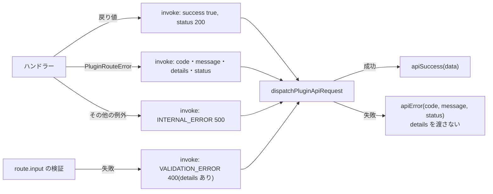

# EmDash 0.39.1 のプラグインルートのエラーの返り方

> [!summary] 要点
> - ハンドラーの戻り値は、EmDash が `{ success: true, data }`(200)で包む。
> - `PluginRouteError(code, message, status, details)` を投げると、HTTP ステータスは `status`、body は `{ success: false, error: { code, message } }` になる。**`details` は応答に含まれない。**
> - 想定外の例外は 500 `INTERNAL_ERROR` で、`message` は固定の `"Plugin route error"` になる(元のメッセージはサーバーのログにだけ出る)。
> - ルートの `input`(zod スキーマ)に合わない入力は 400 `VALIDATION_ERROR` `"Invalid request body"`。これも詳細は返らない。
> - 保存 hook(`content:beforeSave`)で `ContentSaveRejectedError(message)` を投げると、標準のコンテンツ API は `SAVE_REJECTED` と `message` を返す。ほかの例外は `CONTENT_HOOK_ERROR` で、メッセージは隠される。
> - このプラグインは、画面に出す文言をコードだけで決める([[T03-shared-contracts]] の `src/shared/errors.ts`)。
> - 関連: [[base64-image-plugin-spec#7. アップロード(書き込み経路)|仕様書 7 章]]、[[emdash-plugin-route-permissions]]、[[T14-admin-i18n-api]]、[[T18-upload-route]]、[[T21-orphan-routes]]

## 実測の結果

EmDash 0.39.1 の catch-all ルート(dist)と `PluginRouteRegistry`(dist のチャンク)を、Astro を起動せずに呼んだ。Contributor(role 20)、POST、`X-EmDash-Request: 1` あり。根拠: **実測+公式ドキュメント**

| ハンドラーの動き | HTTP | body |
|---|---|---|
| `{ ref: … }` を返す | 200 | `{"success":true,"data":{"ref":…}}` |
| `throw new PluginRouteError("IMAGE_TOO_LARGE", "dataUrl exceeds 100000 bytes", 400, { limit: 100000 })` | 400 | `{"success":false,"error":{"code":"IMAGE_TOO_LARGE","message":"dataUrl exceeds 100000 bytes"}}`(`details` が無い) |
| `throw new PluginRouteError("IMAGE_NOT_FOUND", "Image not found", 404)` | 404 | `{"success":false,"error":{"code":"IMAGE_NOT_FOUND","message":"Image not found"}}` |
| `throw new Error("secret internal detail")` | 500 | `{"success":false,"error":{"code":"INTERNAL_ERROR","message":"Plugin route error"}}` |
| `input: z.strictObject({ width: z.int().min(1) })` に `{ width: 0 }` | 400 | `{"success":false,"error":{"code":"VALIDATION_ERROR","message":"Invalid request body"}}` |
| 同じルートに `{ width: 10 }` | 200 | `{"success":true,"data":{"width":10}}` |
| 無いルート | 404 | `{"success":false,"error":{"code":"NOT_FOUND","message":"Plugin route not found"}}` |

- 想定外の例外は、サーバーのログに `[plugin:base64-image] Route handler failed: Error: secret internal detail` とスタックが出た。
- zod 4.5.4 のスキーマを `definePlugin({ routes: { x: { input } } })` にそのまま渡して、検証が動いた(EmDash と同じ zod を使う)。

> [!info] 計測環境
> macOS 26.4(Darwin 25.4.0、arm64)、Node 26.10.0(mise)、`emdash` 0.39.1、`zod` 4.5.4。2026-09-24 に計測。runtime の `handlePluginApiRoute`(`emdash-runtime.ts:5127`)は、信頼済みプラグインの経路だけを再現した(プラグインの有効・無効とメソッドの確認は省いた)。

## ソースで確かめた流れ



根拠: 公式ドキュメントのみ(`references/emdash/packages/core/src/` 以下)

| 場所 | 内容 |
|---|---|
| `plugins/routes.ts:242-257` | `route.input.safeParse` に失敗すると `VALIDATION_ERROR` 400(`details` に `z.formatError`) |
| `plugins/routes.ts:293-303` | `PluginRouteError` は `code` / `message` / `details` / `status` をそのまま結果にする |
| `plugins/routes.ts:305-314` | その他の例外は `INTERNAL_ERROR` 500 `"An internal error occurred"` |
| `plugins/routes.ts:347-399` | `PluginRouteError(code, message, status = 400, details?)` と、`badRequest` / `unauthorized` / `forbidden` / `notFound` / `conflict` / `internal` |
| `plugins/http-route-dispatch.ts:127-135` | 失敗の結果を `apiError(code, message, status)` にする。`details` は渡さない。`INTERNAL_ERROR` のときは `message` を `"Plugin route error"` に置き換える |
| `api/error.ts:31-43` | `apiError` の body は `{ success: false, error: { code, message, details? } }`。ヘッダーは `Cache-Control: private, no-store` |
| `index.ts:269`、`:271` | `PluginRouteError` と `ContentSaveRejectedError` は `emdash` から import できる |

## EmDash 自身が返すコード

プラグインのルートと、画面から呼ぶ標準 API(完全削除 `DELETE /_emdash/api/content/b64_images/{id}/permanent`)で、EmDash が返すもの。画面の文言を用意するために、`src/shared/errors.ts` の `HOST_ERROR_CODES` に並べた。根拠: 公式ドキュメントのみ(`references/emdash/packages/core/src/` 以下)

| コード | HTTP | いつ | 場所 |
|---|---|---|---|
| `UNAUTHORIZED` | 401 | ログインしていない | `api/authorize.ts:41` |
| `FORBIDDEN` | 403 | ルートの `permission` に足りない(完全削除は Admin のみ) | `api/authorize.ts:44` |
| `CSRF_REJECTED` | 403 | `X-EmDash-Request: 1` が無い | `plugins/http-route-dispatch.ts:76` |
| `INSUFFICIENT_SCOPE` | 403 | API トークンに `admin` スコープが無い | `auth/scopes.ts:26` |
| `NOT_FOUND` | 404 | ルートが無い・プラグインが無効。完全削除では、ゴミ箱に入っていない・無い | `plugins/http-route-dispatch.ts:105`、`emdash-runtime.ts:5139`、`api/handlers/content.ts:1495-1502` |
| `METHOD_NOT_ALLOWED` | 405 | `methods` の宣言に無いメソッド | `plugins/http-route-dispatch.ts:112` |
| `VALIDATION_ERROR` | 400 | `input` スキーマに合わない | `plugins/routes.ts:250` |
| `INVALID_PLUGIN_REQUEST` | 400 / 413 / 415 | 宣言した body を読めない・大きすぎる | `plugins/route-wire.ts:56-64`、`emdash-runtime.ts:5164` |
| `INTERNAL_ERROR` | 500 | ハンドラーの想定外の例外 | `plugins/routes.ts:310` |
| `NOT_CONFIGURED` | 500 | EmDash が初期化されていない | `astro/routes/api/plugins/[pluginId]/[...path].ts`、`astro/routes/api/content/[collection]/[id]/permanent.ts` |
| `CONTENT_DELETE_ERROR` | 500 | 完全削除に失敗した | `api/handlers/content.ts:1509-1517` |

- 完全削除が成功すると `{ success: true, data: { deleted: true, id } }` が返る(`api/handlers/content.ts:1505-1508`)。
- 保存 hook(`content:beforeSave`)で `ContentSaveRejectedError(message)` を投げると、標準のコンテンツ API は `SAVE_REJECTED` と `message` を返す(`emdash-runtime.ts:513-529`)。ほかの例外は `CONTENT_HOOK_ERROR` `"A plugin hook failed while saving content"` になり、元のメッセージは隠される(`:531-538`)。どのフィールドの何が問題かを編集者に伝えるには、`ContentSaveRejectedError` を使う。これは EmDash の編集画面が表示するので、このプラグインの画面の文言には含めない。根拠: 公式ドキュメントのみ

## このプラグインでの使い方

- ルートのハンドラーは、`src/shared/errors.ts` のコードと `ERROR_HTTP_STATUS` で `new PluginRouteError(code, message, ERROR_HTTP_STATUS[code])` を投げる。`message` は英語で、ログと調査に使う。
- 画面は `error.code` から ja / en の文言を選ぶ。上限の値など、文言に差し込みたい情報は画面側が持っている値を使う(`details` は届かない)。
- ルートの入力の形は、ルートの `input` に `src/shared/schema.ts` のスキーマを渡して EmDash に検証させる(失敗は `VALIDATION_ERROR`)。型は `PluginRoute<UploadRequest>` などで合う(`tests/shared/schema.test.ts` の型のテスト)。
- 入力はすべて POST の JSON の body にする。GET / DELETE では入力が query 文字列から作られ、値が文字列になり、1 つだけの値は配列にならない(`plugins/routes.ts:129-150`)。根拠: 公式ドキュメントのみ

## 再現手順

`npm ci` 済みの worktree で、次のスクリプトをスクラッチ(worktree の外)に置き、`node route-errors.mjs <worktree のパス>` を実行した。チャンクのファイル名(`routes-CWzxcZpn.mjs`)は EmDash の版ごとに変わる。

```js
import path from "node:path";
import { pathToFileURL } from "node:url";

const worktree = process.argv[2];
const dist = (p) => pathToFileURL(path.join(worktree, "node_modules/emdash/dist", p)).href;
const { POST } = await import(dist("astro/routes/api/plugins/_pluginId_/_...path_.mjs"));
const { n: PluginRouteRegistry, t: PluginRouteError, i: parseRouteInput } = await import(dist("routes-CWzxcZpn.mjs"));
const { definePlugin } = await import(dist("index.mjs"));

const plugin = definePlugin({
	id: "base64-image",
	version: "0.0.0",
	routes: {
		"route-error": {
			permission: "content:create",
			handler: async () => {
				throw new PluginRouteError("IMAGE_TOO_LARGE", "dataUrl exceeds 100000 bytes", 400, { limit: 100000 });
			},
		},
	},
});

const locals = {
	user: { id: "u20", email: "a@example.com", name: null, role: 20, createdAt: new Date() },
	emdash: {
		getPluginRouteMeta: (_id, p) => ({ public: false, permission: plugin.routes[p.slice(1)]?.permission }),
		handlePluginApiRoute: async (_id, _method, p, request, user) => {
			const registry = new PluginRouteRegistry({ db: {} });
			registry.register(plugin);
			return registry.invoke("base64-image", p.slice(1), { request, body: await parseRouteInput(request), user });
		},
	},
};
const request = new Request("https://example.com/_emdash/api/plugins/base64-image/route-error", {
	method: "POST",
	headers: { "X-EmDash-Request": "1", "Content-Type": "application/json" },
	body: "{}",
});
const res = await POST({ params: { pluginId: "base64-image", path: "route-error" }, request, locals });
console.log(res.status, await res.json());
```
