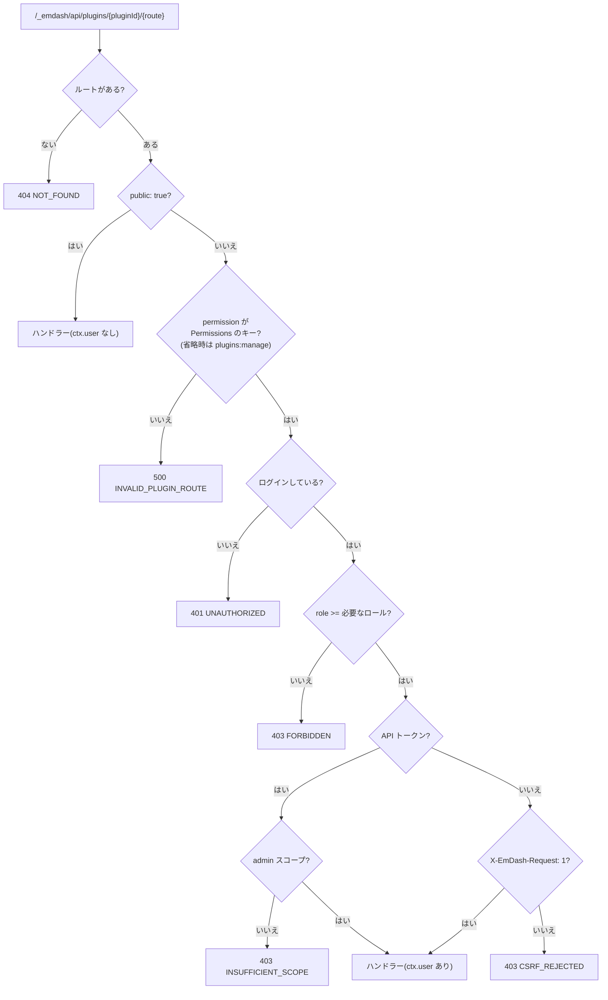

# EmDash 0.38.0 のプラグインルートの権限

> [!summary] 要点
> - private ルートは、EmDash がハンドラーを呼ぶ前に `user.role >= Permissions[permission]` で判定する。**`permission` を省略すると `plugins:manage`(Admin のみ)になる。**
> - Contributor 以上にするには `content:create`(ほかに `content:read_drafts` / `media:upload`)を宣言する。存在しない文字列は、実行時は全員に 500、型チェックでは TS2820 になる。
> - ハンドラーでは `ctx.user`(`role` は数値)を信頼して使える。ただし型は省略可能。
> - プラグインの `ctx.content.*` は、呼び出した利用者の権限を確かめない。権限の確認はルートの `permission` だけ。
> - プラグインが作ったエントリは `author_id` が NULL なので、標準 API では `*_any` の権限(Editor 以上)が要る。
> - 画面側は `@emdash-cms/admin` の `useCurrentUser()` でロールを取る。プラグインのページ自体には、ロールの制限が無い。
> - 0.39.1 でも、動いているサイトで測り直して同じ結果だった。CSRF の確認は、ミドルウェア(`Origin`)とディスパッチ(`X-EmDash-Request`)の 2 か所にある → [[#0.39.1 での再計測]]
> - 関連: [[T06-decision-trash-permission]]、[[T18-upload-route]]、[[T21-orphan-routes]]、[[T25-images-page]]、[[base64-image-plugin-spec#7. アップロード(書き込み経路)|仕様書 7 章]]、[[base64-image-plugin-spec#10. 画像のライフサイクル|仕様書 10 章]]、[[emdash-reference-vs-npm-0-38]]

> [!info] 対象の版
> npm からインストールした `emdash@0.38.0` / `@emdash-cms/auth@0.38.0` / `@emdash-cms/admin@0.38.0`(`node_modules/`)で確かめた。`references/emdash` は 0.38.0 より新しい開発版で、ファイルの分け方が違う([[emdash-reference-vs-npm-0-38]])。このノートの判定の中身は、両方で同じ。
> - 2026-09-24 に対象を 0.39.1 に上げた([[T01-2-emdash-0-39|T01-2]])。`node_modules/` のパスと行番号は 0.38.0 のときのもので、今の `node_modules`(0.39.1)とはずれることがある。`references/emdash/` の行番号は 0.39.1 でも同じ(プラグイン関係のソースに差が無い)。
> - 0.39.1 では、[[T08-spike-route-body|T08]] で動いているサイト(開発サーバーと本番のビルド)を使って測り直した。結果は下の表と同じだった → [[#0.39.1 での再計測]]

## 判定の流れ



- 根拠: 公式ドキュメントのみ
  - npm 版: `node_modules/emdash/src/astro/routes/api/plugins/[pluginId]/[...path].ts:35-82`
  - 参照ソース: `references/emdash/packages/core/src/plugins/http-route-dispatch.ts:49-79`、`:103-117`
  - 説明文: `references/emdash/skills/creating-plugins/references/api-routes.md:81-103`
  - EmDash 自身のテスト: `references/emdash/packages/core/tests/unit/astro/plugin-api-route-auth.test.ts:54-80`(permission 省略の Editor は 403、`content:create` を宣言した Editor は 200)
- ルートの `permission` は、native プラグインでは `definePlugin({ routes })` からそのまま渡る(`node_modules/emdash/src/plugins/routes.ts:73-86` の `buildRouteMeta`)。根拠: 公式ドキュメントのみ

## ロールと permission の組み合わせ(実測)

npm の `emdash@0.38.0` の catch-all ルート(dist)を、偽の `locals` で直接呼んだ。POST、`X-EmDash-Request: 1` あり、セッション認証。根拠: **実測のみ**

| permission \ ロール | 未ログイン | Subscriber(10) | Contributor(20) | Author(30) | Editor(40) | Admin(50) |
|---|---|---|---|---|---|---|
| (省略) | 401 | 403 | 403 | 403 | 403 | 200 |
| `content:create` | 401 | 403 | 200 | 200 | 200 | 200 |
| `content:read_drafts` | 401 | 403 | 200 | 200 | 200 | 200 |
| `content:delete_own` | 401 | 403 | 403 | 200 | 200 | 200 |
| `content:delete_any` | 401 | 403 | 403 | 403 | 200 | 200 |
| `content:delete_permanent` | 401 | 403 | 403 | 403 | 403 | 200 |
| `plugins:manage` | 401 | 403 | 403 | 403 | 403 | 200 |
| `content:trash`(存在しない) | 500 | 500 | 500 | 500 | 500 | 500 |

- GET / DELETE でも同じ(Contributor 200 / Subscriber 403)。HTTP メソッドで判定は変わらない。
- `X-EmDash-Request: 1` が無いと、Contributor + `content:create` でも 403 `CSRF_REJECTED` で、ハンドラーは呼ばれない。
- API トークン(Admin のユーザー)は、スコープが `content:read` / `content:write` だけだと 403 `INSUFFICIENT_SCOPE`、`admin` があれば 200。トークンでプラグインのルートを呼ぶには `admin` スコープが要る。
- ハンドラーに渡る呼び出し元は、`locals.user` そのもの(`{ id, email, name, role }`)。これが `ctx.user` になる。

## Contributor 以上にする permission

| permission | 最低ロール | 本来の意味 |
|---|---|---|
| `content:read_drafts` | Contributor | 下書き・予約・ゴミ箱のコンテンツを読む |
| `content:create` | Contributor | コンテンツを作る |
| `media:upload` | Contributor | メディアライブラリにアップロードする |

- Contributor の段階にある permission は、この 3 つだけ(`references/emdash/packages/auth/src/rbac.ts:18-19`、`:33`。npm 版は `node_modules/@emdash-cms/auth/dist/index.mjs:99-109`)。根拠: 公式ドキュメントのみ
- このプラグインでは、書き込みのルート(アップロード、ゴミ箱への移動)に `content:create` を使う([[T06-decision-trash-permission]])。

## 型

- `PluginRoute.permission?: Permission`(`node_modules/emdash/src/plugins/types.ts:1349`)。`Permission` は `@emdash-cms/auth` の権限名の union なので、打ち間違いは型エラーになる。根拠: **実測のみ**(`tsc --noEmit`)

```text
error TS2820: Type '"content:trash"' is not assignable to type '"content:read" | "taxonomies:read" | ... | undefined'. Did you mean '"content:read"'?
```

- `RouteContext.user?: UserInfo`(`types.ts:1323-1334`)。private ルートでは必ず入っているが、型は省略可能なので、`ctx.user.role` を直接読むと TS18048 になる。ハンドラーの先頭で `if (!ctx.user) throw PluginRouteError.unauthorized();` のように絞り込む(`PluginRouteError` は `emdash` から import できる)。根拠: **実測のみ**(型)+ 公式ドキュメントのみ(export)

## ハンドラーの中の `ctx.content` は利用者の権限を確かめない

- `ctx.content` は、利用者ではなくプラグインの capability で決まる(`content:write` があれば `create` / `update` / `delete` が使える。`node_modules/emdash/src/plugins/context.ts:1146-1150`)。どのメソッドにも、利用者を渡す引数が無い。
- `ctx.content.delete(collection, id)` は `ContentRepository.delete`(`deleted_at` に日時を入れるソフト削除)を直接呼ぶ。`content:delete_own` / `content:delete_any` の確認、`content:beforeDelete` / `content:afterDelete` の hook、entry lock の取得は、どれも行わない(lock は解放する)。
  - npm 版: `node_modules/emdash/src/plugins/context.ts:516-527`、`node_modules/emdash/src/database/repositories/content.ts:1236-1252`
  - 参照ソース: `references/emdash/packages/core/src/plugins/context.ts:897-908`
  - 根拠: 公式ドキュメントのみ
- したがって、**プラグインのルートで行う操作の権限は、ルートの `permission` だけで決まる**。利用者ごとに細かく判定したいときは、ハンドラーで `ctx.user.role` を自分で比べる。

## 標準 API との比較(プラグインが作ったエントリ)

- プラグインの `ctx.content.create` は `authorId` を渡せない(`ContentCreateOptions` は `locale` だけ。`node_modules/emdash/src/plugins/types.ts:365-368`)。リポジトリは `authorId || null` で保存する(`node_modules/emdash/src/database/repositories/content.ts:376`)。根拠: 公式ドキュメントのみ
- 標準 API は、所有者が空のとき `*_any` の権限で判定する(`canActOnOwn`。`node_modules/@emdash-cms/auth/dist/index.mjs:163-167`)。根拠: 公式ドキュメントのみ
- 標準 API のルート(dist)を、偽の `locals` で呼んだ結果。「通る」は権限の確認を通過したこと。根拠: **実測のみ**

| 標準 API | 作成者 | Subscriber | Contributor | Author | Editor | Admin |
|---|---|---|---|---|---|---|
| ゴミ箱へ移動 `DELETE /_emdash/api/content/{collection}/{id}` | なし(NULL) | 403 | 403 | 403 | 通る | 通る |
| 同上 | 本人 | 403 | 403 | 通る | 通る | 通る |
| 復元 `POST …/{id}/restore` | なし(NULL) | 403 | 403 | 403 | 通る | 通る |
| 同上 | 本人 | 403 | 403 | 通る | 通る | 通る |
| 完全削除 `DELETE …/{id}/permanent` | なし(NULL) | 403 | 403 | 403 | 403 | 通る |

- 完全削除は、ゴミ箱に入っていないエントリには 404 `NOT_FOUND` を返す(`deleted_at IS NOT NULL` のときだけ消す)。根拠: 公式ドキュメントのみ(`node_modules/emdash/src/database/repositories/content.ts:1288-1300`)

## 画面側(管理画面の React)

- プラグインのページ(`/_emdash/admin/plugins/{pluginId}/...`)は、ロールに関係なくサイドバーに出る(プラグインのメニューに `minRole` が無い)。ページのコンポーネントには props が渡らない。根拠: 公式ドキュメントのみ(`node_modules/@emdash-cms/admin/dist/index.js:32338-32354`、`:61922-61927`)
- 現在の利用者のロールは、`@emdash-cms/admin` の `useCurrentUser()` で取れる。`GET /_emdash/api/auth/me`(`role` を含む)を React Query のキー `["currentUser"]` でキャッシュする。根拠: 公式ドキュメントのみ(`node_modules/@emdash-cms/admin/dist/index.d.ts` に export あり、`dist/index.js:2602-2609`、`node_modules/emdash/src/astro/routes/api/auth/me.ts:46`)

```tsx
import { useCurrentUser } from "@emdash-cms/admin";

// emdash は Role を export しておらず、@emdash-cms/auth はこのプラグインの依存に無いので自前で持つ
const ROLE_CONTRIBUTOR = 20;
const ROLE_ADMIN = 50;

const { data: currentUser } = useCurrentUser();
const role = currentUser?.role ?? 0;
const canTrash = role >= ROLE_CONTRIBUTOR;
const canDeletePermanently = role >= ROLE_ADMIN;
```

- 管理画面自身も、ロールの定数を自前で定義して同じ形で比べている(`node_modules/@emdash-cms/admin/dist/index.js:7729`、`:8548`、`:38630`)。根拠: 公式ドキュメントのみ
- 画面の条件は表示のためだけ。権限はサーバー側で判定されるので、403 を受けたときの表示も用意する。

## 再現手順

> [!info] 計測環境
> macOS 26.4(Darwin 25.4.0、arm64)、Node 26.10.0(mise)、`emdash` 0.38.0、`@emdash-cms/auth` 0.38.0。2026-09-24 に計測。

1. `npm ci` 済みの worktree で、次のスクリプトを worktree の外(スクラッチ)に置く。
2. `node measure.mjs <worktree のパス>` を実行する。catch-all ルートの dist は `@emdash-cms/auth` とローカルのチャンクだけを import するので、Astro を起動せずに呼べる。

```js
import { pathToFileURL } from "node:url";
import path from "node:path";

const worktree = process.argv[2];
const route = path.join(worktree, "node_modules/emdash/dist/astro/routes/api/plugins/_pluginId_/_...path_.mjs");
const { POST } = await import(pathToFileURL(route).href);

async function call(role, permission) {
	const locals = {
		user: role == null ? null : { id: `u${role}`, email: "a@example.com", name: null, role },
		emdash: {
			getPluginRouteMeta: () => (permission ? { public: false, permission } : { public: false }),
			handlePluginApiRoute: async () => ({ success: true, data: { ok: true } }),
		},
	};
	const request = new Request("https://example.com/_emdash/api/plugins/base64-image/x", {
		method: "POST",
		headers: { "X-EmDash-Request": "1" },
		body: "{}",
	});
	const res = await POST({ params: { pluginId: "base64-image", path: "x" }, request, locals });
	return res.status;
}

for (const permission of [undefined, "content:create", "content:delete_any"]) {
	console.log(permission, await Promise.all([null, 10, 20, 30, 40, 50].map((r) => call(r, permission))));
}
```

- 標準 API(`dist/astro/routes/api/content/_collection_/_id_.mjs` ほか)も同じ形で呼べる。`handleContentGet` などを偽の `locals.emdash` で返し、`DELETE` は権限の確認を通ると `emdash.db`(entry lock)に触るので、そこで投げる例外を「通過」とみなした。
- 型の確認は、`spikes/`(git 管理外)に `definePlugin({ routes: { x: { permission: "content:trash", handler } } })` を書き、ルートの `tsconfig.json` を継承して `tsc --noEmit -p` を実行した。

## 0.39.1 での再計測

[[T08-spike-route-body|T08]] で、EmDash 0.39.1 の動いているサイトを使って測り直した。上の表(0.38.0)と同じ結果で、[[T06-decision-trash-permission|T06]] の結論は変わらない。

> [!info] 方法
> - playground を複製した使い捨てのサイトに、`permission` だけを変えたルートを並べた native プラグインを入れた([[emdash-plugin-route-body-limit#再現手順]])。
> - 開発サーバー(`astro dev`)と本番のビルド(`astro build` + `astro preview`)で、すべて同じ結果だった。
> - ロールは、開発用の管理者の `users.role` をデータベースで書き換えて変えた。EmDash は、リクエストのたびにセッションの利用者 ID から `users` の行を読み直す(`references/emdash/packages/core/src/astro/middleware/auth.ts:437-447`)。
> - POST、`X-EmDash-Request: 1` あり、セッション認証、body は `{}`。macOS 26.4、Node 26.10.0、emdash 0.39.1、Astro 7.3.3、`@astrojs/node` 11.1.6。2026-09-24 に計測。

| permission \ ロール | 未ログイン | Subscriber(10) | Contributor(20) | Author(30) | Editor(40) | Admin(50) |
|---|---|---|---|---|---|---|
| (省略) | 401 | 403 | 403 | 403 | 403 | 200 |
| `content:read` | 401 | 200 | 200 | 200 | 200 | 200 |
| `content:create` | 401 | 403 | 200 | 200 | 200 | 200 |
| `content:read_drafts` | 401 | 403 | 200 | 200 | 200 | 200 |
| `media:upload` | 401 | 403 | 200 | 200 | 200 | 200 |
| `content:delete_own` | 401 | 403 | 403 | 200 | 200 | 200 |
| `content:delete_any` | 401 | 403 | 403 | 403 | 200 | 200 |
| `content:delete_permanent` | 401 | 403 | 403 | 403 | 403 | 200 |
| `plugins:manage` | 401 | 403 | 403 | 403 | 403 | 200 |
| `content:trash`(存在しない) | 500 | 500 | 500 | 500 | 500 | 500 |

- 根拠: **実測+公式ドキュメント**
- 401 は `UNAUTHORIZED`(「Authentication required」)、403 は `FORBIDDEN`(「Insufficient permissions」)、500 は `INVALID_PLUGIN_ROUTE`。
- `content:read`(Subscriber 以上)と `media:upload`(Contributor 以上)の行は、0.39.1 で足した。
- `content:create` のルートは、GET / DELETE / PUT / PATCH でも POST と同じ結果だった。

### CSRF の確認は 2 か所にある

`content:create` のルートと公開ルート(`public: true`)に送った。根拠: **実測+公式ドキュメント**

| リクエスト | 結果 | 返したところ |
|---|---|---|
| 未ログイン、ヘッダーなし | 401 `UNAUTHORIZED` | ディスパッチ(権限の確認が先) |
| Subscriber、ヘッダーなし | 403 `FORBIDDEN` | 同上 |
| Contributor、ヘッダーなし、Origin なし | 403 `CSRF_REJECTED`「Missing required header」 | ディスパッチ(`core/src/plugins/http-route-dispatch.ts:75-77`) |
| Contributor、ヘッダーなし、同じ Origin | 403 `CSRF_REJECTED`「Missing required header」 | 同上 |
| Contributor、ヘッダーなし、別の Origin | 403 `CSRF_REJECTED`「Cross-origin request blocked」 | ミドルウェア(`core/src/astro/middleware/auth.ts:216-223` → `core/src/api/csrf.ts:31-59`) |
| Contributor、ヘッダーあり、別の Origin | 200 | — |
| Contributor、GET、ヘッダーなし | 403 `CSRF_REJECTED`「Missing required header」 | ディスパッチ |
| 公開ルート、未ログイン、ヘッダーなし、Origin なし / 同じ Origin | 200 | — |
| 公開ルート、未ログイン、ヘッダーなし、別の Origin | 403 `CSRF_REJECTED`「Cross-origin request blocked」 | ミドルウェア |

- ミドルウェアは、`/_emdash/api/plugins/` への GET / HEAD / OPTIONS 以外のリクエストで、`X-EmDash-Request: 1` が無く、`Origin` が別のサイトのものなら拒否する。公開ルートも対象になる。`Origin` が無ければ通す。
- ディスパッチは、private ルートをセッションで呼ぶとき、メソッドに関係なく `X-EmDash-Request: 1` を求める。権限の確認のあとなので、権限が足りなければ 401 / 403 が先に返る。
- どちらもコードは `CSRF_REJECTED` なので、画面の文言はコードだけで決めてよい。

### API トークン

| トークン(作った利用者) | ルートの permission | 結果 |
|---|---|---|
| `content:read` + `content:write`(Admin) | `content:create` | 403 `INSUFFICIENT_SCOPE`(「Token lacks required scope: admin」) |
| `admin`(Admin) | `content:create` / `plugins:manage` | 200 / 200 |
| `admin`(作ったあと Contributor に下げた) | `content:create` / `plugins:manage` | 200 / 403 `FORBIDDEN` |

- トークンでも、ルートの `permission` は利用者の今のロールで判定される。`X-EmDash-Request` は要らない。根拠: **実測+公式ドキュメント**(`core/src/plugins/http-route-dispatch.ts:71-75`)
- トークンは `POST /_emdash/api/admin/api-tokens`(`{ name, scopes }`、Admin のみ)で作った。

### 0.39.1 でのソースの場所

- 0.38.0 の npm 版で catch-all のルート(`astro/routes/api/plugins/[pluginId]/[...path].ts`)にあった判定は、0.39.1 では `core/src/plugins/http-route-dispatch.ts:49-79`(権限・スコープ・CSRF)と `:93-135`(ディスパッチ)にある。catch-all のルートは、これを呼ぶだけになった(`core/src/astro/routes/api/plugins/[pluginId]/[...path].ts:22-38`)。根拠: 公式ドキュメントのみ
- 判定の中身(省略すると `plugins:manage`、`Permissions` に無い文字列は 500、トークンは `admin` スコープ、セッションは `X-EmDash-Request: 1`)は 0.38.0 と同じ。
- body の読み方と上限は [[emdash-plugin-route-body-limit]]。
