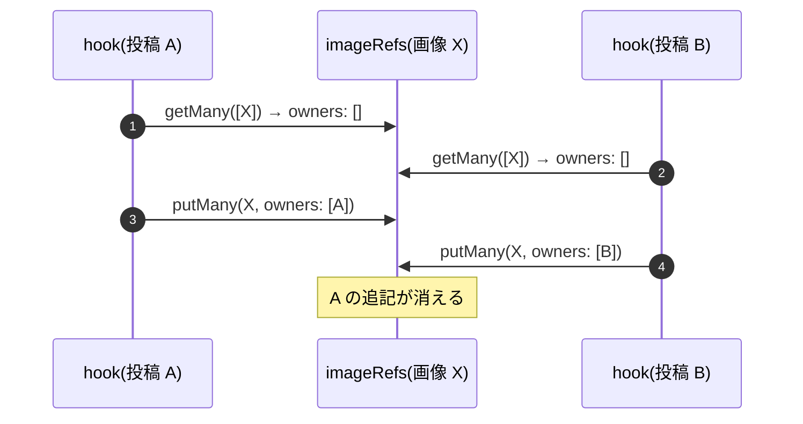

# EmDash 0.39.1 のプラグインストレージの条件付きの書き込みと、同時の追記で記録が消える問題

> [!summary] 要点
> - EmDash 0.39.1 のプラグインストレージ(`ctx.storage.<名前>`)には、**条件付きの書き込み**がある。`getVersioned(id)` で値と版(`revision`)を読み、`compareAndSet(id, revision, value)` は版が変わっていなければ書く(`{ applied: true }`)。変わっていれば書かずに `{ applied: false }` を返す。ほかに `compareAndDelete` と、1 文で条件と更新を行う `updateIf`(`set` と数値の `delta`)がある。
> - 版は、**どの書き込みでも変わる**(`put` / `putMany` / `compareAndSet` は新しい UUID を書き、`updateIf` はトリガーが変える)。そのため `compareAndSet` は、ほかの経路の書き込みも見逃さない。
> - **プラグインが使えるトランザクションは無い。** `putMany` は自分の upsert だけをトランザクションで包む(D1 はトランザクションが使えないので包まない)。「`getMany` で読む → 追記 → `putMany` で書く」の読みと書きの間は守られない。
> - 同じ記録に別々の hook が同時に追記すると、あとの書き込みが先の追記を消す(lost update)。ストレージの呼び出しに 20ms の待ちを入れた実測で、`getMany` → `putMany` の方式は、5 件の並行公開で 6 件中 4 件、8 件の同時作成で 8 件中 6 件の追記が消えた(3 回とも)。`getVersioned` → `compareAndSet` → 版が変わっていたら読み直す方式では、消えなかった。
> - Node + SQLite の開発サーバーでは、待ちを入れないと hook が重ならず、どちらの方式でも消えなかった。重なるのは、D1 のようにクエリに待ち時間がある環境(推測のみ)。
> - 関連: [[T20-owner-tracking]]、[[image-owner-tracking-hooks]]、[[base64-image-plugin-spec#9. 参照元の記録と未使用画像の検出|仕様書 9 章]]、[[base64-image-plugin-spec#5.3 参照元メタデータ(プラグインストレージ `imageRefs`、キーは画像 ID)|仕様書 5.3]]、[[emdash-plugin-content-query-counts]]、[[emdash-after-save-payload]]

> [!info] 確かめた方法と環境
> - ソース: `references/emdash/packages/`(タグ `emdash@0.39.1`)。インストールされた `node_modules/emdash/src` の `plugin-storage.ts` / `transaction.ts` / `plugins/context.ts` / `plugins/types.ts` / `conditional-storage.ts` / マイグレーション 077 は、`references/emdash/` と同一だった(`diff`)。以下の行番号は `references/emdash/packages/` 以下。
> - 実測: playground を複製した使い捨てのサイト(`spikes/owner-tracking/site/`、git 管理外)に、T20 の hook を登録したプラグインを入れ、REST で並行にリクエストを送った。[[#再現手順]]
> - macOS 26.4(Darwin 25.4.0、arm64)、Node 26.10.0、emdash 0.39.1、Astro 7.3.3、SQLite(`node:sqlite`)。開発サーバーはポート 4420。2026-09-24 に計測。
> - Cloudflare Workers(workerd + D1)では確かめていない([[T32-cloudflare-check|T32]])。

## プラグインストレージの操作

`ctx.storage.<名前>` は `PluginStorageRepository` をそのまま包んだもの(`core/src/plugins/context.ts:206-227`)。型は `StorageCollection`(`core/src/plugins/types.ts:242-283`)。

| 操作 | 動き | クエリ | 根拠 |
|---|---|---|---|
| `get(id)` / `getMany(ids)` | 値だけを返す(版は返さない)。`getMany` は ID を分けずに 1 つの IN に入れる | 1 | 公式ドキュメントのみ(`core/src/database/repositories/plugin-storage.ts:131-143`、`:271-288`) |
| `put(id, value)` | 無条件の upsert。版は新しい UUID | 1 | 公式ドキュメントのみ(`plugin-storage.ts:148-172`) |
| `putMany(items)` | 1 件ずつ無条件の upsert。トランザクションが使えれば包む | SQLite は件数 + 2(`begin` / `commit`)、D1 は件数 | 実測+公式ドキュメント(`plugin-storage.ts:293-325`、`core/src/database/transaction.ts:28-55`。1 件で 3 を実測) |
| `getVersioned(id)` | `{ value, revision }`。無ければ `null` | 1 | 実測+公式ドキュメント(`plugin-storage.ts:174-185`) |
| `compareAndSet(id, revision, value)` | `revision` が一致する行だけを更新(`UPDATE … WHERE revision = ? RETURNING revision`)。`revision` に `null` を渡すと「無いときだけ作る」 | 1 | 実測+公式ドキュメント(`plugin-storage.ts:187-223`) |
| `compareAndDelete(id, revision)` | 版が一致するときだけ消す | 1 | 公式ドキュメントのみ(`plugin-storage.ts:225-237`) |
| `updateIf(id, { where, set, delta })` | 1 文の `UPDATE … WHERE <where> RETURNING data`。`set` はキーごとの丸ごとの置き換え、`delta` は整数の増減。配列への追記はできない。行が無ければ作らない | 1 | 公式ドキュメントのみ(`plugin-storage.ts:494-533`、`core/src/plugins/storage-update.ts`) |
| トランザクション | プラグインの ctx には無い | — | 公式ドキュメントのみ(`core/src/plugins/types.ts:967-1020` の `PluginContext`) |

- 版は、マイグレーション 077 で `_plugin_storage` に足された列。`put` / `putMany` / `compareAndSet` は新しい UUID を書く。版を書かない `updateIf` でも、SQLite のトリガー(`AFTER UPDATE … WHEN NEW.revision = OLD.revision`)が新しい値にする。Postgres も同じトリガーを持つ(`core/src/database/migrations/077_plugin_storage_revisions.ts:28-78`)。根拠: 公式ドキュメントのみ
- 条件付きの書き込みの値は、JSON で 1 MiB まで。キーは 1,024 文字まで、版は 128 文字まで(`core/src/plugins/conditional-storage.ts`)。`put` / `putMany` にはこの上限は無い。根拠: 公式ドキュメントのみ
- D1 はトランザクションが使えないので、`putMany` は 1 件ずつの upsert を包まずに流す(`core/src/database/transaction.ts:1-12`)。根拠: 公式ドキュメントのみ

## 同時の追記で記録が消える(lost update)

`imageRefs` の `owners` のような「配列への追記」は、読んでから書くしかない(`updateIf` は配列に足せない)。



版を確かめる方式では、2 の読みで版 r1 を受け取り、H1 の書き込みで版が r2 になる。H2 の `compareAndSet(X, r1, …)` は `applied: false` になるので、H2 は読み直して `[A, B]` を書く。

### 実測

同じ画像を参照するエントリを並行に保存・公開し、画像の `owners` に何件残るかを数えた。`SPIKE_STORAGE_DELAY_MS` は、hook の中のストレージ(と `ctx.schema.getCollection`)の呼び出しの前に入れた待ち時間(D1 の待ち時間の代わり)。

| 方式 | 待ち | 5 件の並行公開(複製した 5 件、管理画面の一括公開と同じ並列度) | 8 件の同時作成 | 根拠 |
|---|---|---|---|---|
| `getMany` → 追記 → `putMany` | なし | 6 / 6(消えず) | 8 / 8(消えず) | 実測のみ(1 回) |
| 〃 | 20ms | **2 / 6**(4 件消えた。3 回とも) | **2 / 8**(6 件消えた。3 回とも) | 実測のみ |
| `getVersioned` → `compareAndSet`(版が変わっていたら読み直す) | なし | 6 / 6(読み直し 0 回) | 8 / 8(読み直し 0 回) | 実測のみ(1 回) |
| 〃 | 20ms | 6 / 6(読み直し計 10 回、1 つの hook で最大 5 回。3 回とも) | 8 / 8(読み直し計 16 回、最大 6 回。3 回とも) | 実測のみ |

- `getMany` → `putMany` の方式では、消えた側の hook も「追記した」と判断していた(書き込みは成功するので、失敗に気付けない)。根拠: 実測のみ
- 待ちが無いとき、Node の開発サーバーでは hook(1 回 1〜3ms)が、次のリクエストの処理より先に終わっていた。そのため hook が重ならず、どちらの方式でも消えなかった。根拠: 実測のみ(理由は推測のみ)
- 5 件の並行公開で、版を確かめる方式の読み直しは 0 + 1 + 2 + 3 + 4 = 10 回だった(5 つの hook がそろって読み、1 つずつ書けた)。k 件がそろって追記すると、最後の hook は k 回試すことになる。T20 の上限は 8 回([[T20-owner-tracking#結果]])。根拠: 実測のみ(式は推測のみ)
- D1 のクエリは、同じコロケーションでも 1 回数 ms 以上かかる見込みで、別々のリクエスト(別の isolate のこともある)の hook は重なりうる。根拠: 推測のみ([[T32-cloudflare-check|T32]] で確かめる)

## 書き方

T20(`src/server/hooks/owners.ts` の `appendOwners`)の形。読み取り専用のふつうの保存で書き込みを増やさないよう、先に `getMany` でまとめて読み、足すものがある画像だけ、版を読んでから書く。

```ts
async function append(store: ImageRefsStore, id: string, owners: ImageOwner[], attempt = 1) {
	const current = await store.getVersioned(id); // 1 クエリ
	if (current === null) return "missing"; // 消えていたら作り直さない(完全削除との競合)
	const plan = planAppend(current.value, owners); // まだ無い参照元だけを足した記録
	if (plan.kind !== "append") return plan.kind;
	const written = await store.compareAndSet(id, current.revision, plan.record); // 1 クエリ
	if (written.applied === true) return "appended";
	return attempt >= MAX_APPEND_ATTEMPTS ? "conflict" : append(store, id, owners, attempt + 1);
}
```

> [!warning] 同じ記録を無条件に書く経路があると、守れない
> `compareAndSet` が守るのは、`compareAndSet` どうしと「版を変える書き込み」の間だけ。ほかの処理が、読んだ値をもとに `put` / `putMany` で丸ごと書き直すと、その間に足された参照元は消える。`imageRefs` を書き換える処理(画像管理の [[T21-orphan-routes|T21]] など)は、記録を作る(新しい ID への `put`)・消す(`delete`)以外は `compareAndSet` を使う。根拠: 公式ドキュメントのみ(上の表)

## 再現手順

1. `spikes/owner-tracking/site/` に playground を複製し、`astro.config.mjs` の `plugins` を、T20 の hook を登録するプラグインに差し替える([[image-owner-tracking-hooks#再現手順]])。
2. サーバーを方式と待ちを指定して起動する(プラグインは起動時に作られるので、変えるたびに起動し直す)。

```sh
cd spikes/owner-tracking/site
SPIKE_OWNERS_MODE=naive SPIKE_STORAGE_DELAY_MS=20 node <worktree>/node_modules/astro/bin/astro.mjs dev --port 4420
# 止める: node <worktree>/node_modules/astro/bin/astro.mjs dev stop
```

3. 画像を 1 枚作り、それを参照する投稿を 8 件同時に作る。または、1 件を作って複製を 5 件作り、5 件を同時に公開する。`imageRefs` の `owners` の件数を数える。

```js
// spikes/owner-tracking/scripts/race.mjs(抜粋)。api / createImage / owners は REST を呼ぶ小さな関数
const image = await createImage(); // プラグインのルートで b64_images を作り、imageRefs に記録を書く
await Promise.all(
	Array.from({ length: 8 }, (_, i) =>
		api("POST", "/content/posts", { data: { title: `race ${i}`, cover: image.ref } }),
	),
);
await sleep(1500); // afterSave は応答のあとに実行される
console.log((await owners(image.id)).length); // 期待は 8
```

比較用の「`getMany` → 追記 → `putMany`」は、spike のプラグインの中に書いた(T20 の抽出の関数 `readReferencedImageIds` を使い、`getMany` の値に参照元を足して `putMany` に渡す)。
