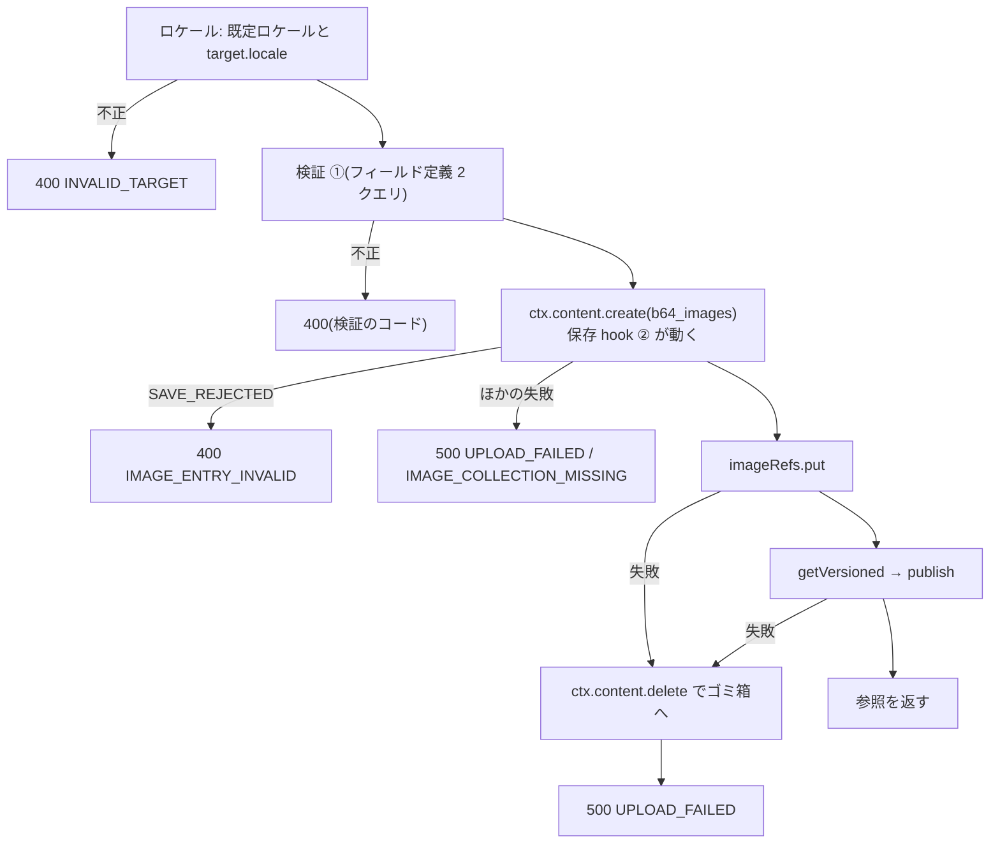

# EmDash 0.39.1 のプラグインから画像エントリを作って公開する

> [!summary] 要点
> - アップロードのルート(`src/server/routes/upload.ts`)は、**ロケールの確認 → 検証(①)→ 作成 → `imageRefs` → 公開 → 参照を返す** の順に処理する。`imageRefs` を公開より先にしたのは、公開で失敗したときに、作った画像を画像管理ページから見つけて消せるようにするため。
> - `ctx.content.create` が使うロケールは、Astro の `i18n` から作られる EmDash の i18n の設定(`getI18nConfig()`)の既定ロケールである。**`ctx.site.locale` は別物**(オプション `emdash:locale`)。プラグインは `emdash` から import した `getI18nConfig()` で同じ設定を読める。根拠: 実測+公式ドキュメント
> - 保存 hook(このプラグインの ②、またはほかのプラグイン)が作成を拒否すると、ルートには `ContentSaveRejectedError` ではなく、`name` と `code` が `"SAVE_REJECTED"` の通常の `Error` が届く。ルートは 400 `IMAGE_ENTRY_INVALID` に変える(何も作られていない)。根拠: 実測+公式ドキュメント
> - 作成のあとで失敗したら、画像エントリを `ctx.content.delete` でゴミ箱に移し、500 `UPLOAD_FAILED` を返す。`imageRefs` の記録は残す。ほかのプラグインが公開を拒否する形で確かめた。根拠: 実測+公式ドキュメント
> - `target.entryId` から記録する最初の参照元は、T20 の参照元の記録(afterSave / afterPublish)と同じ形で、投稿を保存・公開しても重複しなかった。ただし `target.locale` を省くと、既定ロケール以外のエントリでは、ロケールだけが違う参照元が 1 件増える。根拠: 実測のみ
> - クエリ数は SQLite で **75**(ルートの固定費 1、フィールド定義 2、作成 30、`imageRefs` 1、取得 3、公開 38)。i18n を設定したサイトでは 77。拒否は 1〜5。根拠: 実測のみ
> - 公開時にできる、データを丸ごと複製したリビジョンは、**プラグインからは避けられない**。仮の小さい値で公開してから差し替えると複製は 166 バイトになるが、標準 API でそのリビジョンを復元すると画像が 1×1 の仮の値に戻った。根拠: 実測+公式ドキュメント
> - 検証を ①(ルート)と ②(保存 hook)で 2 回行う費用は、② の分が中央値 0.03〜0.41ms、新しいプロセスの 1 回目で約 0.9ms。Workers Free の CPU 時間 10ms と比べて小さいので、2 回のままにする。根拠: 実測のみ(Node)
> - 関連: [[T18-upload-route]]、[[base64-image-plugin-spec#7. アップロード(書き込み経路)|仕様書 7 章]]、[[base64-image-plugin-spec#5.4 容量の目安|仕様書 5.4]]、[[emdash-plugin-route-body-limit]]、[[emdash-plugin-content-query-counts]]、[[emdash-after-save-payload]]、[[server-image-validation]]、[[emdash-plugin-route-errors]]、[[emdash-plugin-route-permissions]]

> [!info] 確かめた方法と環境
> - playground を複製した使い捨てのサイト(`spikes/upload-route/site/`、git 管理外)に、アップロードのルートを本物と同じプラグイン ID(`base64-image`)で登録した。`content:beforeSave` は、T16 の hook と、T19 の hook(`phase-3/t-19` の `src/server/hooks/image-entry.ts` のコピー)で振り分けた。[[#参照元の記録(T20)との関係]]では、T20 の hook(`phase-3/t-20` の `src/server/hooks/owners.ts` のコピー)も登録した。公開・保存を拒否する別のプラグインも入れた。[[#再現手順]]
> - 開発サーバー(`astro dev --port 4418`)に REST で送り、応答の `Server-Timing` の `db.count` と、`EMDASH_QUERY_LOG=1` の SQL のログを読んだ。i18n は、Astro の `i18n`(既定 `ja`、`ja` / `en`)を入れたサイトと入れないサイトの両方で試した。
> - macOS 26.4(Darwin 25.4.0、arm64、Apple M5 Pro)、Node 26.10.0(SQLite 3.53.4)、emdash 0.39.1、Astro 7.3.3、`@astrojs/node` 11.1.6、zod 4.5.4、esbuild 0.28.2、cwebp 1.6.0、ImageMagick 7.1.2-31。2026-09-24 に計測。
> - 行番号は `references/emdash/packages/` 以下(タグ `emdash@0.39.1`)。引用したファイルは、インストールされた `node_modules/emdash/src` と同一だった(`cmp`)。Cloudflare Workers(workerd + D1)では確かめていない([[T32-cloudflare-check|T32]])。

## ルートの形と登録(T29 向け)

| export | 中身 |
|---|---|
| `uploadRoute` | `PluginRoute<UploadRequest>`。`permission: "content:create"`、`methods: ["POST"]`、`request: { body: "json", maxBytes: 600_000 }`、`input: uploadRequestSchema`、`handler: handleUpload` |
| `handleUpload` / `createUploadHandler(options)` | ハンドラー。ctx は使う部分だけの型(`UploadRouteContext`)で、EmDash の `RouteContext<UploadRequest>` を代入できる(型のテスト)。`createUploadHandler` は i18n の設定と時刻を差し替えられる(テスト用) |
| `resolveTargetLocale` / `defaultContentLocale` | ロケールの判定([[#ロケール]]) |
| `UPLOAD_MAX_BODY_BYTES` / `MAX_TARGET_LOCALE_LENGTH` / `MAX_HOOK_MESSAGE_LENGTH` / `DEFAULT_CONTENT_LOCALE` | 600,000 / 35 / 1,000 / `"en"` |

```ts
// T29(src/index.ts)。spike で同じ形の definePlugin を動かした
import { definePlugin } from "emdash";

import { uploadRoute } from "./server/routes/upload";
import { IMAGE_REFS_STORAGE, PLUGIN_ID, ROUTES } from "./shared/constants";

definePlugin({
	id: PLUGIN_ID,
	// アップロードが使うのは schema:read(フィールド定義)・content:write(作成とゴミ箱)・content:publish(getVersioned と公開)。
	// content:read は content:write / content:publish に含まれる(core/src/plugins/types.ts:84-95)
	capabilities: ["schema:read", "content:write", "content:publish" /* , ほかのルートが使うもの */],
	storage: { [IMAGE_REFS_STORAGE]: { indexes: ["createdAt"] } },
	routes: { [ROUTES.upload]: uploadRoute }, // POST /_emdash/api/plugins/base64-image/upload
});
```

- capability かストレージが足りないと、ハンドラーは何も作らずに通常の `Error` を投げ、EmDash は 500 `INTERNAL_ERROR` にする(メッセージはサーバーのログ)。根拠: 実測のみ(単体テスト)
- `definePlugin` は、`content:write` と `content:publish` から `content:read` を補う(`capabilities` は `["schema:read", "content:write", "content:publish", "content:read"]` になった)。根拠: 実測+公式ドキュメント(`core/src/plugins/types.ts:84-107`)

### 応答(T23 向け)

- 成功: 200 `{ "success": true, "data": { "ref": { "v": 1, "id": "01M…", "locale": "en", "width": 1024, "height": 768, "alt": "" } } }`。`ref` はそのままフィールドの値にできる(`uploadResponseSchema`)。T14 の `uploadImage` は `data` を返す。根拠: 実測+公式ドキュメント
- 失敗は `{ "success": false, "error": { "code", "message" } }`。

| HTTP | code | いつ | 何か作られたか |
|---|---|---|---|
| 400 | `INVALID_TARGET` | 保存先のフィールドがこのプラグインの `json` フィールドでない・`target.locale` がサイトのロケールでない | なし |
| 400 | `IMAGE_DATA_INVALID` / `IMAGE_TOO_LARGE` / `IMAGE_DIMENSIONS_MISMATCH` / `IMAGE_EDGE_TOO_LONG` / `THUMB_DATA_INVALID` / `THUMB_TOO_LARGE` | 検証(①。[[server-image-validation]]) | なし |
| 400 | `IMAGE_ENTRY_INVALID` | 作成を保存 hook が拒否した(`SAVE_REJECTED`)。① を通った値は ② も通るので、ふつうはほかのプラグインの拒否 | なし |
| 500 | `IMAGE_COLLECTION_MISSING` | `b64_images` が無い | なし |
| 500 | `UPLOAD_FAILED` | 作成・`imageRefs`・公開の失敗 | 作成のあとなら、ゴミ箱に移した画像エントリ([[#失敗したときの後始末]]) |
| 500 | `INTERNAL_ERROR` | capability・ストレージの宣言が無い、サイトの既定ロケールが参照に入らない値 | なし |
| 400 / 401 / 403 / 405 / 413 | `VALIDATION_ERROR` / `UNAUTHORIZED` / `FORBIDDEN` / `CSRF_REJECTED` / `METHOD_NOT_ALLOWED` / `INVALID_PLUGIN_REQUEST` | EmDash がハンドラーの前に返す([[emdash-plugin-route-body-limit]]) | なし |

- `message` は英語で、ログと調査のため。画面の文言はコードで決める(T14 の `error-messages.ts` にどのコードもある)。

## 処理の順番



- `target.entryId` があれば、`imageRefs.owners` に最初の参照元として記録する。このプラグイン自身の `content:afterSave` は、自分の `ctx.content.create` では呼ばれないため([[emdash-after-save-payload#プラグインからの書き込み]])。
- `_rev` は `getVersioned` で読んで、そのまま `publish` に渡す。公式の説明が「Read first and pass the opaque `_rev`」としているため(`skills/creating-plugins/references/content.md:33`)。`_rev` の中身は `version:updated_at` の base64(`core/src/api/rev.ts:19`)で、作成の結果から作れば 3 クエリ減るが、中身に頼ることになるので採らない。根拠: 公式ドキュメントのみ

## ロケール

### EmDash がエントリに付けるロケール

| 事実 | 場所 | 根拠 |
|---|---|---|
| プラグインの `ctx.content.create` は、`resolveContentCreateLocale(options?.locale)` でロケールを決める。省略すると `config?.defaultLocale ?? "en"` | `core/src/plugins/context.ts:777`、`core/src/emdash-runtime.ts:2140`、`core/src/i18n/config.ts:54-77` | 公式ドキュメントのみ |
| `config` は `getI18nConfig()`。EmDash のミドルウェアが、最初のリクエストで Astro の `i18n` から設定する(`globalThis` の `Symbol.for("emdash:i18n-config")`) | `core/src/astro/middleware.ts:167-190`、`core/src/i18n/config.ts:17-37` | 公式ドキュメントのみ |
| Astro のロケールをオブジェクト(`{ path, codes }`)で書くと、EmDash は `path` をロケールにする | `core/src/i18n/normalize.ts` | 公式ドキュメントのみ |
| `getI18nConfig` は `emdash` から export されている | `core/src/index.ts:182-187` | 公式ドキュメントのみ |
| `ctx.site.locale` はオプション `emdash:locale` の値(無ければ `"en"`)で、i18n の設定とは別。0.39.1 ではセットアップでも設定画面でも書かれない([[emdash-content-before-save]]) | `core/src/emdash-runtime.ts:1564`、`core/src/plugins/context.ts:1362-1369` | 公式ドキュメントのみ |
| エントリの `locale` 列は `locale \|\| "en"` で保存されるので、null にならない | `core/src/database/repositories/content.ts:389` | 公式ドキュメントのみ |

- プラグインのルートの中の `getI18nConfig()` は、i18n を入れたサイトでは Astro の設定(既定 `ja`、`ja` / `en`)を、入れないサイトでは `null` を返した。応答から分かる(下の表。i18n のサイトの拒否のメッセージに `configured: ja, en` と出た)。根拠: 実測+公式ドキュメント

### ルートでの扱い

- 画像エントリは、ロケールを指定せずに作る(= サイトの既定ロケール。仕様書 5.1)。参照の `locale` には、作成の結果のロケールを入れる。
- `target.locale`(参照元のエントリのロケール)は、`imageRefs` の参照元にだけ使う。
  - i18n を設定したサイト: 設定されたロケールのどれかと、大文字・小文字を区別せずに一致しなければ 400 `INVALID_TARGET`。記録する表記は設定にそろえる(EmDash の `resolveContentCreateLocale` と同じ)。
  - 設定していないサイト: EmDash はどのロケールでも作れるので、スキーマ(`LOCALE_CODE_PATTERN` と同じ形)と長さ 35 文字までだけを確かめる。35 は RFC 5646 の 4.4.1 が「言語タグの長さを制限する仕様は、少なくとも 35 文字のタグを受け付けなければならない(MUST)」とする長さ。根拠: 外部ドキュメントのみ(RFC 5646)
  - 省略すると、サイトの既定ロケールを記録する。
- ロケールは、フィールド定義を読む前に確かめる(拒否はクエリ 1 本 = ルートの固定費だけ)。
- サイトの既定ロケールが参照の形(`localeSchema`)に合わないとき(Astro の `path` を既定にした場合など)は、作る前に 500 にする。作っても参照を保存できないため。根拠: 推測のみ(実際にそういうサイトは作っていない)

| サイト | `target.locale` | 結果 | 画像エントリ / 参照の `locale` | 参照元の `locale` | 根拠 |
|---|---|---|---|---|---|
| i18n なし | なし / `EN` | 200 | `en` | `en` / `EN`(表記はそのまま) | 実測のみ |
| i18n なし | 38 文字 | 400 `INVALID_TARGET`(1 クエリ) | — | — | 実測のみ |
| i18n(既定 `ja`、`ja` / `en`) | なし | 200 | `ja` | `ja` | 実測のみ |
| 同上 | `en` / `EN` | 200 | `ja` | `en` | 実測のみ |
| 同上 | `fr` | 400 `INVALID_TARGET`(1 クエリ) | — | — | 実測のみ |

- サイト側の `resolveBase64Images`([[T15-site-resolve|T15]])は、参照の `locale`(`ja`)で画像を引けた。同じ画像を `locale: "en"` の参照で引くと見つからなかった(画像エントリは `ja` にしか無い)。参照の `locale` は、参照元のロケールではなく画像エントリのロケールでなければならない。根拠: 実測のみ

## 失敗したときの後始末

- プラグインは完全削除ができない。作成のあとで失敗したら、`ctx.content.delete`(ソフト削除。`content:write` にある)でゴミ箱に移す。`imageRefs` の記録は消さない。完全削除は、画像管理ページ([[T21-orphan-routes|T21]]・[[T25-images-page|T25]])から管理者が行う。
- `ctx.content.create` は、失敗を `Object.assign(new Error(message), { name: code, code })` で投げる(`core/src/emdash-runtime.ts:2150-2155`)。保存 hook の `ContentSaveRejectedError` も、ここで `name` / `code` が `"SAVE_REJECTED"` の通常の `Error` になる。EmDash のルートの処理は `PluginRouteError` を `instanceof` で見分け、それ以外は 500 `INTERNAL_ERROR` にする(`core/src/plugins/routes.ts:285-314`)ので、ルートで変換する。根拠: 実測+公式ドキュメント

| 失敗・中断した場所 | 応答 | 残るもの | 画像管理ページ(`imageRefs` を一覧する)から |
|---|---|---|---|
| 作成より前 | 400 など | なし | — |
| 作成(保存 hook の拒否) | 400 `IMAGE_ENTRY_INVALID` | なし(保存 hook は行を書く前に動く) | — |
| 作成(そのほか) | 500 `UPLOAD_FAILED` / `IMAGE_COLLECTION_MISSING` | なし | — |
| `imageRefs` の保存 | 500 `UPLOAD_FAILED` | ゴミ箱の下書き(`imageRefs` なし) | **見えない**。EmDash 標準の `b64_images` のゴミ箱画面(重い。仕様書 10 章)から消すしかない |
| `getVersioned`・公開 | 500 `UPLOAD_FAILED` | ゴミ箱の下書き + `imageRefs` | 「ゴミ箱」・参照元なし(または `target.entryId` の参照元)として出て、完全削除できる |
| ゴミ箱への移動も失敗 | 500 `UPLOAD_FAILED`(ログに出す) | 下書き + `imageRefs`(`imageRefs` の保存で失敗したときは下書きだけ) | 「ゴミ箱に入っていない」・参照元なしとして出る |
| 作成と `imageRefs` の間で処理が止まった(Workers の CPU 上限など) | 応答なし | 下書き(`imageRefs` なし) | 見えない |
| `imageRefs` と公開の間で止まった | 応答なし | 下書き + `imageRefs` | 「ゴミ箱に入っていない」・参照元なしとして出る |

- 仕様書 7 章の元の順番(作成 → 公開 → `imageRefs`)だと、公開の失敗と `imageRefs` の保存の失敗のどちらでも、`imageRefs` の無いエントリが残り、画像管理ページから見えない。公開の失敗(ほかのプラグインのポリシー、`_rev` の衝突)は、データベースの失敗より起きやすいと考え、`imageRefs` を先にした。根拠: 推測のみ(起きやすさ)
- `imageRefs` の無いまま残ったエントリを拾うには、`b64_images` を一覧して `imageRefs` に登録し直す処理が要る(仕様書 19 章の「既存の `b64_images` を `imageRefs` に登録する機能」と同じもの)。
- 下書きのまま `imageRefs` に残った画像は、プレビュー([[T17-admin-data-routes|T17]])では `null`(公開していない)になるが、どの投稿も参照していない(ルートが参照を返していない)。

### 実測

| 操作 | 応答 | db.count | データベース | 根拠 |
|---|---|---|---|---|
| ほかのプラグインの `content:beforePublish` が `b64_images` の公開を拒否 | 500 `UPLOAD_FAILED`「Failed to publish the image entry (PUBLISH_REJECTED); the image entry 01M… was moved to the trash」 | 50 | 画像エントリは `status: draft`・`deleted_at` あり、`imageRefs` は残った、リビジョンは 0 件 | 実測のみ |
| ほかのプラグインの `content:beforeSave` が `b64_images` の保存を拒否 | 400 `IMAGE_ENTRY_INVALID`「The image entry was rejected by a content:beforeSave hook: spike-policy: …」 | 5 | 画像エントリも `imageRefs` も増えなかった | 実測のみ |
| T19 の hook が拒否する値(`meta.bytes: 1`)で `ctx.content.create` を直接呼ぶ | 例外は `ContentSaveRejectedError` でなく `Error`。`name` / `code` は `"SAVE_REJECTED"`、`message` は T19 の日本語と英語の 2 行 | — | — | 実測+公式ドキュメント |
| 無いコレクションに `ctx.content.create` | `name` / `code` が `"COLLECTION_NOT_FOUND"`、`message`「Collection 'no_such_collection' not found」 | — | — | 実測+公式ドキュメント(`core/src/api/handlers/validation.ts:157`) |

## 参照元の記録(T20)との関係

アップロードで記録する最初の参照元は `{ collection: target.collection, entryId: target.entryId, locale, field: target.field }`(`locale` は [[#ルートでの扱い]]の `target.locale`)。[[T20-owner-tracking|T20]] の afterSave / afterPublish は `{ collection: event.collection, entryId: event.content.id, locale: event.content.locale, field }` を記録し、4 つのキーがすべて同じ参照元は重複させない。

T20 の hook(`phase-3/t-20` の `src/server/hooks/owners.ts` のコピー)を spike のプラグインに登録し、投稿を REST で作成 → `target.entryId` を付けてアップロード → 投稿の `cover` に参照を入れて保存(`PUT`)→ 公開、の各段階のあとで `owners` を読んだ。根拠: 実測のみ

| サイト | 投稿のロケール | 送った `target.locale` | アップロードのあと | 保存・公開のあと |
|---|---|---|---|---|
| i18n なし | `en` | `en` / 省略 | `en` の 1 件 | 1 件のまま |
| i18n なし | `EN` | `EN` | `EN` の 1 件 | 1 件のまま |
| i18n なし(対照) | `en` | `entryId` も送らない | なし | T20 が `en` の 1 件を足した(hook が動いていることの確認) |
| i18n(既定 `ja`、`ja` / `en`) | `ja` | `ja` | `ja` の 1 件 | 1 件のまま |
| 同上 | `en` | `en` / `EN` | `en` の 1 件(表記は設定にそろう) | 1 件のまま |
| 同上 | `en` | 省略 | `ja`(サイトの既定)の 1 件 | **T20 が `en` の 1 件を足して 2 件** |

- EmDash も、i18n のサイトではエントリのロケールを設定の表記にそろえて保存し、i18n の無いサイトでは送られた表記のまま保存する(`core/src/i18n/config.ts:54-77`)。ルートの扱いはこれと同じなので、widget がエントリのロケールをそのまま送れば、T20 の記録と一致する。根拠: 実測+公式ドキュメント
- `target.entryId` を送るときは、そのエントリのロケールも送る([[T23-upload-hook|T23]])。省くと、既定ロケール以外のエントリでは、ロケールだけが違う参照元が残る。同じエントリを指すので、画像管理の判定の結果は変わらない見込み(T20 はエントリごとに 1 回だけ調べるよう T21 に求めている)。根拠: 推測のみ
- ルートは、新しい画像 ID の記録を `put` で作るだけで、既存の記録は書き換えない。画像 ID は応答で初めて返るので、T20 の追記(`compareAndSet`)と同じ記録に同時に書くことはない。根拠: 推測のみ

## クエリ数

アップロード 1 回(i18n なしのサイト)の SQL を、`EMDASH_QUERY_LOG=1` のログで並べた。5 回とも 75、T19 の hook を入れても 75(hook はクエリをしない)。T20 の hook を入れても 75(i18n のサイトで 77)だった(T20 は `b64_images` の公開では何も読まない)。根拠: 実測のみ(何の処理かの対応は、SQL とソースからの推測を含む)

| 行 | 本数 | 中身 |
|---|---|---|
| 1 | 1 | ルートの固定費(セッションの利用者の `users`) |
| 2〜3 | 2 | `ctx.schema.getCollection`(`_emdash_collections` / `_emdash_fields`) |
| 4〜5 | 2 | 作成: 書き込みの前の確認(`_emdash_media_usage_activation`。`core/src/api/media-usage-write-fence.ts:31`) |
| 6〜11 | 6 | 作成: フィールド定義を 2 回、`has_seo`、フィールドの型(EmDash の検証の準備) |
| 12〜18 | 7 | 作成: `begin`、日時の正規化(フィールドの型・`options`)、`INSERT`、行、バイライン、`commit` |
| 19〜33 | 15 | 作成: メディアの使用状況の索引(`_emdash_media_usage_*`)の更新(`refreshContentUsageAfterSuccessfulWrite`。`core/src/emdash-runtime.ts:4817`)。索引が有効かの確認 1 本と、索引の読み書き 14 本([[emdash-plugin-content-query-counts]] の「14 本ずつ」は後者) |
| 34 | 1 | `imageRefs.put`(upsert 1 本) |
| 35〜37 | 3 | `getVersioned`(行・`has_seo`・バイライン) |
| 38〜39 | 2 | 公開: 書き込みの前の確認 |
| 40〜44 | 5 | 公開: ID の解決、公開のポリシーの確認(行・`has_seo`・バイライン・`options`) |
| 45〜59 | 15 | 公開: `begin`、行を 3 回、`supports` / `routable`、日時の正規化、**リビジョンの `INSERT`**、`_emdash_revision_prune_queue`、`UPDATE`、`commit` |
| 60 | 1 | 公開: `has_seo` |
| 61〜75 | 15 | 公開: メディアの使用状況の索引の更新(確認 1 本 + 読み書き 14 本) |

- 合計 75 = 固定費 1 + フィールド定義 2 + 作成 30 + `imageRefs` 1 + 取得 3 + 公開 38。[[T10-spike-after-save|T10]] の 72 に、検証のフィールド定義 2 と `imageRefs` 1 が加わった。
- i18n を設定したサイトでは 77。公開のあとに、翻訳の兄弟エントリを探す 2 本(`_emdash_collections` の ID、`translatable` のフィールド)が加わる(`findSyncedSiblingsForUsageRefresh` → `findNonTranslatableSiblingContentIds`。`core/src/emdash-runtime.ts:4783`、`core/src/media/usage/content-refresh.ts:865`)。根拠: 実測+公式ドキュメント
- 拒否のクエリ数: ロケール・スキーマ・body の上限・権限は 1、フィールドが無いコレクションは 2、フィールド・画像の検証は 3、保存 hook の拒否は 5、公開の拒否は 50。
- 減らせるところ: `getVersioned`(3)は `_rev` の中身に頼れば省けるが採らない([[#処理の順番]])。フィールド定義(2)は ① に要る。残りの 68 本は EmDash 本体の作成と公開の中にある。上限(1 呼び出し 1,000。[[cloudflare-workers-free-d1-limits]])には十分収まる。
- SQLite の `begin` / `commit`(4 本)は、D1 では出ない(トランザクションが使えない。[[emdash-plugin-content-query-counts#書き込み(参考)]])。D1 の実際の数は [[T32-cloudflare-check|T32]] で確かめる。
- 1 回の応答時間は、開発サーバーで 12〜24ms(クエリを含む。SQLite。サーバーを起動して最初のアップロードは 70ms)。根拠: 実測のみ

## 公開時のリビジョンの複製を避けられるか

結論: **避けられない。** 仕様書 5.4 の見積もり(1 枚で約 2 倍、500MB で約 2,500 枚)のままにする。

| 確かめたこと | 結果 | 根拠 |
|---|---|---|
| 作成で公開状態にできるか | できない。`ContentCreateOptions` は `locale` と `translationOf` だけで、ランタイムも `status` を渡さない | 公式ドキュメントのみ(`core/src/plugins/types.ts:475-480`、`core/src/emdash-runtime.ts:2128-2157`) |
| `ctx.content.update` で公開できるか | できない。`{ data }` だけを渡し、`status` は変えない。hook も呼ばない | 公式ドキュメントのみ(`core/src/plugins/context.ts:836-895`)。hook は [[emdash-after-save-payload#プラグインからの書き込み]] |
| `supports: []` の公開 | 公開中のリビジョンが無ければ、その時点の値を `revisions` に複製してから、`live_revision_id` を指す(`promoteRevision` が偽の分岐。リビジョンの値を列に書き戻さない) | 実測+公式ドキュメント(`core/src/database/repositories/content.ts:2308-2320`、`core/src/api/handlers/content.ts:1815`) |
| 管理画面にリビジョンの画面が出るか | 出ない(`supports` に `revisions` があるときだけ) | 公式ドキュメントのみ(`admin/src/router.tsx:1693`、`admin/src/components/ContentSettingsPanel.tsx:1263`) |

仮の値で公開してから差し替える案(B)を、今の実装(A)と比べた。B は、1×1 の可逆 WebP(38 バイト)で作成 → 公開 → `ctx.content.update` で本来の値に差し替える。

| | A: 本来の値で作成 → 公開 | B: 仮の値で作成 → 公開 → 差し替え | 根拠 |
|---|---|---|---|
| リビジョンの大きさ | 95,592 バイト | **166 バイト** | 実測のみ |
| 列(`image`)の大きさ | 95,582 バイト | 95,544 バイト(`filename` と `quality` なし) | 実測のみ |
| クエリ数 | 75 | 87 | 実測のみ |
| サイト側で引いた画像 | 1024 × 768 | 1024 × 768 | 実測のみ |
| 標準 API で公開中のリビジョンを復元(`POST /_emdash/api/revisions/{id}/restore`、Editor 以上) | 値は変わらない(リビジョンがもう 1 件増える: 95,592 バイト) | **列が 1×1 の仮の値(156 バイト)に戻り、サイトにも 1×1 が出た** | 実測+公式ドキュメント(`core/src/api/handlers/revision.ts:94-157`、`core/src/astro/routes/api/revisions/[revisionId]/restore.ts:52`) |
| 差し替えの検証 | — | `ctx.content.update` は保存 hook を呼ばないので、② を通らない | 実測+公式ドキュメント |

B を採らない理由:

1. 復元の API(と MCP)で、画像が気付かれずに仮の値に置き換わる。管理画面には出ないが、Editor 以上なら API で呼べる。
2. 本来の値が保存 hook(②)を通らない。どこからの書き込みでも ② を通すという仕様書 8 章の方針から外れる。
3. `promoteRevision` が偽の分岐の動き(リビジョンを列に書き戻さない)に頼る。1.0 前の EmDash では変わりうる。根拠: 推測のみ

- 副次的な発見: A でも、リビジョンを復元すると、復元の記録として同じ大きさのリビジョンがもう 1 件できる。画像エントリの容量は、復元のたびに約 1 枚分増える。管理画面からは操作できないので、仕様書の見積もりは変えない。根拠: 実測+公式ドキュメント(`core/src/database/repositories/content.ts:970-1030` の `restoreRevision` は、`INSERT INTO revisions` をしてから列を更新する)

## 検証を 2 回行う費用

アップロードでは、ルートの ①(`validateUpload`)のあと、`ctx.content.create` の中で保存 hook の ②(`validateImageEntry`)が同じ画像をもう一度確かめる。`src/server/validate.ts` と `src/server/routes/upload.ts` を esbuild でまとめ、Node で測った(300 回の空回しの後、1,000 回を 1 回ずつ)。単位は ms(中央値 / p95)。根拠: 実測のみ

| 入力 | base64 のデコード | ①(フィールドの options で) | ②(固定上限で) | ハンドラー全体(偽の ctx、① + ②) |
|---|---|---|---|---|
| spike の画像(1024 × 768、data URL 95,455 文字) | `Uint8Array.fromBase64` | 0.012 / 0.027 | 0.029 / 0.035 | 0.040 / 0.054 |
| 同じ | `atob` | 0.064 / 0.086 | 0.083 / 0.099 | 0.147 / 0.183 |
| 固定上限に近い画像(1600 × 1200、497,655 文字) | `Uint8Array.fromBase64` | 0.036 / 0.060 | 0.148 / 0.162 | 0.182 / 0.230 |
| 同じ | `atob` | 0.303 / 0.387 | 0.414 / 0.506 | 0.716 / 0.895 |

- 新しいプロセスでの 1 回目(5 回): ① 0.03(`fromBase64`)/ 0.16ms(`atob`)、② 0.80〜0.94 / 0.85〜0.90ms。② の 1 回目は、`base64ImageEntrySchema`(zod)の初期化を含む。
- ② の分は、最も重い場合でも中央値 0.41ms、1 回目で約 0.9ms で、Workers Free の CPU 時間(1 リクエスト 10ms)と比べて小さい。EmDash の作成と公開(75 クエリの組み立てと結果の処理)の CPU 時間は測っていない([[T32-cloudflare-check|T32]])。
- 2 回のままにする理由:
  - ① はフィールドの options(`maxStoredBytes` / `maxEdge`)で確かめ、サムネイルも確かめ、失敗の理由ごとのコードを 400 で返す。② は保存先のフィールドを知らず、固定上限で確かめ、失敗は `SAVE_REJECTED` になる。① を省くと、フィールドごとの上限とサムネイルの検証がなくなる。
  - ② を省くと、REST・MCP・ほかのプラグインからの書き込みを確かめられない。保存 hook は書き込み元を区別できない(`runContentBeforeSave` に除外の引数が無い。`core/src/plugins/hooks.ts:543`)。プラグインの `create` には `actor` が無いが、ほかのプラグインの `create` も同じなので、`actor` の有無で飛ばすこともできない([[emdash-after-save-payload#afterSave の event の形]])。
  - [[T11-server-validation|T11]] の設計で、① を通った値は必ず ② も通る。単体テストでも、ルートが作る値が ② を通ることを確かめた。

## 権限とそのほかの確認(実測)

| リクエスト | 結果 | 根拠 |
|---|---|---|
| 未ログイン | 401 `UNAUTHORIZED` | 実測+公式ドキュメント |
| Subscriber | 403 `FORBIDDEN`(1 クエリ) | 実測+公式ドキュメント |
| Contributor / Author / Editor / Admin | 200(75 クエリ) | 実測+公式ドキュメント |
| `X-EmDash-Request` なし | 403 `CSRF_REJECTED` | 実測+公式ドキュメント |
| 600,001 バイトの body | 413 `INVALID_PLUGIN_REQUEST` | 実測+公式ドキュメント |
| `width: 0` / 知らないキー / サムネイルに 8,000 文字を超える値 | 400 `VALIDATION_ERROR`(スキーマ。ハンドラーは呼ばれない) | 実測+公式ドキュメント |
| 寸法の不一致 / widget でないフィールド / 無いコレクション / `b64_images` 自身を保存先にする | 400 `IMAGE_DIMENSIONS_MISMATCH` / `INVALID_TARGET` / `INVALID_TARGET` / `INVALID_TARGET` | 実測のみ |

- 拒否したリクエストでは、画像エントリは 1 件も増えなかった。根拠: 実測のみ
- 作成者(`imageRefs.createdBy`)には、ログイン中の利用者の ID が入った。ロールは、[[emdash-plugin-route-body-limit#再現手順]] と同じく `users.role` を書き換えて変えた。

## 再現手順

1. playground の `astro.config.mjs` / `package.json` / `tsconfig.json` / `seed/` / `src/` を `spikes/upload-route/site/` に複製する。`package.json` の `dependencies` からプラグイン本体(`file:..`)を外す([[emdash-after-save-payload#再現手順]])。
2. `astro.config.mjs` を次のようにする(抜粋)。

```js
// SPIKE_I18N=1 で i18n(既定 ja)を入れ、SPIKE_DB でデータベースを分ける
const i18n = process.env.SPIKE_I18N
	? { defaultLocale: "ja", locales: ["ja", "en"], routing: { prefixDefaultLocale: false } }
	: undefined;
export default defineConfig({
	output: "server",
	adapter: node({ mode: "standalone" }),
	...(i18n ? { i18n } : {}),
	integrations: [
		react(),
		emdash({
			database: sqlite({ url: `file:./${process.env.SPIKE_DB ?? "data.db"}` }),
			plugins: [
				{ id: "base64-image", version: "0.0.0", entrypoint: "/plugins/upload-spike.ts", options: {} },
				{ id: "spike-policy", version: "0.0.0", entrypoint: "/plugins/policy-spike.ts", options: {} },
			],
			fonts: false,
		}),
	],
});
```

3. プラグイン(抜粋)。T19 の hook は `git show phase-3/t-19:src/server/hooks/image-entry.ts` を、T20 の hook は `git show phase-3/t-20:src/server/hooks/owners.ts` を、import のパスだけ worktree の `src` に向けてコピーした。

```ts
// spikes/upload-route/site/plugins/upload-spike.ts
import { definePlugin } from "emdash";
import { validateReferencesBeforeSave } from "../../../../src/server/hooks/references";
import { uploadRoute } from "../../../../src/server/routes/upload";
import { IMAGE_COLLECTION, IMAGE_REFS_STORAGE, ROUTES } from "../../../../src/shared/constants";
import { validateImageEntryBeforeSave } from "./image-entry.t19";
import { imageOwnerHooks } from "./owners.t20";

export function createPlugin() {
	return definePlugin({
		id: "base64-image",
		version: "0.0.0",
		capabilities: ["schema:read", "content:write", "content:publish"],
		storage: { [IMAGE_REFS_STORAGE]: { indexes: ["createdAt"] } },
		hooks: {
			...imageOwnerHooks, // T20(SPIKE_T20=0 で外す)
			"content:beforeSave": {
				handler: async (event, ctx) => {
					if (event.collection === IMAGE_COLLECTION) return validateImageEntryBeforeSave(event, ctx);
					await validateReferencesBeforeSave(event, ctx);
				},
			},
		},
		routes: { [ROUTES.upload]: uploadRoute /* , 補助のルート(仮の値で公開する案 B など) */ },
	});
}
```

```ts
// spikes/upload-route/site/plugins/policy-spike.ts: フラグのファイルがあるときだけ、b64_images の公開・保存を拒否する
export function createPlugin() {
	return definePlugin({
		id: "spike-policy",
		version: "0.0.0",
		capabilities: ["hooks.content-policy:register", "content:write"], // beforeSave の登録には content:write が要る
		hooks: {
			"content:beforePublish": async (event) =>
				event.collection === "b64_images" && existsSync(PUBLISH_FLAG)
					? { cancel: true, reason: "spike: publishing b64_images is rejected" }
					: undefined,
			"content:beforeSave": async (event) => {
				if (event.collection === "b64_images" && existsSync(SAVE_FLAG)) {
					throw new ContentSaveRejectedError("spike-policy: saving b64_images is rejected");
				}
			},
		},
	});
}
```

4. サイトのディレクトリで `EMDASH_QUERY_LOG=1 node ../../../node_modules/astro/bin/astro.mjs dev --port 4418` を実行する(エージェントからはバックグラウンドで起動する。止めるのは `… dev stop`。[[astro-dev-background-for-agents]])。
5. 画像を作り、開発用ログインの Cookie で送る。

```sh
magick -seed 8 -size 1600x1200 plasma:fractal src.png
cwebp -quiet -resize 1024 0 -size 74000 src.png -o main-100k.webp   # 1024 × 768、71,572 B
cwebp -quiet -resize 96 0 -size 5500 src.png -o thumb.webp           # 96 × 72、3,902 B
cwebp -quiet -size 372000 src.png -o main-500k.webp                  # 1600 × 1200、373,222 B(検証の時間用)
```

```js
const res = await fetch(`${BASE}/_emdash/api/setup/dev-bypass?redirect=/_emdash/admin`, { redirect: "manual" });
const cookie = res.headers.getSetCookie().map((c) => c.split(";")[0]).join("; ");
const r = await fetch(`${BASE}/_emdash/api/plugins/base64-image/upload`, {
	method: "POST",
	headers: { "Content-Type": "application/json", "X-EmDash-Request": "1", Cookie: cookie },
	body: JSON.stringify({ dataUrl, thumb, width: 1024, height: 768, quality: 0.77, filename: "spike.png", target: { collection: "posts", field: "cover" } }),
});
const count = Number(/db\.count;dur=(\d+)/.exec(r.headers.get("server-timing") ?? "")?.[1]);
```

6. SQL は `.astro/dev.log` の `[emdash-stream-end]` と `[emdash-query-log]` の行を、リクエストごとに分けて読む([[emdash-plugin-content-query-counts#計り方]])。データベースの状態(`ec_b64_images` の `status` / `deleted_at` / `length(image)`、`revisions` の `length(data)`、`_plugin_storage`)は `node:sqlite` で読んだ。
7. 検証の時間は、`export { validateImageEntry, validateUpload } from "…/src/server/validate"; export { createUploadHandler } from "…/src/server/routes/upload";` を `esbuild --bundle --format=esm --platform=node --target=es2024 --external:emdash` でまとめて測った。`atob` の列は、`Object.defineProperty(Uint8Array, "fromBase64", { value: undefined, configurable: true })` で `fromBase64` を隠して測った([[server-image-validation#手順]])。
