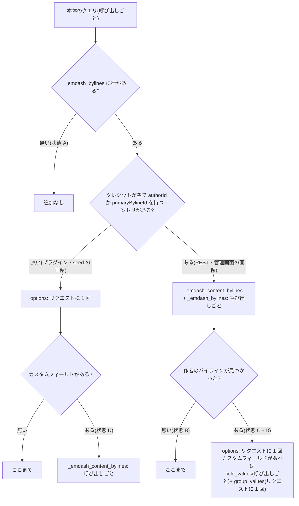

# b64_images を ID の IN 句で取得するときのクエリ数(getEmDashCollection)

> [!summary] 要点
> - `getEmDashCollection("b64_images", { where: { id: [...] }, locale })` は、1 回の呼び出しにつき**本体の 1 クエリ**だった。タクソノミーとバイラインは、本体の SQL に相関サブクエリとして畳み込まれている。10 件・50 件は 1 クエリ、51 件を 50 件ずつに分けると 2 クエリ。
> - **サイトにバイラインが 1 件でもあると、バイラインの補完でクエリが増える。** 増え方は画像エントリの authorId で変わる。authorId が無い画像(プラグインの `ctx.content.create`・seed)はリクエストあたり +1。authorId がある画像(標準の REST API・管理画面)は呼び出しごとに +2(作者のバイラインがあれば、リクエストあたりさらに +1)。バイラインのカスタムフィールドがあると、さらに増える(最悪で呼び出しごとに 4、リクエストあたり +2)。
> - 本体のクエリのバインド変数は **ID の数 + 7(locale あり)/ + 6(locale なし)**。D1 の上限 100 を node:sqlite で模擬すると、locale ありで 93 件、なしで 94 件まで通り、1 件でも超えると失敗した。
> - 上限を超えても**例外にならない**。`{ entries: [], error }` が返り、HTTP は 200 のまま、サーバーのログにも何も出ない。
> - locale を省くと、多言語サイトでは、匿名の訪問者は既定のロケールに、編集モードの編集者はページのロケールに絞り込まれる。参照の locale を必ず明示する。
> - [[T15-site-resolve|T15]] の分割単位は仕様どおり 50 件にする。1 ページ(1 ロケール・50 件まで)のクエリ数は、このプラグインで作った画像なら 1〜3。
> - 関連: [[T09-spike-query-count]]、[[base64-image-plugin-spec#12. サイト側の描画|仕様書 12 章]]、[[base64-image-plugin-spec#5.2 参照(投稿側フィールドの値)|仕様書 5.2]]、[[emdash-plugin-content-api-constraints]]、[[emdash-seed-and-b64-images]]、[[emdash-playground-site-config]]、[[astro-dev-background-for-agents]]

## 測り方

- playground の設定を複製した使い捨てのサイト(`spikes/query-count/site/`、コミットしない)を、`astro dev --port 4409` で動かした。データベースは Node の `node:sqlite`(`sqlite({ url: "file:./data.db" })`)。
- 環境変数で 2 つの構成を切り替えた。
  - 単一ロケール(playground と同じ。i18n の設定なし)
  - 多言語(Astro の `i18n: { defaultLocale: "en", locales: ["en", "ja"], routing: { prefixDefaultLocale: false } }`)
- 画像エントリは 3 通りで作った。中身は [[T03-shared-contracts|T03]] の `base64ImageEntrySchema` の形で、`src` は `tests/fixtures/webp/lossy.webp`(778 B、300×199)の data URL。作った全件がスキーマを通ることを確かめた。

| 作り方 | 件数 | authorId | ロケール |
|---|---|---|---|
| seed(`content.b64_images`、slug なし、`status: "published"`) | 60 | なし | 既定(en) |
| 標準の REST API(dev-bypass でログインした管理者。`POST /_emdash/api/content/b64_images` → `…/{id}/publish`) | 単一ロケール 60、多言語 en・ja 各 30 | あり(管理者) | 指定どおり |
| spike 用のプラグインのルート(`ctx.content.create` → `getVersioned` → `publish`。capability は `content:write` / `content:publish`) | 単一ロケール 60、多言語 en・ja 各 30 | なし | 指定どおり |

- 計測用のエンドポイント `/qc`(と、ロケールが ja になる `/ja/qc`)で、ID を 50 件ずつに分けて `getEmDashCollection` を呼んだ。ページの frontmatter で呼ぶ版(`qc-page.astro`)も同じ数になった。
- 数え方は 2 つを併用し、すべての場合で一致した。
  - **応答の `Server-Timing` の `db.count`**([[T02-playground|T02]] の知見)。1 回の暖機のあと 3 回測り、3 回とも同じ値だった。
  - **`EMDASH_QUERY_LOG=1` の Kysely のログ**。各クエリの SQL とパラメータが `[emdash-query-log]` の行で標準出力(バックグラウンドの `astro dev` では `.astro/dev.log`)に出る。リクエストヘッダー `x-perf-phase` の値が各行の `phase` に入るので、どのリクエストのクエリかを区別できる(`references/emdash/packages/core/src/astro/middleware.ts:645-647`、`references/emdash/packages/core/src/database/instrumentation.ts:104-121`)。
- 計測のリクエストは、Cookie を付けない匿名の GET(公開ページの訪問者と同じ経路)。編集モードの確認だけ、ログインした編集者の Cookie と `emdash-edit-mode=true` を付けた。
- サイトの状態を 4 段階に変えて、同じ組み合わせを測った: A バイラインなし → B 作者と無関係のゲストのバイラインを 1 件追加 → C 管理者(REST で作った画像の作者)に紐づくバイラインを追加 → D バイラインのカスタムフィールド(string)を 1 つ追加。

## 1 回の呼び出しで発行される SQL

根拠: **実測+公式ドキュメント**(`references/emdash/packages/core/src/loader.ts:1357-1431`)

```sql
SELECT *,
  (SELECT json_group_array(…) … FROM "content_taxonomies" AS ct … default_term.locale = ? … ct.collection = ? …) AS "_emdash_terms",
  (SELECT json_group_array(…) FROM "_emdash_content_bylines" AS cb CROSS JOIN "_emdash_bylines" AS b … cb.collection_slug = ? …) AS "_emdash_bylines",
  (SELECT 1 FROM "_emdash_bylines" LIMIT 1) AS "_emdash_bylines_exist",
  (SELECT json_group_array(f.slug) FROM "_emdash_fields" AS f … WHERE c.slug = ? AND f.type = ?) AS "_emdash_boolean_fields"
FROM "ec_b64_images"
WHERE deleted_at IS NULL
  AND "status" = ?
  AND locale = ?          -- locale が決まったときだけ
  AND "id" IN (?, ?, …)   -- where.id の件数だけ
ORDER BY "created_at" DESC, "id" DESC
```

- バインド変数は、ID 以外に 6 個(既定のロケール、コレクション名 × 3、`"boolean"`、`"published"`)。locale が決まると `locale = ?` で 1 個増える。**ID が N 件なら 6 + N(locale なし)/ 7 + N(locale あり)。** ログのパラメータの数で確かめた(10 件で 16 / 17、50 件で 56 / 57)。
- タクソノミーとバイラインのクレジットは、この SQL の相関サブクエリで一緒に読まれる(`references/emdash/packages/core/src/loader.ts:124-165`)。タクソノミーは、このあと追加のクエリを出さない(`references/emdash/packages/core/src/query.ts:1226-1261`)。
- `limit` を渡さないと LIMIT が付かず、一致した行がすべて返る(51 件・94 件の 1 回の呼び出しで全件が返った)。返る順番は `created_at DESC, id DESC` で、要求した ID の順ではない(`references/emdash/packages/core/src/loader.ts:686-690`)。

## クエリ数

根拠: **実測+公式ドキュメント**(`references/emdash/packages/core/src/query.ts:1085-1197`、`references/emdash/packages/core/src/bylines/index.ts:189-321`)

1 リクエストのクエリ数(匿名、暖機のあと)。「51 件(50+1)」は 50 件ずつに分けた 2 回の呼び出し、「51 件(1 回)」は分けずに 1 回で呼んだもの。locale を指定しても省いても、同じ数だった。

| サイトの状態 | 画像の作り方(authorId) | 10 件 | 50 件 | 51 件(50+1) | 51 件(1 回) |
|---|---|---|---|---|---|
| A バイラインなし | seed・REST・プラグイン(どれも同じ) | 1 | 1 | 2 | 1 |
| B ゲストのバイラインあり | seed・プラグイン(なし) | 2 | 2 | 3 | 2 |
| B | REST(あり。作者のバイラインは無い) | 3 | 3 | 6 | 4 |
| C B + 作者のバイライン | seed・プラグイン(なし) | 2 | 2 | 3 | 2 |
| C | REST(あり) | 4 | 4 | 7 | 5 |
| D C + バイラインのカスタムフィールド | seed・プラグイン(なし) | 3 | 3 | 5 | 4 |
| D | REST(あり) | 6 | 6 | 10 | 7 |

- 1 件も見つからない呼び出し(ロケール違いなど)は、どの状態でも本体の 1 クエリだけだった。補完は、見つかったエントリがあるときだけ走る。
- seed 25 件 + REST 25 件を 1 回で呼ぶと、REST だけのときと同じ数になった。authorId のある画像が 1 件でも入ると、その呼び出し全体が補完の経路に進む。
- 状態 C・D では、REST で作った画像の `data.byline` に作者のバイラインが入った。画像には不要なデータで、クエリだけが増える。

内訳(ログのテーブル名で数えた):

| クエリ | 読むテーブル | 回数 | 出る条件 |
|---|---|---|---|
| 本体 | `ec_b64_images`(タクソノミー・クレジットを畳み込み) | 呼び出しごと | 常に |
| カスタムフィールドの定義の版 | `options`(`byline_fields_version`) | リクエストに 1 回 | バイラインがあるサイトで、カスタムフィールドの有無を確かめたとき(状態 B の REST では出なかった) |
| クレジット | `_emdash_content_bylines` | 呼び出しごと(内部で 50 件ずつ) | authorId のある画像が含まれるとき、またはカスタムフィールドがあるとき |
| 作者のバイライン | `_emdash_bylines` | 呼び出しごと(作者 50 人ずつ) | authorId のある画像が含まれるとき |
| カスタムフィールドの値 | `_emdash_byline_field_values` | 呼び出しごと | 作者のバイラインが見つかり、カスタムフィールドがあるとき |
| 共有のカスタムフィールドの値 | `_emdash_byline_field_group_values` | リクエストに 1 回 | 同上 |



- 分岐の場所: 畳み込みの結果だけで済む条件は `references/emdash/packages/core/src/query.ts:1093-1146`。`_emdash_bylines` が空なら `_emdash_bylines_exist` が NULL になり、補完を丸ごと飛ばす(`references/emdash/packages/core/src/loader.ts:159-163`、`query.ts:1107-1109`)。
- 作者のバイラインの補完は、クレジットの無いエントリの authorId から探す(`references/emdash/packages/core/src/bylines/index.ts:257-292`)。このため、authorId の有無でクエリ数が変わる。
- authorId が付くのは、標準の REST API で作ったとき(`references/emdash/packages/core/src/astro/routes/api/content/[collection]/index.ts:84-87` がログイン中の利用者を入れる)。管理画面からの作成も同じ API を使う(`references/emdash/packages/admin/src/lib/api/content.ts:266-278`)。seed とプラグインの `ctx.content.create` は付けない(seed は `references/emdash/packages/core/src/seed/apply.ts:675-684`、プラグインは実測で `authorId: null`)。根拠: 管理画面は **公式ドキュメントのみ**、ほかは **実測+公式ドキュメント**
- カスタムフィールドの定義は、版をリクエストごとに `options` から読み、定義そのものは isolate ごとに持つ(`references/emdash/packages/core/src/bylines/field-defs-cache.ts:106-131`)。

## 1 回の IN 句に入れられる ID の数(D1 の上限 100)

- D1 のバインド変数の上限は 1 クエリ 100 個(公式ドキュメントのみ: Cloudflare D1 Limits)。D1 は手元で動かせないので、Node 26 の `node:sqlite` の `database.limits.variableNumber` を 100 にした dialect をサイトの `database` に指定して模擬した。この設定で 100 個は通り、101 個は `too many SQL variables` になることを先に確かめた。
- 分けずに 1 回で呼んだ結果(状態 D のデータ):

| ID の数 | locale なし(6 + N) | locale あり(7 + N) |
|---|---|---|
| 90・92・93 | 成功 | 成功(93 件で 100 個) |
| 94 | 成功(100 個) | **失敗**(101 個) |
| 95・96・100 | 失敗 | 失敗 |

根拠: **実測+公式ドキュメント**(D1 そのものでは未実測。上限 100 は Cloudflare の文書、バインド変数の数は実測)

- **1 回の呼び出しの上限は、locale ありで 93 件、なしで 94 件。** 多言語サイトでは、locale を省いても既定のロケールで `locale = ?` が付くので 93 件になる(後述)。
- 失敗したときの形: `getEmDashCollection` は例外を投げず、`{ entries: [], error }` を返した。`error.message` は `Failed to load collection: too many SQL variables`。ページは HTTP 200 のまま描画され、失敗したクエリは `db.count` にも入らず、サーバーのログにも何も出なかった。根拠: **実測+公式ドキュメント**(`references/emdash/packages/core/src/loader.ts:1500-1515` が例外を `error` に変える、`references/emdash/packages/core/src/query.ts:797-799`)
- バイラインの補完のクエリは、EmDash の中で 50 件ずつに分けられる(`references/emdash/packages/core/src/database/repositories/byline.ts:1091`、`:1198`)。分割の単位は `SQL_BATCH_SIZE = 50` で、「D1 の上限に十分収まる控えめな値」と説明されている(`references/emdash/packages/core/src/utils/chunks.ts:16-17`)。根拠: **公式ドキュメントのみ**
- 100 件を 50 件ずつ(locale あり)に分けると、2 回とも成功した(状態 D のプラグイン・seed の画像で 5 クエリ)。

## locale を指定したとき・しないとき

根拠: **実測+公式ドキュメント**(`references/emdash/packages/core/src/query.ts:769-774`、`references/emdash/packages/core/src/astro/middleware/request-context.ts:200-212`、`:247`)

- 取得のロケールは「`filter.locale` → リクエストのコンテキストの `locale` → 多言語サイトなら既定のロケール → 指定なし」の順で決まる。
- リクエストのコンテキストに `locale`(Astro の `currentLocale`)が入るのは、編集モードの Cookie か `_preview` があるときだけ。匿名の訪問者には入らない。

| サイト | 呼び方 | 付いた条件 | 結果(10 件で実測) |
|---|---|---|---|
| 単一ロケール | locale を省く | なし | 全件見つかる |
| 単一ロケール | `locale: "en"` | `locale = 'en'` | 全件見つかる(行はすべて en) |
| 単一ロケール | `locale: "ja"` | `locale = 'ja'` | 0 件 |
| 多言語 | 匿名・locale を省く(`/qc` でも `/ja/qc` でも) | `locale = 'en'`(既定) | en の画像だけ。**ja の画像は 0 件** |
| 多言語 | 編集モードの編集者・locale を省く | ページのロケール | `/ja/qc` では **en の画像が 0 件**、ja の画像が見つかる |
| 多言語 | locale を明示(匿名・編集者とも) | 指定どおり | 指定したロケールの画像だけ |
| 多言語 | 参照をロケールでまとめて明示(en 5 + ja 5) | ロケールごと | 2 クエリで 10 件 |
| 多言語 | en 5 + ja 5 を locale を省いて 1 回 | `locale = 'en'` | 5 件(ja が欠ける) |

- locale を省いたときの結果は、見ている人(匿名か編集者か)とページのロケールで変わる。参照の `locale` でまとめて、必ず明示する。ロケールが 2 つなら、呼び出しも 2 つになる(en 26 + ja 25 は 2 クエリで 51 件)。
- 多言語サイトでは、既定以外のロケールの行の `entry.id` に `ja/` のような接頭辞が付く(`ja/01M37…`)。データベースの ID は `entry.data.id` にある。根拠: **実測+公式ドキュメント**(`references/emdash/packages/core/src/loader.ts:1443-1449`)

## 1 リクエストに 1 回・isolate に 1 回のクエリ

- サーバーを起動し直した直後の最初の `/qc`(状態 D、プラグインの画像 10 件)は 6 クエリ、2 回目は 3 クエリだった。増えた 3 つは次のとおり。根拠: **実測+公式ドキュメント**

| クエリ | 頻度 | 画像の解決との関係 |
|---|---|---|
| `_emdash_taxonomy_defs` | isolate に 1 回(`where` を使う最初の呼び出し) | あり(`references/emdash/packages/core/src/loader.ts:370-409`、`:1274`) |
| `_emdash_byline_fields` | isolate・カスタムフィールドの版ごとに 1 回(バイラインがあるサイト) | あり(`field-defs-cache.ts`) |
| `_emdash_redirects` | isolate に 30 秒に 1 回 | 無い。リダイレクトのミドルウェア(`references/emdash/packages/core/src/redirects/cache.ts:47`) |

- ログインしたリクエストには、利用者の読み込み(`users`)が 1 つ加わる。画像の解決の数は変わらない。根拠: **実測のみ**

## そのほか

- 同じリクエストの中で、フィルターがまったく同じ呼び出し(ID の順番も同じ)は 1 回にまとめられた(`requestCached`)。同じ ID を逆順で渡すと、別のクエリになった。根拠: **実測+公式ドキュメント**(`references/emdash/packages/core/src/query.ts:468`、`:670-682`)
- オブジェクトキャッシュ(L2)は既定で無効で、どのリクエストもデータベースを読む。`memoryCache()` / `kvCache()` を設定すると、匿名のリクエストはキャッシュから返ることがある。根拠: **公式ドキュメントのみ**(`references/emdash/packages/core/src/object-cache/index.ts:10-14`、`references/emdash/packages/core/src/query.ts:493-531`)
- `Server-Timing` の `db.count` は、ミドルウェアの `next()` が返った時点の値で、ストリーミング中に描画されるコンポーネントのクエリは入らない。ページの frontmatter とエンドポイントのクエリは入る(`qc-page.astro` と `/qc` が同じ数だった)。根拠: 前半は **公式ドキュメントのみ**(`references/emdash/packages/core/src/astro/middleware.ts:813-822`、`references/emdash/packages/core/src/astro/middleware/stream-end-metrics.ts`)、後半は **実測のみ**

> [!warning] Cloudflare(D1)では未実測
> SQL は同じ(SQLite の方言)なので、画像の解決のクエリ数は同じになる見込み(推測のみ)。ただし D1 では、匿名の HTML のリクエストで EmDash がレイアウト用のデータを `after()` で先読みする(`references/emdash/packages/core/src/astro/middleware.ts:824-854`。公式ドキュメントのみ)。リクエスト全体のクエリ数は [[T32-cloudflare-check|T32]] で確かめる。

## T15 への反映

- **分割単位は 50 件(仕様どおり)。** locale を明示すると 7 + 50 = 57 個で、上限 100 まで 43 の余裕がある。EmDash 自身の IN 句の分割単位(`SQL_BATCH_SIZE = 50`)とも揃う。93 件まで入るが、余裕が無く、EmDash の SQL にバインド変数が 1 つ増えるだけで黙って失敗するので採らない。51 件以上になるのは、1 ページに同じロケールの参照が 51 件以上あるときだけ(ギャラリーは 20 枚まで)。
- **1 ページあたりのクエリ数**: ロケールごとに `ceil(件数 / 50)` 回の呼び出しで、1 回につき本体の 1 クエリ。これにバイラインの補完が加わる。このプラグインで作った画像(authorId なし)では、バイラインが無いサイトで +0、あるサイトで +1、カスタムフィールドもあるサイトで呼び出しごとに +1。1 ロケール・50 件までのページは 1〜3 クエリ。
- 実装で守ること:
  1. 参照の `locale` でまとめ、`locale` を必ず渡す。
  2. 戻り値の `error` を確かめる。例外にならないので、見なければ画像が黙って消える。`error` があれば、その呼び出しの ID をすべて「見つからない」として警告ログを出す。
  3. 結果は `entry.data.id` で引く(`entry.id` は `ja/…` になりうる)。
  4. 返る順番は要求の順ではないので、ID をキーにした Map にする。
  5. (任意)ID を並べ替えてから呼ぶと、同じリクエストで同じ参照を解決し直したときに 1 回にまとまる。

## 再現の手順

使い捨てのサイトは `spikes/query-count/site/`(git 管理外)。playground の `astro.config.mjs` を複製し、次の部分だけを変えた。

```js
// astro.config.mjs(抜粋)
const I18N = process.env.SPIKE_I18N === "1";
const D1_LIMIT = process.env.SPIKE_D1_LIMIT ? Number(process.env.SPIKE_D1_LIMIT) : undefined;
const DB_URL = process.env.SPIKE_DB ?? (I18N ? "file:./data-i18n.db" : "file:./data.db");
const baseDb = sqlite({ url: DB_URL });
const database = D1_LIMIT
	? { ...baseDb, entrypoint: here("./d1-like-dialect.mjs"), config: { url: DB_URL, variableNumber: D1_LIMIT } }
	: baseDb;
// i18n: I18N ? { defaultLocale: "en", locales: ["en", "ja"], routing: { prefixDefaultLocale: false } } : undefined
// plugins: [base64ImagePlugin(), { id: "qc-spike", version: "0.0.0", entrypoint: here("./spike-plugin.mjs"), options: {} }]
```

```js
// d1-like-dialect.mjs(emdash/db/sqlite と同じ。上限だけを変える)
export function createDialect(config) {
	const database = new DatabaseSync(config.url.replace(/^file:/, ""));
	database.limits.variableNumber = config.variableNumber; // D1 と同じ 100
	return new SqliteDialect({ database: /* openNodeSqliteDatabase と同じ包み */ });
}
```

```js
// spike-plugin.mjs のルート(authorId は付かない)
create: {
	handler: async (ctx) => {
		const item = await ctx.content.create("b64_images", { image: ctx.input.image }, ctx.input.locale ? { locale: ctx.input.locale } : undefined);
		const { _rev } = await ctx.content.getVersioned("b64_images", item.id);
		await ctx.content.publish("b64_images", item.id, { _rev });
		return { id: item.id };
	},
},
```

```ts
// src/pages/qc.ts(と src/pages/ja/qc.ts)の中身
for (const part of chunked(ids, 50)) {
	const { entries, error } = await getEmDashCollection("b64_images", locale ? { where: { id: part }, locale } : { where: { id: part } });
	// entries.length、error、entries[i].data.id / .locale / .authorId / .byline を返す
}
```

```sh
# サイトのディレクトリで起動する(バックグラウンドの子プロセスの cwd はサイトのルートになる。
# ルートの外から相対パスの --root を渡すと、子プロセスで二重に解決されて起動しない)
cd spikes/query-count/site
EMDASH_QUERY_LOG=1 node ../../../node_modules/astro/bin/astro.mjs dev --port 4409
# 多言語: SPIKE_I18N=1、D1 の模擬: SPIKE_D1_LIMIT=100 を前に付ける
curl -s -D - -o /dev/null "http://localhost:4409/qc?ids=<id>,<id>&locale=en" -H "x-perf-phase: label|scenario|r1" | grep -i server-timing
grep '\[emdash-query-log\]' .astro/dev.log   # SQL・パラメータ・phase
node ../../../node_modules/astro/bin/astro.mjs dev stop
```

- 画像エントリの作成は、dev-bypass の Cookie と `X-EmDash-Request: 1` を付けて REST API とプラグインのルートに POST した。
- バイラインは `POST /_emdash/api/admin/bylines`(`{ slug, displayName, isGuest: true }` / `{ slug, displayName, userId }`)、カスタムフィールドは `POST /_emdash/api/admin/byline-fields`(`{ slug: "twitter", label: "Twitter", type: "string" }`)で追加した。

> [!info] 計測環境
> macOS 26.4(Darwin 25.4.0、arm64)、Node 26.10.0(SQLite 3.53.4)、emdash 0.39.1、Astro 7.3.3、@astrojs/node 11.1.6、Kysely 0.29.6。開発サーバー(`astro dev`、ポート 4409)。2026-09-24 に計測。
