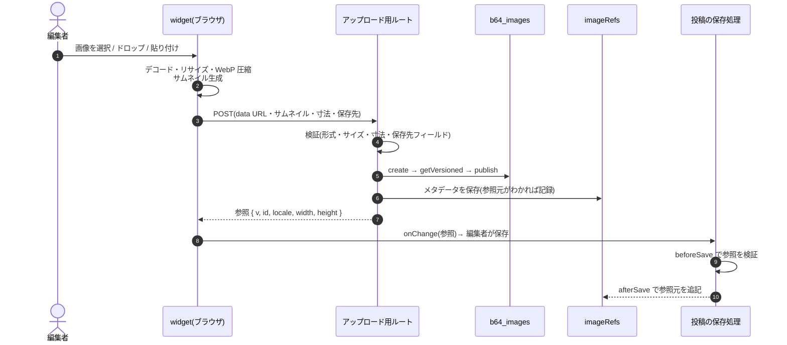
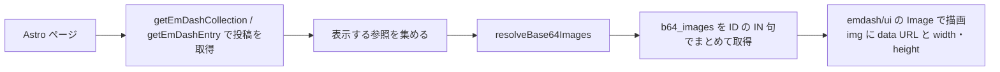

# EmDash Base64 画像プラグイン 仕様書

> [!summary] 概要
> R2 などのオブジェクトストレージを使わずに、EmDash で画像を扱うための native プラグイン。
> - 管理画面でアップロードした画像を、ブラウザで WebP に圧縮する(保存する data URL で 100,000 バイト以下)。
> - base64 の data URL を、D1 に JSON として保存する。
> - width / height を保持し、サイト側では `` で描画して Layout Shift を抑える。

> [!info] 根拠レベルと参照パス
> - 事実には根拠レベルを付ける: **実測+公式ドキュメント** / **実測のみ** / **公式ドキュメントのみ** / **外部ドキュメントのみ** / **推測のみ**
> - EmDash のソースコードを読んで確認した事実(実行はしていない)は「公式ドキュメントのみ」に含める。
> - ファイルパスは、特に断りがなければ `references/emdash/` 以下を指す(EmDash 0.38.0 時点)。

## 目次

- [[#1. 背景と目的]]
- [[#2. 動作環境と制約]]
- [[#3. スコープ]]
- [[#4. アーキテクチャ]]
- [[#5. データモデル]]
- [[#6. 圧縮仕様(ブラウザ)]]
- [[#7. アップロード(書き込み経路)]]
- [[#8. サーバー側の検証]]
- [[#9. 参照元の記録と未使用画像の検出]]
- [[#10. 画像のライフサイクル]]
- [[#11. 管理画面 UI]]
- [[#12. サイト側の描画]]
- [[#13. 設定]]
- [[#14. 配布とバージョン]]
- [[#15. リポジトリ構成・ツール・テスト]]
- [[#16. 実装前の検証(スパイク)]]
- [[#17. 実装時に再確認する事項]]
- [[#18. 既知の制約とリスク]]
- [[#19. 対象外・将来の検討事項]]
- [[#20. 決定ログ]]
- [[#付録 A. 実測データ]]
- [[#付録 B. 参考資料]]

## 用語

| 用語 | 意味 |
|---|---|
| 画像エントリ | 非表示コレクション `b64_images` の1エントリ。画像1枚の本体(data URL)を持つ |
| 参照 | 投稿などのフィールドに保存する値。画像エントリの ID・寸法・alt だけを持つ |
| 参照元 | ある画像を参照しているエントリとフィールド(`collection` / `entryId` / `locale` / `field`) |
| 未使用画像 | 現在のコンテンツ(公開版・下書き)のどこからも参照されていない画像エントリ |

---

## 1. 背景と目的

**目的**
- 画像を base64 で DB に保存できる EmDash プラグインを作る。
- 保存形式は JSON だが、管理画面では画像として表示する。
- アップロード時に WebP に圧縮し、サイズを小さくする。
- 画像の width / height も保存し、表示時の Layout Shift を減らす。

**動機(Q1)**
- R2 を使わずに EmDash を動かしたい。
- R2 を使うには、Workers Paid プランは不要だが、「R2 サブスクリプションのチェックアウト(支払い情報の登録)」が必要になる。無料枠(10GB-month/月)内であれば請求は $0。
  - 根拠: 公式ドキュメントのみ(Cloudflare R2 Get started / Pricing)
- このプラグインは「支払い情報を登録せずに運用する」ことを前提とする。

## 2. 動作環境と制約

### 2.1 想定する環境

- Cloudflare Workers Free + D1 Free。storage(R2)は使わない。
- EmDash 0.38.0(1.0 前のため、マイナーバージョンでも破壊的変更がありうる)。
- 管理画面を操作するブラウザは Chrome / Edge / Firefox。**Safari は対象外。**

### 2.2 プラットフォームの上限

| 項目 | 値 | 根拠 |
|---|---|---|
| Workers Free のリクエスト数 | 100,000 / 日 | 公式ドキュメントのみ |
| Workers Free の CPU 時間 | 10ms / リクエスト | 公式ドキュメントのみ |
| Workers のメモリ | 128MB | 公式ドキュメントのみ |
| D1 のクエリ数(Free) | 50 / リクエスト | 公式ドキュメントのみ |
| D1 の DB サイズ(Free) | 500MB / DB、5GB / アカウント | 公式ドキュメントのみ |
| D1 の1行・1値のサイズ | 2MB | 公式ドキュメントのみ |
| D1 の SQL 文の長さ | 100KB | 公式ドキュメントのみ |
| D1 のバインド変数 | 100 / クエリ | 公式ドキュメントのみ |
| D1 Time Travel(Free) | 7日 | 公式ドキュメントのみ |
| EmDash API のリクエスト body | 10MB(`packages/core/src/api/parse.ts:13`) | 公式ドキュメントのみ |

### 2.3 storage なしで使えなくなる EmDash の機能

- メディアライブラリへのアップロード。標準の `image` / `file` フィールドや、リッチテキストへの画像アップロードも含む。いずれも `NO_STORAGE` エラーになる(`packages/core/src/astro/routes/api/media.ts:124` ほか)。
- 自動バックアップ(`STORAGE_NOT_CONFIGURED`)。
- 結果として、**このプラグインがサイトで唯一の画像の手段**になる。
- 根拠: 公式ドキュメントのみ

### 2.4 バックアップ

> [!warning] 復旧手段は D1 Time Travel(直近7日)のみ
> - `wrangler d1 export` は仮想テーブルを含む DB では使えない(公式ドキュメントのみ: Cloudflare D1 Import/Export)。
>   - EmDash の検索機能は FTS5 の仮想テーブルを使う(`packages/core/src/search/fts-manager.ts:111`)。
>   - Cloudflare テンプレートは検索が既定で有効(`templates/blog-cloudflare/seed/seed.json:18`)。
>   - つまり、このプラグインと関係なく SQL ダンプが取れない。
> - 検索を無効にしても、base64 を含む行は SQL 文の 100KB 上限を超える。そのため、ダンプからの復元は失敗する見込み(公式ドキュメントのみ: limits と import のトラブルシュートからの推論、未実測)。
> - 7日より前に戻す必要が出てきたら、プラグインとは別に独自のエクスポート/リストアツールで対応する。

## 3. スコープ

| # | 用途 | 扱い | 理由 |
|---|---|---|---|
| 1 | 専用の画像フィールド(1フィールドに1枚) | **対象** | — |
| 2 | ギャラリー(1フィールドに複数枚) | **対象** | — |
| 3 | リッチテキスト本文中の画像 | 対象外 | 本文ブロックの編集 UI は Block Kit 要素しか使えず、ファイル選択や圧縮の UI を入れられない(`packages/admin/src/components/editor/PluginBlockNode.tsx:41`)。公式ドキュメントのみ |
| 4 | OGP / X カード画像 | 対象外(将来検討) | SNS のクローラーは HTTP(S) の URL が前提と思われる(推測のみ)。対応するには画像を返す公開ルートが必要 |

## 4. アーキテクチャ

### 4.1 構成要素

| 要素 | 役割 |
|---|---|
| native プラグイン `base64-image` | React の field widget、画像管理ページ、一覧の列、アップロード用ルート、保存 hook |
| 非表示コレクション `b64_images` | 画像本体の置き場所(1エントリ1画像) |
| 投稿側の `json` フィールド | 画像への**参照だけ**を持つ |
| プラグインストレージ `imageRefs` | 参照元・サムネイル・サイズなどのメタデータ(base64 本体は持たない) |

**native プラグインにする理由**
- sandboxed プラグインの field widget で使えるのは、Block Kit 要素(`text_input` / `number_input` / `toggle` / `select` / `media_picker`)だけ。ファイル選択、canvas での圧縮、プレビューができない。
- 根拠: `skills/creating-plugins/references/admin-ui.md`、`packages/admin/src/components/ContentEditor.tsx:1800`(公式ドキュメントのみ)

**画像本体を投稿に直接持たせない理由(Q4)**
- 管理画面の一覧は、1ページ100件を全データ込み(`SELECT *`)で取得する(`packages/admin/src/router.tsx:440`、`packages/core/src/database/repositories/content.ts:760`)。
  - カバー1枚+10枚ギャラリーの投稿が100件あると、応答は 146.9MB になり、Workers のメモリ上限 128MB を超える。
  - 根拠: 実測+公式ドキュメント([[#付録 A. 実測データ|付録 A.1]])
- リビジョンは、保存のたびに全データを複製し、最大50件残す(`packages/core/src/cleanup.ts:37`)。

**画像本体をプラグインストレージに置かない理由**
- サイト側のテンプレートからプラグインストレージを読む公開 API がない。`createPluginStorageAccessor` は `index.ts` から export されていない(`packages/core/src/database/repositories/plugin-storage.ts:539`)。
- 根拠: 公式ドキュメントのみ

### 4.2 アップロードの流れ



### 4.3 描画の流れ



## 5. データモデル

### 5.1 画像エントリ(`b64_images`)

- コレクション設定: `hidden: true` / `routable: false` / `supports: []`(リビジョン・下書き・検索なし)
- フィールド: `image`(`json`、必須)

```jsonc
{
  "id": "01J…",                            // エントリ ID と同じ値
  "src": "data:image/webp;base64,UklGR…",  // 既定で 100,000 バイト以下
  "mimeType": "image/webp",
  "width": 1280,
  "height": 853,
  "filename": "IMG_0001.jpg",              // 元のファイル名(任意)
  "meta": { "v": 1, "bytes": 74668 }       // スキーマのバージョン・WebP 本体のバイト数
}
```

- `MediaValue` 互換の形。`alt` は使う場所ごとに変えられるよう参照側で持つので、画像エントリには持たせない(Q3 + Q9)。
- 作成時のロケールは、サイトの既定ロケールにする(`ctx.content.create` の既定値。`packages/core/src/plugins/types.ts:476`)。
- 画像エントリは、作成したあと変更しない。

### 5.2 参照(投稿側フィールドの値)

```jsonc
// base64-image:image(単一)
{ "v": 1, "id": "01J…", "locale": "ja", "width": 1280, "height": 853, "alt": "説明文" }

// base64-image:gallery(複数)→ 上の参照の配列
[ { "v": 1, "id": "01J…", … }, { "v": 1, "id": "01J…", … } ]
```

- `locale`: 画像エントリのロケール。
  - 多言語サイトでは、取得がリクエストのロケールに絞り込まれるため、取得時にこの値を明示的に指定する(`packages/core/src/query.ts:769`)。
- `alt`: 使う場所やロケールごとに設定できる。1,000 文字以内。空欄は装飾画像として扱う。
- 型: `json` フィールドは、サイト側の型生成で `unknown` になる(`packages/core/src/schema/zod-generator.ts:499`)。プラグインから型定義と type guard を export する。

### 5.3 参照元メタデータ(プラグインストレージ `imageRefs`、キーは画像 ID)

```jsonc
{
  "owners": [
    { "collection": "posts", "entryId": "01J…", "locale": "ja", "field": "cover" }
  ],
  "bytes": 74668,
  "width": 1280,
  "height": 853,
  "thumb": "data:image/webp;base64,…",  // 長辺 96px 程度、8,000 バイト以下
  "createdAt": "2026-09-23T12:00:00.000Z",
  "createdBy": "<userId>"
}
```

- インデックス: `createdAt`
- `owners` には追記だけを行い、保存時に削除はしない([[#9. 参照元の記録と未使用画像の検出]])。

### 5.4 容量の目安

- 画像1枚は最大 100,000 バイトなので、D1 の 500MB で約 5,000 枚(未使用画像を含む)。
- 投稿側の行とリビジョンには参照しか入らないため、小さいまま保たれる。

## 6. 圧縮仕様(ブラウザ)

### 6.1 エンコード方式

- canvas の `toBlob("image/webp", quality)` を使う。
  - 対応ブラウザ: Chrome 50 以降 / Edge 79 以降 / Firefox 96 以降(外部ドキュメントのみ: caniuse)
- 生成された Blob の `type` が `image/webp` でなければ、「このブラウザは非対応です」と表示して中断する。
  - Safari はデスクトップ・iOS とも 27.2 時点で未対応。エラーを出さずに PNG を返してしまう(外部ドキュメントのみ: caniuse)。

> [!note] WASM エンコーダーを使わない理由
> - 管理画面の本番 CSP は `script-src 'self' 'unsafe-inline'` で、`'wasm-unsafe-eval'` を含まない。そのため WASM は禁止されている(`packages/core/src/astro/middleware/csp.ts:92`、MDN)。
> - この CSP は本番で無条件に設定され、サイト側から上書きできない(`packages/core/src/astro/middleware/auth.ts:301`, `:322`)。
> - 開発モードでは CSP が付かない。WASM を使うと「開発では動くのに本番で壊れる」ことになる。

### 6.2 サイズ予算(Q6)

- `src`(先頭の `data:image/webp;base64,` を含む data URL 全体)の長さを `maxStoredBytes` 以下にする。既定は 100,000。
- WebP 本体に換算すると 74,982 バイト以下になる。計算式は `23 + 4 × ceil(B / 3) ≤ 100,000`。

### 6.3 リサイズと画質の方針(Q7)

1. EXIF の向きを反映してデコードする(`createImageBitmap(file, { imageOrientation: "from-image" })`)。
2. 長辺を `maxEdge`(既定 1600px)以下に縮小する。拡大はしない。
3. 画質 `minQuality`(既定 0.60)〜 0.92 の範囲で二分探索し、予算内に収まる最高の画質を採用する。
4. `minQuality` でも収まらなければ、0.8 倍に縮小して手順 3 に戻る。
5. 長辺が `minEdge`(既定 480px)を下回ったら、エラーにする。

写真5枚での結果(cwebp での見積もり。[[#付録 A. 実測データ|付録 A.2]]):

| 写真 | 採用される長辺 / 画質 |
|---|---|
| p1 | 1280px / 77 |
| p2 | 1600px / 80 |
| p3(細部が多い) | 1024px / 60 |
| p4 | 1024px / 77 |
| p5(単純) | 1600px / 92 |

### 6.4 サムネイル

- 本体と同時に、長辺 96px 程度の WebP(8,000 バイト以下)を作る。アップロード時に一緒に送り、`imageRefs.thumb` に保存する。
- 用途: コンテンツ一覧の列と、画像管理ページ。

### 6.5 入力形式と上限(Q8)

| 区分 | 形式 | 扱い |
|---|---|---|
| 受け付ける | JPEG / PNG / WebP / AVIF / BMP | そのまま変換する |
| 受け付ける | GIF | 最初のフレームだけの静止画にする。アニメーションが消えることを注意書きで伝える |
| 拒否する | HEIC / HEIF | 「iPhone のカメラ設定を『互換性優先』にするか、JPEG に書き出してください」と案内する。Chrome / Edge / Firefox はデコードできない(外部ドキュメントのみ: caniuse) |
| 拒否する | SVG | ベクター画像を画素に変換すると劣化し、スクリプトを含められる形式でもあるため |
| 拒否する | TIFF など | デコードできないため |

- 入力の上限: ファイル 40MB、または 6,400万画素(64MP)を超えるものは拒否する。ブラウザのタブがメモリ不足で落ちるのを防ぐため。
- 形式は、拡張子ではなく「MIME タイプ」と「実際にデコードできたか」で判定する。
- 変換で自動的に起きること(ヘルプに書く): 位置情報を含む EXIF は削除される。透過は保持される。色は sRGB に変換される。

## 7. アップロード(書き込み経路)

- widget から、プラグインの private ルート(例: `POST /_emdash/api/plugins/base64-image/upload`)を呼ぶ。
- ルートの権限は `content:create`(Contributor 以上。`packages/auth/src/rbac.ts:19`)。
- **1リクエストで1枚**だけ扱う。D1 のクエリ数上限(1リクエスト50本)に確実に収めるため。
- 入力:

```jsonc
{
  "dataUrl": "data:image/webp;base64,…",
  "thumb": "data:image/webp;base64,…",
  "width": 1280,
  "height": 853,
  "filename": "IMG_0001.jpg",
  "target": { "collection": "posts", "field": "cover", "entryId": "01J…", "locale": "ja" }  // entryId は新規エントリなら省略
}
```

- 処理の順番:
  1. 検証する([[#8. サーバー側の検証]] の①)。
  2. `ctx.content.create("b64_images", …)` で作成する。
  3. `getVersioned` で最新の版を取得し、`publish` で公開する。
  4. `imageRefs` にメタデータを保存する。
  5. 参照を返す。
- 公開まで行う理由: Contributor には公開権限がない(`content:publish_own` は Author 以上。`packages/auth/src/rbac.ts:28`)。標準 API で作成すると下書きのまま残り、サイトに表示されない。
- 必要な capability: `schema:read` / `content:read` / `content:write` / `content:publish` / `content:revisions:read`

## 8. サーバー側の検証

| 場所 | 検証内容 | 不正なとき |
|---|---|---|
| ① アップロード用ルート | ・保存先のフィールドが存在し、このプラグインの widget であること(`ctx.schema.getCollection` で `widget` / `options` を読む。`packages/core/src/plugins/types.ts:407`)<br>・`dataUrl` が `data:image/webp;base64,` で始まり、長さが `maxStoredBytes` 以下(固定上限 500,000)<br>・デコードした中身が WebP(RIFF / WEBP、`VP8 ` / `VP8L` / `VP8X`)で、ヘッダーから読んだ寸法が width / height と一致し、長辺が `maxEdge` 以下<br>・`thumb` が WebP で 8,000 バイト以下 | 拒否 |
| ② `b64_images` の `content:beforeSave` | ①と同じ中身の検証。API / MCP / 管理画面など、どこからの書き込みでも実行する | 拒否 |
| ③ 参照を持つコレクションの `content:beforeSave` | ・参照の形(`{ v, id, locale, width, height, alt }` の型、alt は 1,000 文字以内)<br>・ギャラリーの枚数が `maxItems` 以下で、同じ画像が重複していないこと<br>・参照している画像 ID が、すべて `imageRefs` に存在すること(`getMany` でまとめて1クエリ) | 拒否し、どのフィールドの何が問題かをメッセージで返す |

- 保存 hook では書き込み元を判別できない(`runContentBeforeSave` には書き込み元のプラグインを除外する引数がない。`packages/core/src/plugins/hooks.ts:543`)。そのため、書き込み元ではなく中身で判定する。
- 処理の重さ: 約 100KB の data URL のデコードと WebP ヘッダーの解析は、`Uint8Array.fromBase64` で 0.011ms、`atob` で 0.149ms(実測のみ。[[#付録 A. 実測データ|付録 A.4]])。
- ③の存在確認の影響: 管理者が画像を完全削除したあと、その画像を参照している投稿を保存しようとすると、保存が拒否される。widget 側では「画像が見つかりません」と表示し、削除ボタンで参照を外せるようにする。

## 9. 参照元の記録と未使用画像の検出

**記録(追記のみ)**
- アップロード時: `target.entryId` があれば、最初の参照元として記録する。
- 保存時: 参照を持つコレクションの `content:afterSave` で、保存されたエントリの中の参照を読み取り、`imageRefs.owners` に追記する。
  - `getMany` / `putMany` でまとめて処理するので、1〜2クエリで済む。
  - afterSave は `after()`(waitUntil)で遅れて実行される(`packages/core/src/emdash-runtime.ts:5560`)。
- 保存時に参照元を削除しない理由: 下書きと公開版の二重管理や、hook が失敗したときのずれを扱わずに済むため。
- エントリの複製などで、1枚の画像に参照元が複数つくこともある。その場合は `owners` に複数並ぶ。

**判定(画像管理ページを開いたときに行う)**
- 参照元ごとに `ctx.content.get` でエントリを取得する。
- 公開版のデータと下書きリビジョン(`getRevision`)の両方に、画像 ID が残っているかを確認する。
  - 下書きは、公開版の行とは別にリビジョンのテーブルに保存されている(`packages/core/src/emdash-runtime.ts:3516`)。
- 判定結果は4種類:
  - **使用中**
  - **参照元が削除された**(ゴミ箱に入った場合を含む)
  - **参照元から外された**
  - **参照元なし**(アップロードしたが保存されなかった)
- 判定は 10 件程度ずつのページ送りで行う。D1 のクエリ数上限(1リクエスト50本)があり、プラグインの `ctx.content.list` では ID の IN 検索ができないため(`packages/core/src/plugins/types.ts:443`)。

> [!warning] 「参照されていない」は「消しても安全」ではない
> 判定の対象は、現在のコンテンツ(公開版と下書き)だけ。古いリビジョンからは、まだ参照されている可能性がある。警告文にもそう明記する。

## 10. 画像のライフサイクル

- 画像は作成後に変更しない。既存画像の再利用もしない。自動削除もしない。
- 削除は、画像管理ページから手動で行う。
  - **ゴミ箱への移動**: Contributor 以上(`ctx.content.delete`)。ただし権限は [[#17. 実装時に再確認する事項]] で再確認する。
  - **完全削除**: 管理者のみ。標準の API `DELETE /_emdash/api/content/b64_images/{id}/permanent` を、ログイン中の管理者の権限で呼ぶ(`packages/core/src/astro/routes/api/content/[collection]/[id]/permanent.ts:14`。権限は `content:delete_permanent`)。
- プラグインは完全削除ができない(`skills/creating-plugins/references/sandbox-boundaries.md`)。ゴミ箱を自動で空にする処理も見当たらない。容量が戻るのは完全削除したときだけ。
- EmDash 標準の `b64_images` 一覧画面とゴミ箱画面は、1ページ100件分の base64 を読み込むので使わない(1件約 100KB)。

## 11. 管理画面 UI

### 11.1 共通方針

- コンポーネントは Kumo(`@cloudflare/kumo`)を使う(公式の field-kit と同じ)。
- 文言は日本語と英語を用意し、`<html lang>` で切り替える。どちらでもなければ英語にする(`packages/admin/src/locales/LocaleDirectionProvider.tsx:21`)。
- ファイル選択、並べ替え、削除は、すべてキーボードでも操作できるようにする。進捗は `aria-live` でスクリーンリーダーに伝える。
- plugin widget には `readOnly` が渡されない(`packages/admin/src/components/ContentEditor.tsx:1827`)。そのため、編集ロック中でも widget は操作できてしまう。これは EmDash 側の制約。

### 11.2 単一画像 widget(`base64-image:image`)

```
空のとき        ┌──────────────────────────────┐
                │  画像をドロップ / 貼り付け          │
                │  [ファイルを選択]                 │
                └──────────────────────────────┘
処理中          圧縮中… 1280px / 画質 0.74   [キャンセル]
設定済みのとき   (プレビュー)
                1280×853 · 保存サイズ 98.2KB · 画質 0.77
                代替テキスト [______________]   [差し替え] [削除]
```

- アップロードのタイミング: 圧縮が終わった時点で、すぐにルートへ送る。失敗したらその場にエラーを表示し、フィールドの値は変えない。
- プレビュー:
  - 追加したばかりの画像は、手元にある data URL をそのまま表示する。
  - 保存済みの画像は、編集画面を開いたときに、プラグインのルートからまとめて1回で取得する。
- 代替テキストは任意入力。空欄のときは「装飾画像として扱われます」と注意を表示する。
- 参照先の画像が見つからないときは、「画像が見つかりません」と表示し、削除ボタンを出す。

### 11.3 ギャラリー widget(`base64-image:gallery`)

- 複数枚をまとめて選択・ドロップでき、1枚ずつ順に処理する(それぞれの進捗を表示)。
- サムネイルを並べて表示する。ドラッグ、または ↑↓ ボタンで並べ替えられる。1枚ずつ削除や代替テキストの入力ができる。
- 「あと N 枚追加できます」と表示し、`maxItems` を超える追加は拒否する。

### 11.4 コンテンツ一覧のサムネイル列(Q10)

- trusted プラグイン向けの `contentListColumns` で列を追加する(`packages/admin/src/lib/content-list-columns.tsx:23`)。
- 表示する画像:
  - 単一画像のフィールドがあれば、スキーマ上で最初のものを表示する。
  - なければ、最初のギャラリーの1枚目を表示し、「+N」で残りの枚数を添える。
- プラグインのフィールドを持つコレクションにだけ列を出す。どのフィールドがプラグインの widget かは、`@emdash-cms/admin` の `fetchManifest` で判別する。
- サムネイルは、そのページに表示中の全行(`visibleItems`)の分を、1ページにつき1回のリクエストでまとめて `imageRefs` から取得する。100行で数百KB 程度で、各行の base64 本体は読み込まない。
- 画像が未設定の行は「—」を表示する。参照先の画像が見つからない行は、警告アイコンを表示する。

### 11.5 画像管理ページ

- `admin.pages` で登録する(例: `/_emdash/admin/plugins/base64-image/images`)。
- 一覧に出すもの: サムネイル、寸法、保存サイズ、参照元へのリンク、状態バッジ([[#9. 参照元の記録と未使用画像の検出]])、作成日時。
- 操作: ゴミ箱への移動、完全削除(管理者のみ)。
- メニューのラベルは静的な文字列になる(マニフェストのラベルは翻訳されない)。

## 12. サイト側の描画

- プラグインは `resolveBase64Images(refs)` を提供する。ページで使う参照をまとめて渡すと、画像 ID をキーにした `MediaValue` 互換の値(`src` は data URL、`alt` は参照のもの)を返す。
  - 中では `getEmDashCollection("b64_images", { where: { id: [...] }, locale })` を使う。IN 句は `packages/core/src/loader.ts:772`。
  - ID は 50 件ずつに分けて取得する(D1 のバインド変数は1クエリ100個まで)。
  - バイラインとタクソノミーは、本体のクエリにまとめて取得される仕組みがある(`packages/core/src/query.ts:1085`)。そのため1ページあたり1〜3クエリの見込み(推測のみ。スパイクで実測する)。
- 描画は `emdash/ui` の `Image` を使う。data URL は responsive 変換の対象外なので、`` がそのまま出力される(`packages/core/src/components/EmDashImage.astro`、`packages/core/src/media/responsive.ts:127`)。
- LCP の対象になる画像には `priority` を付ける。
- 画像が見つからないときは何も描画せず、警告ログを出す。
- 一覧ページ(カード表示)でもメイン画像を使う(Q12 は (a) を選択)。表示中のエントリの参照をまとめて1回で解決する。10件並べると HTML は最大約 1MB になる。

```astro
---
import { getEmDashCollection } from "emdash";
import { Image } from "emdash/ui";
import { isBase64ImageRef, resolveBase64Images } from "emdash-plugin-base64-image/astro";

const { entries } = await getEmDashCollection("posts", { limit: 10 });
const refs = entries.map((entry) => entry.data.cover).filter(isBase64ImageRef);
const images = await resolveBase64Images(refs);
---
{entries.map((entry, i) => {
	const ref = entry.data.cover;
	const image = isBase64ImageRef(ref) ? images.get(ref.id) : undefined;
	return image && <Image image={image} priority={i === 0} />;
})}
```

## 13. 設定

### 13.1 seed

管理画面のスキーマ編集 UI では `widget` を指定できない(`packages/admin/src/components/FieldEditor.tsx:362`)。フィールドは seed / API / MCP のいずれかで作成する。

```jsonc
{
	"collections": [
		{
			"slug": "b64_images",
			"label": "Base64 Images",
			"hidden": true,
			"routable": false,
			"supports": [],
			"fields": [{ "slug": "image", "label": "Image", "type": "json", "required": true }]
		},
		{
			"slug": "posts",
			"label": "Posts",
			"supports": ["drafts", "revisions", "search", "seo"],
			"fields": [
				{ "slug": "title", "label": "Title", "type": "string", "required": true },
				{
					"slug": "cover",
					"label": "Cover",
					"type": "json",
					"widget": "base64-image:image",
					"options": { "maxStoredBytes": 100000 }
				},
				{
					"slug": "gallery",
					"label": "Gallery",
					"type": "json",
					"widget": "base64-image:gallery",
					"options": { "maxStoredBytes": 100000, "maxItems": 10 }
				}
			]
		}
	]
}
```

- プラグインは起動時に `b64_images` があるかを確認し、なければエラーを出す。プラグインからはコレクションを作れない(`ctx.schema` は読み取り専用)。

### 13.2 フィールドの `options`

| option | 対象 | 既定値 | 説明 |
|---|---|---|---|
| `maxStoredBytes` | image / gallery | 100000 | data URL の最大長(バイト)。サーバー側の固定上限は 500000 |
| `maxEdge` | image / gallery | 1600 | 長辺の上限(px) |
| `minQuality` | image / gallery | 0.6 | 画質の下限 |
| `minEdge` | image / gallery | 480 | 縮小していく下限(px)。これを下回るとエラー |
| `maxItems` | gallery | 10 | 最大枚数 |

### 13.3 `astro.config.mjs`

```js
import cloudflare from "@astrojs/cloudflare";
import react from "@astrojs/react";
import { d1 } from "@emdash-cms/cloudflare";
import { defineConfig } from "astro/config";
import emdash from "emdash/astro";
import { base64ImagePlugin } from "emdash-plugin-base64-image";

export default defineConfig({
	output: "server",
	adapter: cloudflare(),
	integrations: [
		react(),
		emdash({
			database: d1({ binding: "DB", session: "auto" }),
			// storage は指定しない(R2 を使わない)
			plugins: [base64ImagePlugin()],
		}),
	],
});
```

## 14. 配布とバージョン

- **npm には公開しない。** git 依存として配布する(例: `"emdash-plugin-base64-image": "github:<owner>/emdash-base64img-plugin#v0.1.0"`)。
- 名前:
  - パッケージ名: `emdash-plugin-base64-image`
  - プラグイン ID: `base64-image`(`^[a-z0-9-]+$` を満たす。`packages/core/src/plugins/define-plugin.ts`)
  - widget: `base64-image:image` / `base64-image:gallery`
- プラグイン本体はリポジトリ直下に置く。npm はサブディレクトリを git 依存として入れられないため。
- TS ソースのまま配布する(`files: ["src"]`、ビルドなし)。
  - 公式プラグインも `"main": "src/index.ts"` で配布している(`packages/plugins/color/package.json`)。
  - ビルドがないので、git 依存でインストールするたびに `prepare` でビルドが走ることもない。
- peer dependency: `emdash: "^0.38.0"`(`>=0.38.0 <0.39.0`)、`react`、`@cloudflare/kumo`、`@emdash-cms/admin`
  - EmDash のマイナーバージョンが上がるたびに動作を確認し、範囲を広げる。
  - 範囲([[T01-scaffold]] で決定): `@emdash-cms/admin: "^0.38.0"`、`@cloudflare/kumo: "2.6.0"`(`@emdash-cms/admin` 0.38.0 の依存と同じ版に固定)、`react: "^18.0.0 || ^19.0.0"`(`@emdash-cms/admin` 0.38.0 の peer と同じ)。
- dependency: `zod: "^4.5.4"`(`emdash` 0.38.0 が依存する 4.5.4 と同じ版を使う)。
- GitHub リポジトリを非公開にする場合、サイトのビルド環境(Cloudflare Workers Builds など)に、そのリポジトリを読むためのトークンが必要になる。

## 15. リポジトリ構成・ツール・テスト

```
/                        ← パッケージのルート(git 依存でインストールされる対象)
├─ package.json          files: ["src"]、exports: "." / "./admin" / "./astro"
├─ src/
│  ├─ index.ts           definePlugin(ルート・hook・ストレージ・capability)
│  ├─ admin.tsx          widget(単一画像 / ギャラリー)・画像管理ページ・一覧の列
│  ├─ astro.ts           resolveBase64Images・型・type guard(サイト側で使う)
│  ├─ server/            アップロード用ルート・検証・参照元の記録
│  ├─ client/            圧縮処理(canvas)・サムネイル生成
│  └─ shared/            WebP ヘッダーの解析・参照のスキーマ・定数
├─ tests/                vitest(単体テスト)
├─ playground/           動作確認用の EmDash サイト(配布物には含めない)
├─ e2e/                  Playwright(Chromium・Firefox)
├─ plans/                仕様書
└─ references/           EmDash の clone(git 管理外)
```

**ツール**
- mise で固定した npm 12 を使い、ルートと `playground/` を npm workspaces でまとめる。
- TypeScript は strict。lint と format は EmDash と同じ oxlint + prettier。

**テスト**

| 種類 | 対象 |
|---|---|
| 単体テスト(vitest) | WebP ヘッダーの解析、サーバー側の検証、参照のスキーマ、画質の探索処理(エンコーダーを差し替え可能にして試す)、参照元の判定 |
| widget のテスト(vitest + jsdom + Testing Library) | 操作と状態の遷移。jsdom には canvas がないので、エンコーダーはモックにする |
| E2E(Playwright、Chromium・Firefox) | 実ブラウザの canvas で「圧縮 → アップロード → 保存 → サイトに表示(img の width / height を確認)→ 一覧のサムネイル → 画像管理ページ」を通しで確認する。Safari の検出は、toBlob が PNG を返すモックで確認する |

- `@emdash-cms/plugin-test` は使わない。sandboxed プラグイン向け(workerd とマニフェストが前提)のため(`packages/plugin-test/package.json`)。
- playground: 普段の開発は Node + SQLite で素早く確認し、`wrangler dev` + D1 でも動くことを確かめる。
- Cloudflare の本番環境(Workers Free)でクエリ数と CPU 時間を測るのは任意。利用者のアカウントに手動でデプロイして行う。

## 16. 実装前の検証(スパイク)

問題が見つかったら、設計に戻る。

- [ ] git 依存 + TS ソースのプラグインを、Vite(Node と workerd)が読み込めるか(現状は推測のみ)
- [ ] プラグインのルートの body 上限(既定 1MiB。`skills/creating-plugins/references/sandbox-boundaries.md`)で、100KB の data URL を問題なくやり取りできるか
- [ ] `resolveBase64Images` で画像を解決するのに、実際に何クエリかかるか(画像エントリの authorId によってバイライン取得のクエリが増えるかも含めて)
- [ ] canvas の WebP のファイルサイズが、ブラウザ間と cwebp とでどれだけずれるか

## 17. 実装時に再確認する事項

> [!question] 合意内容のうち、実装時に確認・調整するもの
> - **ゴミ箱に移動できる権限**: 合意したのは Contributor 以上。ただし EmDash の RBAC では、自分のコンテンツを削除する `content:delete_own` でも Author 以上(`packages/auth/src/rbac.ts:22`)。画像は複数の投稿から参照されうるので、Editor 以上(`content:delete_any`)に揃えるかを確認する。
> - **一覧の列を出すコレクションの判定方法**: `contentListColumns` の `collections` は同期関数。マニフェストをどう参照するかを確認する。
> - **`content:afterSave` に渡される内容**: 下書きを保存したときに、下書きのデータが渡るのか公開版のデータが渡るのかを確認する(`packages/core/src/emdash-runtime.ts:3670`)。
> - **`b64_images` の seed**: タイトル用のフィールドなど、最低限必要な構成を確認する。

## 18. 既知の制約とリスク

| 項目 | 内容 |
|---|---|
| ブラウザ | 管理画面は Safari 非対応(canvas で WebP を作れない) |
| 入力形式 | HEIC / HEIF は非対応 |
| 編集ロック | 編集ロック中でも widget を操作できる(EmDash 側の制約) |
| 容量 | D1 の 500MB で約 5,000 枚。使われなくなった画像は自動では消えず、プラグインからは完全削除もできない。使用量は Cloudflare のダッシュボードで監視する |
| バックアップ | D1 Time Travel(直近7日)だけ |
| ページの重さ | 画像は HTML にインラインで埋め込まれる。一覧ページ10件で最大約 1MB、カバー1枚+ギャラリー10枚のページで約 1.1MB。圧縮すれば転送量はほぼ WebP 本体の合計まで下がる見込み(推測のみ) |
| 標準画面 | `b64_images` の標準の一覧画面・ゴミ箱画面は重い(1ページ100件 × 約 100KB) |
| スコープ外 | 本文中の画像と OGP 画像には対応しない |

## 19. 対象外・将来の検討事項

- OGP 用に画像を返す公開ルート
- 既存画像の再利用(選択 UI)
- カード表示用の小さい派生画像(Q12 の (b)。実測値は [[#付録 A. 実測データ|付録 A.3]])
- 未使用画像の自動検出・自動削除(cron)
- npm での公開
- Safari 対応(EmDash 本体で、CSP に `'wasm-unsafe-eval'` を許可する変更が必要)

## 20. 決定ログ

| # | 論点 | 決定 | 主な根拠 |
|---|---|---|---|
| Q1 | なぜ base64 か | R2 を使わない(支払い情報を登録せずに運用する) | R2 はサブスクリプションのチェックアウトが必要(公式ドキュメントのみ) |
| Q2 | スコープ | 単一画像とギャラリー。本文中の画像と OGP は対象外 | 本文ブロックの編集 UI は Block Kit のみ(公式ドキュメントのみ) |
| Q3 | 保存形式 | `json` フィールド、`MediaValue` 互換の形 | 標準の `Image` が data URL をそのまま描画できる(公式ドキュメントのみ) |
| Q4 | 画像本体の置き場所 | 非表示コレクション `b64_images` に置き、フィールドには参照だけを持つ | 画像を投稿に直接持たせると、管理画面の一覧が 146.9MB になる(実測+公式ドキュメント) |
| Q5 | ライフサイクル | 変更しない・再利用しない・自動削除しない。参照元をプラグインストレージに記録し、画像管理ページで警告を出す | プラグインは完全削除できない。D1 は1リクエスト50クエリまで(公式ドキュメントのみ) |
| Q6 | サイズ予算 | 保存する data URL で 100,000 バイト以下 | 利用者の選択 |
| — | ブラウザ | Safari は対象外。canvas で WebP を作る | Safari は WebP を作れない(外部ドキュメントのみ)。WASM は CSP で禁止されている(公式ドキュメントのみ) |
| Q7 | リサイズと画質 | 画質の下限(0.60)を守り、収まらなければ縮小する(1600 → 480px) | 写真5枚で検証(実測のみ) |
| Q8 | 入力形式 | JPEG / PNG / WebP / AVIF / BMP / GIF(静止画にする)を受け付ける。40MB・64MP まで | HEIC は Chrome / Firefox で扱えない(外部ドキュメントのみ) |
| Q9 | widget の仕様 | [[#11. 管理画面 UI]] のとおり | 公式ドキュメントのみ |
| Q10 | 一覧のサムネイル | 最初のバージョンに含める | `contentListColumns` / `visibleItems`(公式ドキュメントのみ) |
| Q11 | サーバー側の検証 | ルート・画像エントリの保存 hook・投稿の保存 hook の3か所 | デコードと解析は 0.011〜0.149ms(実測のみ) |
| Q12 | 一覧ページの画像 | メイン画像を使う(派生画像は作らない) | 利用者の選択 |
| Q13 | 配布 | npm には公開しない。git 依存で配布する | 利用者の選択 |
| Q14 | 構成とテスト | [[#15. リポジトリ構成・ツール・テスト]] のとおり | — |

---

## 付録 A. 実測データ

> [!info] 計測環境
> - macOS(ローカル)、Node 26.10.0、cwebp 1.6.0(libsharpyuv 0.4.2)、ImageMagick(Lanczos でリサイズ)
> - 写真は、EmDash テンプレートの seed に含まれる Unsplash の写真5枚を 2400×1600 で取得して使った。
> - ブラウザの canvas ではなく cwebp で計測したので、実際のブラウザの値とは多少ずれる可能性がある。

### A.1 一覧データの JSON 処理(画像を投稿に直接持たせる案。不採用)

計測したときの前提: 画像1枚 = WebP 本体 100,000 バイト(data URL 約 133KB)。根拠は実測のみ。

| ケース | ペイロード | JSON の parse + stringify(中央値) |
|---|---|---|
| 管理画面の一覧 100件(カバーのみ) | 13.4MB | 6.8ms |
| 管理画面の一覧 100件(カバー+10枚ギャラリー) | 146.9MB | 87.5ms |
| サイト側 10件(カバーのみ) | 1.3MB | 0.6ms |
| サイト側 10件(カバー+10枚ギャラリー) | 14.7MB | 6.8ms |

### A.2 保存 100,000 バイト(WebP ≤ 74,982 B)に収まる最高画質(cwebp の `-q`)

| 写真 | 1920px | 1600px | 1280px | 1024px | 800px |
|---|---|---|---|---|---|
| p1 | 34 | 55 | 77 | 84 | 90 |
| p2 | 76 | 80 | 86 | 91 | 94 |
| p3(細部が多い) | 13 | 22 | 37 | 60 | 80 |
| p4 | 26 | 40 | 59 | 77 | 84 |
| p5(単純) | 89 | 92 | 95 | 97 | 100 |

### A.3 カード用の派生画像: 保存 30,000 バイト(WebP ≤ 22,482 B)に収まる最高画質(参考。不採用)

| 写真 | 640px | 512px |
|---|---|---|
| p1 | 49 | 76 |
| p2 | 83 | 88 |
| p3 | 49 | 76 |
| p4 | 54 | 75 |
| p5 | 94 | 97 |

### A.4 サーバー側の検証処理の重さ

- 入力: p4 を 1024px・画質 77 でエンコードしたもの(WebP 74,668 B、data URL 99,583 バイト)
- base64 のデコード + WebP ヘッダーの解析(20回の中央値):
  - `Uint8Array.fromBase64`: 0.011ms
  - `atob` + ループ: 0.149ms

## 付録 B. 参考資料

### EmDash(`references/emdash/`、0.38.0)

| パス | 内容 |
|---|---|
| `skills/creating-plugins/SKILL.md` | プラグインの形式(sandboxed / native)と capability |
| `skills/creating-plugins/references/admin-ui.md` | field widget(sandboxed で使える要素、native の React) |
| `skills/creating-plugins/references/sandbox-boundaries.md` | ルートの body 上限、完全削除できないこと |
| `skills/creating-plugins/references/storage.md` | プラグインストレージの API(`getMany` / `putMany`) |
| `packages/admin/src/components/ContentEditor.tsx:1800` | plugin widget の解決方法と、widget に渡される props |
| `packages/admin/src/router.tsx:440` | 管理画面の一覧は 100件ずつ取得する |
| `packages/admin/src/lib/content-list-columns.tsx:23` | 一覧の列を追加する拡張 |
| `packages/admin/src/components/FieldEditor.tsx:362` | スキーマ編集 UI では widget を指定できない |
| `packages/admin/src/components/editor/PluginBlockNode.tsx:41` | 本文ブロックの定義は Block Kit のみ |
| `packages/core/src/database/repositories/content.ts:760` | 一覧取得は `SELECT *` |
| `packages/core/src/cleanup.ts:37` | リビジョンは最大 50件残る |
| `packages/core/src/api/parse.ts:13` | リクエスト body の上限は 10MB |
| `packages/core/src/schema/zod-generator.ts:174` | `json` フィールドはサーバー側で中身を検証しない |
| `packages/core/src/components/EmDashImage.astro` / `packages/core/src/media/responsive.ts:127` | data URL をそのまま描画する |
| `packages/core/src/astro/middleware/csp.ts:92` / `auth.ts:301` | 管理画面の CSP |
| `packages/core/src/search/fts-manager.ts:111` | 検索は FTS5 の仮想テーブル |
| `packages/core/src/query.ts:769` / `loader.ts:772` | ロケールの決まり方、IN 句 |
| `packages/core/src/plugins/types.ts:407` / `:443` / `:544` | スキーマ情報・一覧の絞り込み条件・`ContentAccess` |
| `packages/core/src/plugins/hooks.ts:543` | beforeSave では書き込み元のプラグインを除外できない |
| `packages/core/src/emdash-runtime.ts:3516` / `:5560` | 下書きはリビジョンに保存される、afterSave は遅れて実行される |
| `packages/auth/src/rbac.ts:19` | 権限(content:create / delete_own / publish_own) |

### 外部ドキュメント

- Cloudflare R2 Get started: https://developers.cloudflare.com/r2/get-started/
- Cloudflare R2 Pricing: https://developers.cloudflare.com/r2/pricing/
- Cloudflare D1 Limits: https://developers.cloudflare.com/d1/platform/limits/
- Cloudflare D1 Import and export data: https://developers.cloudflare.com/d1/best-practices/import-export-data/
- Cloudflare Workers Limits: https://developers.cloudflare.com/workers/platform/limits/
- Can I use - toBlob の `image/webp`: https://caniuse.com/mdn-api_htmlcanvaselement_toblob_type_parameter_webp
- Can I use - HEIF/HEIC: https://caniuse.com/heif
- Can I use - AVIF: https://caniuse.com/avif
- MDN `HTMLCanvasElement.toBlob()`: https://developer.mozilla.org/en-US/docs/Web/API/HTMLCanvasElement/toBlob
- MDN CSP `script-src`(`'wasm-unsafe-eval'`): https://developer.mozilla.org/en-US/docs/Web/HTTP/Reference/Headers/Content-Security-Policy/script-src
