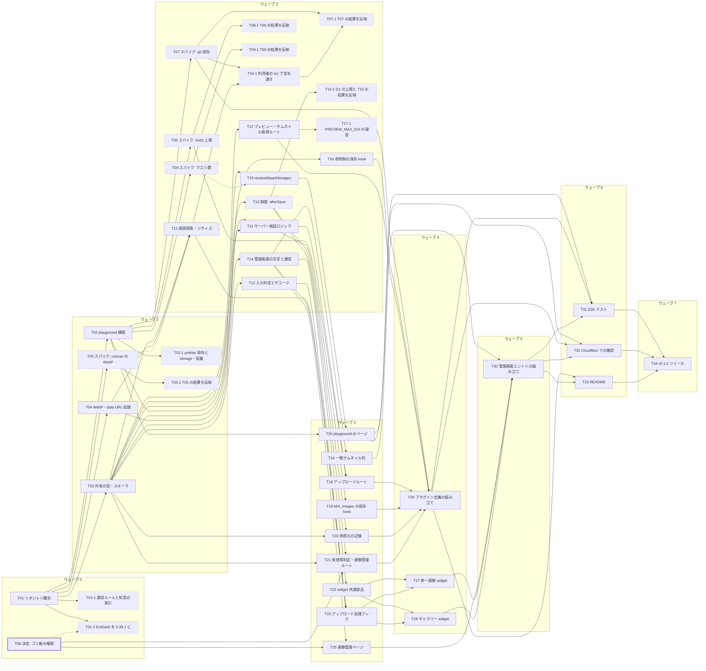

# タスク一覧

> [!summary] 概要
> [[base64-image-plugin-spec|仕様書]] の合意内容を、並列に進められるように 34 個のタスクに分けたもの。
> - 依存関係から決まる「ウェーブ」は 0〜7 の 8 段。ウェーブ N を「フェーズ N」として、ブランチ `phase/N` で進める。同じウェーブのタスクは同時に進められる。
> - 各タスクは、変更してよいファイルを分けてある。そのため、同じウェーブのタスクを別々のブランチで進めても衝突しにくい。
> - 各タスクのノートの frontmatter に、依存(`depends_on`)・後続(`blocks`)・変更してよいファイル(`files`)・状態(`status`)を書いてある。
> - 予定外の作業は、サブタスク `TNN-M` として追加する(現在 10 件: [[T01-1-workflow-docs-index|T01-1]]、[[T01-2-emdash-0-39|T01-2]]、[[T02-1-prettier-storage-capacity|T02-1]]、[[T04-1-consumer-typecheck|T04-1]]、[[T05-1-spec-browser-results|T05-1]]、[[T07-1-spec-distribution|T07-1]]、[[T08-1-spec-route-body|T08-1]]、[[T09-1-spec-locale-query-count|T09-1]]、[[T10-1-spec-d1-limits|T10-1]]、[[T17-1-preview-limit-reason|T17-1]])。
> - 対象の EmDash は 0.39.1(peer は `^0.39.0`)。2026-09-24 に 0.38.0 から変更した([[T01-2-emdash-0-39|T01-2]])。
> - 作業中に得た知見は [[docs/00-index|知見の索引]] から辿れる。

## 進め方のルール

### ブランチ

| ブランチ | 作り方 | 例 |
|---|---|---|
| フェーズブランチ | 前のフェーズを `develop` にマージしてから、`develop` から作る | `phase/2` |
| タスクブランチ | フェーズブランチから作る | `phase-2/t-11` |
| サブタスクブランチ | 予定外の作業が出たら、フェーズブランチから作る | `phase-0/t-01-1` |

- ブランチを作る前に、分岐元のコミットを確かめる。
- タスクの最終確認は `npm run verify`(build・lint・test)。通ったら、タスクブランチをフェーズブランチに `--no-ff` でマージする。
- フェーズのタスクがすべて終わったら、フェーズブランチでもう一度 `npm run verify` を実行する。通ったら `develop` に `--no-ff` でマージする。
- サブタスクが出たら、そのたびにノート `tasks/TNN-M-<slug>.md` を作り、この一覧(ウェーブの表・依存グラフ・全タスクの表)に追加する。
- main には直接コミットしない。`develop` には、フェーズブランチのマージだけで変更を入れる。

### 並列作業(worktree)

- チームメイトは、タスクごとに isolation: worktree で作られた worktree(`.claude/worktrees/`)で作業する。この worktree は `main` から作られる。そのため、分岐元を確かめてから、フェーズブランチを起点にタスクブランチを作る([[claude-code-worktree-isolation]])。
- 同時に進めるのは 2〜4 タスク(多くても 5)。変更するファイルが重ならないタスクだけを並べる。依存するタスクは、前のタスクがフェーズブランチにマージされてから着手する。
- 開発サーバーのポートは `4400 + タスク番号` にする。wrangler dev は `8700 + 番号`、inspector は `9300 + 番号`。SQLite と D1 のローカル状態は、worktree ごとに持つ。
- worktree ごとに `npm ci` で `node_modules` を作る([[npm-workspaces-nested-worktree]])。
- マージが終わった worktree は `git worktree remove` で消す。`git worktree list` で定期的に確かめる。
- `git stash` は worktree の間で共有される。チームメイトは使わない。

### そのほか

- 着手する前に、ローカルの変更を `git stash` などで退避する。2026-09-23 に、未追跡だった `mise.toml` を stash に退避した。同じ内容のファイルを [[T01-scaffold|T01]] でコミットしている。
- `git add` はパスを指定する(`-A` などで全体を追加しない)。
- タスクノートの `status` を `todo` → `doing` → `done` と更新する。
- スパイクのコードはコミットしない(`spikes/` は git 管理外)。結果はタスクノートの「結果」と `docs/` の知見ノートに、根拠レベル付きで書く。設計が変わる場合は、仕様書と関係するタスクも更新する。
- 作業中に得た知見や検証結果は、`docs/` に Obsidian 形式で書く。[[docs/00-index|知見の索引]] は、マージのときにリーダーが更新する。
- 管理画面の文言は、各部品のファイル内に ja / en の辞書として持つ。共有の辞書ファイルには追記しない(同時に編集して衝突するのを防ぐため)。
- `package.json` / `package-lock.json` を変更するタスクは、1 つのフェーズで 1 つに限る。重なる場合はサブタスクに分ける(`package-lock.json` の衝突を防ぐため)。

## 共通の完了条件

- `npm run verify` が通る。`build` は型チェックと playground のビルド、`lint` は oxlint と prettier、`test` は vitest。型チェックは、利用者のサイトの設定の代わりの 2 つの tsconfig(緩い・厳しい)でも `src` を検査する([[T04-1-consumer-typecheck|T04-1]])。
- 新しいコードには、実際の不具合で失敗しうる単体テストがある。
- 管理画面の文言は日本語と英語の両方があり、キーボードで操作できる。
- 仕様と違う実装にした場合は、仕様書を更新した。
- 得た知見は `docs/` に書いた。

## ウェーブ(同時に進められるタスクのまとまり)

| ウェーブ(フェーズ) | 並列数 | タスク |
|---|---|---|
| 0 | 2 | [[T01-scaffold\|T01]] リポジトリ雛形<br>[[T01-1-workflow-docs-index\|T01-1]] 運用ルールと知見の索引(サブタスク)<br>[[T01-2-emdash-0-39\|T01-2]] EmDash を 0.39.1 に(サブタスク)<br>[[T06-decision-trash-permission\|T06]] 決定: ゴミ箱の権限 |
| 1 | 4 | [[T02-playground\|T02]] playground 構築<br>[[T02-1-prettier-storage-capacity\|T02-1]] 生成物の prettier 除外と storage・容量の記述(サブタスク)<br>[[T03-shared-contracts\|T03]] 共有の型・スキーマ<br>[[T04-webp-utils\|T04]] WebP・data URL 処理<br>[[T05-spike-canvas-webp\|T05]] スパイク: canvas の WebP<br>[[T05-1-spec-browser-results\|T05-1]] T05 の結果を仕様書と T13 に反映(サブタスク) |
| 2 | 11 | [[T04-1-consumer-typecheck\|T04-1]] 利用者の tsc で src の型を通す(サブタスク)<br>[[T07-spike-git-dependency\|T07]] スパイク: git 依存<br>[[T07-1-spec-distribution\|T07-1]] T07 の結果を仕様書と後続タスクに反映(サブタスク)<br>[[T08-spike-route-body\|T08]] スパイク: body 上限<br>[[T08-1-spec-route-body\|T08-1]] T08 の結果を仕様書と後続タスクに反映(サブタスク)<br>[[T09-spike-query-count\|T09]] スパイク: クエリ数<br>[[T09-1-spec-locale-query-count\|T09-1]] T09 の結果を仕様書に反映(サブタスク)<br>[[T10-spike-after-save\|T10]] 調査: afterSave<br>[[T10-1-spec-d1-limits\|T10-1]] D1 の上限と T10 の結果を反映(サブタスク)<br>[[T11-server-validation\|T11]] サーバー検証ロジック<br>[[T12-input-decode\|T12]] 入力判定とデコード<br>[[T13-encode-search\|T13]] 画質探索・リサイズ<br>[[T14-admin-i18n-api\|T14]] 管理画面の文言と通信<br>[[T15-site-resolve\|T15]] resolveBase64Images<br>[[T16-reference-hook\|T16]] 参照側の保存 hook<br>[[T17-admin-data-routes\|T17]] プレビュー・サムネイル取得ルート<br>[[T17-1-preview-limit-reason\|T17-1]] PREVIEW_MAX_IDS の理由を直す(サブタスク) |
| 3 | 9 | [[T18-upload-route\|T18]] アップロードルート<br>[[T19-image-entry-hook\|T19]] b64_images の保存 hook<br>[[T20-owner-tracking\|T20]] 参照元の記録<br>[[T21-orphan-routes\|T21]] 未使用判定・画像管理ルート<br>[[T22-widget-parts\|T22]] widget 共通部品<br>[[T23-upload-hook\|T23]] アップロード処理フック<br>[[T24-list-column\|T24]] 一覧サムネイル列<br>[[T25-images-page\|T25]] 画像管理ページ<br>[[T26-playground-pages\|T26]] playground のページ |
| 4 | 3 | [[T27-image-widget\|T27]] 単一画像 widget<br>[[T28-gallery-widget\|T28]] ギャラリー widget<br>[[T29-plugin-definition\|T29]] プラグイン定義の組み立て |
| 5 | 1 | [[T30-admin-entry\|T30]] 管理画面エントリの組み立て |
| 6 | 3 | [[T31-e2e\|T31]] E2E テスト<br>[[T32-cloudflare-check\|T32]] Cloudflare での確認<br>[[T33-readme\|T33]] README |
| 7 | 1 | [[T34-release\|T34]] v0.1.0 リリース |

**クリティカルパス**(最も長い依存の連なり、8 段): [[T01-scaffold|T01]] → [[T03-shared-contracts|T03]] → [[T12-input-decode|T12]] → [[T23-upload-hook|T23]] → [[T27-image-widget|T27]] → [[T30-admin-entry|T30]] → [[T31-e2e|T31]] → [[T34-release|T34]]

> [!tip] 最優先は [[T03-shared-contracts|T03]](共有の型・スキーマ)
> 9 個のタスクが T03 の完了を直接待っている。フェーズ 1 では最初に着手し、小さく仕上げる。

## 依存グラフ



- 実線の矢印: 完了を待ってから着手する依存
- 点線の矢印: 結果を後で反映するだけで、着手はブロックしない依存
- 点線の枠: スパイク / 太い枠: 利用者が決めること / 細かい点線の枠: 予定外のサブタスク

## 全タスク

| ID | タスク | 種別 | ウェーブ | 依存 | 主な変更ファイル |
|---|---|---|---|---|---|
| [[T01-scaffold\|T01]] | リポジトリの雛形を作る | 実装 | 0 | — | `package.json`<br>`package-lock.json`<br>`playground/package.json`(仮)<br>ほか |
| [[T01-1-workflow-docs-index\|T01-1]] | 運用ルールの更新と知見の索引を作る(サブタスク) | ドキュメント | 0 | [[T01-scaffold\|T01]] | `tasks/00-index.md`<br>`docs/00-index.md`<br>`docs/claude-code-worktree-isolation.md`<br>`plans/base64-image-plugin-spec.md`(15 章) |
| [[T01-2-emdash-0-39\|T01-2]] | EmDash を 0.39.1 に上げる(サブタスク) | 実装 | 0 | [[T01-scaffold\|T01]] | `package.json`<br>`package-lock.json`<br>`playground/package.json`<br>`plans/base64-image-plugin-spec.md`(版)<br>ほか |
| [[T06-decision-trash-permission\|T06]] | 決定: 画像をゴミ箱に移動できる権限 | 決定 | 0 | — | `plans/base64-image-plugin-spec.md`(10・17 章)<br>このノートの「結果」 |
| [[T02-playground\|T02]] | playground(動作確認用サイト)を作る | 実装 | 1 | [[T01-scaffold\|T01]] | `playground/**` |
| [[T02-1-prettier-storage-capacity\|T02-1]] | playground の生成物を prettier から外し、storage と容量の記述を直す(サブタスク) | ドキュメント | 1 | [[T02-playground\|T02]] | `.prettierignore`<br>`plans/base64-image-plugin-spec.md`(2.3・5.4・18 章)<br>`tasks/T18-upload-route.md` |
| [[T03-shared-contracts\|T03]] | 共有の型・スキーマ・定数を定める | 実装 | 1 | [[T01-scaffold\|T01]] | `src/shared/constants.ts`<br>`src/shared/types.ts`<br>`src/shared/schema.ts`<br>ほか |
| [[T04-webp-utils\|T04]] | WebP と data URL の低レベル処理を作る | 実装 | 1 | [[T01-scaffold\|T01]] | `src/shared/webp.ts`<br>`src/shared/data-url.ts`<br>`tests/shared/webp.test.ts`<br>ほか |
| [[T05-spike-canvas-webp\|T05]] | スパイク: canvas の WebP サイズを比較する | スパイク | 1 | [[T01-scaffold\|T01]] | `spikes/canvas-webp/**`(使い捨て)<br>このノートの「結果」 |
| [[T05-1-spec-browser-results\|T05-1]] | T05 の結果を仕様書と T13 に反映する(サブタスク) | ドキュメント | 1 | [[T05-spike-canvas-webp\|T05]] | `plans/base64-image-plugin-spec.md`(6.3・16 章、付録 A)<br>`tasks/T13-encode-search.md` |
| [[T04-1-consumer-typecheck\|T04-1]] | 利用者のサイトの tsc で src の型が通るようにする(サブタスク) | 実装 | 2 | [[T07-spike-git-dependency\|T07]]、[[T13-encode-search\|T13]] | `src/shared/data-url.ts`<br>`src/shared/pipeline.ts`<br>`tsconfig.consumer-loose.json`<br>`tsconfig.consumer-strict.json`<br>`package.json`(typecheck)<br>ほか |
| [[T07-spike-git-dependency\|T07]] | スパイク: git 依存 + TS ソースで読み込めるか確かめる | スパイク | 2 | [[T02-playground\|T02]] | `spikes/git-dependency/**`(使い捨て)<br>このノートの「結果」 |
| [[T07-1-spec-distribution\|T07-1]] | T07 の結果(配布・npm 12・利用者側の制約)を仕様書と後続タスクに反映する(サブタスク) | ドキュメント | 2 | [[T07-spike-git-dependency\|T07]]、[[T04-1-consumer-typecheck\|T04-1]] | `plans/base64-image-plugin-spec.md`(14・16・18 章)<br>`tasks/T29`・`T33`・`T34` |
| [[T08-spike-route-body\|T08]] | スパイク: プラグインのルートの body 上限を確かめる | スパイク | 2 | [[T02-playground\|T02]] | `spikes/route-body/**`(使い捨て)<br>このノートの「結果」 |
| [[T08-1-spec-route-body\|T08-1]] | T08 の結果(ルートの body 上限)を仕様書と後続タスクに反映する(サブタスク) | ドキュメント | 2 | [[T08-spike-route-body\|T08]] | `plans/base64-image-plugin-spec.md`(2.2・16・20 章、付録 B)<br>`tasks/T18`・`T32` |
| [[T09-spike-query-count\|T09]] | スパイク: 画像の解決にかかるクエリ数を測る | スパイク | 2 | [[T02-playground\|T02]] | `spikes/query-count/**`(使い捨て)<br>このノートの「結果」 |
| [[T09-1-spec-locale-query-count\|T09-1]] | T09 の結果を仕様書に反映する(16 章・5.2 のロケール)(サブタスク) | ドキュメント | 2 | [[T09-spike-query-count\|T09]] | `plans/base64-image-plugin-spec.md`(5.2・16 章)<br>`docs/astro-dev-background-for-agents.md` |
| [[T10-spike-after-save\|T10]] | 調査: afterSave に渡される内容を確かめる | スパイク | 2 | [[T02-playground\|T02]] | `spikes/after-save/**`(使い捨て)<br>このノートの「結果」 |
| [[T10-1-spec-d1-limits\|T10-1]] | D1 のクエリ数の上限を直し、T10 の結果を後続タスクに反映する(サブタスク) | ドキュメント | 2 | [[T10-spike-after-save\|T10]] | `plans/base64-image-plugin-spec.md`(2.2・7・9・18 章)<br>`tasks/T18〜T21`<br>`docs/cloudflare-workers-free-d1-limits.md` |
| [[T11-server-validation\|T11]] | サーバー側の検証ロジックを作る | 実装 | 2 | [[T03-shared-contracts\|T03]]、[[T04-webp-utils\|T04]] | `src/server/validate.ts`<br>`tests/server/validate.test.ts` |
| [[T12-input-decode\|T12]] | 入力画像の判定とデコードを作る | 実装 | 2 | [[T03-shared-contracts\|T03]] | `src/client/input.ts`<br>`tests/client/input.test.ts` |
| [[T13-encode-search\|T13]] | リサイズ・画質探索・サムネイル生成を作る | 実装 | 2 | [[T03-shared-contracts\|T03]]、[[T04-webp-utils\|T04]] | `src/client/encode.ts`<br>`src/client/thumbnail.ts`<br>`tests/client/encode.test.ts` |
| [[T14-admin-i18n-api\|T14]] | 管理画面の文言(i18n)と API クライアントを作る | 実装 | 2 | [[T03-shared-contracts\|T03]] | `src/client/i18n.ts`<br>`src/client/error-messages.ts`<br>`src/client/api.ts`<br>ほか |
| [[T15-site-resolve\|T15]] | サイト側の resolveBase64Images を作る | 実装 | 2 | [[T03-shared-contracts\|T03]] | `src/site/resolve.ts`<br>`src/astro.ts`<br>`tests/site/resolve.test.ts` |
| [[T16-reference-hook\|T16]] | 参照を持つコレクションの保存 hook(検証)を作る | 実装 | 2 | [[T03-shared-contracts\|T03]] | `src/server/hooks/references.ts`<br>`tests/server/references.test.ts` |
| [[T17-admin-data-routes\|T17]] | 管理画面用のデータ取得ルートを作る | 実装 | 2 | [[T03-shared-contracts\|T03]] | `src/server/routes/admin-data.ts`<br>`tests/server/admin-data.test.ts` |
| [[T17-1-preview-limit-reason\|T17-1]] | PREVIEW_MAX_IDS の理由を T17 の実測に合わせて直す(サブタスク) | ドキュメント | 2 | [[T17-admin-data-routes\|T17]] | `src/shared/constants.ts`(コメント)<br>`docs/emdash-plugin-content-api-constraints.md`<br>`tasks/T03`・`T14` |
| [[T18-upload-route\|T18]] | アップロード用ルートを作る | 実装 | 3 | [[T11-server-validation\|T11]]、[[T08-spike-route-body\|T08]] | `src/server/routes/upload.ts`<br>`tests/server/upload.test.ts` |
| [[T19-image-entry-hook\|T19]] | b64_images の保存 hook(検証)を作る | 実装 | 3 | [[T11-server-validation\|T11]] | `src/server/hooks/image-entry.ts`<br>`tests/server/image-entry.test.ts` |
| [[T20-owner-tracking\|T20]] | 参照元の記録(afterSave)を作る | 実装 | 3 | [[T03-shared-contracts\|T03]]、[[T10-spike-after-save\|T10]] | `src/server/hooks/owners.ts`<br>`tests/server/owners.test.ts` |
| [[T21-orphan-routes\|T21]] | 未使用画像の判定と画像管理ルートを作る | 実装 | 3 | [[T03-shared-contracts\|T03]]、[[T06-decision-trash-permission\|T06]]、[[T10-spike-after-save\|T10]] | `src/server/orphans.ts`<br>`src/server/routes/images-admin.ts`<br>`src/server/hooks/image-deleted.ts`<br>ほか |
| [[T22-widget-parts\|T22]] | widget 共通の UI 部品を作る | 実装 | 3 | [[T14-admin-i18n-api\|T14]] | `src/admin/parts/**`<br>`tests/admin/parts.test.tsx` |
| [[T23-upload-hook\|T23]] | アップロード処理の React フックを作る | 実装 | 3 | [[T12-input-decode\|T12]]、[[T13-encode-search\|T13]]、[[T14-admin-i18n-api\|T14]] | `src/admin/hooks/**`<br>`tests/admin/hooks.test.ts` |
| [[T24-list-column\|T24]] | コンテンツ一覧のサムネイル列を作る | 実装 | 3 | [[T14-admin-i18n-api\|T14]] | `src/admin/ThumbnailColumn.tsx`<br>`tests/admin/ThumbnailColumn.test.tsx` |
| [[T25-images-page\|T25]] | 画像管理ページを作る | 実装 | 3 | [[T14-admin-i18n-api\|T14]]、[[T06-decision-trash-permission\|T06]] | `src/admin/ImagesPage.tsx`<br>`tests/admin/ImagesPage.test.tsx` |
| [[T26-playground-pages\|T26]] | playground に E2E 用のページとデータを用意する | 実装 | 3 | [[T02-playground\|T02]]、[[T15-site-resolve\|T15]] | `playground/src/pages/**`<br>`playground/seed/**`<br>`e2e/fixtures/**` |
| [[T27-image-widget\|T27]] | 単一画像の widget を作る | 実装 | 4 | [[T22-widget-parts\|T22]]、[[T23-upload-hook\|T23]] | `src/admin/ImageField.tsx`<br>`tests/admin/ImageField.test.tsx` |
| [[T28-gallery-widget\|T28]] | ギャラリーの widget を作る | 実装 | 4 | [[T22-widget-parts\|T22]]、[[T23-upload-hook\|T23]] | `src/admin/GalleryField.tsx`<br>`tests/admin/GalleryField.test.tsx` |
| [[T29-plugin-definition\|T29]] | プラグイン定義(src/index.ts)を組み立てる | 実装 | 4 | [[T07-spike-git-dependency\|T07]]、[[T16-reference-hook\|T16]]、[[T17-admin-data-routes\|T17]]、[[T18-upload-route\|T18]]、[[T19-image-entry-hook\|T19]]、[[T20-owner-tracking\|T20]]、[[T21-orphan-routes\|T21]] | `src/index.ts`<br>`src/server/plugin.ts` |
| [[T30-admin-entry\|T30]] | 管理画面のエントリ(src/admin.tsx)を組み立てる | 実装 | 5 | [[T24-list-column\|T24]]、[[T25-images-page\|T25]]、[[T27-image-widget\|T27]]、[[T28-gallery-widget\|T28]] | `src/admin.tsx` |
| [[T31-e2e\|T31]] | E2E テストを作る | テスト | 6 | [[T26-playground-pages\|T26]]、[[T29-plugin-definition\|T29]]、[[T30-admin-entry\|T30]] | `e2e/**`<br>`playwright.config.ts` |
| [[T32-cloudflare-check\|T32]] | Cloudflare(wrangler dev + D1)で動作を確認する | テスト | 6 | [[T26-playground-pages\|T26]]、[[T29-plugin-definition\|T29]]、[[T30-admin-entry\|T30]] | `playground/wrangler.jsonc`<br>`playground/astro.config.cloudflare.mjs`<br>このノートの「結果」 |
| [[T33-readme\|T33]] | README と導入手順を書く | ドキュメント | 6 | [[T29-plugin-definition\|T29]]、[[T30-admin-entry\|T30]] | `README.md` |
| [[T34-release\|T34]] | v0.1.0 をリリースする | リリース | 7 | [[T31-e2e\|T31]]、[[T32-cloudflare-check\|T32]]、[[T33-readme\|T33]] | `package.json`(version)<br>`plans/base64-image-plugin-spec.md`(status) |

## 状態の一覧(Dataview プラグインがある場合)

```dataview
TABLE WITHOUT ID file.link AS タスク, title AS 内容, type AS 種別, wave AS ウェーブ, status AS 状態
FROM "tasks"
WHERE id
SORT wave ASC, id ASC
```
