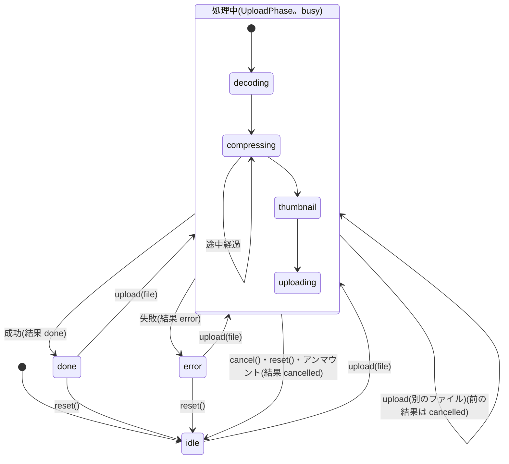
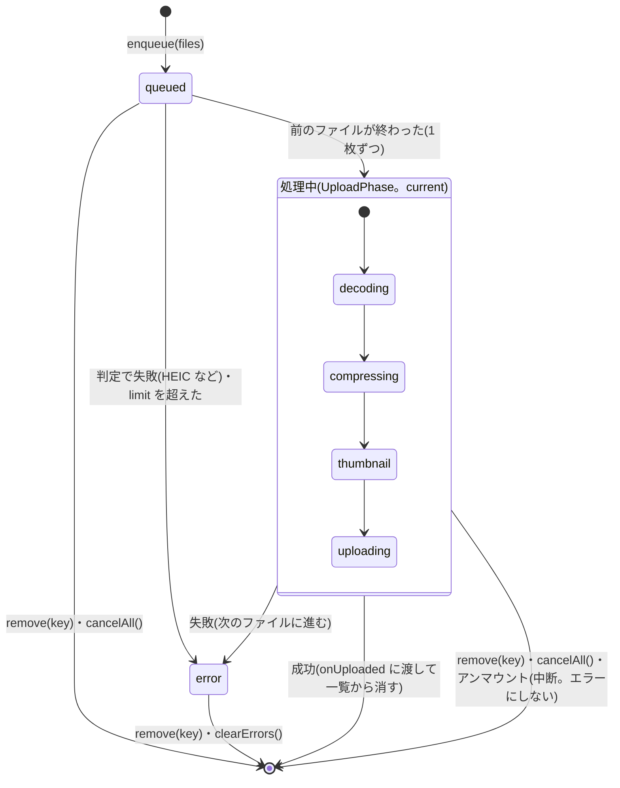
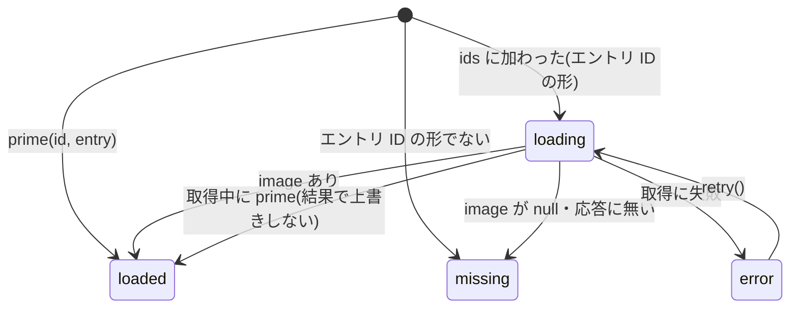

# T23 アップロード処理の React フックを作る

> [!info] 概要
> - 種別: 実装 / ウェーブ: 3
> - 着手の条件(依存): [[T12-input-decode|T12]]、[[T13-encode-search|T13]]、[[T14-admin-i18n-api|T14]]
> - このタスクを待つもの: [[T27-image-widget|T27]]、[[T28-gallery-widget|T28]]
> - 仕様: [[base64-image-plugin-spec#4.2 アップロードの流れ|仕様書 4.2]]、[[base64-image-plugin-spec#11. 管理画面 UI|仕様書 11章]]

## 目的

「デコード → 圧縮 → サムネイル → アップロード → 参照を返す」の一連の処理を、widget から使えるフックにまとめる。

## 作業内容

- [x] [[T12-input-decode|T12]]・[[T13-encode-search|T13]]・[[T14-admin-i18n-api|T14]] を組み合わせた `useImageUpload`(進捗・キャンセル・エラーを状態として返す)
- [x] 保存済み画像のプレビュー取得(`usePreviewImages`)
- [x] 複数ファイルを1枚ずつ順に処理する仕組み(ギャラリー用。`useUploadQueue`)
- [x] [[T12-input-decode|T12]] の `decodeImage(file, { signal })` の結果は、`finally` で必ず `close()` する。Firefox 155 はデコードの間に押された中断を、デコードが終わってから届ける(`decodeImage` が resolve する)ので、そのあとの中断の確認と `close()` を忘れない([[T12-input-decode#T23 が使う export|T12 の呼び方の例]])
- [x] ギャラリーで複数のファイルを受け取ったら、`inspectInputFile` で先にまとめて判定し、HEIC などを最初に知らせる(1 件 1ms 前後)
- [x] `decoded.notices` は `getNoticeMessage(code, locale)`([[T14-admin-i18n-api|T14]])で表示する。`decoded.filename` は、空なら送らず、`MAX_FILENAME_LENGTH`(255)文字で切る
  - フックは表示を持たないので、`notices` を処理中の状態と結果(`UploadedImage.notices`)で渡す。表示は [[T22-widget-parts|T22]] の `UploadNotices`(中で `getNoticeMessage` を使う)。
- [x] テストでは、`createDecodeImage` に偽の `createImageBitmap` を渡し、実際のヘッダーのバイトで作った `File` を使う(T12 のノートに例がある)

## 完了条件

- [x] フックのテスト(エンコーダーと API をモックにする)

## 変更してよいファイル

- `src/admin/hooks/**`
- `tests/admin/hooks.test.ts`

> [!note] ここに挙げたファイル以外を変更する必要が出てきたら、そのファイルを担当するタスクと調整する(並列作業での衝突を避けるため)。

## 結果

> [!success] 概要(2026-09-24)
> - `src/admin/hooks/` に、アップロードの保存先を求める `useUploadTarget`、1 枚を処理する `useImageUpload`、複数のファイルを 1 枚ずつ処理する `useUploadQueue`、保存済みの画像を取得する `usePreviewImages` を作った。状態と処理だけを持ち、表示は持たない(表示は [[T22-widget-parts|T22]] の部品)。
> - 保存先(`target`)は、管理画面の URL と widget の `id` から求める。`entryId` と `locale` は組にして、URL から両方が分かるときだけ送る([[T18-upload-route#T23 が使う応答|T18]] の依頼)。
> - 中断(キャンセル・差し替え・アンマウント)はエラーにしない。デコードした画像は、成功・失敗・中断のどれでも、送信の前に閉じる。Firefox でデコードのあとに届く中断も確かめる。
> - 処理の段階は `decoding → compressing → thumbnail → uploading`。T22 の `UploadProgress` の段階(`UploadStage`)と同じ名前にした。
> - `tests/admin/hooks.test.ts` に 145 件のテスト。不具合を 101 種類入れて、すべてテストが失敗することを確かめた。
> - 実ブラウザ(Chromium 153・Firefox 155)で、送る値がサーバーの検証を通ること、デコード中のキャンセル、ギャラリーの順番を確かめた。「読み込み中…」をデコードの前に描画するには、`requestAnimationFrame` を 2 回待つ必要があった(1 回では 30 回中 20 回で間に合わなかった)。
> - 知見ノート: [[emdash-admin-content-editor-url]](編集画面の URL と保存先の求め方)、[[react-hook-testing-pitfalls]](StrictMode の effect をテストで確かめる方法、oxlint の誤検出)、[[upload-hook-browser-check]](実ブラウザでの確認)

### T27・T28 が使うもの

`import { … } from "./hooks";`(`src/admin/ImageField.tsx`・`src/admin/GalleryField.tsx` から)。

| export | 種類 | 内容 |
|---|---|---|
| `useUploadTarget(id)` | フック | widget の props の `id` を渡す。結果(`UploadTargetResolution`)を、下の 2 つのフックの `target` にそのまま渡す。`ok === false`(コンテンツの編集画面でない・`id` が `field-<slug>` でない)なら、アップロードは `INVALID_TARGET` で失敗する |
| `useImageUpload({ target, options })` | フック | 単一画像。`options` は widget の props の `options`(`normalizeFieldOptions` で丸める) |
| `useUploadQueue({ target, options, onUploaded })` | フック | ギャラリー。1 枚が終わるたびに `onUploaded(image, file)` を呼ぶ |
| `usePreviewImages(ids)` | フック | 値の画像 ID を渡す。`previews.get(id)` で状態を読む |
| `isUploadPhase(state)` | 関数 | 状態が処理中の段階(`UploadPhase`)かを判定し、型を絞り込む |
| 型 | — | `ImageUploadState`・`UploadPhase`・`UploadOutcome`・`UploadedImage`・`CompressedSummary`・`UploadQueue`・`UploadQueueItem`・`ProcessingUploadQueueItem`・`PreviewState`・`UploadTargetResolution` など |

- `useImageUpload` と `useUploadQueue` は `dependencies`(処理に使う関数の差し替え)も受け取る。テスト用で、widget は渡さない。
- React に依存しない `processImageFile(file, { target, fieldOptions, signal, onPhase })` も export している(フックの中身。widget は使わなくてよい)。

### 状態と遷移

#### `useImageUpload`

```ts
type ImageUploadState =
	| { status: "idle" }
	| { status: "decoding" }
	| { status: "compressing"; notices: NoticeCode[]; progress: CompressProgress | null } // 画質を探すたびに変わる
	| { status: "thumbnail"; notices: NoticeCode[]; compressed: CompressedSummary }
	| { status: "uploading"; notices: NoticeCode[]; compressed: CompressedSummary }
	| { status: "done"; image: UploadedImage }
	| { status: "error"; error: unknown }; // 文言は T14 の useErrorMessage(T22 の ErrorMessage)

interface ImageUpload {
	state: ImageUploadState;
	file: File | null; // 処理中か、最後に処理したファイル。idle なら null
	busy: boolean; // isUploadPhase(state)
	upload(file: File): Promise<UploadOutcome>; // reject しない
	cancel(): void; // 処理中なら中断して idle。処理中でなければ何もしない
	reset(): void; // 処理中なら中断し、done / error も消して idle
}

type UploadOutcome = { status: "done"; image: UploadedImage } | { status: "error"; error: unknown } | { status: "cancelled" };
interface UploadedImage {
	ref: Base64ImageRef; // ルートの応答。alt は ""。locale は画像エントリのロケール(書き換えない)
	entry: Base64ImageEntry; // 保存した画像エントリと同じ形(src は data URL)。prime に渡す
	notices: NoticeCode[]; // GIF_FIRST_FRAME_ONLY など
}
interface CompressedSummary { width: number; height: number; quality: number; storedBytes: number }
```

(実際の型は `readonly`。)



- 失敗してもフィールドの値は変わらない。値を変えるのは widget で、`upload` の結果が `done` のときだけ `onChange` する。
- 送信の関数が中断に応えなくても(応答が中断のあとに届いても)、結果は `cancelled`、状態は `idle` のまま。

#### `useUploadQueue`

```ts
type UploadQueueItemState = { status: "queued" } | UploadPhase | { status: "error"; error: unknown };
interface UploadQueueItem { key: string; file: File; state: UploadQueueItemState } // key は React の key に使える
interface ProcessingUploadQueueItem extends UploadQueueItem { state: UploadPhase }

interface UploadQueue {
	items: UploadQueueItem[]; // 処理待ち・処理中・失敗(受け付けた順)。成功したものは onUploaded に渡して消える
	current: ProcessingUploadQueueItem | null; // 処理中のファイル
	pendingCount: number; // 処理待ちと処理中の数
	busy: boolean; // pendingCount > 0
	finishedCount: number; // ひと続きの処理で、処理を終えた数(成功と失敗)
	uploadedCount: number; // ひと続きの処理で、アップロードした数
	enqueue(files: ArrayLike<File> | Iterable<File>, options?: { limit?: number }): void; // FileList も渡せる
	remove(key: string): void; // 処理待ちは処理しない、処理中は中断する、失敗は表示を消す
	cancelAll(): void; // 処理待ちと処理中を取り消す(失敗は残す)
	clearErrors(): void; // 失敗をすべて消す
}
```



- ひと続きの処理は、処理待ちも処理中も無いときに `enqueue` してから、それが無くなるまで。処理中に `enqueue` したファイルは同じひと続きに入る。次のひと続きを始めると、`finishedCount` と `uploadedCount` は 0 に戻る。受け付けたときの判定で失敗したファイルと、取り消したファイルは数えない。
- 進捗の「2 / 3 枚目」は `finishedCount + 1` / `finishedCount + pendingCount`。終わったあとの「3 枚の画像を追加しました」は `uploadedCount`。

#### `usePreviewImages`

```ts
type PreviewState =
	| { status: "loading" }
	| { status: "loaded"; image: Base64ImageEntry }
	| { status: "missing" } // 「画像が見つかりません」(ゴミ箱・削除・非公開・値が不正、応答に無い、ID の形でない)
	| { status: "error"; error: unknown }; // 通信の失敗など。retry() で取得し直す
interface PreviewImages {
	previews: ReadonlyMap<string, PreviewState>; // 渡した ID ごと(重複は除き、渡した順)
	prime(id: string, image: Base64ImageEntry): void; // アップロードしたばかりの画像を登録する(取得しない)
	retry(): void; // 今の ID のうち error のものを取得し直す
}
```



- 持っていない ID だけを取得する。並べ替えや同じ ID での再描画では取得しない。1 回の要求は 10 件(`PREVIEW_MAX_IDS`)までで、超える分は分けて並行に送る。1 回分が失敗しても、ほかの結果は使う。
- アンマウントすると、取得中の要求を中断する。

### 使い方の例

単一画像([[T27-image-widget|T27]])。部品は [[T22-widget-parts#部品と props(T27・T28 向け)|T22]] のもの。`value` は T27 が `Base64ImageRef | null` に絞り込んだ値、`altText` は代替テキストの入力欄の値(差し替えで前の値を残すかは T27 が決める)。

```tsx
import { isUploadPhase, useImageUpload, usePreviewImages, useUploadTarget } from "./hooks";
import { ErrorMessage, UploadNotices, UploadProgress, type UploadProgressInfo } from "./parts";

// ---- コンポーネントの中 ----
const target = useUploadTarget(id);
const upload = useImageUpload({ target, options });
const { previews, prime } = usePreviewImages(value === null ? [] : [value.id]);
const preview = value === null ? undefined : previews.get(value.id); // loading / loaded / missing / error

const handleFiles = async (files: File[]) => {
	const file = files[0];
	if (file === undefined) return;
	const outcome = await upload.upload(file); // reject しない
	if (outcome.status !== "done") return; // error は upload.state に残る。cancelled は何もしない
	const { ref, entry } = outcome.image;
	prime(ref.id, entry); // 手元の data URL を表示する(preview を取得しない)
	onChange({ ...ref, alt: altText }); // ref.alt は空。ref.locale はそのまま
};

const { state, file } = upload;
const progress: UploadProgressInfo | null = isUploadPhase(state)
	? {
			stage: state.status, // decoding / compressing / thumbnail / uploading
			compress: state.status === "compressing" ? (state.progress ?? undefined) : undefined,
			filename: file?.name,
		}
	: null;
const notices =
	state.status === "done"
		? state.image.notices
		: isUploadPhase(state) && state.status !== "decoding"
			? state.notices
			: [];

return (
	<>
		{/* ImageDropZone の onFiles に handleFiles を渡す(略) */}
		<UploadProgress
			progress={progress}
			onCancel={upload.cancel}
			completed={state.status === "done" ? 1 : 0}
			cancelButtonRef={cancelRef}
		/>
		<ErrorMessage error={state.status === "error" ? state.error : null} onDismiss={upload.reset} />
		<UploadNotices notices={notices} title={file?.name} />
	</>
);
```

ギャラリー([[T28-gallery-widget|T28]])。`refs` は T28 が `Base64ImageRef[]` に絞り込んだ値。`onUploaded` は続けて呼ばれるので、描画を待たずに次の画像を足せるよう、最新の値を ref に持つ。

```tsx
import { useEffect, useRef } from "react";

import { normalizeFieldOptions } from "../shared/options";
import { usePreviewImages, useUploadQueue, useUploadTarget } from "./hooks";
import { ErrorMessage, ImageDropZone, UploadProgress, type UploadProgressInfo } from "./parts";

// ---- コンポーネントの中 ----
const target = useUploadTarget(id);
const { maxItems } = normalizeFieldOptions(options);
const { previews, prime } = usePreviewImages(refs.map((ref) => ref.id));
const valueRef = useRef(refs);
useEffect(() => {
	valueRef.current = refs;
});
const queue = useUploadQueue({
	target,
	options,
	onUploaded: (image) => {
		const next = [...valueRef.current, { ...image.ref, alt: "" }];
		valueRef.current = next; // 続けて届く画像を、この値の後ろに足す
		prime(image.ref.id, image.entry);
		onChange(next);
	},
});
const remaining = maxItems - refs.length - queue.pendingCount; // 負になっても、フックは 0 として扱う

const { current } = queue;
const progress: UploadProgressInfo | null =
	current === null
		? null
		: {
				stage: current.state.status,
				compress:
					current.state.status === "compressing" ? (current.state.progress ?? undefined) : undefined,
				filename: current.file.name,
				index: queue.finishedCount + 1,
				total: queue.finishedCount + queue.pendingCount,
			};

return (
	<>
		<ImageDropZone
			multiple
			onFiles={(files) => queue.enqueue(files, { limit: remaining })}
			disabled={remaining <= 0}
			label={label}
			description={t.remaining(remaining)}
			buttonRef={zoneRef}
		/>
		<UploadProgress
			progress={progress}
			onCancel={queue.cancelAll}
			completed={queue.busy ? 0 : queue.uploadedCount}
			cancelButtonRef={cancelRef}
		/>
		{queue.items.map((item) =>
			item.state.status === "error" ? (
				<ErrorMessage
					key={item.key}
					error={item.state.error}
					title={item.file.name}
					onDismiss={() => queue.remove(item.key)}
				/>
			) : null,
		)}
	</>
);
```

- 処理中のファイルは `current`(`busy` の間でも、受け付けたときの判定の間は `null`)。処理待ちのファイルの一覧を出すなら `items` の `queued`。
- 1 枚ごとの失敗は `items` に残る。値には加えない。

### 決めたこと

| # | 決定 | 理由 | 根拠レベル |
|---|---|---|---|
| 1 | 保存先は、管理画面の URL(`/_emdash/admin/content/<collection>/<エントリ ID か new>` と `?locale=`)と props の `id`(`field-<slug>`)から求める | plugin widget の props に、コレクション・エントリ ID・ロケールが無い | 公式ドキュメントのみ(`references/emdash/packages/admin/src/components/ContentEditor.tsx:1818-1843`、`router.tsx:687-695`・`:833-842`。[[emdash-admin-content-editor-url]]) |
| 2 | `entryId` と `locale` は組にして、両方が分かるときだけ送る。新規作成の画面と、`?locale=` の無い画面では、どちらも送らない | ルートは参照元を `target.locale` で記録し、省くと既定ロケールで記録する。既定以外のロケールのエントリでは、保存時の記録([[T20-owner-tracking\|T20]])とロケールだけ違う参照元が増える。`entryId` の無いときに `locale` だけ送ると、使わない値でアップロード全体が 400 になりうる | 実測のみ([[emdash-plugin-upload-route#参照元の記録(T20)との関係\|T18 の実測]])。URL の形は公式ドキュメントのみ |
| 3 | `?locale=` の無い画面(ダッシュボード・コマンドパレット・サイトのツールバーから開いた編集画面)で、翻訳の一覧の API からロケールを引くことはしない | 要求が 1 つ増え、標準 API の応答の形に頼ることになる。参照元は、保存・自動保存・公開のときに T20 がエントリ自身のロケールで記録する | 公式ドキュメントのみ(`references/emdash/packages/core/src/api/handlers/content.ts:2122-2182`) |
| 4 | `?locale=` は管理画面のルーターと同じ規則で読み(JSON として読めれば `JSON.parse`、同じ名前が 2 つあれば使わない)、`localeSchema` に合い 35 文字までのときだけ使う | 管理画面が使う値と同じにする。35 文字は、ルートが i18n の無いサイトで受け付ける長さ。手で書き換えた長い値でアップロードを失敗させない | 実測+公式ドキュメント(`@tanstack/router-core` 1.163.2 の `qss.js`・`searchParams.js`) |
| 5 | パスの 2 つ目が `entryIdSchema` に合わなければ `entryId` を送らない。slug の形(`my-first-post`)は ID と見分けられないので送る | 合わない値は送る前の確認でアップロード全体を失敗させる。管理画面の中の移動は ID を使う | 公式ドキュメントのみ(`references/emdash/packages/core/src/database/repositories/content.ts:633-659`) |
| 6 | 保存先を求められないとき(コンテンツの編集画面でない・`id` の形が違う)は、デコードもせずに `INVALID_TARGET`(`details.problem` に理由)で失敗させる | ルートに送っても同じコードになる。文言は [[T18-2-invalid-target-message\|T18-2]] で広げた `INVALID_TARGET` のもの | 設計判断 |
| 7 | 中断(キャンセル・差し替え・アンマウント)はエラーにしない。結果は `cancelled`、状態は `idle`。送信が終わってから押された中断も中断として扱う | 仕様書 11.2(失敗のときだけエラーを出す)。T22 の `ErrorMessage` も中断を出さない。中断のあとに作られた画像は未使用画像として画像管理ページに出る | 実測のみ(テスト) |
| 8 | デコードの前に描画を待つ(`waitForPaint`: `requestAnimationFrame` を 2 回重ね、2 回目の中の `setTimeout(0)` で始める。背景のタブ用に 100ms で打ち切る) | Firefox はデコードと縮小の間、主スレッドを止める。「読み込み中…」を先に描画する([[T12-input-decode#後続タスク向けのメモ\|T12]])。1 回だけでは、React のコミットより先にフレームが来ることが多い | 実測のみ(下の「実ブラウザでの確認」。[[upload-hook-browser-check]]) |
| 9 | デコードのあとにも中断を確かめる。デコードした画像は、圧縮とサムネイルが終わったら、送信を待たずに閉じる(`finally`) | Firefox では、デコード中の中断はデコードのあとに届く。デコードした画像は最大 6,400 万画素 × 4 バイト | 実測のみ(テスト・実ブラウザ) |
| 10 | 段階は `decoding → compressing → thumbnail → uploading`。`compressing` は、画質を探すたびに `progress` を変える | T22 の `UploadProgress` の `UploadStage` と同じ名前にし、widget がそのまま渡せるようにする | 設計判断 |
| 11 | 送る `quality` は採用した画質。`filename` は、空なら送らず、255 コードポイントで切る(サロゲートペアの途中で切らない)。`ref.alt` は widget が入れる。`ref.locale` は書き換えない | 仕様書 7 章、T18 の応答 | 公式ドキュメントのみ([[T18-upload-route#T23 が使う応答\|T18]])。テストで確かめた |
| 12 | ギャラリーは、受け付けたファイルを先にまとめて判定し、受け付けない形式を最初に失敗にする。`limit` は判定を通ったファイルだけを受け付けた順に数え、超えた分は `GALLERY_TOO_MANY_ITEMS` | HEIC などを早く知らせる。上限の案内をファイルごとに出せる | 設計判断 |
| 13 | ギャラリーは、1 枚が失敗しても次のファイルに進む。失敗したファイルは値に加えず、一覧に失敗として残す。`onUploaded` が例外を投げたら、そのファイルの失敗にする | T28 の「次の画像に進むかを決める」への答え。成功した画像を失敗のせいで捨てない | 設計判断 |
| 14 | ギャラリーは、処理中のファイル(`current`)と、ひと続きの処理で終えた数(`finishedCount`)・アップロードした数(`uploadedCount`)を返す | T22 の `UploadProgress` の `index`・`total`・`completed` を、widget が数えずに渡せるようにする | 設計判断 |
| 15 | プレビューは、持っていない ID だけを 10 件ずつ並行に取得する。`image: null` と応答に無い ID は `missing`、通信の失敗は `error`(`retry()`)。`prime` した画像は取得しない | 仕様書 11.2([[T17-admin-data-routes\|T17]]) | 公式ドキュメントのみ(T17)。テストで確かめた |
| 16 | StrictMode(effect が 2 回動く)でも動くようにし、テストで確かめる | 管理画面は StrictMode を使っていないが、playground などで使われても壊れないようにする | 公式ドキュメントのみ(`references/emdash/packages/admin/src` に `StrictMode` が無い)。テストで確かめた |

### テスト

- `tests/admin/hooks.test.ts`: 145 件。保存先(URL の形・ロケールの読み方・`id`・`popstate`)、1 枚の処理(送る値・段階の順・ファイル名・失敗・各段階での中断・Firefox の順の中断・閉じる時期)、`waitForPaint`(描画のあと・背景のタブ・`requestAnimationFrame` の無い環境)、`useImageUpload`(段階・キャンセル・差し替え・中断に応えない送信・中断のあとの途中経過・アンマウント・options の変更・StrictMode)、`useUploadQueue`(順番・先の判定・`limit`・失敗のあと・処理中の追加・`remove`・`cancelAll`・`clearErrors`・数・アンマウント・StrictMode)、`usePreviewImages`(10 件ずつ・`missing`・`error` と `retry`・`prime`・並べ替え・アンマウント・StrictMode)。
- デコードは `createDecodeImage` に偽の `createImageBitmap`、`File` はヘッダーだけの本物のバイト列(PNG・GIF・HEIC)。圧縮とサムネイルは本物の `compressImage` / `createThumbnail` に偽のエンコーダー、通信は本物の `uploadImage` / `fetchPreviews` に `vi.stubGlobal("fetch")`。フックは `renderHook`。
- act の外での状態の変化(React の警告)があれば、テストを失敗にする(`console.error` を見張る)。
- ソースに不具合を 1 つずつ入れて、101 種類すべてでテストが失敗することを確かめた(スクリプトは scratchpad に置いた使い捨て)。例: `field-` を確かめない・ルーターと違う読み方をする・`entryId` と `locale` を組にしない・35 文字を超える `locale` を送る・描画を待たない・`requestAnimationFrame` を 1 回だけ待つ・デコードした画像を閉じない・送信のあとで閉じる・丸めた画質を送る・ファイル名を切らない / UTF-16 で切る・各段階の中断を確かめない・キャンセルで `idle` に戻さない・並行に処理する・先に判定しない・`limit` を使わない・取り消したファイルを数える・StrictMode で再開できない・10 件ずつに分けない・`prime` を登録しない。最初の版では 89 種類のうち 8 種類が見つからなかったので、次のように直した。根拠: 実測のみ

| 見つからなかった不具合 | 分かったこと | 対応 |
|---|---|---|
| `?locale=` の値を数値・`true` / `false` に変換しない(2 種類) | ルーターの変換を真似た処理は、`JSON.parse` だけで同じ結果になる(重複) | 変換の処理を消した([[emdash-admin-content-editor-url#検索パラメーターの読み方(TanStack Router)]]) |
| 描画を待ったあとの中断の確認を外す・デコードのあとの中断の確認を外す | 本物の `decodeImage` / `compressImage` が中断を確かめるので、違いが見えない | 確認は残し、中断を見ない偽の `decodeImage` と、段階の知らせで違いを確かめるテストを足した |
| 中断のあとも状態を変える(`useImageUpload`) | 本物の処理は中断のあとに途中経過を知らせない | 中断のあとに途中経過を知らせる偽の `compressImage` でテストを足した |
| 中断した処理をエラーにする(`useUploadQueue`) | 取り消したファイルは一覧から消えているので、見分けられない | そのあと足した数(`finishedCount`)に表れるので、テストで確かめた |
| 中断した取得をエラーにする・`dispose` で取得中の ID を戻さない(`usePreviewImages`) | StrictMode のテストが、effect を 2 回動かしていなかった(`wrapper` で包む形) | `reactStrictMode: true` にし、1 回目の要求が中断されたことも確かめた([[react-hook-testing-pitfalls]]) |

- lint: oxlint 1.83.0 の `react(memo-dependencies)` が、`useCallback` の中の `catch` の無い `try` / `finally` で誤って依存を報告する。`pump` の外側の `try` / `finally` をやめて避けた。`afterEach` の中の `expect` は `vitest(no-standalone-expect)` になるので、`throw` にした([[react-hook-testing-pitfalls]])。

### 実ブラウザでの確認

フックをそのまま使うページ(`spikes/upload-hook/`、git 管理外)を、Playwright で Chromium 153(SW / GPU)と Firefox 155 のヘッドレスで動かした。管理画面とアップロード用ルートは `page.route` の偽物で、送られた要求はサーバーと同じ検証(① `validateUpload`)に通した。詳細は [[upload-hook-browser-check]]。根拠: 実測のみ

- 最初の実装(`requestAnimationFrame` 1 回 → `setTimeout(0)`)では、30 回のうち 20 回で、「読み込み中…」のコミットのあとの最初のフレームより先にデコードが始まった(React のコミットより先にフレームが来る)。**2 回重ねる形に直し**、30 回とも描画のあとに始まることを確かめた。Firefox はデコードと縮小の間、主スレッドを止めるので、先に描画しないと「読み込み中…」が出ない。
- デコード中のキャンセル(8000 × 6000 の JPEG、0ms / 20ms 後): どの構成でも結果は `cancelled`、状態は `idle`、デコードした画像は閉じられた。Firefox の 20ms 後のキャンセルは、デコード(約 57ms)と縮小(約 60ms)のあとに届いた(主スレッドが最大 120ms 止まった)。
- 送った要求 36 件は、どれも ① を通り、結果の画像エントリは ② `validateImageEntry` を通った。`target` には URL の `entryId` と `locale: "ja"` が入った。
- ギャラリー(JPEG・HEIC・PNG): HEIC は 1〜2ms で `INPUT_HEIC_REJECTED`、残りの 2 枚を 1 枚ずつ送った。`finishedCount` と `uploadedCount` は 2。

### 仕様書の変更

- 7 章の入力の例: `target` のコメントを「`entryId` と `locale` は組にして、管理画面の URL から両方が分かるときだけ送る(新規作成の画面と、URL に `?locale=` の無い編集画面では送らない)」にした。
- 4.2 は変えていない(図の「保存先」のままで合う)。

### 11 章への変更の依頼(リーダーへ)

11 章は T22 が変えたので、次の追記をリーダーに依頼する。

1. 11.1 に追加: 「widget は、アップロードの保存先(`target`)を、管理画面の URL(`/_emdash/admin/content/<collection>/<エントリ ID か new>` と `?locale=`)と props の `id`(`field-<slug>`)から求める。plugin widget には、コレクション・エントリ ID・ロケールが渡らない。`?locale=` の無い画面では参照元を送らず、保存のときに記録する([[emdash-admin-content-editor-url]])」
2. 11.2 に追加: 「キャンセルはエラーにせず、処理を始める前の表示に戻す(フィールドの値は変えない)。処理中に別の画像を選ぶと、前の処理を中断してから始める」(段階の名前は、T22 が 11.1 に書いた読み上げの段階と同じ)
3. 11.3 に追加: 「受け付けたファイルは、先にまとめて形式を確かめ、HEIC などの受け付けない形式は、ほかのファイルの処理を待たずに失敗として表示する。`maxItems` を超える分は処理せず、ファイルごとに失敗として表示する。1 枚が終わるたびに値に加える。1 枚が失敗しても残りを処理し、失敗したファイルは値に加えずにエラーを出す。進捗は何枚目か(2 / 3 枚目)を出す」

> [!note] 反映済み(リーダー、マージのとき)
> 上の 1〜3 を仕様書 11.1・11.2・11.3 に反映し、知見ノート 3 つを索引に登録した。下の「他のタスクへの影響」の T27・T28・T31 の分は、[[T23-1-handoff-upload-hook|T23-1]] で後続タスクのノートに書いた。

### 他のタスクへの影響

1. [[T27-image-widget|T27]] / [[T28-gallery-widget|T28]]: 上の「使い方の例」。`upload` の結果が `done` のときだけ `onChange` し、`prime(ref.id, entry)` で手元の data URL を表示する。ギャラリーの `onUploaded` は続けて呼ばれるので、最新の値を ref に持って後ろに足す。`limit` には `maxItems - 値の枚数 - pendingCount` を渡す。
2. [[T22-widget-parts|T22]]: `UploadProgressInfo` の `stage` に、フックの段階(`state.status`)をそのまま渡せる。`thumbnail` の段階もフックが知らせる。
3. [[T18-upload-route|T18]]: 依頼のとおり、`target.entryId` を送るときは `target.locale` も送る。保存先を求められないときは、ルートに送らずに `INVALID_TARGET` にする(文言は同じ)。
4. [[T20-owner-tracking|T20]]: `?locale=` の無い画面からのアップロードと、新規作成の画面からのアップロードは、参照元を送らない。参照元は T20 の保存時の記録だけになる。
5. [[T21-orphan-routes|T21]]: URL を手で `/content/posts/my-first-post` にして開いた画面では、slug が `entryId` として参照元に記録される。`ctx.content.get` は ID でしか引かないので、その参照元は「削除された」に見える。保存のときに T20 が正しい参照元を足すので、画像が未使用に見えることはない(推測のみ)。
6. [[T31-e2e|T31]]: 実際の管理画面で、新規作成・編集・翻訳・ダッシュボードから開いた編集画面の URL と、送られる `target` を確かめる。新規作成の保存のあとに widget が作り直されることも確かめる。

### 未解決・サブタスクの候補

1. `?locale=` の無い画面でも参照元を送るなら、翻訳の一覧の API(`GET /_emdash/api/content/{collection}/{id}/translations`)でエントリのロケールを引く(決定 3。今は不要)。
2. 保存先を求められないとき(プラグインのページなど、編集画面の外で widget が描かれたとき)の専用のエラーコードと文言。今は `INVALID_TARGET` の文言(フィールドとサイトの言語の設定を確かめる案内)になる。
3. 実際の管理画面(playground)で、URL と widget の作り直しの時期を確かめていない(T27・T31)。
4. `docs/00-index.md` に [[emdash-admin-content-editor-url]]・[[react-hook-testing-pitfalls]]・[[upload-hook-browser-check]] を登録する(リーダー)。
5. Firefox はデコードと縮小(合わせて 48MP で約 120ms)の間、画面が止まる。Worker でデコード・縮小すれば避けられるが、[[T12-input-decode|T12]] と同じ理由(管理画面の CSP、TS ソースのまま配布)で見送る。止まる間は「読み込み中…」が出ている。
